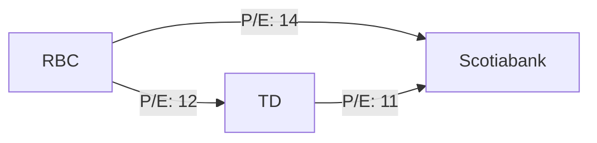

## 14.12 Value Ratios

In the realm of financial analysis, value ratios are indispensable tools for investors and analysts seeking to assess the market valuation of a company's shares. Among these, the Price-to-Earnings (P/E) ratio and the Dividend Discount Model (DDM) stand out as fundamental metrics. This section delves into the intricacies of these ratios, their applications, and their significance in the Canadian financial landscape.

### Understanding Value Ratios

Value ratios provide insights into how the market values a company's earnings and dividends. They are essential for comparing companies within the same industry and making informed investment decisions.

#### Price-to-Earnings (P/E) Ratio

The Price-to-Earnings (P/E) ratio is a widely used metric that measures a company's current share price relative to its per-share earnings. It is calculated as:

 \text{P/E Ratio} = \frac{\text{Market Price per Share}}{\text{Earnings per Share (EPS)}} 

**Example:**

Consider Royal Bank of Canada (RBC), one of the major Canadian banks. Suppose RBC's current share price is CAD 120, and its earnings per share (EPS) is CAD 10. The P/E ratio would be:

 \text{P/E Ratio} = \frac{120}{10} = 12 

A P/E ratio of 12 indicates that investors are willing to pay CAD 12 for every CAD 1 of earnings, reflecting market expectations about the company's future growth and profitability.

**Importance of P/E Ratio:**

- **Valuation Benchmark:** The P/E ratio helps investors determine whether a stock is overvalued or undervalued compared to its peers or the broader market.
- **Growth Expectations:** A high P/E ratio may suggest that investors expect higher earnings growth in the future, while a low P/E could indicate potential undervaluation or lower growth expectations.

#### Dividend Discount Model (DDM)

The Dividend Discount Model (DDM) is a method of valuing a company's stock price based on the theory that its stock is worth the sum of all its future dividend payments, discounted back to their present value. The formula for the simplest form of DDM, the Gordon Growth Model, is:

 \text{Stock Price} = \frac{\text{Dividend per Share}}{\text{Discount Rate} - \text{Dividend Growth Rate}} 

**Example:**

Let's analyze a Canadian utility company that pays an annual dividend of CAD 2 per share, with an expected dividend growth rate of 3% and a required rate of return of 6%. The stock price using the DDM would be:

 \text{Stock Price} = \frac{2}{0.06 - 0.03} = \frac{2}{0.03} = 66.67 

This implies that the intrinsic value of the stock, based on its dividend payments, is CAD 66.67.

**Importance of DDM:**

- **Intrinsic Value Estimation:** DDM provides a theoretical fair value of a stock based on expected future dividends, helping investors assess whether a stock is fairly priced.
- **Focus on Dividends:** It is particularly useful for valuing companies with stable and predictable dividend payments, such as utilities and mature firms.

### Application of Value Ratios in Industry Comparison

Value ratios are crucial for comparing companies within the same industry. They provide a standardized measure to evaluate relative valuation and performance.

**Case Study: Canadian Banks**

Consider the P/E ratios of major Canadian banks like RBC, Toronto-Dominion Bank (TD), and Bank of Nova Scotia (Scotiabank). By comparing their P/E ratios, investors can gauge market sentiment and growth expectations for each bank. A higher P/E ratio might indicate that investors expect stronger future growth for that bank compared to its peers.

**Diagram: P/E Ratio Comparison**

### Best Practices and Common Pitfalls

**Best Practices:**

- **Industry Context:** Always compare value ratios within the same industry to account for sector-specific factors.
- **Historical Analysis:** Consider historical P/E ratios to understand trends and market cycles.
- **Complementary Metrics:** Use value ratios alongside other financial metrics for a comprehensive analysis.

**Common Pitfalls:**

- **Ignoring Growth Rates:** A low P/E ratio might seem attractive but could indicate low growth prospects.
- **Overreliance on DDM:** DDM assumptions can significantly impact valuation; ensure realistic growth and discount rates.

### Resources for Further Exploration

- **Book:** *Valuation: Measuring and Managing the Value of Companies* by McKinsey & Company Inc. offers in-depth insights into valuation techniques.
- **Online Tool:** Use the [P/E Ratio Calculator](https://www.calculatorsoup.com/calculators/financial/price-earnings-ratio-calculator.php) for quick calculations.

### Conclusion

Value ratios like the P/E ratio and DDM are powerful tools for assessing the market valuation of a company's shares. By understanding and applying these ratios, investors can make informed decisions, compare companies effectively, and identify potential investment opportunities in the Canadian market.

### **Ready to Test Your Knowledge?**

**Practice 10 Essential CSC Exam Questions to Master Your Certification**



### What does the P/E ratio measure?

- [x] The current share price relative to its per-share earnings
- [ ] The company's total revenue
- [ ] The company's market capitalization
- [ ] The company's dividend yield

> **Explanation:** The P/E ratio measures a company's current share price relative to its per-share earnings, providing insight into how the market values its earnings.

### How is the P/E ratio calculated?

- [x] Market Price per Share divided by Earnings per Share (EPS)
- [ ] Earnings per Share (EPS) divided by Market Price per Share
- [ ] Total Revenue divided by Market Price per Share
- [ ] Dividend per Share divided by Market Price per Share

> **Explanation:** The P/E ratio is calculated by dividing the market price per share by the earnings per share (EPS).

### What does a high P/E ratio indicate?

- [x] Higher growth expectations
- [ ] Lower growth expectations
- [ ] The company is undervalued
- [ ] The company is overvalued

> **Explanation:** A high P/E ratio often indicates that investors expect higher earnings growth in the future.

### What is the Dividend Discount Model (DDM) used for?

- [x] Valuing a company's stock based on future dividend payments
- [ ] Calculating a company's total revenue
- [ ] Estimating a company's market capitalization
- [ ] Determining a company's debt-to-equity ratio

> **Explanation:** The DDM is used to value a company's stock based on the sum of all its future dividend payments, discounted back to their present value.

### Which formula represents the Gordon Growth Model?

- [x] Stock Price = Dividend per Share / (Discount Rate - Dividend Growth Rate)
- [ ] Stock Price = Earnings per Share / (Discount Rate - Dividend Growth Rate)
- [ ] Stock Price = Total Revenue / (Discount Rate - Dividend Growth Rate)
- [ ] Stock Price = Market Price per Share / (Discount Rate - Dividend Growth Rate)

> **Explanation:** The Gordon Growth Model is represented by the formula: Stock Price = Dividend per Share / (Discount Rate - Dividend Growth Rate).

### Why is the P/E ratio important for investors?

- [x] It helps determine if a stock is overvalued or undervalued
- [ ] It measures a company's total revenue
- [ ] It calculates a company's market capitalization
- [ ] It estimates a company's dividend yield

> **Explanation:** The P/E ratio is important because it helps investors determine whether a stock is overvalued or undervalued compared to its peers or the market.

### What is a common pitfall when using the DDM?

- [x] Overreliance on assumptions
- [ ] Ignoring total revenue
- [ ] Focusing on market capitalization
- [ ] Calculating the debt-to-equity ratio

> **Explanation:** A common pitfall when using the DDM is overreliance on assumptions, as unrealistic growth and discount rates can significantly impact valuation.

### How can value ratios be used effectively?

- [x] By comparing companies within the same industry
- [ ] By comparing companies across different industries
- [ ] By focusing solely on total revenue
- [ ] By ignoring historical analysis

> **Explanation:** Value ratios are most effective when used to compare companies within the same industry, accounting for sector-specific factors.

### What does a low P/E ratio potentially indicate?

- [x] Potential undervaluation or lower growth expectations
- [ ] Higher growth expectations
- [ ] The company is overvalued
- [ ] The company has high dividend payments

> **Explanation:** A low P/E ratio could indicate potential undervaluation or lower growth expectations.

### True or False: The DDM is particularly useful for valuing companies with stable and predictable dividend payments.

- [x] True
- [ ] False

> **Explanation:** True. The DDM is particularly useful for valuing companies with stable and predictable dividend payments, such as utilities and mature firms.


