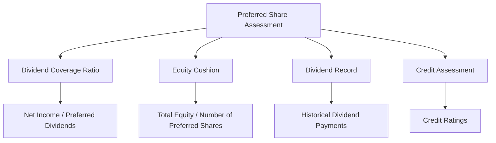

## 14.13 Assessing Preferred Share Investment Quality

Preferred shares are a unique class of equity that offer investors a blend of fixed-income and equity characteristics. They are often sought after for their steady dividend payments and priority over common shares in the event of liquidation. However, assessing the investment quality of preferred shares requires a thorough understanding of several key criteria. This section will guide you through the essential aspects of evaluating preferred shares, focusing on the Canadian financial landscape.

### Criteria for Evaluating Preferred Share Investment Quality

When evaluating the investment quality of preferred shares, investors should consider several critical factors:

1. **Preferred Dividend Coverage Ratio**: This ratio measures the company's ability to pay dividends to preferred shareholders from its earnings. A higher ratio indicates a stronger capacity to meet dividend obligations, which is crucial for preferred shareholders who prioritize income stability.

2. **Equity Cushion**: The equity cushion represents the amount of equity backing a preferred share, providing an indication of the company's financial stability. A substantial equity cushion suggests that the company has a solid financial foundation, reducing the risk of default on preferred dividends.

3. **Dividend Payment History**: A consistent and reliable dividend payment history is a positive indicator of a company's commitment to its preferred shareholders. It reflects the company's ability to generate sufficient earnings over time to support dividend payments.

4. **Credit Assessment**: Evaluating the creditworthiness of the issuing company is essential. Credit ratings from agencies such as Moody's or Standard & Poor's provide insights into the company's financial health and its ability to meet its obligations.

### Key Tests Used in Assessing Preferred Shares

To effectively assess the quality of preferred shares, investors can apply several key tests:

#### 1. Dividend Coverage Ratio

The Dividend Coverage Ratio is calculated as follows:

 \text{Dividend Coverage Ratio} = \frac{\text{Net Income}}{\text{Preferred Dividends}} 

A ratio above 1 indicates that the company earns more than enough to cover its preferred dividends. For example, if a Canadian bank like RBC has a net income of $10 billion and preferred dividends of $500 million, the ratio would be 20, suggesting strong coverage.

#### 2. Equity per Preferred Share

This metric provides insight into the equity backing each preferred share:

 \text{Equity per Preferred Share} = \frac{\text{Total Equity}}{\text{Number of Preferred Shares}} 

A higher value indicates a more substantial equity cushion. For instance, if TD Bank has total equity of $50 billion and 5 million preferred shares, the equity per preferred share would be $10,000, indicating robust financial support.

#### 3. Dividend Record

Analyzing the company's dividend record involves reviewing its historical dividend payments. Consistent payments over several years, especially during economic downturns, suggest reliability. Investors should look for Canadian companies with a strong track record of maintaining or increasing dividends, such as utility companies or major banks.

#### 4. Credit Assessment

Credit assessments involve reviewing the company's credit ratings and financial statements. A high credit rating indicates lower risk, while a downgrade may signal potential financial difficulties. Investors should stay informed about changes in credit ratings and understand the implications for preferred shares.

### Practical Financial Examples and Case Studies

Consider a scenario where a Canadian pension fund is evaluating preferred shares from a major Canadian bank. The fund would analyze the bank's dividend coverage ratio, equity cushion, and credit rating. If the bank has a strong dividend coverage ratio, a substantial equity cushion, and a high credit rating, the preferred shares would likely be deemed a high-quality investment.

### Diagrams and Visual Aids

To enhance understanding, consider the following diagram illustrating the relationship between key metrics in assessing preferred share quality:

### Best Practices and Common Pitfalls

**Best Practices:**
- Regularly review financial statements and credit ratings.
- Diversify preferred share holdings to mitigate risk.
- Stay informed about economic and industry trends that may impact the issuing company's financial health.

**Common Pitfalls:**
- Overlooking changes in credit ratings or financial health.
- Focusing solely on dividend yield without considering underlying financial stability.
- Ignoring macroeconomic factors that could affect the company's performance.

### Resources for Further Exploration

For those interested in deepening their understanding of preferred shares, consider the following resources:

- Article: [Evaluating Preferred Shares](https://www.investopedia.com/articles/stocks/09/preferred-stock.asp)
- Book: *The Handbook of Preferred Stock* by William L. Megginson

These resources provide comprehensive insights into preferred share evaluation and can enhance your investment analysis skills.

### Summary

Assessing the investment quality of preferred shares involves a multifaceted approach, considering dividend coverage, equity cushion, dividend history, and credit assessment. By applying these criteria and utilizing key tests, investors can make informed decisions and enhance their investment portfolios. Remember to stay informed, diversify your holdings, and continuously evaluate the financial health of issuing companies.

### **Ready to Test Your Knowledge?**

**Practice 10 Essential CSC Exam Questions to Master Your Certification**



### What does the Preferred Dividend Coverage Ratio measure?

- [x] The company's ability to pay dividends to preferred shareholders from its earnings.
- [ ] The market value of preferred shares.
- [ ] The interest rate on preferred shares.
- [ ] The company's total revenue.

> **Explanation:** The Preferred Dividend Coverage Ratio measures the company's ability to pay dividends to preferred shareholders from its earnings, indicating financial stability.

### What is an Equity Cushion?

- [x] The amount of equity backing a preferred share, indicating financial stability.
- [ ] The dividend yield of a preferred share.
- [ ] The market price of a preferred share.
- [ ] The interest rate on a preferred share.

> **Explanation:** An Equity Cushion is the amount of equity backing a preferred share, providing an indication of the company's financial stability.

### Which of the following is a key test for assessing preferred shares?

- [x] Dividend Coverage Ratio
- [ ] Price-to-Earnings Ratio
- [ ] Current Ratio
- [ ] Debt-to-Equity Ratio

> **Explanation:** The Dividend Coverage Ratio is a key test used to assess the quality of preferred shares by measuring the company's ability to pay dividends.

### What does a high Dividend Coverage Ratio indicate?

- [x] Strong capacity to meet dividend obligations.
- [ ] High market volatility.
- [ ] Low dividend yield.
- [ ] High interest rates.

> **Explanation:** A high Dividend Coverage Ratio indicates a strong capacity to meet dividend obligations, which is crucial for preferred shareholders.

### Why is a consistent dividend payment history important?

- [x] It reflects the company's ability to generate sufficient earnings over time to support dividend payments.
- [ ] It indicates high market volatility.
- [x] It suggests reliability and commitment to shareholders.
- [ ] It shows the company's interest rate policy.

> **Explanation:** A consistent dividend payment history reflects the company's ability to generate sufficient earnings over time and suggests reliability and commitment to shareholders.

### What should investors consider when evaluating preferred shares?

- [x] Dividend Coverage Ratio
- [ ] Price-to-Earnings Ratio
- [ ] Current Ratio
- [ ] Debt-to-Equity Ratio

> **Explanation:** Investors should consider the Dividend Coverage Ratio, among other factors, when evaluating preferred shares.

### How can investors mitigate risk when investing in preferred shares?

- [x] Diversify preferred share holdings.
- [ ] Focus solely on dividend yield.
- [x] Stay informed about economic and industry trends.
- [ ] Ignore changes in credit ratings.

> **Explanation:** Diversifying preferred share holdings and staying informed about economic and industry trends can help investors mitigate risk.

### What is a potential pitfall when investing in preferred shares?

- [x] Overlooking changes in credit ratings or financial health.
- [ ] Diversifying holdings.
- [ ] Staying informed about industry trends.
- [ ] Evaluating dividend coverage.

> **Explanation:** Overlooking changes in credit ratings or financial health is a potential pitfall when investing in preferred shares.

### What is the significance of credit assessment in evaluating preferred shares?

- [x] It provides insights into the company's financial health and ability to meet obligations.
- [ ] It determines the market price of preferred shares.
- [ ] It sets the dividend yield.
- [ ] It calculates the interest rate.

> **Explanation:** Credit assessment provides insights into the company's financial health and its ability to meet obligations, which is crucial for evaluating preferred shares.

### True or False: A high equity per preferred share value indicates a weak financial foundation.

- [ ] True
- [x] False

> **Explanation:** A high equity per preferred share value indicates a strong financial foundation, suggesting robust financial support for the preferred shares.


