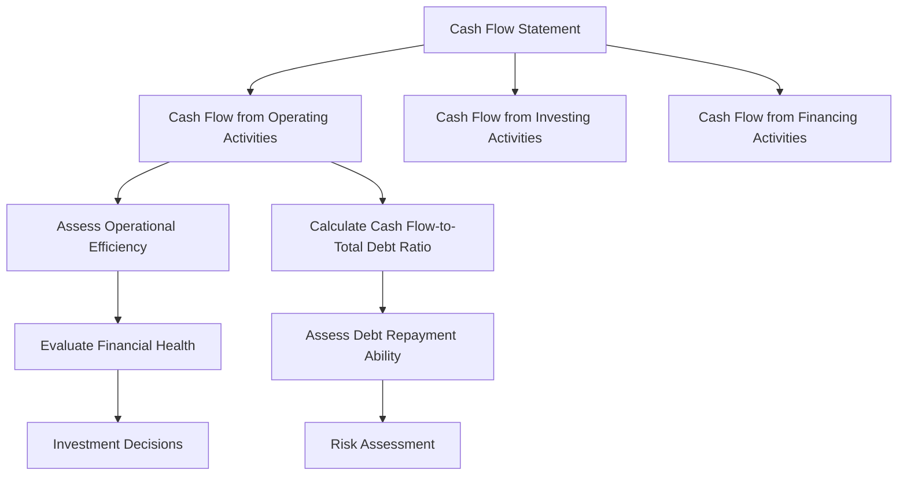

## 14.15 Cash Flow Analysis

Cash flow analysis is a critical component of company analysis, offering insights into a company's financial health and operational efficiency. In this section, we will delve into the importance of cash flow from operating activities, the calculation and interpretation of the Cash Flow-to-Total Debt Outstanding Ratio, and the role of cash flow in meeting short-term obligations and financing expansion.

### Importance of Cash Flow from Operating Activities

Cash flow from operating activities (CFO) is a key indicator of a company's ability to generate sufficient cash to maintain and grow its operations. Unlike net income, which can be influenced by accounting policies and non-cash items, CFO provides a clearer picture of the cash generated by a company's core business activities.

#### Key Points:
- **Operational Efficiency:** CFO reflects the efficiency of a company's operations in generating cash. A positive and growing CFO indicates that a company is effectively managing its operations and generating sufficient cash to cover its expenses.
- **Financial Health:** Consistent positive cash flow from operations is a sign of financial stability, enabling a company to meet its short-term liabilities and invest in growth opportunities.
- **Investment Decisions:** Investors often look at CFO to assess a company's ability to generate cash, which is crucial for dividend payments, debt repayment, and reinvestment in the business.

### Calculation and Interpretation of Cash Flow-to-Total Debt Outstanding Ratio

The Cash Flow-to-Total Debt Outstanding Ratio is a vital metric for evaluating a company's ability to repay its debt using its operating cash flow. This ratio helps investors and analysts understand the financial leverage and risk associated with a company's debt levels.

#### Formula:
 \text{Cash Flow-to-Total Debt Ratio} = \frac{\text{Cash Flow from Operating Activities}}{\text{Total Debt Outstanding}} 

#### Interpretation:
- **High Ratio:** A high ratio indicates that a company generates sufficient cash flow to cover its debt obligations, suggesting lower financial risk.
- **Low Ratio:** A low ratio may signal potential liquidity issues, as the company may struggle to meet its debt obligations with its current cash flow.

### Role of Cash Flow in Meeting Short-Term Obligations and Financing Expansion

Cash flow plays a crucial role in a company's ability to meet short-term obligations and finance expansion projects. Efficient cash flow management ensures that a company can cover its operational costs, pay off short-term liabilities, and invest in growth opportunities without relying excessively on external financing.

#### Meeting Short-Term Obligations:
- **Liquidity Management:** Adequate cash flow ensures that a company can meet its immediate financial commitments, such as payroll, supplier payments, and interest expenses.
- **Avoiding Insolvency:** Consistent cash flow helps prevent liquidity crises that could lead to insolvency or bankruptcy.

#### Financing Expansion:
- **Internal Funding:** Companies with strong cash flow can fund expansion projects internally, reducing reliance on debt or equity financing.
- **Strategic Investments:** Positive cash flow allows companies to invest in new projects, research and development, and market expansion, driving long-term growth.

### Practical Example: Canadian Pension Funds

Consider a Canadian pension fund that invests in various companies. The fund evaluates potential investments by analyzing the cash flow statements of target companies. A company with strong cash flow from operating activities and a high Cash Flow-to-Total Debt Ratio is more likely to be considered a stable and profitable investment, aligning with the fund's objective of securing long-term returns for its beneficiaries.

### Diagram: Cash Flow Analysis Process

Below is a visual representation of the cash flow analysis process, highlighting the key components and their relationships.

### Best Practices and Common Pitfalls

#### Best Practices:
- **Regular Monitoring:** Continuously monitor cash flow statements to identify trends and potential issues early.
- **Scenario Analysis:** Conduct scenario analysis to understand the impact of various business conditions on cash flow.
- **Diversified Revenue Streams:** Develop diversified revenue streams to ensure stable cash flow even during economic downturns.

#### Common Pitfalls:
- **Overlooking Non-Operating Cash Flows:** Focusing solely on operating cash flow without considering investing and financing activities can provide an incomplete picture.
- **Ignoring Seasonal Variations:** Failing to account for seasonal variations in cash flow can lead to inaccurate assessments of financial health.

### Glossary

- **Cash Flow from Operating Activities:** The amount of cash generated by a company's normal business operations.
- **Cash Flow-to-Total Debt Ratio:** A measure of a company's ability to repay its total debt with its operating cash flow.

### Resources for Further Exploration

- Article: [Understanding Cash Flow Statements](https://www.investopedia.com/articles/basics/07/cashflowstatement.asp)
- Online Tool: [Cash Flow Calculator](https://www.calculatorsoup.com/calculators/financial/cash-flow-calculator.php)

### Conclusion

Cash flow analysis is an essential tool for assessing a company's financial health and operational efficiency. By understanding cash flow from operating activities and the Cash Flow-to-Total Debt Ratio, investors and analysts can make informed decisions about a company's ability to meet its obligations and finance growth. Regular monitoring and analysis of cash flow statements are crucial for identifying trends and potential risks, ensuring long-term financial stability.

### **Ready to Test Your Knowledge?**

**Practice 10 Essential CSC Exam Questions to Master Your Certification**



### What does cash flow from operating activities indicate?

- [x] The efficiency of a company's operations in generating cash
- [ ] The total revenue of a company
- [ ] The net profit of a company
- [ ] The total assets of a company

> **Explanation:** Cash flow from operating activities reflects the efficiency of a company's operations in generating cash, providing insights into its financial health.

### How is the Cash Flow-to-Total Debt Ratio calculated?

- [x] Cash Flow from Operating Activities divided by Total Debt Outstanding
- [ ] Total Revenue divided by Total Debt Outstanding
- [ ] Net Profit divided by Total Debt Outstanding
- [ ] Total Assets divided by Total Debt Outstanding

> **Explanation:** The Cash Flow-to-Total Debt Ratio is calculated by dividing Cash Flow from Operating Activities by Total Debt Outstanding.

### What does a high Cash Flow-to-Total Debt Ratio indicate?

- [x] Lower financial risk
- [ ] Higher financial risk
- [ ] Poor operational efficiency
- [ ] High net profit

> **Explanation:** A high Cash Flow-to-Total Debt Ratio indicates lower financial risk, as the company generates sufficient cash flow to cover its debt obligations.

### Why is cash flow important for meeting short-term obligations?

- [x] It ensures liquidity and prevents insolvency
- [ ] It increases net profit
- [ ] It reduces total debt
- [ ] It enhances asset value

> **Explanation:** Cash flow is crucial for meeting short-term obligations as it ensures liquidity and helps prevent insolvency.

### What is a common pitfall in cash flow analysis?

- [x] Overlooking non-operating cash flows
- [ ] Regular monitoring of cash flow statements
- [ ] Conducting scenario analysis
- [ ] Developing diversified revenue streams

> **Explanation:** A common pitfall in cash flow analysis is overlooking non-operating cash flows, which can provide an incomplete picture of financial health.

### What role does cash flow play in financing expansion?

- [x] It allows for internal funding of projects
- [ ] It increases total debt
- [ ] It decreases net profit
- [ ] It reduces operational efficiency

> **Explanation:** Cash flow plays a role in financing expansion by allowing for internal funding of projects, reducing reliance on external financing.

### What is the significance of regular monitoring of cash flow statements?

- [x] Identifying trends and potential issues early
- [ ] Increasing total revenue
- [ ] Enhancing asset value
- [ ] Reducing net profit

> **Explanation:** Regular monitoring of cash flow statements is significant for identifying trends and potential issues early, ensuring financial stability.

### What is the impact of a low Cash Flow-to-Total Debt Ratio?

- [x] Potential liquidity issues
- [ ] Increased net profit
- [ ] Enhanced asset value
- [ ] Reduced operational efficiency

> **Explanation:** A low Cash Flow-to-Total Debt Ratio may signal potential liquidity issues, as the company may struggle to meet its debt obligations.

### What is a benefit of conducting scenario analysis in cash flow management?

- [x] Understanding the impact of various business conditions on cash flow
- [ ] Increasing total debt
- [ ] Reducing net profit
- [ ] Enhancing asset value

> **Explanation:** Conducting scenario analysis in cash flow management helps understand the impact of various business conditions on cash flow, aiding in strategic planning.

### True or False: Cash flow from operating activities is influenced by accounting policies and non-cash items.

- [ ] True
- [x] False

> **Explanation:** False. Unlike net income, cash flow from operating activities is not influenced by accounting policies and non-cash items, providing a clearer picture of cash generated by core business activities.


