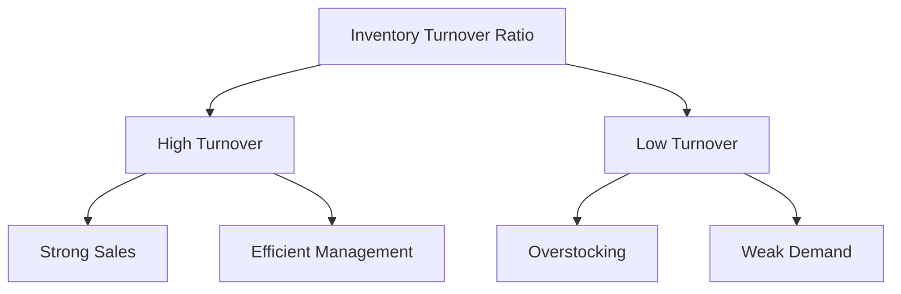

## 14.18 Inventory Turnover Ratio

In the realm of financial analysis, particularly within the context of company analysis, the Inventory Turnover Ratio is a critical metric. It provides insights into how efficiently a company manages its inventory, which is a key component of operational efficiency. This section will delve into the importance of the Inventory Turnover Ratio, its calculation methods, interpretation across various industries, and its relevance in the Canadian financial landscape.

### Importance of the Inventory Turnover Ratio

The Inventory Turnover Ratio is a measure of how many times a company's inventory is sold and replaced over a specific period. It is a vital indicator of a company's operational efficiency and effectiveness in managing its inventory levels. A high turnover ratio suggests that a company is selling its inventory quickly, which can be a sign of strong sales or effective inventory management. Conversely, a low turnover ratio may indicate overstocking, obsolescence, or weak sales.

For Canadian businesses, particularly those in retail and manufacturing, maintaining an optimal inventory turnover is crucial. It impacts cash flow, profitability, and the ability to meet customer demand. Investors and analysts use this ratio to assess how well a company is performing relative to its peers and to identify potential operational improvements.

### Calculation Methods for Inventory Turnover and Days Inventory Outstanding

The Inventory Turnover Ratio can be calculated using the following formula:

 \text{Inventory Turnover Ratio} = \frac{\text{Cost of Goods Sold (COGS)}}{\text{Average Inventory}} 

Where:
- **Cost of Goods Sold (COGS)** is the direct costs attributable to the production of the goods sold by a company.
- **Average Inventory** is calculated as the sum of the beginning and ending inventory for a period, divided by two.

To further understand the efficiency of inventory management, the Days Inventory Outstanding (DIO) can be calculated. DIO indicates the average number of days a company takes to sell its inventory:

 \text{Days Inventory Outstanding (DIO)} = \frac{365}{\text{Inventory Turnover Ratio}} 

These calculations provide a comprehensive view of inventory management efficiency, allowing companies to benchmark their performance against industry standards.

### Interpretation of High and Low Turnover Ratios in Different Industries

The interpretation of inventory turnover ratios can vary significantly across different industries. For instance, industries with perishable goods, such as food and beverage, typically have higher turnover ratios due to the necessity of selling products quickly. In contrast, industries like automotive or heavy machinery may have lower turnover ratios due to longer sales cycles and higher inventory costs.

#### High Inventory Turnover Ratio

A high inventory turnover ratio can indicate:
- Strong sales performance.
- Efficient inventory management.
- Potential stockouts if inventory levels are too low.

For example, a Canadian grocery chain like Loblaw Companies Limited might exhibit a high turnover ratio due to the rapid sale of perishable goods.

#### Low Inventory Turnover Ratio

A low inventory turnover ratio may suggest:
- Overstocking or slow-moving inventory.
- Potential issues with product demand.
- Increased holding costs and risk of obsolescence.

A Canadian electronics retailer might experience a lower turnover ratio if new technology products are not selling as quickly as anticipated.

### Practical Financial Examples and Case Studies

Consider a case study involving a major Canadian retailer, such as Canadian Tire. Suppose Canadian Tire reports a COGS of CAD 5 billion and an average inventory of CAD 1 billion. The inventory turnover ratio would be:

 \text{Inventory Turnover Ratio} = \frac{5,000,000,000}{1,000,000,000} = 5 

This indicates that Canadian Tire sells and replaces its inventory five times a year. If the industry average is 6, Canadian Tire might explore strategies to improve sales or reduce inventory levels.

### Diagrams and Visual Aids

To visualize the relationship between inventory turnover and days inventory outstanding, consider the following diagram:

### Best Practices and Common Pitfalls

**Best Practices:**
- Regularly monitor inventory levels and turnover ratios.
- Compare turnover ratios with industry benchmarks.
- Implement inventory management systems to optimize stock levels.

**Common Pitfalls:**
- Ignoring seasonal variations in inventory turnover.
- Failing to account for changes in consumer demand.
- Over-reliance on turnover ratios without considering other financial metrics.

### Resources for Further Exploration

For those interested in deepening their understanding of inventory management and operational efficiency, consider the following resources:
- **Book:** *Operations Management* by William J. Stevenson
- **Online Tool:** [Inventory Turnover Calculator](https://www.calculatorsoup.com/calculators/financial/inventory-turnover-calculator.php)

These resources provide valuable insights and tools for analyzing and improving inventory turnover.

### Encouragement for Application

Understanding and applying the Inventory Turnover Ratio is essential for financial professionals and investors. By analyzing this ratio, you can gain insights into a company's operational efficiency and make informed investment decisions. Consider applying these principles to your own portfolio or business practices, and explore additional topics to enhance your financial acumen.

### **Ready to Test Your Knowledge?**

**Practice 10 Essential CSC Exam Questions to Master Your Certification**



### What does a high Inventory Turnover Ratio indicate?

- [x] Strong sales performance
- [ ] Overstocking
- [ ] Weak demand
- [ ] High holding costs

> **Explanation:** A high Inventory Turnover Ratio typically indicates strong sales performance and efficient inventory management.

### How is the Inventory Turnover Ratio calculated?

- [x] Cost of Goods Sold divided by Average Inventory
- [ ] Average Inventory divided by Cost of Goods Sold
- [ ] Net Sales divided by Average Inventory
- [ ] Average Inventory divided by Net Sales

> **Explanation:** The Inventory Turnover Ratio is calculated by dividing the Cost of Goods Sold by the Average Inventory.

### What does Days Inventory Outstanding (DIO) measure?

- [x] The average number of days a company holds inventory before selling it
- [ ] The total sales period of a company
- [ ] The average number of days it takes to receive inventory
- [ ] The average number of days inventory is in transit

> **Explanation:** DIO measures the average number of days a company holds inventory before selling it.

### Which industry is likely to have a high Inventory Turnover Ratio?

- [x] Food and Beverage
- [ ] Automotive
- [ ] Heavy Machinery
- [ ] Real Estate

> **Explanation:** The Food and Beverage industry typically has a high Inventory Turnover Ratio due to the perishable nature of its products.

### What might a low Inventory Turnover Ratio suggest?

- [x] Overstocking
- [ ] Strong sales
- [x] Weak demand
- [ ] Efficient inventory management

> **Explanation:** A low Inventory Turnover Ratio may suggest overstocking and weak demand for products.

### What is a potential risk of a high Inventory Turnover Ratio?

- [x] Stockouts
- [ ] Overstocking
- [ ] Increased holding costs
- [ ] Weak sales

> **Explanation:** A high Inventory Turnover Ratio can lead to stockouts if inventory levels are too low.

### How can companies improve their Inventory Turnover Ratio?

- [x] Optimize inventory levels
- [ ] Increase holding costs
- [x] Enhance sales strategies
- [ ] Reduce sales

> **Explanation:** Companies can improve their Inventory Turnover Ratio by optimizing inventory levels and enhancing sales strategies.

### What is the formula for Days Inventory Outstanding (DIO)?

- [x] 365 divided by Inventory Turnover Ratio
- [ ] Inventory Turnover Ratio divided by 365
- [ ] Cost of Goods Sold divided by 365
- [ ] Average Inventory divided by Cost of Goods Sold

> **Explanation:** DIO is calculated as 365 divided by the Inventory Turnover Ratio.

### Which of the following is a best practice for managing inventory?

- [x] Regularly monitor inventory levels
- [ ] Ignore seasonal variations
- [ ] Over-rely on turnover ratios
- [ ] Avoid comparing with industry benchmarks

> **Explanation:** Regularly monitoring inventory levels and comparing with industry benchmarks are best practices for managing inventory.

### True or False: A low Inventory Turnover Ratio always indicates poor performance.

- [ ] True
- [x] False

> **Explanation:** A low Inventory Turnover Ratio does not always indicate poor performance, as it may vary by industry and business model.


