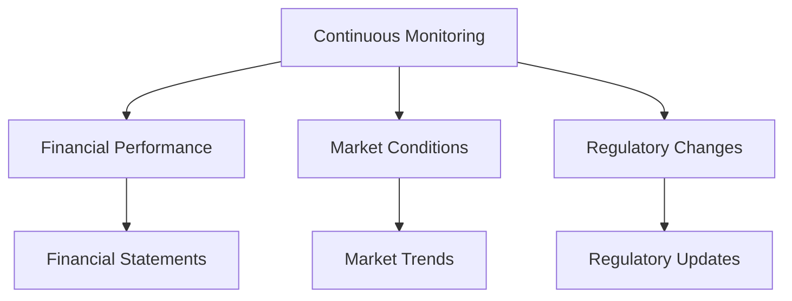

---

linkTitle: "14.23 Continuous Monitoring and Qualitative Analysis"
title: "Continuous Monitoring and Qualitative Analysis: Essential Strategies for Investors"
description: "Explore the importance of continuous monitoring and qualitative analysis in company evaluation, focusing on management effectiveness, company reputation, and staying informed through financial reports and market news."
categories:
- Finance
- Investment
- Canadian Securities
tags:
- Continuous Monitoring
- Qualitative Analysis
- Company Analysis
- Investment Strategies
- Financial Performance
date: 2024-10-25
type: docs
nav_weight: 440000
canonical: "https://securitiesexamsmastery.ca/14/2/24"
license: "© 2023 Tokenizer Inc. CC BY-NC-SA 4.0"
---

## 14.23 Continuous Monitoring and Qualitative Analysis

In the dynamic world of finance, continuous monitoring and qualitative analysis are crucial components of effective company analysis. Investors must remain vigilant, consistently evaluating both quantitative and qualitative factors to make informed decisions. This section delves into the importance of ongoing monitoring, the role of qualitative factors, and strategies for staying informed, all within the context of the Canadian financial landscape.

### Importance of Continuous Monitoring

Continuous monitoring involves the regular assessment of a company's operations and financial performance. This process is essential for investors to ensure that their investments align with their financial goals and risk tolerance. By staying informed about a company's performance, investors can make timely decisions to buy, hold, or sell securities.

#### Key Aspects of Continuous Monitoring:

1. **Financial Performance:** Regularly reviewing financial statements, such as income statements, balance sheets, and cash flow statements, helps investors understand a company's profitability, liquidity, and solvency.

2. **Market Conditions:** Monitoring market trends and economic indicators can provide insights into potential opportunities or threats that may impact a company's performance.

3. **Regulatory Changes:** Staying updated on regulatory developments is crucial, as changes in laws or regulations can significantly affect a company's operations and profitability.

### Role of Qualitative Factors

While quantitative analysis focuses on numerical data, qualitative analysis evaluates non-numerical factors that can influence a company's success. These factors include management effectiveness, company reputation, and business models.

#### Key Qualitative Factors:

- **Management Effectiveness:** The quality of a company's leadership can significantly impact its performance. Effective management teams are often characterized by strong strategic vision, operational efficiency, and the ability to adapt to changing market conditions.

- **Company Reputation:** A company's reputation can affect its brand value, customer loyalty, and overall market position. Companies with strong reputations often enjoy competitive advantages and can attract top talent.

- **Business Model:** Understanding a company's business model helps investors assess its long-term viability and growth potential. A robust business model should be scalable, sustainable, and adaptable to market changes.

### Strategies for Staying Informed

To effectively monitor and analyze companies, investors must utilize various resources and strategies to stay informed. Here are some practical approaches:

1. **Financial Reports and Prospectuses:** Regularly reviewing a company's financial reports and prospectuses provides valuable insights into its financial health and strategic direction. A prospectus, for instance, is a legal document that describes a company's securities offering, helping investors make informed decisions.

2. **Market News and Analysis:** Keeping up with market news and analysis through reputable financial news outlets and industry reports can help investors identify trends and potential risks.

3. **Investor Relations Websites:** Many companies maintain investor relations websites where they publish financial reports, press releases, and other relevant information. These resources can be invaluable for staying updated on company developments.

4. **Networking and Industry Conferences:** Engaging with industry professionals and attending conferences can provide insights into market trends and company performance from experts and peers.

### Practical Example: Monitoring a Canadian Bank

Consider the example of monitoring a major Canadian bank, such as the Royal Bank of Canada (RBC). Continuous monitoring of RBC would involve:

- **Reviewing Quarterly Reports:** Analyzing RBC's quarterly financial statements to assess its profitability, asset quality, and capital adequacy.

- **Evaluating Management:** Assessing the effectiveness of RBC's management team by examining their strategic initiatives and responses to regulatory changes.

- **Staying Informed on Regulatory Changes:** Keeping abreast of changes in Canadian banking regulations that could impact RBC's operations.

- **Monitoring Market News:** Following news related to the Canadian banking sector, such as interest rate changes or economic forecasts, to understand potential impacts on RBC.

### Diagrams and Visual Aids

To enhance understanding, consider the following diagram illustrating the continuous monitoring process:

### Best Practices and Common Pitfalls

**Best Practices:**

- **Diversify Information Sources:** Use multiple sources of information to gain a comprehensive view of a company's performance and market conditions.

- **Regularly Update Analysis:** Continuously update your analysis to reflect the latest data and market developments.

**Common Pitfalls:**

- **Overreliance on Historical Data:** Avoid relying solely on past performance, as it may not accurately predict future outcomes.

- **Ignoring Qualitative Factors:** Focusing only on quantitative data can lead to overlooking critical qualitative factors that impact a company's success.

### Resources for Further Exploration

- **Article:** [Qualitative vs Quantitative Analysis](https://www.investopedia.com/terms/q/qualitativeanalysis.asp)
- **Online Tool:** [SEC Filings Search](https://www.sec.gov/edgar/search/)

These resources provide additional insights into the differences between qualitative and quantitative analysis and offer tools for accessing company filings.

### Conclusion

Continuous monitoring and qualitative analysis are essential for effective company analysis. By understanding both quantitative and qualitative factors, investors can make informed decisions that align with their financial goals. By employing the strategies outlined in this section, investors can stay informed and adapt to the ever-changing financial landscape.

### **Ready to Test Your Knowledge?**

**Practice 10 Essential CSC Exam Questions to Master Your Certification**



### What is the primary purpose of continuous monitoring in company analysis?

- [x] To regularly assess a company's operations and financial performance
- [ ] To focus solely on historical data
- [ ] To ignore qualitative factors
- [ ] To rely only on market news

> **Explanation:** Continuous monitoring involves regularly assessing a company's operations and financial performance to make informed investment decisions.

### Which of the following is a qualitative factor in company analysis?

- [x] Management effectiveness
- [ ] Profit margins
- [ ] Revenue growth
- [ ] Debt ratios

> **Explanation:** Qualitative factors include non-numerical aspects such as management effectiveness, which can significantly impact a company's success.

### What is a prospectus?

- [x] A legal document describing a company's securities offering
- [ ] A financial statement
- [ ] A market trend report
- [ ] A regulatory update

> **Explanation:** A prospectus is a legal document issued by companies to describe securities offerings for sale to the public.

### Why is it important to stay informed about regulatory changes?

- [x] Because changes in laws can significantly affect a company's operations and profitability
- [ ] Because it helps ignore market trends
- [ ] Because it focuses solely on historical data
- [ ] Because it is not relevant to company analysis

> **Explanation:** Staying informed about regulatory changes is crucial as they can have a significant impact on a company's operations and profitability.

### Which strategy can help investors stay informed about company developments?

- [x] Reviewing financial reports and prospectuses
- [ ] Ignoring market news
- [ ] Relying solely on historical data
- [ ] Focusing only on qualitative factors

> **Explanation:** Reviewing financial reports and prospectuses provides valuable insights into a company's financial health and strategic direction.

### What is the role of qualitative analysis in company evaluation?

- [x] To evaluate non-numerical factors such as management quality and business models
- [ ] To focus only on numerical data
- [ ] To ignore management effectiveness
- [ ] To rely solely on financial statements

> **Explanation:** Qualitative analysis evaluates non-numerical factors, such as management quality and business models, which can influence a company's success.

### How can investors effectively monitor a Canadian bank like RBC?

- [x] By reviewing quarterly reports and evaluating management effectiveness
- [ ] By ignoring regulatory changes
- [ ] By focusing only on historical data
- [ ] By relying solely on market news

> **Explanation:** Effective monitoring involves reviewing quarterly reports, evaluating management effectiveness, and staying informed about regulatory changes.

### What is a common pitfall in company analysis?

- [x] Overreliance on historical data
- [ ] Diversifying information sources
- [ ] Regularly updating analysis
- [ ] Considering qualitative factors

> **Explanation:** Overreliance on historical data is a common pitfall, as it may not accurately predict future outcomes.

### Which of the following is a best practice for continuous monitoring?

- [x] Diversifying information sources
- [ ] Ignoring qualitative factors
- [ ] Relying solely on historical data
- [ ] Focusing only on market news

> **Explanation:** Diversifying information sources is a best practice, as it provides a comprehensive view of a company's performance and market conditions.

### True or False: Qualitative analysis focuses only on numerical data.

- [ ] True
- [x] False

> **Explanation:** False. Qualitative analysis evaluates non-numerical factors, such as management quality and business models, which can influence a company's success.


