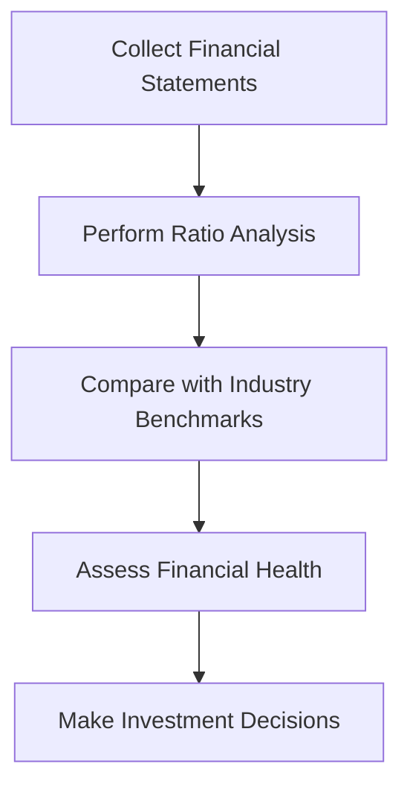

## Additional Resources for Chapter 14

Chapter 14 of the CSC® Exam Prep Guide: Volume 2 delves into the intricacies of company analysis, a critical skill for any finance professional. To enhance your understanding and application of the concepts covered in this chapter, we have compiled a list of additional resources. These resources include official Canadian financial regulations, open-source financial tools, insightful books, and online courses that provide further learning opportunities.

### Official Canadian Financial Regulations and Institutions

Understanding the regulatory environment is crucial for conducting thorough company analysis. Here are some key Canadian institutions and regulations that provide valuable insights and guidelines:

- **[Canadian Securities Administrators (CSA)](https://www.securities-administrators.ca/):** The CSA is an umbrella organization of Canada’s provincial and territorial securities regulators. It aims to improve, coordinate, and harmonize regulation of the Canadian capital markets. The CSA website offers a wealth of information on securities regulations, policy initiatives, and investor protection.

- **[Financial Transactions and Reports Analysis Centre of Canada (FINTRAC)](https://www.fintrac-canafe.gc.ca/):** FINTRAC is Canada’s financial intelligence unit, responsible for facilitating the detection, prevention, and deterrence of money laundering and terrorist financing activities. Understanding FINTRAC’s guidelines can help analysts assess a company’s compliance with financial regulations.

### Open-Source Financial Tools and Frameworks

Leveraging technology can significantly enhance the efficiency and accuracy of company analysis. Here are some open-source tools that can aid in financial analysis and management:

- **[GNUCash](https://www.gnucash.org/):** GNUCash is a free, open-source accounting software that offers features such as double-entry accounting, stock/bond/mutual fund accounts, and financial reports. It is a useful tool for managing personal and small business finances, providing a practical way to apply accounting principles in real-world scenarios.

- **[Apache OFBiz](https://ofbiz.apache.org/):** Apache OFBiz is an open-source enterprise automation software project that includes a suite of applications for financial management. It can be customized to fit various business needs, making it a versatile tool for analyzing and managing company operations.

### Books for Deeper Insights

Books are an excellent way to gain deeper insights into company analysis and valuation. Here are some recommended readings:

- **_Financial Statement Analysis and Security Valuation_ by Stephen Penman:** This book provides a comprehensive approach to analyzing financial statements and valuing securities. It emphasizes the importance of understanding the economic context of financial data and offers practical techniques for valuation.

- **_The Intelligent Investor_ by Benjamin Graham:** A classic in the field of investment, this book introduces the concept of value investing and provides timeless principles for analyzing and selecting stocks. Graham’s insights into market behavior and investment strategies are invaluable for any finance professional.

- **_Valuation: Measuring and Managing the Value of Companies_ by McKinsey & Company Inc.:** This book offers a detailed framework for valuing companies, integrating financial theory with practical applications. It covers various valuation methods and provides guidance on managing company value.

### Online Courses for Further Learning

Online courses offer flexible learning opportunities to deepen your understanding of company analysis. Here are some courses that can enhance your skills:

- **[Financial Analysis for Decision Making](https://www.coursera.org/learn/financial-analysis):** This course covers the fundamentals of financial analysis, including financial statement analysis, ratio analysis, and cash flow analysis. It is designed to help you make informed financial decisions based on quantitative data.

- **[Investment Analysis and Portfolio Management](https://www.edx.org/course/investment-analysis-and-portfolio-management):** This course explores investment strategies, portfolio management techniques, and risk assessment. It provides practical insights into constructing and managing investment portfolios.

- **[Financial Ratios and Analysis](https://www.coursera.org/learn/financial-ratio-analysis):** This course focuses on the use of financial ratios to evaluate company performance and financial health. It covers key ratios such as liquidity, profitability, and solvency ratios, and explains how to interpret them in the context of company analysis.

### Practical Financial Examples and Case Studies

To further illustrate the concepts covered in Chapter 14, consider the following practical examples and case studies:

#### Example 1: Analyzing a Canadian Bank's Financial Statements

Let's take the example of analyzing the financial statements of a major Canadian bank, such as the Royal Bank of Canada (RBC). Start by examining the bank's balance sheet, income statement, and cash flow statement. Identify key financial ratios, such as the return on equity (ROE), net interest margin, and efficiency ratio. Compare these ratios with industry benchmarks to assess the bank's financial performance and stability.

#### Example 2: Evaluating a Canadian Pension Fund's Investment Strategy

Consider a case study involving a Canadian pension fund's investment strategy. Analyze the fund's asset allocation, focusing on the mix of equities, fixed income, and alternative investments. Evaluate the fund's risk management practices and performance metrics, such as the Sharpe ratio and alpha. Assess how the fund's strategy aligns with its long-term objectives and regulatory requirements.

### Diagrams and Visual Aids

To enhance your understanding of company analysis, consider using diagrams and visual aids. For example, a flowchart illustrating the process of financial statement analysis can help visualize the steps involved in evaluating a company's financial health.

### Best Practices and Common Pitfalls

When conducting company analysis, keep the following best practices and common pitfalls in mind:

- **Best Practices:**
  - Use a comprehensive approach that considers both quantitative and qualitative factors.
  - Stay updated on industry trends and regulatory changes.
  - Validate data sources and ensure the accuracy of financial information.

- **Common Pitfalls:**
  - Over-reliance on historical data without considering future prospects.
  - Ignoring qualitative factors, such as management quality and competitive positioning.
  - Failing to account for macroeconomic and industry-specific risks.

### Encouraging Continuous Learning

Company analysis is a dynamic field that requires continuous learning and adaptation. Stay curious and open to new ideas, and seek opportunities to apply your knowledge in real-world scenarios. Engage with professional networks and forums to exchange insights and experiences with peers.

### **Ready to Test Your Knowledge?**

**Practice 10 Essential CSC Exam Questions to Master Your Certification**



### Which Canadian organization aims to improve and harmonize regulation of the capital markets?

- [x] Canadian Securities Administrators (CSA)
- [ ] Financial Transactions and Reports Analysis Centre of Canada (FINTRAC)
- [ ] Bank of Canada
- [ ] Office of the Superintendent of Financial Institutions (OSFI)

> **Explanation:** The Canadian Securities Administrators (CSA) is responsible for improving and harmonizing regulation of the Canadian capital markets.

### What is the primary focus of FINTRAC?

- [x] Detecting and preventing money laundering and terrorist financing
- [ ] Regulating securities markets
- [ ] Managing monetary policy
- [ ] Overseeing pension funds

> **Explanation:** FINTRAC is Canada's financial intelligence unit, focusing on detecting and preventing money laundering and terrorist financing.

### Which open-source tool is useful for managing personal and small business finances?

- [x] GNUCash
- [ ] Apache OFBiz
- [ ] QuickBooks
- [ ] SAP

> **Explanation:** GNUCash is a free, open-source accounting software suitable for managing personal and small business finances.

### Which book introduces the concept of value investing?

- [x] The Intelligent Investor by Benjamin Graham
- [ ] Financial Statement Analysis and Security Valuation by Stephen Penman
- [ ] Valuation: Measuring and Managing the Value of Companies by McKinsey & Company Inc.
- [ ] Security Analysis by Benjamin Graham

> **Explanation:** "The Intelligent Investor" by Benjamin Graham introduces the concept of value investing.

### Which course focuses on the use of financial ratios to evaluate company performance?

- [x] Financial Ratios and Analysis
- [ ] Financial Analysis for Decision Making
- [ ] Investment Analysis and Portfolio Management
- [ ] Corporate Finance Essentials

> **Explanation:** The course "Financial Ratios and Analysis" focuses on using financial ratios to evaluate company performance.

### What is a common pitfall in company analysis?

- [x] Over-reliance on historical data
- [ ] Comprehensive approach
- [ ] Staying updated on industry trends
- [ ] Validating data sources

> **Explanation:** Over-reliance on historical data without considering future prospects is a common pitfall in company analysis.

### Which diagram type can help visualize the process of financial statement analysis?

- [x] Flowchart
- [ ] Pie chart
- [ ] Bar graph
- [ ] Scatter plot

> **Explanation:** A flowchart can help visualize the process of financial statement analysis by illustrating the steps involved.

### What is the Sharpe ratio used for?

- [x] Evaluating investment performance relative to risk
- [ ] Measuring company profitability
- [ ] Assessing liquidity
- [ ] Analyzing cash flow

> **Explanation:** The Sharpe ratio is used to evaluate investment performance relative to risk, helping assess risk-adjusted returns.

### Which financial statement provides information about a company's cash inflows and outflows?

- [x] Cash flow statement
- [ ] Balance sheet
- [ ] Income statement
- [ ] Statement of changes in equity

> **Explanation:** The cash flow statement provides information about a company's cash inflows and outflows.

### True or False: Apache OFBiz is a proprietary financial management software.

- [ ] True
- [x] False

> **Explanation:** Apache OFBiz is an open-source enterprise automation software project, not proprietary.



By exploring these resources and engaging with the material, you will deepen your understanding of company analysis and enhance your ability to make informed financial decisions.
