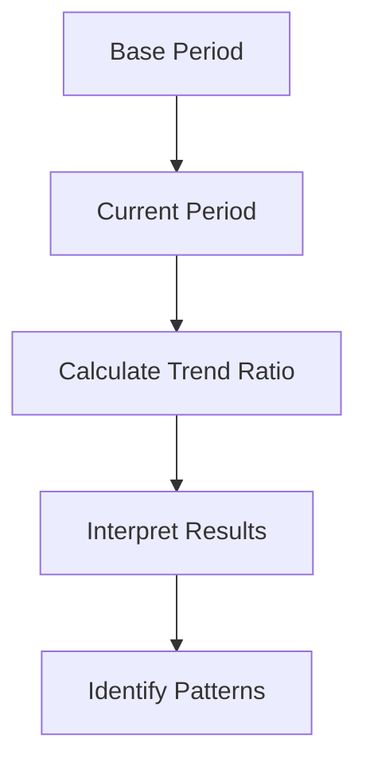

## 14.6 Trend Analysis

In the realm of financial analysis, understanding the trajectory of a company's performance over time is crucial for making informed investment decisions. Trend analysis serves as a powerful tool in this regard, enabling analysts and investors to identify patterns and changes in financial metrics. This section delves into the methodology of trend analysis, focusing on the calculation and application of trend ratios, and provides practical insights into assessing company performance.

### Understanding Trend Ratios

Trend ratios are financial metrics that illustrate the relationship of specific financial data over a series of periods. They are instrumental in identifying whether a company's financial position is improving, deteriorating, or remaining stable. By examining these ratios, analysts can detect trends that may not be immediately apparent from a single period's data.

#### Key Components of Trend Ratios

1. **Trend Ratio:** This is a comparative measure that shows how a particular financial metric has changed over time. It is expressed as a percentage or a ratio, indicating the relative change from a base period.

2. **Base Period:** The base period serves as the reference point for trend analysis. It is typically the earliest period in the analysis and is assigned a value of 100% or 1.0. Subsequent periods are compared against this base to determine the trend.

### Calculating Trend Ratios

To calculate trend ratios, follow these steps:

1. **Select the Base Period:** Choose the initial period for comparison. This could be a fiscal year, quarter, or month, depending on the data available and the analysis's scope.

2. **Determine the Metric:** Identify the financial metric you wish to analyze, such as revenue, net income, or operating expenses.

3. **Calculate the Ratio for Each Period:** For each subsequent period, divide the metric's value by the base period's value and multiply by 100 to express it as a percentage. This formula is represented as:

   
   \text{Trend Ratio} = \left(\frac{\text{Metric Value in Current Period}}{\text{Metric Value in Base Period}}\right) \times 100
   

4. **Interpret the Results:** Analyze the trend ratios to identify patterns. A ratio above 100% indicates growth compared to the base period, while a ratio below 100% suggests a decline.

### Practical Application of Trend Analysis

Trend analysis is widely used to assess company performance, providing insights into financial health and operational efficiency. Here are some practical applications:

#### Evaluating Revenue Growth

Consider a Canadian technology company, TechInnovate Inc., which has reported the following annual revenues:

- 2020: $500 million
- 2021: $550 million
- 2022: $600 million

Using 2020 as the base period, calculate the trend ratios:

- **2021 Trend Ratio:** \\((550/500) \times 100 = 110%\\)
- **2022 Trend Ratio:** \\((600/500) \times 100 = 120%\\)

These ratios indicate a consistent revenue growth trend, suggesting that TechInnovate Inc. is expanding its market presence effectively.

#### Analyzing Cost Management

Trend analysis can also be applied to cost management. Suppose a Canadian manufacturing firm, Maple Manufacturing, aims to reduce its operating expenses. The trend analysis of operating expenses over three years might reveal:

- 2020: $200 million
- 2021: $190 million
- 2022: $180 million

Calculating the trend ratios:

- **2021 Trend Ratio:** \\((190/200) \times 100 = 95%\\)
- **2022 Trend Ratio:** \\((180/200) \times 100 = 90%\\)

These results demonstrate effective cost management, with a downward trend in operating expenses.

### Visualizing Trend Analysis

To enhance understanding, visual representations such as line graphs can be used to depict trend ratios over time. Below is a simple diagram illustrating the trend analysis process:

### Best Practices and Common Pitfalls

#### Best Practices

- **Consistency in Base Period:** Ensure the base period is consistent across all metrics to maintain comparability.
- **Regular Updates:** Regularly update trend analyses to reflect the most current data, providing timely insights.
- **Comprehensive Metrics:** Analyze a range of financial metrics to gain a holistic view of company performance.

#### Common Pitfalls

- **Ignoring External Factors:** Be mindful of external factors such as economic conditions or regulatory changes that may impact trends.
- **Overreliance on Historical Data:** While historical trends are informative, they do not guarantee future performance. Consider forward-looking indicators as well.

### Resources for Further Exploration

To deepen your understanding of trend analysis, consider the following resources:

- **Book:** *Trend Analysis Basics* by Charles E. Scott
- **Online Tool:** [Trend Analysis Calculator](https://www.calculatorsoup.com/calculators/financial/trend-analysis-calculator.php)

These resources provide additional insights and tools to enhance your trend analysis skills.

### Conclusion

Trend analysis is a vital component of company analysis, offering valuable insights into financial performance over time. By mastering the calculation and interpretation of trend ratios, you can make informed investment decisions and assess the financial health of companies effectively. Remember to consider both historical data and future projections to build a comprehensive analysis.

### **Ready to Test Your Knowledge?**

**Practice 10 Essential CSC Exam Questions to Master Your Certification**



### What is a trend ratio?

- [x] A financial ratio that shows the relationship of financial metrics over a series of periods.
- [ ] A measure of a company's profitability in a single period.
- [ ] A ratio used to compare two companies in the same industry.
- [ ] A metric for assessing a company's market share.

> **Explanation:** A trend ratio is used to analyze changes in financial metrics over time, providing insights into trends and patterns.

### What is the base period in trend analysis?

- [x] The starting point used for comparison in trend analysis.
- [ ] The period with the highest financial performance.
- [ ] The most recent period in the analysis.
- [ ] The period with the lowest financial performance.

> **Explanation:** The base period is the initial period against which all other periods are compared in trend analysis.

### How is a trend ratio calculated?

- [x] By dividing the metric value in the current period by the metric value in the base period and multiplying by 100.
- [ ] By subtracting the base period value from the current period value.
- [ ] By adding the base period value to the current period value.
- [ ] By multiplying the base period value by the current period value.

> **Explanation:** The trend ratio formula involves dividing the current period's metric by the base period's metric and expressing it as a percentage.

### What does a trend ratio above 100% indicate?

- [x] Growth compared to the base period.
- [ ] Decline compared to the base period.
- [ ] Stability compared to the base period.
- [ ] No change compared to the base period.

> **Explanation:** A trend ratio above 100% signifies that the metric has increased relative to the base period.

### Which of the following is a practical application of trend analysis?

- [x] Evaluating revenue growth over time.
- [ ] Comparing two companies' market shares.
- [ ] Assessing a company's current stock price.
- [ ] Determining a company's dividend payout ratio.

> **Explanation:** Trend analysis is used to evaluate changes in financial metrics, such as revenue growth, over time.

### Why is it important to use a consistent base period?

- [x] To maintain comparability across all metrics.
- [ ] To ensure the highest possible trend ratios.
- [ ] To focus on the most recent data.
- [ ] To highlight periods of poor performance.

> **Explanation:** Consistency in the base period ensures that comparisons are valid and meaningful across different metrics.

### What is a common pitfall in trend analysis?

- [x] Ignoring external factors that may impact trends.
- [ ] Using too many financial metrics.
- [ ] Focusing solely on qualitative data.
- [ ] Overemphasizing short-term trends.

> **Explanation:** External factors can significantly influence trends, and failing to consider them can lead to inaccurate conclusions.

### How can visual representations aid in trend analysis?

- [x] By providing a clear depiction of trends over time.
- [ ] By eliminating the need for numerical calculations.
- [ ] By focusing solely on qualitative data.
- [ ] By highlighting only the most recent trends.

> **Explanation:** Visual tools like graphs can help illustrate trends and make complex data more accessible.

### What should be considered alongside historical trends?

- [x] Forward-looking indicators and projections.
- [ ] Only the most recent financial data.
- [ ] The company's current stock price.
- [ ] The company's dividend history.

> **Explanation:** While historical trends are informative, considering future projections provides a more comprehensive analysis.

### True or False: Trend analysis guarantees future performance.

- [ ] True
- [x] False

> **Explanation:** Trend analysis provides insights based on historical data but does not guarantee future performance due to potential changes in external factors and market conditions.


