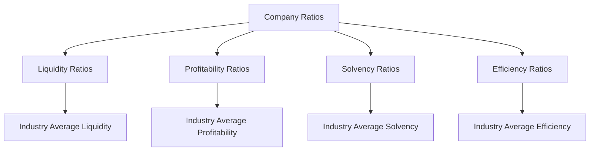

## 14.7 External Comparisons

In the realm of company analysis, external comparisons play a pivotal role in understanding a company's financial health and performance. This section delves into the intricacies of comparing financial ratios with industry peers and standards, emphasizing the importance of contextualizing these ratios within the same industry. We will explore the differentiation between industry standards and industry ratios, providing you with the tools to effectively benchmark a company's performance.

### Understanding Financial Ratios in Context

Financial ratios are powerful tools that provide insights into a company's operational efficiency, liquidity, profitability, and solvency. However, these ratios gain true significance only when compared against industry peers or standards. This comparison allows analysts to determine whether a company's performance is above, below, or in line with industry expectations.

#### Key Financial Ratios

1. **Liquidity Ratios**: Measure a company's ability to meet short-term obligations. Common examples include the current ratio and quick ratio.
2. **Profitability Ratios**: Assess a company's ability to generate profit relative to revenue, assets, or equity. Examples include the net profit margin and return on equity (ROE).
3. **Solvency Ratios**: Evaluate a company's long-term financial stability. The debt-to-equity ratio is a prime example.
4. **Efficiency Ratios**: Indicate how well a company utilizes its assets. The inventory turnover ratio is commonly used.

### Importance of Contextualizing Ratios

When analyzing financial ratios, it's crucial to compare them within the same industry. Different industries have varying capital structures, growth rates, and operational models, which can significantly impact financial ratios. For instance, a high debt-to-equity ratio might be typical in the utilities sector due to the capital-intensive nature of the industry, whereas the same ratio could signal financial distress in the technology sector.

#### Case Study: Canadian Banks

Consider the major Canadian banks such as RBC and TD. These institutions typically exhibit higher ROEs compared to global peers due to Canada's concentrated banking market and stable economic environment. Comparing their ROEs against a technology firm would be misleading due to the inherent differences in industry dynamics.

### Differentiating Industry Standards and Industry Ratios

**Industry Standards** refer to the best practices or benchmarks that companies strive to achieve. These are often set by industry leaders or regulatory bodies and represent optimal performance levels.

**Industry Ratios**, on the other hand, are the average financial ratios calculated from all companies within a specific industry. These provide a baseline for comparison but may not represent the best possible performance.

#### Example: Benchmarking in the Canadian Energy Sector

In the Canadian energy sector, industry standards might include specific environmental compliance metrics or safety performance indicators. Meanwhile, industry ratios would provide average financial performance metrics such as the average return on assets (ROA) for energy companies.

### Benchmarking: A Strategic Tool

Benchmarking involves comparing a company's performance metrics to industry bests or best practices from other companies. This process helps identify areas of improvement and strategic opportunities.

#### Steps for Effective Benchmarking

1. **Identify Key Metrics**: Determine which financial ratios or performance indicators are most relevant to the company's strategic goals.
2. **Select Peers**: Choose industry peers or leaders that represent best practices.
3. **Analyze Gaps**: Compare the company's metrics against selected benchmarks to identify performance gaps.
4. **Develop Action Plans**: Create strategies to address identified gaps and improve performance.

### Practical Example: Benchmarking a Canadian Retailer

Imagine a Canadian retailer aiming to improve its inventory turnover ratio. By benchmarking against industry leaders like Canadian Tire, the retailer can identify best practices in inventory management and implement strategies to enhance efficiency.

### Visualizing Financial Comparisons

To further illustrate the concept of external comparisons, consider the following diagram representing a company's financial ratios compared to industry averages:

### Best Practices and Common Pitfalls

**Best Practices:**
- Always compare financial ratios within the same industry to ensure relevance.
- Use a combination of industry ratios and standards for a comprehensive analysis.
- Regularly update benchmarks to reflect current industry trends.

**Common Pitfalls:**
- Comparing ratios across different industries without considering contextual differences.
- Relying solely on industry averages without considering company-specific factors.
- Ignoring qualitative factors such as management quality or market positioning.

### Resources for Further Exploration

To deepen your understanding of external comparisons, consider exploring the following resources:
- [StatCan Industry Statistics](https://www.statcan.gc.ca/): Provides comprehensive data on Canadian industries.
- Article: [How to Benchmark Financial Ratios](https://www.investopedia.com/articles/investing/082614/how-benchmark-youre-financial-ratios.asp)

### Conclusion

External comparisons are a vital component of company analysis, enabling investors and analysts to gauge a company's performance relative to its peers. By understanding the nuances of financial ratios, industry standards, and benchmarking, you can make informed investment decisions and identify strategic opportunities for growth.

### **Ready to Test Your Knowledge?**

**Practice 10 Essential CSC Exam Questions to Master Your Certification**



### What is the primary purpose of comparing financial ratios with industry peers?

- [x] To determine a company's performance relative to industry expectations
- [ ] To calculate a company's intrinsic value
- [ ] To assess a company's historical performance
- [ ] To evaluate a company's management team

> **Explanation:** Comparing financial ratios with industry peers helps determine if a company's performance is above, below, or in line with industry expectations.

### Why is it important to contextualize financial ratios within the same industry?

- [x] Different industries have varying capital structures and operational models
- [ ] It simplifies the analysis process
- [ ] It ensures compliance with regulatory standards
- [ ] It reduces the need for qualitative analysis

> **Explanation:** Different industries have unique characteristics that can significantly impact financial ratios, making it essential to compare within the same industry.

### What is the difference between industry standards and industry ratios?

- [x] Industry standards represent best practices, while industry ratios are averages
- [ ] Industry standards are averages, while industry ratios represent best practices
- [ ] Both terms refer to the same concept
- [ ] Industry standards are set by regulatory bodies, while industry ratios are set by companies

> **Explanation:** Industry standards represent best practices or benchmarks, while industry ratios are the average financial ratios within an industry.

### What is benchmarking?

- [x] Comparing a company's performance metrics to industry bests or best practices
- [ ] Calculating a company's intrinsic value
- [ ] Assessing a company's historical performance
- [ ] Evaluating a company's management team

> **Explanation:** Benchmarking involves comparing a company's performance metrics to industry bests or best practices to identify areas for improvement.

### Which of the following is a common pitfall when comparing financial ratios?

- [x] Comparing ratios across different industries without considering contextual differences
- [ ] Using a combination of industry ratios and standards
- [ ] Regularly updating benchmarks
- [ ] Considering qualitative factors

> **Explanation:** Comparing ratios across different industries without considering contextual differences can lead to misleading conclusions.

### What is a key benefit of benchmarking?

- [x] Identifying areas of improvement and strategic opportunities
- [ ] Simplifying the analysis process
- [ ] Ensuring compliance with regulatory standards
- [ ] Reducing the need for qualitative analysis

> **Explanation:** Benchmarking helps identify areas of improvement and strategic opportunities by comparing performance metrics to industry bests.

### Which financial ratio measures a company's ability to meet short-term obligations?

- [x] Liquidity ratios
- [ ] Profitability ratios
- [ ] Solvency ratios
- [ ] Efficiency ratios

> **Explanation:** Liquidity ratios, such as the current ratio and quick ratio, measure a company's ability to meet short-term obligations.

### What is an example of a profitability ratio?

- [x] Net profit margin
- [ ] Current ratio
- [ ] Debt-to-equity ratio
- [ ] Inventory turnover ratio

> **Explanation:** The net profit margin is a profitability ratio that assesses a company's ability to generate profit relative to revenue.

### How can a company improve its inventory turnover ratio?

- [x] By implementing best practices in inventory management
- [ ] By increasing its debt-to-equity ratio
- [ ] By reducing its net profit margin
- [ ] By decreasing its current ratio

> **Explanation:** Implementing best practices in inventory management can help a company improve its inventory turnover ratio.

### True or False: Industry ratios provide a baseline for comparison but may not represent the best possible performance.

- [x] True
- [ ] False

> **Explanation:** Industry ratios provide average financial performance metrics within an industry, serving as a baseline for comparison but not necessarily representing the best performance.


