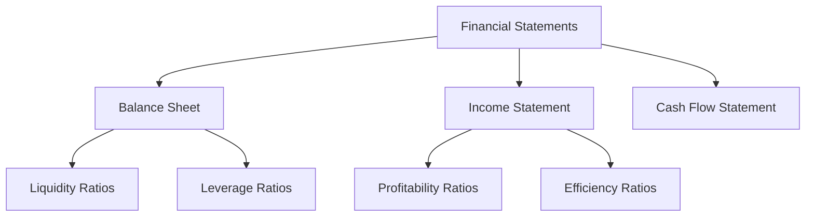

## Chapter 14: Company Analysis

In the world of finance, company analysis is a cornerstone of informed investment decision-making. This chapter delves into the intricacies of evaluating a company's financial health, profitability, and overall investment potential. By mastering company analysis, investors can make strategic decisions that align with their financial goals, particularly within the Canadian market.

### Understanding the Purpose and Significance of Company Analysis

Company analysis is a systematic approach to evaluating a business's financial and operational performance. It provides investors with insights into a company's strengths, weaknesses, opportunities, and threats (SWOT). The primary objectives of company analysis include:

- **Assessing Financial Health:** Understanding a company's financial stability and ability to meet its obligations.
- **Evaluating Profitability:** Analyzing revenue streams, cost structures, and profit margins to gauge financial success.
- **Determining Investment Potential:** Identifying growth prospects and risks to make informed investment decisions.

### Examining and Interpreting Financial Statements

Financial statements are the backbone of company analysis. They offer a snapshot of a company's financial position and performance over a specific period. The three primary financial statements are:

1. **Balance Sheet:** Provides a summary of a company's assets, liabilities, and shareholders' equity at a given point in time. It reflects the company's financial position and capital structure.

2. **Income Statement:** Also known as the profit and loss statement, it details a company's revenues, expenses, and profits over a period. It helps assess operational efficiency and profitability.

3. **Cash Flow Statement:** Tracks the inflow and outflow of cash, highlighting how a company generates and uses cash. It is crucial for understanding liquidity and cash management.

#### Practical Example: Analyzing RBC's Financial Statements

Consider the Royal Bank of Canada (RBC), one of Canada's largest banks. By examining RBC's financial statements, investors can assess its financial health:

- **Balance Sheet Analysis:** Evaluate RBC's asset quality, liability management, and equity structure. Look for trends in asset growth and changes in debt levels.
- **Income Statement Analysis:** Analyze revenue growth, expense management, and profit margins. Compare these metrics to industry benchmarks.
- **Cash Flow Statement Analysis:** Assess cash flow from operating, investing, and financing activities to understand liquidity and capital allocation.

### Utilizing Financial Ratios for Performance Evaluation

Financial ratios are powerful tools for evaluating a company's performance and comparing it to industry peers. Key financial ratios include:

- **Liquidity Ratios:** Measure a company's ability to meet short-term obligations. Examples include the current ratio and quick ratio.
- **Profitability Ratios:** Assess a company's ability to generate profits. Examples include the net profit margin, return on assets (ROA), and return on equity (ROE).
- **Leverage Ratios:** Evaluate a company's debt levels relative to equity. Examples include the debt-to-equity ratio and interest coverage ratio.
- **Efficiency Ratios:** Analyze how effectively a company utilizes its assets. Examples include inventory turnover and asset turnover.

#### Case Study: Financial Ratio Analysis of TD Bank

Let's analyze Toronto-Dominion Bank (TD) using financial ratios:

- **Liquidity Ratios:** TD's current ratio indicates its ability to cover short-term liabilities with short-term assets.
- **Profitability Ratios:** TD's ROE reflects its efficiency in generating profits from shareholders' equity.
- **Leverage Ratios:** The debt-to-equity ratio shows TD's financial leverage and risk exposure.
- **Efficiency Ratios:** Asset turnover ratio highlights TD's effectiveness in using assets to generate revenue.

### Assessing the Investment Quality of Preferred Shares

Preferred shares are a hybrid security offering features of both equity and debt. When evaluating preferred shares, consider:

- **Dividend Yield:** The annual dividend payment relative to the share price. A higher yield indicates better income potential.
- **Credit Rating:** Assess the issuer's creditworthiness. Higher-rated preferred shares are less risky.
- **Callability:** Determine if the shares can be redeemed by the issuer before maturity, affecting yield and investment horizon.
- **Conversion Features:** Some preferred shares can be converted into common shares, offering potential for capital appreciation.

### Best Practices and Common Pitfalls in Company Analysis

**Best Practices:**

- **Comprehensive Analysis:** Consider both quantitative and qualitative factors, such as management quality and industry trends.
- **Comparative Analysis:** Benchmark against industry peers to identify relative strengths and weaknesses.
- **Continuous Monitoring:** Regularly update analysis to reflect changing market conditions and company performance.

**Common Pitfalls:**

- **Overreliance on Historical Data:** Past performance does not guarantee future results. Consider forward-looking indicators.
- **Ignoring Macroeconomic Factors:** Economic conditions can significantly impact company performance.
- **Neglecting Qualitative Aspects:** Factors like corporate governance and competitive positioning are crucial for a holistic view.

### Diagrams and Visual Aids

To enhance understanding, let's visualize the relationship between financial statements and ratios using a diagram:

### Conclusion

Company analysis is an essential skill for investors seeking to make informed decisions in the Canadian market. By mastering financial statement interpretation, ratio analysis, and preferred share evaluation, investors can identify opportunities and mitigate risks. Continuous learning and adaptation to market changes are vital for successful company analysis.

### Additional Resources

- **Books:** "Financial Statement Analysis" by Martin Fridson and Fernando Alvarez
- **Online Courses:** "Financial Analysis for Decision Making" on Coursera
- **Regulatory References:** Canadian Securities Administrators (CSA) website for official guidelines

## Quiz Time!



### What is the primary purpose of company analysis?

- [x] To assess a company's financial health and investment potential
- [ ] To determine the company's marketing strategy
- [ ] To evaluate the company's human resources policies
- [ ] To analyze the company's IT infrastructure

> **Explanation:** Company analysis aims to evaluate a company's financial health and investment potential, helping investors make informed decisions.

### Which financial statement provides a snapshot of a company's financial position at a specific point in time?

- [x] Balance Sheet
- [ ] Income Statement
- [ ] Cash Flow Statement
- [ ] Statement of Retained Earnings

> **Explanation:** The balance sheet provides a snapshot of a company's financial position, including assets, liabilities, and equity, at a specific point in time.

### What does the net profit margin ratio measure?

- [x] A company's profitability relative to its total revenue
- [ ] A company's liquidity position
- [ ] A company's asset turnover rate
- [ ] A company's debt-to-equity ratio

> **Explanation:** The net profit margin measures a company's profitability by comparing net income to total revenue, indicating how much profit is generated from sales.

### Which ratio would you use to assess a company's ability to meet short-term obligations?

- [x] Current Ratio
- [ ] Return on Equity
- [ ] Debt-to-Equity Ratio
- [ ] Asset Turnover Ratio

> **Explanation:** The current ratio measures a company's ability to meet short-term obligations with its current assets.

### What is a key consideration when evaluating preferred shares?

- [x] Dividend Yield
- [ ] Market Share
- [ ] Employee Satisfaction
- [ ] Product Innovation

> **Explanation:** Dividend yield is a key consideration for preferred shares, as it indicates the income potential relative to the share price.

### What is a common pitfall in company analysis?

- [x] Overreliance on historical data
- [ ] Considering qualitative factors
- [ ] Benchmarking against industry peers
- [ ] Continuous monitoring

> **Explanation:** Overreliance on historical data is a common pitfall, as it may not accurately predict future performance.

### Which financial ratio assesses a company's efficiency in using assets to generate revenue?

- [x] Asset Turnover Ratio
- [ ] Current Ratio
- [ ] Net Profit Margin
- [ ] Debt-to-Equity Ratio

> **Explanation:** The asset turnover ratio measures how efficiently a company uses its assets to generate revenue.

### What does a high debt-to-equity ratio indicate?

- [x] High financial leverage and potential risk
- [ ] Strong liquidity position
- [ ] High profitability
- [ ] Efficient asset utilization

> **Explanation:** A high debt-to-equity ratio indicates that a company is using more debt relative to equity, which can imply higher financial leverage and risk.

### Which financial statement tracks the inflow and outflow of cash?

- [x] Cash Flow Statement
- [ ] Balance Sheet
- [ ] Income Statement
- [ ] Statement of Retained Earnings

> **Explanation:** The cash flow statement tracks the inflow and outflow of cash, highlighting how a company generates and uses cash.

### True or False: Preferred shares can be converted into common shares.

- [x] True
- [ ] False

> **Explanation:** Some preferred shares have conversion features that allow them to be converted into common shares, offering potential for capital appreciation.


