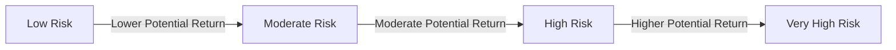

## 15.1.1 Relationship Between Risk and Return

In the world of investments, understanding the relationship between risk and return is crucial for making informed decisions. This section delves into the types and measures of risk, the role of risk in asset selection, and how these factors influence the potential returns on investments. By the end of this section, you will have a comprehensive understanding of how to evaluate and manage risk within a portfolio, particularly in the Canadian financial context.

### Types and Measures of Risk

Investment risk can be broadly categorized into two types: systematic risk and non-systematic risk. Each type of risk affects investments differently and requires distinct strategies for management.

#### Systematic Risk

**Systematic risk**, also known as market risk, is the inherent risk that affects the entire market or a broad range of assets. This type of risk is undiversifiable, meaning it cannot be eliminated through diversification. Systematic risk is influenced by factors such as economic recessions, political instability, changes in interest rates, and natural disasters. For example, a global financial crisis would impact all securities, regardless of the industry or geographic location.

**Key Characteristics of Systematic Risk:**
- Affects all securities in the market.
- Cannot be mitigated through diversification.
- Measured by beta, which indicates a security's volatility relative to the market.

#### Non-Systematic Risk

**Non-systematic risk**, also known as specific or idiosyncratic risk, is associated with a particular company or industry. This type of risk can be mitigated through diversification. Examples include a company's management decisions, product recalls, or industry-specific regulations.

**Key Characteristics of Non-Systematic Risk:**
- Specific to individual securities or industries.
- Can be reduced through diversification.
- Includes risks such as business risk, financial risk, and operational risk.

### Specific Risks

Beyond the broad categories of systematic and non-systematic risks, there are specific risks that investors should be aware of:

- **Inflation Rate Risk:** The risk that inflation will erode the purchasing power of returns. Fixed-income securities, like bonds, are particularly susceptible to this risk.
- **Interest Rate Risk:** The risk that changes in interest rates will affect the value of investments, especially bonds. When interest rates rise, bond prices typically fall.
- **Default Risk:** The risk that a borrower will be unable to make the required payments on their debt obligations. This is a significant concern for bond investors.
- **Political Risk:** The risk of losses due to political instability or changes in government policy. This is more prevalent in emerging markets.
- **Liquidity Risk:** The risk that an investor will not be able to buy or sell an investment quickly without affecting its price. Real estate and certain stocks may have higher liquidity risk.

### Role of Risk in Asset Selection

When selecting assets for a portfolio, understanding the risk associated with each investment is crucial. Investors must balance their risk tolerance with their return objectives. Here are some strategies to consider:

- **Diversification:** By holding a mix of asset classes and securities, investors can reduce non-systematic risk. For example, a Canadian investor might diversify their portfolio by including equities, bonds, and real estate investment trusts (REITs).
- **Risk Assessment Tools:** Utilize statistical measures such as standard deviation and beta to quantify and compare the risk levels of different securities and portfolios. Standard deviation measures the volatility of an investment, while beta assesses its volatility relative to the market.

#### Statistical Measures of Risk

- **Standard Deviation:** This measure indicates the amount of variation or dispersion in a set of values. A higher standard deviation means greater volatility and, therefore, higher risk. For instance, a stock with a standard deviation of 15% is more volatile than one with a standard deviation of 10%.
  
- **Beta:** Beta measures a security's volatility in relation to the overall market. A beta greater than 1 indicates that the security is more volatile than the market, while a beta less than 1 suggests lower volatility. For example, if a Canadian bank stock has a beta of 1.2, it is expected to be 20% more volatile than the market.

### Practical Example: Diversification in a Canadian Portfolio

Consider a Canadian investor with a portfolio consisting solely of stocks from the technology sector. This portfolio is highly susceptible to non-systematic risk, as it is not diversified across different industries. By adding stocks from the financial, healthcare, and energy sectors, as well as bonds and international equities, the investor can significantly reduce non-systematic risk.

#### Visualizing Risk and Return

To better understand the relationship between risk and return, consider the following diagram illustrating the risk-return trade-off:

In this diagram, as risk increases, the potential for higher returns also increases. However, higher risk also means a greater chance of loss, emphasizing the importance of balancing risk and return in investment decisions.

### Best Practices and Common Pitfalls

**Best Practices:**
- Regularly assess and adjust your portfolio to align with your risk tolerance and investment goals.
- Use diversification to mitigate non-systematic risk.
- Stay informed about market trends and economic indicators that may impact systematic risk.

**Common Pitfalls:**
- Overconcentration in a single asset class or industry, leading to increased non-systematic risk.
- Ignoring the impact of inflation and interest rate changes on investment returns.
- Failing to reassess risk tolerance as personal circumstances or market conditions change.

### Conclusion

Understanding the relationship between risk and return is fundamental to successful investing. By recognizing the types of risk, utilizing statistical measures, and employing diversification strategies, investors can make informed decisions that align with their financial goals. In the Canadian context, this knowledge is essential for navigating the complexities of the financial markets and achieving long-term investment success.

## Quiz Time!



### Which type of risk affects the entire market and cannot be diversified away?

- [x] Systematic Risk
- [ ] Non-Systematic Risk
- [ ] Default Risk
- [ ] Liquidity Risk

> **Explanation:** Systematic risk affects the entire market and cannot be eliminated through diversification.

### What is the primary method to reduce non-systematic risk in a portfolio?

- [x] Diversification
- [ ] Increasing leverage
- [ ] Investing in a single industry
- [ ] Holding cash

> **Explanation:** Diversification involves spreading investments across various asset classes and industries to reduce non-systematic risk.

### Which measure indicates a security's volatility relative to the market?

- [x] Beta
- [ ] Standard Deviation
- [ ] Alpha
- [ ] Sharpe Ratio

> **Explanation:** Beta measures a security's volatility in relation to the overall market.

### What risk is particularly significant for fixed-income securities like bonds?

- [x] Interest Rate Risk
- [ ] Political Risk
- [ ] Liquidity Risk
- [ ] Business Risk

> **Explanation:** Interest rate risk affects the value of fixed-income securities, as changes in interest rates impact bond prices.

### Which risk can be mitigated by holding a diversified portfolio?

- [x] Non-Systematic Risk
- [ ] Systematic Risk
- [ ] Inflation Rate Risk
- [ ] Interest Rate Risk

> **Explanation:** Non-systematic risk is specific to individual securities and can be reduced through diversification.

### What does a beta greater than 1 indicate about a security?

- [x] It is more volatile than the market.
- [ ] It is less volatile than the market.
- [ ] It has no volatility.
- [ ] It is risk-free.

> **Explanation:** A beta greater than 1 indicates that the security is more volatile than the market.

### Which risk involves the potential for a borrower to default on debt obligations?

- [x] Default Risk
- [ ] Liquidity Risk
- [ ] Systematic Risk
- [ ] Inflation Rate Risk

> **Explanation:** Default risk is the risk that a borrower will be unable to make the required payments on their debt obligations.

### What does standard deviation measure in the context of investments?

- [x] The volatility of an investment
- [ ] The average return of an investment
- [ ] The risk-free rate
- [ ] The market index

> **Explanation:** Standard deviation measures the amount of variation or dispersion in a set of values, indicating the volatility of an investment.

### Which of the following is an example of systematic risk?

- [x] Economic recession
- [ ] Product recall
- [ ] Management change
- [ ] Industry regulation

> **Explanation:** An economic recession is a systematic risk that affects the entire market.

### True or False: Diversification can eliminate all types of investment risk.

- [ ] True
- [x] False

> **Explanation:** Diversification can reduce non-systematic risk but cannot eliminate systematic risk.


