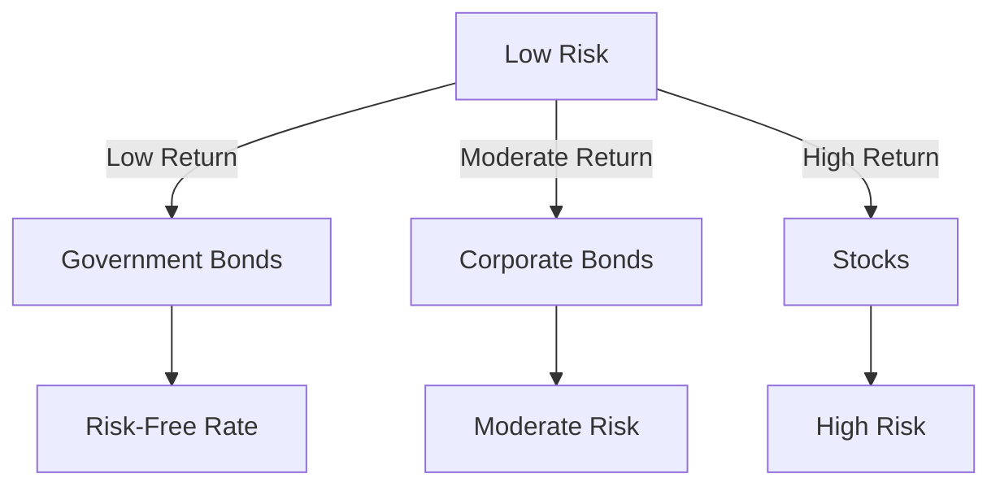

## 15.1 Risk and Return

In the world of finance, understanding the relationship between risk and return is crucial for making informed investment decisions. This section delves into the calculation of rates of return for single securities, the distinction between nominal and real rates of return, and the importance of the risk-free rate as a benchmark.

### Calculating Rates of Return for a Single Security

The rate of return is a fundamental concept that measures the gain or loss of an investment over a specified period, expressed as a percentage of the investment's initial cost. It encompasses two main components: cash flows (such as dividends or interest) and capital gains or losses.

#### Components of Return

1. **Cash Flows:** These include dividends from stocks or interest payments from bonds. Cash flows provide a steady income stream and are a critical component of the total return.

2. **Capital Gains or Losses:** This represents the change in the value of the security over time. A capital gain occurs when the security's value increases, while a capital loss occurs when it decreases.

#### Formula for Expected Return

To calculate the expected return of a single security, use the following formula:


\text{Expected Return (\%)} = \left( \frac{\text{Expected Cash Flow} + (\text{Expected Ending Value} - \text{Beginning Value})}{\text{Beginning Value}} \right) \times 100


This formula helps investors estimate the potential return on an investment, considering both cash flows and changes in the security's value.

#### Practical Example

Consider an investor who purchases a stock for CAD 100. Over the year, the stock pays a dividend of CAD 2 and its price increases to CAD 110. The expected return is calculated as follows:


\text{Expected Return (\%)} = \left( \frac{2 + (110 - 100)}{100} \right) \times 100 = 12\%


This example illustrates how both dividends and capital appreciation contribute to the overall return.

### Nominal vs. Real Rates of Return

Understanding the difference between nominal and real rates of return is essential for evaluating investment performance in the context of inflation.

#### Nominal Rate of Return

The nominal rate of return is the percentage increase in money from an investment without adjusting for inflation. It reflects the raw financial gain or loss.

#### Real Rate of Return

The real rate of return accounts for inflation, providing a more accurate measure of an investment's purchasing power increase. It is calculated by adjusting the nominal rate for inflation:


\text{Real Rate of Return} = \text{Nominal Rate of Return} - \text{Inflation Rate}


#### Example of Nominal vs. Real Return

Suppose an investment yields a nominal return of 8%, but the inflation rate is 3%. The real rate of return would be:


\text{Real Rate of Return} = 8\% - 3\% = 5\%


This calculation shows that the investment's purchasing power increased by 5% after accounting for inflation.

### The Risk-Free Rate of Return

The risk-free rate of return is a theoretical concept representing the return on an investment with zero risk. In practice, it is often represented by the yield on short-term government securities, such as Canadian Treasury bills, which are considered virtually risk-free due to government backing.

#### Significance of the Risk-Free Rate

The risk-free rate serves as a benchmark for evaluating other investments. It represents the minimum return an investor expects for any investment, given that they could earn this return without taking on additional risk.

#### Example: Evaluating Investment Options

Consider two investment options: a government bond yielding 2% (risk-free rate) and a corporate bond yielding 5%. The additional 3% return on the corporate bond compensates investors for the additional risk compared to the risk-free government bond.

### Visualizing Risk and Return

To better understand the relationship between risk and return, consider the following diagram illustrating the risk-return trade-off:

This diagram highlights how different asset classes align along the risk-return spectrum, with government bonds offering low risk and return, while stocks offer higher potential returns at increased risk.

### Best Practices and Common Pitfalls

- **Best Practices:**
  - Always adjust nominal returns for inflation to understand the real growth in purchasing power.
  - Use the risk-free rate as a baseline to assess the attractiveness of riskier investments.
  - Diversify investments to balance risk and return across different asset classes.

- **Common Pitfalls:**
  - Ignoring inflation can lead to overestimating the true return on investment.
  - Focusing solely on high returns without considering the associated risks can lead to significant losses.

### Conclusion

Understanding risk and return is fundamental for making informed investment decisions. By mastering the calculation of rates of return, distinguishing between nominal and real returns, and recognizing the importance of the risk-free rate, investors can better evaluate their investment options and align them with their financial goals.

### Further Reading and Resources

- **Books:**
  - "The Intelligent Investor" by Benjamin Graham
  - "A Random Walk Down Wall Street" by Burton Malkiel

- **Online Courses:**
  - Canadian Securities Institute (CSI) offers courses on investment fundamentals.
  - Coursera and edX provide courses on financial markets and investment strategies.

- **Regulatory Resources:**
  - Canadian Investment Regulatory Organization (CIRO) for compliance guidelines.
  - Bank of Canada for current risk-free rates and economic indicators.

## Quiz Time!



### What are the two main components of a security's return?

- [x] Cash flows and capital gains or losses
- [ ] Dividends and interest only
- [ ] Inflation and deflation
- [ ] Risk and volatility

> **Explanation:** The two main components of a security's return are cash flows (such as dividends or interest) and capital gains or losses.

### How do you calculate the expected return of a single security?

- [x] \\(\left( \frac{\text{Expected Cash Flow} + (\text{Expected Ending Value} - \text{Beginning Value})}{\text{Beginning Value}} \right) \times 100\\)
- [ ] \\(\left( \frac{\text{Expected Ending Value} - \text{Beginning Value}}{\text{Beginning Value}} \right) \times 100\\)
- [ ] \\(\left( \frac{\text{Expected Cash Flow} - \text{Beginning Value}}{\text{Beginning Value}} \right) \times 100\\)
- [ ] \\(\left( \frac{\text{Expected Ending Value} + \text{Beginning Value}}{\text{Beginning Value}} \right) \times 100\\)

> **Explanation:** The expected return formula accounts for both cash flows and changes in the security's value.

### What is the nominal rate of return?

- [x] The percentage increase in money from an investment without adjusting for inflation
- [ ] The percentage increase in money from an investment after adjusting for inflation
- [ ] The return on an investment with zero risk
- [ ] The average return of a portfolio

> **Explanation:** The nominal rate of return does not account for inflation, reflecting the raw financial gain or loss.

### How do you calculate the real rate of return?

- [x] Nominal Rate of Return - Inflation Rate
- [ ] Nominal Rate of Return + Inflation Rate
- [ ] Nominal Rate of Return / Inflation Rate
- [ ] Nominal Rate of Return \* Inflation Rate

> **Explanation:** The real rate of return adjusts the nominal rate for inflation to reflect the true increase in purchasing power.

### What does the risk-free rate of return represent?

- [x] The theoretical return of an investment with zero risk
- [ ] The average return of a high-risk investment
- [ ] The return of a diversified portfolio
- [ ] The return of a corporate bond

> **Explanation:** The risk-free rate is often represented by short-term government securities, considered virtually risk-free.

### Why is it important to adjust nominal returns for inflation?

- [x] To understand the real growth in purchasing power
- [ ] To increase the nominal return
- [ ] To decrease the nominal return
- [ ] To calculate the risk-free rate

> **Explanation:** Adjusting for inflation provides a more accurate measure of an investment's purchasing power increase.

### What is a common pitfall when evaluating investment returns?

- [x] Ignoring inflation
- [ ] Overestimating the risk-free rate
- [ ] Underestimating cash flows
- [ ] Focusing on low-risk investments

> **Explanation:** Ignoring inflation can lead to overestimating the true return on investment.

### Which asset class typically offers the highest potential returns at increased risk?

- [x] Stocks
- [ ] Government bonds
- [ ] Corporate bonds
- [ ] Real estate

> **Explanation:** Stocks generally offer higher potential returns but come with increased risk compared to bonds.

### What is a best practice when assessing investment options?

- [x] Use the risk-free rate as a baseline
- [ ] Focus solely on high returns
- [ ] Ignore inflation
- [ ] Invest only in government bonds

> **Explanation:** Using the risk-free rate as a baseline helps assess the attractiveness of riskier investments.

### True or False: The real rate of return is always higher than the nominal rate of return.

- [ ] True
- [x] False

> **Explanation:** The real rate of return is typically lower than the nominal rate because it accounts for inflation.


