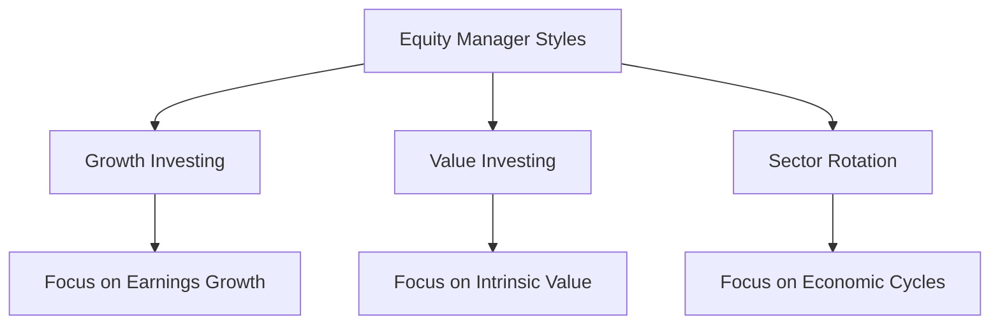

## 15.9 Equity Manager Styles Overview

In the realm of equity management, understanding the various styles is crucial for constructing a well-balanced portfolio that aligns with an investor's goals and risk tolerance. This section delves into three predominant equity manager styles: growth, value, and sector rotation. Each style offers unique perspectives on stock selection and portfolio construction, catering to different investment philosophies and market conditions.

### Growth Investing

**Growth Investing** is a strategy centered on identifying companies that demonstrate the potential for above-average growth. Growth investors are typically less concerned with the current price of a stock relative to traditional valuation metrics. Instead, they focus on the future earnings potential and market share expansion of a company.

#### Characteristics of Growth Investing

- **Focus on Earnings Growth:** Growth investors seek companies with strong historical earnings growth and the potential for continued expansion.
- **High Valuation Multiples:** These stocks often trade at high price-to-earnings (P/E) ratios, reflecting the market's optimism about future growth.
- **Reinvestment of Profits:** Growth companies typically reinvest profits into the business rather than paying dividends, fueling further growth.

#### Risk Profile

Growth investing carries a higher risk profile due to the reliance on future earnings projections. Market volatility can significantly impact growth stocks, especially if a company fails to meet growth expectations.

#### Example Strategy

A Canadian growth investor might focus on technology companies like Shopify, which has shown rapid revenue growth and innovation in e-commerce solutions. Despite high valuations, the potential for continued market expansion makes it attractive to growth investors.

### Value Investing

**Value Investing** is a strategy that involves selecting stocks that appear undervalued based on intrinsic or book value. Value investors look for companies that the market has overlooked, offering the potential for price appreciation as the market corrects its valuation.

#### Characteristics of Value Investing

- **Emphasis on Intrinsic Value:** Value investors seek stocks trading below their intrinsic value, often using metrics like the price-to-book (P/B) ratio.
- **Margin of Safety:** This approach provides a cushion against market volatility, as undervalued stocks have less downside risk.
- **Dividend Yield:** Value stocks often offer attractive dividend yields, providing income in addition to potential capital gains.

#### Risk Profile

While value investing is generally considered less risky than growth investing, it requires patience, as undervalued stocks may take time to reach their true value. Additionally, some value stocks may be undervalued for legitimate reasons, such as declining business prospects.

#### Example Strategy

A Canadian value investor might consider investing in established financial institutions like the Royal Bank of Canada (RBC), which may trade below intrinsic value during market downturns but offer strong fundamentals and dividend yields.

### Sector Rotation

**Sector Rotation** is an investment strategy that involves shifting investments among different industry sectors to capitalize on economic cycles. This approach requires a keen understanding of macroeconomic trends and their impact on various sectors.

#### Characteristics of Sector Rotation

- **Economic Cycle Awareness:** Investors must anticipate which sectors will perform well during different phases of the economic cycle.
- **Diversification Across Sectors:** This strategy involves maintaining a diversified portfolio that can be adjusted as economic conditions change.
- **Active Management:** Sector rotation requires active management and frequent portfolio adjustments to align with economic forecasts.

#### Risk Profile

Sector rotation can be risky due to the need for accurate economic predictions. Misjudging the economic cycle can lead to underperformance if investments are concentrated in the wrong sectors.

#### Example Strategy

A Canadian sector rotation strategy might involve increasing exposure to energy stocks during periods of economic expansion when demand for oil and gas rises, while shifting to consumer staples during economic downturns for stability.

### Practical Application and Considerations

When applying these equity manager styles, investors should consider their risk tolerance, investment horizon, and market conditions. Diversification across styles can also enhance portfolio resilience, balancing the high-risk, high-reward nature of growth investing with the stability of value investing and the strategic flexibility of sector rotation.

### Visualizing Equity Manager Styles

Below is a diagram illustrating the relationship between these equity manager styles and their focus areas:

### Best Practices and Common Pitfalls

- **Best Practices:**
  - Diversify across styles to mitigate risk.
  - Stay informed about market trends and economic indicators.
  - Regularly review and adjust portfolios to align with investment goals.

- **Common Pitfalls:**
  - Overconcentration in a single style can increase risk.
  - Ignoring macroeconomic factors in sector rotation can lead to poor timing.
  - Emotional decision-making can undermine long-term strategies.

### Additional Resources

For those interested in deepening their understanding of equity manager styles, consider the following resources:

- **Books:**
  - *"Security Analysis"* by Benjamin Graham and David Dodd
- **Online Courses:**
  - **Coursera:** [Investment Strategies and Portfolio Analysis](https://www.coursera.org/learn/investment-strategies-portfolio-analysis)

### Conclusion

Understanding the nuances of growth, value, and sector rotation styles is essential for effective equity management. By aligning investment strategies with personal goals and market conditions, investors can optimize their portfolios for success in the Canadian financial landscape.

### **Ready to Test Your Knowledge?**

**Practice 10 Essential CSC Exam Questions to Master Your Certification**



### Which of the following is a characteristic of growth investing?

- [x] Focus on companies with above-average growth potential
- [ ] Emphasis on high dividend yields
- [ ] Preference for low P/E ratios
- [ ] Concentration on economic cycles

> **Explanation:** Growth investing focuses on companies with above-average growth potential, often trading at high valuation multiples.

### What is a key risk associated with value investing?

- [x] Stocks may remain undervalued for extended periods
- [ ] High volatility due to future earnings projections
- [ ] Frequent portfolio adjustments required
- [ ] Lack of dividend income

> **Explanation:** Value investing involves the risk that stocks may remain undervalued for extended periods, requiring patience from investors.

### Sector rotation involves shifting investments based on what factor?

- [x] Economic cycles
- [ ] Company earnings growth
- [ ] Dividend yields
- [ ] Intrinsic value

> **Explanation:** Sector rotation involves shifting investments among industry sectors based on economic cycles.

### Which investment style is likely to involve high P/E ratios?

- [x] Growth Investing
- [ ] Value Investing
- [ ] Sector Rotation
- [ ] Dividend Investing

> **Explanation:** Growth investing often involves high P/E ratios due to the focus on future earnings potential.

### What is a common characteristic of value stocks?

- [x] They often trade below intrinsic value
- [ ] They typically have high growth rates
- [x] They may offer attractive dividend yields
- [ ] They are concentrated in technology sectors

> **Explanation:** Value stocks often trade below intrinsic value and may offer attractive dividend yields.

### Which style requires frequent portfolio adjustments?

- [x] Sector Rotation
- [ ] Growth Investing
- [ ] Value Investing
- [ ] Dividend Investing

> **Explanation:** Sector rotation requires frequent portfolio adjustments to align with economic forecasts.

### What is a potential benefit of growth investing?

- [x] High potential for capital appreciation
- [ ] Low volatility
- [x] Reinvestment of profits into the business
- [ ] High dividend yields

> **Explanation:** Growth investing offers high potential for capital appreciation and reinvestment of profits into the business.

### Which style emphasizes a margin of safety?

- [x] Value Investing
- [ ] Growth Investing
- [ ] Sector Rotation
- [ ] Momentum Investing

> **Explanation:** Value investing emphasizes a margin of safety by selecting stocks trading below intrinsic value.

### What is a key focus of sector rotation?

- [x] Shifting investments based on economic cycles
- [ ] Identifying undervalued stocks
- [ ] Investing in high-growth companies
- [ ] Maximizing dividend income

> **Explanation:** Sector rotation focuses on shifting investments based on economic cycles.

### True or False: Growth investing typically involves high dividend yields.

- [ ] True
- [x] False

> **Explanation:** Growth investing typically involves reinvestment of profits into the business rather than high dividend yields.


