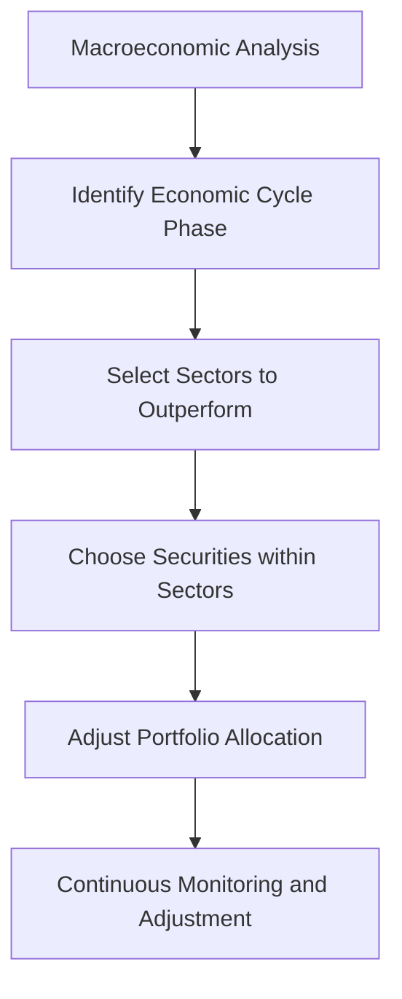

## 15.12 Sector Rotation

Sector rotation is a dynamic investment strategy that involves shifting investments among different industry sectors to capitalize on the varying performance of these sectors during different phases of the economic cycle. As an equity management style, sector rotation aims to enhance portfolio returns by anticipating and responding to macroeconomic changes that influence sector performance.

### Understanding Sector Rotation

Sector rotation is grounded in the belief that different sectors of the economy perform better at different stages of the economic cycle. This strategy leverages a **top-down approach**, which begins with a broad analysis of macroeconomic factors before narrowing down to specific sectors and individual securities. 

#### The Top-Down Approach

The **top-down approach** is a strategic method of investment that starts with an analysis of the overall economy. Investors assess macroeconomic indicators such as GDP growth, interest rates, inflation, and employment trends to determine the current phase of the **economic cycle**. Once the economic outlook is established, investors identify sectors that are likely to outperform in the given economic environment.

For example, during an economic expansion, consumer discretionary and technology sectors often thrive due to increased consumer spending and business investments. Conversely, during a recession, defensive sectors like utilities and healthcare may perform better as they provide essential services that remain in demand regardless of economic conditions.

### Implementing Sector Rotation

Implementing a sector rotation strategy involves several key steps:

1. **Macroeconomic Analysis:** Investors begin by analyzing economic indicators to determine the current phase of the economic cycle. This analysis helps predict which sectors are likely to benefit from the prevailing economic conditions.

2. **Sector Identification:** Based on the economic analysis, investors identify sectors that are expected to outperform. This involves understanding the historical performance of sectors during similar economic phases and considering current market trends.

3. **Investment Selection:** Once the target sectors are identified, investors select specific securities within those sectors. This may involve analyzing individual companies' financial health, competitive position, and growth prospects.

4. **Portfolio Adjustment:** Investors adjust their portfolios by reallocating assets to the identified sectors. This may involve selling underperforming sectors and buying into those expected to perform well.

5. **Continuous Monitoring:** Sector rotation requires ongoing monitoring of economic indicators and sector performance. Investors must be prepared to adjust their portfolios as economic conditions change.

### Risks and Benefits of Sector Rotation

#### Benefits

- **Potential for Higher Returns:** By investing in sectors poised to outperform, investors can potentially achieve higher returns compared to a static investment strategy.
- **Diversification:** Sector rotation can enhance diversification by spreading investments across various sectors, reducing the impact of sector-specific risks.
- **Flexibility:** This strategy allows investors to adapt to changing economic conditions, potentially mitigating losses during downturns.

#### Risks

- **Timing Challenges:** Accurately predicting economic cycles and sector performance is challenging, and mistimed investments can lead to losses.
- **Increased Transaction Costs:** Frequent buying and selling of securities to adjust sector allocations can result in higher transaction costs.
- **Market Volatility:** Sector rotation strategies are susceptible to market volatility, which can impact short-term performance.

### Sector Rotation in the Canadian Context

In Canada, sector rotation strategies must consider the unique characteristics of the Canadian economy and its sectors. For instance, the Canadian market is heavily influenced by natural resources, with significant exposure to the energy and materials sectors. Understanding the global demand for commodities and the impact of regulatory changes is crucial for effective sector rotation in Canada.

Canadian investors can leverage tools such as the S&P/TSX Composite Index to track sector performance and make informed decisions. Additionally, regulatory frameworks set by the Canadian Investment Regulatory Organization (CIRO) and provincial authorities provide guidelines for sector-based investments.

### Practical Example: Canadian Pension Funds

Canadian pension funds often employ sector rotation strategies to optimize returns for their beneficiaries. For example, during periods of economic expansion, these funds may increase allocations to the financial and industrial sectors, which tend to benefit from rising interest rates and increased infrastructure spending. Conversely, during economic slowdowns, they might shift focus to the utilities and consumer staples sectors to preserve capital.

### Visualizing Sector Rotation

Below is a simplified diagram illustrating the sector rotation process:

### Additional Resources

For those interested in further exploring sector rotation, consider the following resources:

- **Books:**
  - *"Sector Investing: Maximizing Opportunities and Managing Risks"* by David Tyson

- **Online Courses:**
  - **Udemy:** [Sector Rotation Investing](https://www.udemy.com/course/sector-rotation-investing/)

- **Canadian Regulatory Bodies:**
  - [Canadian Investment Regulatory Organization (CIRO)](https://www.ciro.ca)
  - [Ontario Securities Commission (OSC)](https://www.osc.ca)

### Conclusion

Sector rotation is a sophisticated investment strategy that requires a deep understanding of economic cycles and sector dynamics. By leveraging a top-down approach, investors can potentially enhance portfolio performance by aligning investments with the phases of the economic cycle. However, this strategy also involves risks, including timing challenges and market volatility. As with any investment strategy, thorough research and continuous monitoring are essential for success.

### **Ready to Test Your Knowledge?**

**Practice 10 Essential CSC Exam Questions to Master Your Certification**



### What is sector rotation?

- [x] An investment strategy that shifts investments among different industry sectors based on economic cycles.
- [ ] A strategy that focuses solely on investing in technology stocks.
- [ ] A method of investing in fixed-income securities.
- [ ] A strategy that involves short-selling stocks.

> **Explanation:** Sector rotation involves shifting investments among various sectors to capitalize on their performance during different economic cycle phases.

### What approach does sector rotation primarily use?

- [x] Top-down approach
- [ ] Bottom-up approach
- [ ] Technical analysis
- [ ] Quantitative analysis

> **Explanation:** Sector rotation uses a top-down approach, starting with macroeconomic analysis to identify sectors likely to outperform.

### Which phase of the economic cycle might favor consumer discretionary sectors?

- [x] Expansion
- [ ] Recession
- [ ] Contraction
- [ ] Depression

> **Explanation:** During economic expansion, consumer discretionary sectors often perform well due to increased consumer spending.

### What is a key risk associated with sector rotation?

- [x] Timing challenges
- [ ] Guaranteed returns
- [ ] Lack of diversification
- [ ] Low transaction costs

> **Explanation:** Timing challenges are a key risk, as predicting economic cycles and sector performance accurately is difficult.

### Which Canadian regulatory body provides guidelines for sector-based investments?

- [x] Canadian Investment Regulatory Organization (CIRO)
- [ ] Federal Reserve
- [ ] Securities and Exchange Commission (SEC)
- [ ] Bank of England

> **Explanation:** CIRO provides guidelines for sector-based investments in Canada.

### What is a benefit of sector rotation?

- [x] Potential for higher returns
- [ ] Guaranteed profits
- [ ] Elimination of market risk
- [ ] Reduced need for monitoring

> **Explanation:** Sector rotation can potentially lead to higher returns by investing in sectors expected to outperform.

### Which sector might perform well during a recession?

- [x] Utilities
- [ ] Consumer discretionary
- [ ] Technology
- [ ] Financials

> **Explanation:** Utilities often perform well during recessions as they provide essential services with consistent demand.

### What is the first step in implementing a sector rotation strategy?

- [x] Macroeconomic analysis
- [ ] Selecting individual securities
- [ ] Portfolio adjustment
- [ ] Continuous monitoring

> **Explanation:** The first step is macroeconomic analysis to determine the current phase of the economic cycle.

### What is a common characteristic of the Canadian market that affects sector rotation?

- [x] Significant exposure to natural resources
- [ ] Dominance of technology stocks
- [ ] Lack of regulatory oversight
- [ ] High inflation rates

> **Explanation:** The Canadian market is heavily influenced by natural resources, affecting sector rotation strategies.

### Sector rotation requires continuous monitoring and adjustment. True or False?

- [x] True
- [ ] False

> **Explanation:** Continuous monitoring and adjustment are essential to respond to changing economic conditions and sector performance.


