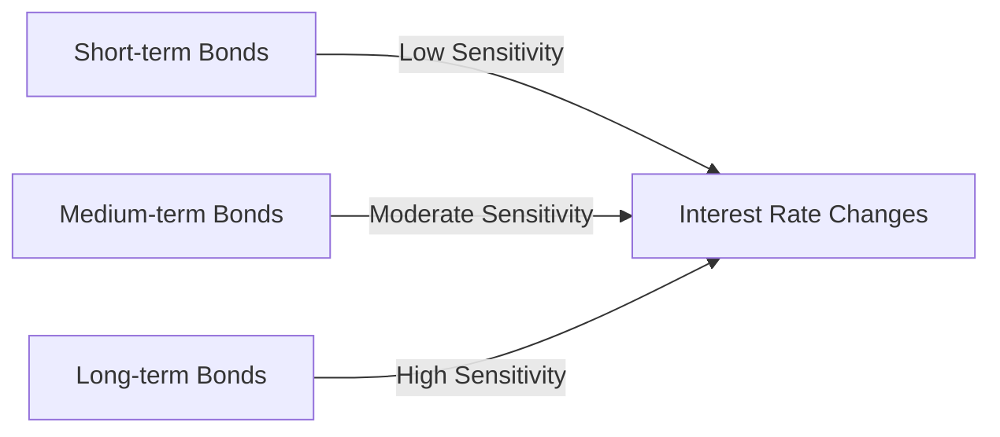

## 15.14 Term to Maturity

In the realm of fixed-income investments, understanding the term to maturity is crucial for effective portfolio management. This section delves into the concept of term to maturity, its significance in shaping the risk and return profiles of bonds, and strategies for managing interest rate risk through careful term selection.

### Understanding Term to Maturity

**Term to Maturity** refers to the length of time remaining until a bond's principal is repaid to the investor. It is a fundamental characteristic of bonds that influences their price volatility, yield, and overall risk profile. Bonds can be categorized based on their term to maturity into short-term, medium-term, and long-term bonds.

- **Short-term Bonds:** Typically have maturities of up to 3 years.
- **Medium-term Bonds:** Generally have maturities ranging from 3 to 10 years.
- **Long-term Bonds:** Have maturities exceeding 10 years.

### Significance of Term to Maturity in Fixed-Income Portfolios

The term to maturity is a critical factor in determining a bond's sensitivity to interest rate changes, known as **Interest Rate Risk**. As interest rates fluctuate, the market value of bonds adjusts inversely. Longer-term bonds are generally more sensitive to interest rate changes, exhibiting greater price volatility compared to short-term bonds.

#### Risk and Return Profiles

- **Short-term Bonds:** These bonds are less sensitive to interest rate changes, offering lower volatility and typically lower yields. They are often used by investors seeking stability and liquidity.
  
- **Medium-term Bonds:** These provide a balance between risk and return, offering moderate yields with moderate sensitivity to interest rate changes.

- **Long-term Bonds:** These are more sensitive to interest rate fluctuations, resulting in higher volatility. However, they often offer higher yields, attracting investors willing to accept greater risk for potentially higher returns.

### Managing Interest Rate Risk Through Term Selection

Investors can manage interest rate risk by strategically selecting bonds with varying terms to maturity. This approach helps in diversifying the portfolio and aligning it with the investor's risk tolerance and investment objectives.

#### Strategies for Managing Interest Rate Risk

1. **Laddering Strategy:** This involves purchasing bonds with staggered maturities. As bonds mature, the proceeds can be reinvested in new bonds, maintaining a consistent income stream and reducing interest rate risk.

2. **Barbell Strategy:** This strategy combines short-term and long-term bonds, avoiding medium-term bonds. It allows investors to benefit from the stability of short-term bonds while capturing the higher yields of long-term bonds.

3. **Bullet Strategy:** Investors focus on bonds with similar maturities, aligning them with a specific investment horizon. This strategy is useful for meeting future financial obligations.

### Practical Examples of Bond Investments

To illustrate the application of term to maturity in investment decisions, consider the following examples involving Canadian financial instruments:

- **Short-term Investment:** A 2-year Government of Canada bond, offering stability and liquidity with minimal interest rate risk.

- **Medium-term Investment:** A 5-year corporate bond issued by a major Canadian bank like RBC, providing a balance of yield and risk.

- **Long-term Investment:** A 15-year provincial bond, offering higher yields but with increased sensitivity to interest rate changes.

### Visualizing Term to Maturity

To further understand the impact of term to maturity on bond portfolios, consider the following diagram illustrating the relationship between bond maturity and interest rate sensitivity:

### Canadian Financial Regulations and Resources

Understanding the regulatory environment is essential for managing fixed-income portfolios in Canada. The following resources provide valuable insights:

- **Bank of Canada:** Offers comprehensive information on bond markets and interest rate trends. [Understanding Bonds](https://www.bankofcanada.ca/markets/bonds/)

- **Canadian Securities Administrators (CSA):** Provides guidelines and regulations for fixed-income securities.

### Further Reading and Resources

For those seeking to deepen their understanding of bond markets and strategies, consider the following resources:

- **Books:**
  - *"Bond Markets, Analysis and Strategies"* by Frank J. Fabozzi: A comprehensive guide to bond market dynamics and investment strategies.

- **Online Courses:**
  - Explore courses on platforms like Coursera or edX focusing on fixed-income securities and portfolio management.

### Conclusion

The term to maturity is a pivotal concept in fixed-income investing, influencing the risk and return dynamics of bond portfolios. By understanding and strategically managing term to maturity, investors can effectively navigate interest rate risks and align their portfolios with their financial goals.

### **Ready to Test Your Knowledge?**

**Practice 10 Essential CSC Exam Questions to Master Your Certification**



### What is the term to maturity?

- [x] The length of time until a bond's principal is repaid
- [ ] The interest rate of a bond
- [ ] The credit rating of a bond
- [ ] The coupon payment frequency

> **Explanation:** Term to maturity refers to the length of time until a bond's principal is repaid to the investor.

### How does term to maturity affect a bond's interest rate risk?

- [x] Longer-term bonds are more sensitive to interest rate changes
- [ ] Short-term bonds are more sensitive to interest rate changes
- [ ] Medium-term bonds are unaffected by interest rate changes
- [ ] All bonds have the same sensitivity to interest rate changes

> **Explanation:** Longer-term bonds are more sensitive to interest rate changes, resulting in higher price volatility.

### Which strategy involves purchasing bonds with staggered maturities?

- [x] Laddering Strategy
- [ ] Barbell Strategy
- [ ] Bullet Strategy
- [ ] Yield Curve Strategy

> **Explanation:** The laddering strategy involves purchasing bonds with staggered maturities to manage interest rate risk.

### What type of bond typically offers higher yields but with increased sensitivity to interest rate changes?

- [x] Long-term Bonds
- [ ] Short-term Bonds
- [ ] Medium-term Bonds
- [ ] Floating-rate Bonds

> **Explanation:** Long-term bonds typically offer higher yields but are more sensitive to interest rate changes.

### Which strategy combines short-term and long-term bonds?

- [x] Barbell Strategy
- [ ] Laddering Strategy
- [ ] Bullet Strategy
- [ ] Duration Matching

> **Explanation:** The barbell strategy combines short-term and long-term bonds, avoiding medium-term bonds.

### What is the primary benefit of a laddering strategy?

- [x] Reduces interest rate risk and maintains a consistent income stream
- [ ] Maximizes yield by focusing on long-term bonds
- [ ] Minimizes credit risk by investing in government bonds
- [ ] Increases liquidity by investing in short-term bonds

> **Explanation:** A laddering strategy reduces interest rate risk and maintains a consistent income stream by staggering bond maturities.

### Which Canadian institution provides comprehensive information on bond markets?

- [x] Bank of Canada
- [ ] Canadian Securities Administrators
- [ ] Toronto Stock Exchange
- [ ] Investment Industry Regulatory Organization of Canada

> **Explanation:** The Bank of Canada provides comprehensive information on bond markets and interest rate trends.

### What is a key characteristic of short-term bonds?

- [x] Lower volatility and typically lower yields
- [ ] Higher volatility and higher yields
- [ ] Moderate volatility and yields
- [ ] High sensitivity to credit risk

> **Explanation:** Short-term bonds have lower volatility and typically offer lower yields, making them suitable for stability and liquidity.

### Which book is recommended for understanding bond markets and strategies?

- [x] "Bond Markets, Analysis and Strategies" by Frank J. Fabozzi
- [ ] "The Intelligent Investor" by Benjamin Graham
- [ ] "A Random Walk Down Wall Street" by Burton Malkiel
- [ ] "Security Analysis" by Benjamin Graham and David Dodd

> **Explanation:** "Bond Markets, Analysis and Strategies" by Frank J. Fabozzi is a comprehensive guide to bond market dynamics and investment strategies.

### True or False: Medium-term bonds are unaffected by interest rate changes.

- [ ] True
- [x] False

> **Explanation:** Medium-term bonds are affected by interest rate changes, though they exhibit moderate sensitivity compared to short-term and long-term bonds.


