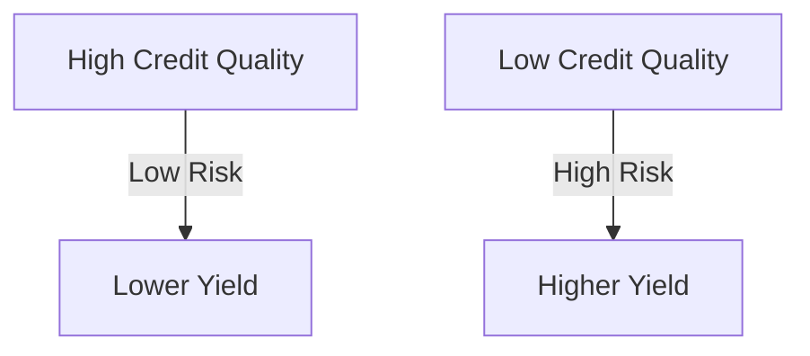

## 15.15 Credit Quality

In the realm of fixed-income investing, understanding credit quality is paramount. It serves as a critical indicator of a bond's ability to meet its financial commitments, influencing both investment decisions and portfolio management strategies. This section delves into the intricacies of credit quality, examining its impact on bond yields, the methodologies used to assess it, and strategies for managing credit risk.

### Understanding Credit Quality

**Credit Quality** refers to the likelihood that a bond issuer will fulfill its debt obligations. It is a measure of the issuer's financial health and stability, which directly affects the risk and return profile of a bond. High credit quality implies a lower risk of default, while low credit quality suggests a higher risk, necessitating a higher yield to attract investors.

### Importance of Credit Quality in Fixed-Income Investing

Credit quality is crucial for several reasons:

1. **Risk Assessment:** It helps investors gauge the risk of default associated with a bond. Higher credit quality bonds are generally considered safer investments.
2. **Yield Determination:** There is a direct correlation between credit quality and bond yields. Lower credit quality bonds, often termed **High-Yield Bonds**, offer higher yields to compensate for increased risk.
3. **Portfolio Diversification:** Understanding credit quality allows investors to diversify their portfolios by balancing high and low credit quality bonds to achieve desired risk-return profiles.

### Credit Rating Scales

Credit ratings are assessments provided by rating agencies that evaluate the creditworthiness of bond issuers. These ratings are crucial for investors as they provide a standardized measure of credit risk. The major rating agencies include Moody's, Standard & Poor's (S&P), and Fitch Ratings, each using a slightly different scale:

- **Moody's Ratings:**
  - Aaa: Highest quality, minimal credit risk
  - Aa: High quality, very low credit risk
  - A: Upper-medium grade, low credit risk
  - Baa: Medium grade, moderate credit risk
  - Ba and below: Speculative, higher credit risk

- **S&P and Fitch Ratings:**
  - AAA: Highest quality, minimal credit risk
  - AA: High quality, very low credit risk
  - A: Upper-medium grade, low credit risk
  - BBB: Medium grade, moderate credit risk
  - BB and below: Speculative, higher credit risk

These ratings are pivotal in determining the interest rates that issuers must offer to attract investors.

### Relationship Between Credit Quality and Bond Yields

The relationship between credit quality and bond yields is inverse. As credit quality decreases, the risk of default increases, leading investors to demand higher yields as compensation for taking on additional risk. This relationship can be visualized as follows:

### Strategies for Managing Credit Risk

Managing credit risk is essential for maintaining a stable and profitable fixed-income portfolio. Here are some strategies:

1. **Diversification:** Spread investments across various issuers, sectors, and geographies to mitigate the impact of any single default.
2. **Credit Analysis:** Regularly assess the creditworthiness of bond issuers using both quantitative and qualitative analysis.
3. **Duration Management:** Adjust the portfolio's duration to manage interest rate risk, which can affect credit spreads.
4. **Use of Credit Derivatives:** Instruments such as credit default swaps (CDS) can be used to hedge against credit risk.
5. **Active Monitoring:** Continuously monitor economic indicators and issuer-specific news that could impact credit quality.

### Canadian Context and Regulations

In Canada, the Office of the Superintendent of Financial Institutions (OSFI) oversees the financial stability of federally regulated financial institutions, ensuring they maintain adequate capital to cover credit risks. Additionally, the Canadian Securities Administrators (CSA) provide guidelines for credit rating agencies operating in Canada.

### Additional Resources

For those looking to deepen their understanding of credit risk and management, consider the following resources:

- **Books:**
  - *"Credit Risk Measurement: New Approaches to Value at Risk and Other Paradigms"* by Anthony Saunders and Linda Allen

- **Online Courses:**
  - **edX:** [Credit Risk Management](https://www.edx.org/course/credit-risk-management)

These resources offer comprehensive insights into credit risk assessment and management techniques, essential for both novice and seasoned investors.

### Conclusion

Understanding and managing credit quality is a cornerstone of successful fixed-income investing. By assessing credit ratings, analyzing the relationship between credit quality and yields, and implementing effective risk management strategies, investors can optimize their portfolios to achieve desired outcomes while mitigating potential risks.

### **Ready to Test Your Knowledge?**

**Practice 10 Essential CSC Exam Questions to Master Your Certification**



### What is credit quality?

- [x] A bond's capacity to meet its financial commitments
- [ ] The interest rate of a bond
- [ ] The market value of a bond
- [ ] The maturity date of a bond

> **Explanation:** Credit quality refers to a bond's capacity to meet its financial commitments, indicating the likelihood of default.

### Which of the following is a high-yield bond?

- [ ] A bond with AAA rating
- [ ] A bond with AA rating
- [x] A bond with BB rating
- [ ] A bond with A rating

> **Explanation:** High-yield bonds are typically rated BB or lower, indicating higher risk and offering higher yields.

### What is the relationship between credit quality and bond yields?

- [x] Inverse relationship
- [ ] Direct relationship
- [ ] No relationship
- [ ] Exponential relationship

> **Explanation:** There is an inverse relationship; as credit quality decreases, bond yields increase to compensate for higher risk.

### Which agency is responsible for overseeing financial stability in Canada?

- [ ] CSA
- [x] OSFI
- [ ] SEC
- [ ] FINRA

> **Explanation:** The Office of the Superintendent of Financial Institutions (OSFI) oversees financial stability in Canada.

### What is a credit rating?

- [x] An assessment of a borrower's ability to repay debt obligations
- [ ] The interest rate of a bond
- [ ] The market value of a bond
- [ ] The maturity date of a bond

> **Explanation:** A credit rating is an assessment of a borrower's ability to repay debt obligations.

### Which of the following strategies helps manage credit risk?

- [x] Diversification
- [ ] Concentration
- [ ] Ignoring credit ratings
- [ ] Investing in a single sector

> **Explanation:** Diversification helps manage credit risk by spreading investments across various issuers and sectors.

### What does a BBB rating indicate?

- [x] Medium grade, moderate credit risk
- [ ] Highest quality, minimal credit risk
- [ ] Speculative, higher credit risk
- [ ] Upper-medium grade, low credit risk

> **Explanation:** A BBB rating indicates a medium grade with moderate credit risk.

### Which of the following is a tool for hedging credit risk?

- [ ] Equity swaps
- [x] Credit default swaps
- [ ] Currency swaps
- [ ] Interest rate swaps

> **Explanation:** Credit default swaps are used to hedge against credit risk.

### What is the role of the CSA in Canada?

- [x] Provide guidelines for credit rating agencies
- [ ] Set interest rates
- [ ] Issue government bonds
- [ ] Manage pension funds

> **Explanation:** The Canadian Securities Administrators (CSA) provide guidelines for credit rating agencies in Canada.

### True or False: High credit quality bonds offer higher yields than low credit quality bonds.

- [ ] True
- [x] False

> **Explanation:** False. High credit quality bonds offer lower yields due to lower risk, while low credit quality bonds offer higher yields to compensate for higher risk.


