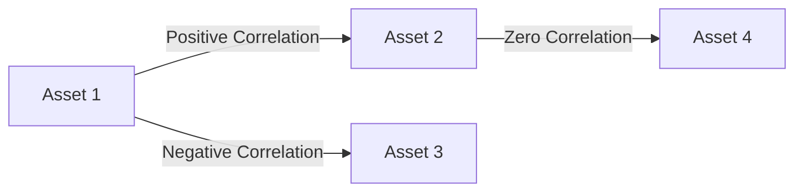

## 15.18 Correlation in Portfolio Management

In the realm of portfolio management, understanding correlation is crucial for constructing a diversified and risk-adjusted investment portfolio. Correlation, a statistical measure, indicates the extent to which two securities move in relation to each other. This concept is foundational in assessing how different assets interact within a portfolio, influencing both risk and return dynamics.

### Understanding Correlation

Correlation is quantified by the correlation coefficient, a value ranging from -1 to +1. This coefficient reveals the degree and direction of the relationship between two securities:

- **Perfect Positive Correlation (+1):** When two securities have a correlation coefficient of +1, they move in the same direction by the same magnitude. This implies that if one security's value increases, the other will increase proportionally, and vice versa.
  
- **Perfect Negative Correlation (-1):** A correlation coefficient of -1 indicates that two securities move in opposite directions by the same magnitude. If one security's value rises, the other will fall proportionally.

- **Zero Correlation (0):** A correlation coefficient of zero suggests no predictable relationship in the movements of the two securities.

### Significance of Correlation in Portfolio Construction

The primary goal of portfolio construction is to optimize returns while minimizing risk. Correlation plays a pivotal role in achieving this balance. By understanding and strategically managing the correlations between assets, investors can enhance diversification, thereby reducing unsystematic risk.

#### Positive and Negative Correlations

- **Positive Correlation:** When securities in a portfolio are positively correlated, they tend to move together. While this can lead to amplified gains during market upswings, it also increases the risk of simultaneous losses during downturns. For instance, holding stocks from the same industry, such as Canadian banks like RBC and TD, often results in positive correlation due to similar market influences.

- **Negative Correlation:** Incorporating negatively correlated securities can significantly reduce portfolio risk. When one asset's value decreases, the other may increase, providing a natural hedge. For example, stocks and bonds often exhibit negative correlation, especially in volatile markets, as investors shift between equities and fixed-income securities based on economic conditions.

### Ideal Correlation Scenarios for Diversification

Effective diversification aims to combine assets with varying correlations to achieve a balanced risk-return profile. The ideal scenario involves:

- **Low to Moderate Positive Correlation:** This allows for some level of diversification while still capturing potential market gains.
  
- **Negative Correlation:** Including assets with negative correlations can buffer against market volatility, stabilizing portfolio performance.

### Impact of Correlation on Portfolio Performance

The impact of correlation on portfolio performance is profound. Consider a portfolio comprising Canadian equities, bonds, and international securities. By analyzing the correlations between these asset classes, an investor can strategically allocate resources to mitigate risk and enhance returns.

#### Example: Canadian Pension Funds

Canadian pension funds, such as the Canada Pension Plan Investment Board (CPPIB), often utilize correlation analysis to diversify their portfolios across various asset classes and geographies. By investing in a mix of domestic equities, foreign stocks, real estate, and infrastructure, these funds aim to achieve a low overall portfolio correlation, thereby reducing risk and enhancing long-term returns.

### Practical Application: Analyzing Portfolio Correlation

To apply these concepts, investors can use financial tools and software to calculate correlation coefficients between portfolio assets. Open-source tools like R and Python libraries (e.g., Pandas, NumPy) offer robust functionalities for conducting correlation analysis.

#### Step-by-Step Guide:

1. **Data Collection:** Gather historical price data for the securities in your portfolio.
2. **Calculate Returns:** Compute the daily, weekly, or monthly returns for each security.
3. **Compute Correlation Matrix:** Use statistical software to calculate the correlation matrix, which displays the correlation coefficients between all pairs of securities.
4. **Analyze Results:** Identify securities with high positive correlations and consider diversifying with assets that have low or negative correlations.

### Visualizing Correlation

Below is a simple diagram illustrating the concept of correlation in a portfolio context:

### Best Practices and Common Pitfalls

**Best Practices:**
- Regularly review and adjust portfolio allocations based on changing correlations.
- Consider macroeconomic factors that may influence correlations, such as interest rate changes or geopolitical events.

**Common Pitfalls:**
- Over-reliance on historical correlations, which may not hold in future market conditions.
- Ignoring the impact of extreme market events, where correlations can converge, reducing diversification benefits.

### References and Further Reading

For those interested in delving deeper into the topic of correlation in finance, consider the following resources:

- **Books:**
  - *"Correlation and Its Implications in Finance"* by Martin Oehmke

- **Online Resources:**
  - **Investopedia:** [Correlation in Investing](https://www.investopedia.com/terms/c/correlation.asp)

- **Canadian Financial Institutions:**
  - Canada Pension Plan Investment Board (CPPIB)
  - Bank of Canada

### Conclusion

Understanding and managing correlation is essential for effective portfolio management. By strategically diversifying assets based on their correlations, investors can optimize their portfolios to achieve desired risk-return objectives. As the financial landscape evolves, continuous learning and adaptation are key to maintaining a robust investment strategy.

### **Ready to Test Your Knowledge?**

**Practice 10 Essential CSC Exam Questions to Master Your Certification**



### What is correlation in the context of portfolio management?

- [x] A statistical measure indicating the extent to which two securities move in relation to each other.
- [ ] A measure of the average return of a portfolio.
- [ ] A method for calculating the intrinsic value of a stock.
- [ ] A tool for predicting future stock prices.

> **Explanation:** Correlation is a statistical measure that indicates how two securities move in relation to each other, which is crucial for understanding portfolio dynamics.

### What does a correlation coefficient of +1 signify?

- [x] Perfect positive correlation, where two securities move in the same direction by the same magnitude.
- [ ] Perfect negative correlation, where two securities move in opposite directions by the same magnitude.
- [ ] No correlation between the securities.
- [ ] The securities are unrelated.

> **Explanation:** A correlation coefficient of +1 indicates perfect positive correlation, meaning the securities move together in the same direction.

### How does negative correlation affect portfolio risk?

- [x] It reduces portfolio risk by providing a natural hedge.
- [ ] It increases portfolio risk by amplifying losses.
- [ ] It has no effect on portfolio risk.
- [ ] It only affects the portfolio during market downturns.

> **Explanation:** Negative correlation reduces portfolio risk by offsetting losses in one security with gains in another.

### What is the ideal correlation scenario for effective diversification?

- [x] Low to moderate positive correlation and negative correlation.
- [ ] High positive correlation.
- [ ] High negative correlation.
- [ ] Zero correlation only.

> **Explanation:** Effective diversification is achieved with low to moderate positive correlation and negative correlation, balancing risk and return.

### Which Canadian institution is known for utilizing correlation analysis in its investment strategy?

- [x] Canada Pension Plan Investment Board (CPPIB)
- [ ] Bank of Canada
- [ ] Toronto Stock Exchange
- [ ] Canadian Imperial Bank of Commerce (CIBC)

> **Explanation:** The CPPIB uses correlation analysis to diversify its portfolio across various asset classes and geographies.

### What is a common pitfall when relying on historical correlations?

- [x] They may not hold in future market conditions.
- [ ] They always predict future market trends accurately.
- [ ] They are irrelevant to portfolio management.
- [ ] They are only useful for short-term investments.

> **Explanation:** Historical correlations may not hold in future market conditions, making it a common pitfall to rely solely on them.

### Which tool can be used to calculate correlation coefficients?

- [x] R and Python libraries like Pandas and NumPy
- [ ] Microsoft Word
- [ ] Adobe Photoshop
- [ ] Google Maps

> **Explanation:** R and Python libraries like Pandas and NumPy are used for statistical analysis, including calculating correlation coefficients.

### What does a correlation coefficient of zero indicate?

- [x] No predictable relationship in the movements of the two securities.
- [ ] Perfect positive correlation.
- [ ] Perfect negative correlation.
- [ ] The securities move in opposite directions.

> **Explanation:** A correlation coefficient of zero indicates no predictable relationship between the movements of the two securities.

### How can investors apply correlation analysis to their portfolios?

- [x] By calculating correlation coefficients and adjusting asset allocations accordingly.
- [ ] By ignoring correlations and focusing solely on returns.
- [ ] By investing only in high-risk securities.
- [ ] By using correlation to predict future stock prices.

> **Explanation:** Investors can apply correlation analysis by calculating correlation coefficients and adjusting their asset allocations to optimize risk and return.

### True or False: Including assets with negative correlations in a portfolio can help stabilize performance.

- [x] True
- [ ] False

> **Explanation:** Including assets with negative correlations can help stabilize portfolio performance by offsetting losses in one asset with gains in another.


