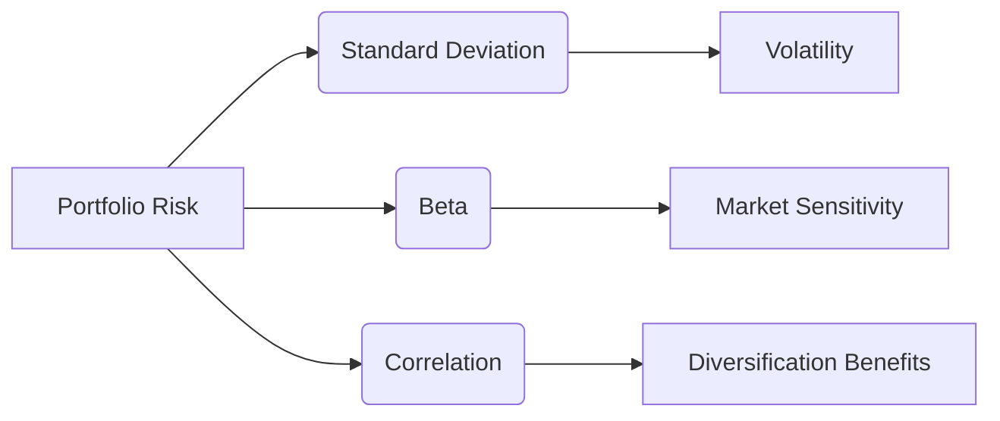

## 15.2.1 Measuring Risk in a Portfolio

In the realm of portfolio management, understanding and measuring risk is crucial for making informed investment decisions. This section delves into the key metrics used to assess portfolio risk: standard deviation, beta, and correlation. By mastering these concepts, investors can better manage their portfolios to align with their risk tolerance and investment goals.

### Understanding Standard Deviation in Portfolio Risk

**Standard Deviation** is a statistical measure that quantifies the amount of variation or dispersion in a set of values. In the context of portfolio management, it is used to assess the volatility of a portfolio's returns. A higher standard deviation indicates greater risk, as it suggests a wider range of potential returns.

#### Calculating Standard Deviation

To calculate the standard deviation of a portfolio's returns, follow these steps:

1. **Calculate the Mean Return:** Determine the average return of the portfolio over a specific period.
2. **Compute Deviations:** Subtract the mean return from each individual return to find the deviation for each period.
3. **Square the Deviations:** Square each deviation to eliminate negative values.
4. **Average the Squared Deviations:** Find the mean of these squared deviations.
5. **Take the Square Root:** The standard deviation is the square root of this average.

This calculation provides a measure of how much the portfolio's returns deviate from the average, offering insight into the potential for fluctuation.

#### Practical Example

Consider a portfolio with the following annual returns over five years: 8%, 10%, 12%, 9%, and 11%. The mean return is 10%. The deviations from the mean are -2%, 0%, 2%, -1%, and 1%. Squaring these deviations and averaging them gives a variance of 2.5%. The standard deviation, therefore, is the square root of 2.5%, approximately 1.58%.

### Beta: Sensitivity to Market Movements

**Beta** measures a portfolio's sensitivity to market movements. It indicates how much the portfolio's returns are expected to change in response to changes in the overall market.

#### Interpreting Beta

- **Beta = 1.0:** The portfolio's returns are expected to move in line with the market.
- **Beta > 1.0:** The portfolio is more volatile than the market, implying higher risk and potential return.
- **Beta < 1.0:** The portfolio is less volatile than the market, suggesting lower risk and potential return.

#### Calculating Portfolio Beta

Portfolio beta is the weighted average of the betas of the individual securities within the portfolio. It is calculated as follows:

 \text{Portfolio Beta} = \sum (\text{Weight of Security} \times \text{Beta of Security}) 

#### Example with Canadian Context

Imagine a portfolio consisting of two stocks: RBC (Royal Bank of Canada) with a beta of 1.2 and TD (Toronto-Dominion Bank) with a beta of 0.8. If RBC constitutes 60% of the portfolio and TD 40%, the portfolio beta is:

 \text{Portfolio Beta} = (0.6 \times 1.2) + (0.4 \times 0.8) = 0.72 + 0.32 = 1.04 

This indicates that the portfolio is slightly more volatile than the market.

### The Role of Correlation in Portfolio Risk

**Correlation** measures the degree to which two securities move in relation to each other. It ranges from -1 to +1, where:

- **+1** indicates perfect positive correlation (securities move in the same direction).
- **0** indicates no correlation (securities move independently).
- **-1** indicates perfect negative correlation (securities move in opposite directions).

#### Impact of Correlation on Portfolio Risk

By combining securities with different correlations, investors can optimize their portfolio's risk-return profile. Diversification benefits arise when securities with low or negative correlations are included, as they can reduce overall portfolio volatility.

#### Constructing a Diversified Portfolio

To construct a diversified portfolio, consider the correlation coefficients between potential investments. For example, if a Canadian equity fund and a bond fund have a correlation of 0.3, including both in a portfolio can reduce risk compared to holding only equities.

### Visualizing Portfolio Risk

Below is a diagram illustrating the relationship between standard deviation, beta, and correlation in a portfolio context:

### Best Practices and Common Pitfalls

- **Best Practices:**
  - Regularly assess the standard deviation and beta of your portfolio to stay informed about its risk profile.
  - Use correlation coefficients to strategically diversify your portfolio, reducing unsystematic risk.

- **Common Pitfalls:**
  - Ignoring the impact of correlation can lead to suboptimal diversification.
  - Over-reliance on historical data for beta and standard deviation may not accurately predict future risk.

### Conclusion

Measuring risk in a portfolio is a fundamental aspect of effective portfolio management. By understanding and applying standard deviation, beta, and correlation, investors can make informed decisions that align with their risk tolerance and investment objectives. These tools enable the construction of portfolios that balance risk and return, optimizing financial outcomes.

### Further Resources

- **Books:**
  - "A Random Walk Down Wall Street" by Burton G. Malkiel
  - "The Intelligent Investor" by Benjamin Graham

- **Online Courses:**
  - Coursera: "Investment Management" by the University of Geneva
  - edX: "Introduction to Risk Management" by NYIF

- **Canadian Financial Institutions:**
  - Visit the websites of major Canadian banks like RBC and TD for insights into their investment strategies and risk management practices.

## Quiz Time!



### What does a higher standard deviation indicate in a portfolio?

- [x] Greater risk and potential for wider fluctuations in returns
- [ ] Lower risk and more stable returns
- [ ] No impact on risk
- [ ] A guaranteed higher return

> **Explanation:** A higher standard deviation indicates greater risk, as it suggests a wider range of potential returns.

### What does a portfolio beta of 1.0 signify?

- [x] The portfolio's returns are expected to move in line with the market
- [ ] The portfolio is more volatile than the market
- [ ] The portfolio is less volatile than the market
- [ ] The portfolio is not affected by market movements

> **Explanation:** A beta of 1.0 means the portfolio's returns are expected to move in line with the market.

### How does a correlation coefficient of -1 affect two securities?

- [x] They move in opposite directions
- [ ] They move in the same direction
- [ ] They move independently
- [ ] They do not move at all

> **Explanation:** A correlation coefficient of -1 indicates perfect negative correlation, meaning the securities move in opposite directions.

### What is the primary benefit of including securities with low or negative correlations in a portfolio?

- [x] Reduced overall portfolio volatility
- [ ] Increased overall portfolio volatility
- [ ] Guaranteed higher returns
- [ ] No impact on portfolio risk

> **Explanation:** Including securities with low or negative correlations can reduce overall portfolio volatility through diversification.

### Which of the following is NOT a measure of portfolio risk?

- [ ] Standard Deviation
- [ ] Beta
- [ ] Correlation
- [x] Dividend Yield

> **Explanation:** Dividend yield is not a measure of portfolio risk; it measures the income generated by an investment.

### What does a beta greater than 1.0 indicate?

- [x] The portfolio is more volatile than the market
- [ ] The portfolio is less volatile than the market
- [ ] The portfolio is equally volatile as the market
- [ ] The portfolio is not affected by market movements

> **Explanation:** A beta greater than 1.0 indicates that the portfolio is more volatile than the market.

### How can investors optimize their portfolio's risk-return profile?

- [x] By combining securities with different correlations
- [ ] By investing only in high-risk securities
- [ ] By ignoring market trends
- [ ] By focusing solely on dividend-paying stocks

> **Explanation:** Combining securities with different correlations can optimize the portfolio's risk-return profile through diversification.

### What does a correlation coefficient of 0 indicate?

- [x] Securities move independently
- [ ] Securities move in the same direction
- [ ] Securities move in opposite directions
- [ ] Securities do not move at all

> **Explanation:** A correlation coefficient of 0 indicates no correlation, meaning securities move independently.

### What is the formula for calculating portfolio beta?

- [x] The weighted average of the betas of the individual securities
- [ ] The sum of the standard deviations of the securities
- [ ] The average return of the portfolio
- [ ] The correlation coefficient of the securities

> **Explanation:** Portfolio beta is calculated as the weighted average of the betas of the individual securities.

### True or False: A portfolio with a beta of less than 1.0 is less volatile than the market.

- [x] True
- [ ] False

> **Explanation:** A beta of less than 1.0 indicates that the portfolio is less volatile than the market.


