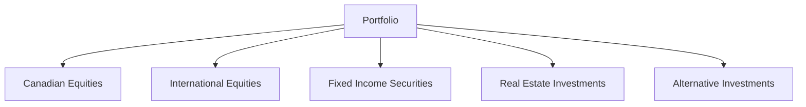

## 15.1 Introduction to the Portfolio Approach

In the realm of investment management, the portfolio approach stands as a cornerstone strategy, essential for both novice and seasoned investors. This approach involves the careful selection and management of a collection of investments, known as a portfolio, to achieve specific financial goals while managing risk. Understanding the portfolio approach is crucial for anyone involved in financial planning or investment management, particularly within the Canadian financial landscape.

### The Portfolio Approach: Definition and Importance

The portfolio approach is a method of investing that involves diversifying investments across a range of asset classes to optimize returns and minimize risk. Unlike investing in a single security, which can expose an investor to significant risk, a diversified portfolio spreads risk across various investments. This strategy is grounded in the principle that while individual securities may be volatile, a well-constructed portfolio can provide more stable returns over time.

The importance of the portfolio approach lies in its ability to balance risk and return. By diversifying investments, investors can potentially achieve higher returns without proportionately increasing risk. This is particularly relevant in the Canadian context, where investors have access to a wide range of financial instruments, including stocks, bonds, mutual funds, and exchange-traded funds (ETFs).

### The Absence of a Perfect Security

One of the fundamental reasons for adopting a portfolio approach is the absence of a perfect security. No single investment can provide the ideal balance of risk and return for all investors. Each security is subject to its own set of risks, including market risk, credit risk, and interest rate risk, among others. By investing in a variety of securities, investors can mitigate the impact of any one security's poor performance on the overall portfolio.

### Diversification: Reducing Risk Without Sacrificing Returns

Diversification is a key component of the portfolio approach. It involves spreading investments across different asset classes, sectors, and geographic regions to reduce exposure to any single asset or risk. The goal of diversification is to reduce the overall risk of the portfolio without necessarily decreasing expected returns.

#### How Diversification Works

Diversification works by combining assets that have different risk profiles and return characteristics. For example, when stocks in one sector perform poorly, stocks in another sector may perform well, balancing the overall portfolio performance. This is particularly important in volatile markets, where the performance of individual securities can be unpredictable.

Consider a Canadian investor who holds a diversified portfolio consisting of Canadian equities, international equities, fixed income securities, and real estate investments. If the Canadian stock market experiences a downturn, the impact on the investor's portfolio may be cushioned by gains in international equities or real estate, thus reducing overall portfolio volatility.

#### Visualizing Diversification

To better understand diversification, consider the following diagram illustrating a diversified portfolio:

This diagram shows how a portfolio can be diversified across various asset classes, each contributing to the overall risk and return profile.

### The Role of Portfolio Managers and Advisors

Portfolio managers and advisors play a crucial role in the portfolio approach. These professionals are responsible for selecting and managing the securities within a portfolio to achieve the investor's financial objectives.

#### Portfolio Managers

A portfolio manager is a professional responsible for making investment decisions and managing a portfolio of assets. They analyze market trends, economic data, and individual securities to construct a portfolio that aligns with the investor's risk tolerance and investment goals. Portfolio managers often use sophisticated financial models and tools to optimize portfolio performance.

#### Advisors

An advisor is an individual or firm that provides financial guidance to investors. Advisors help investors understand their financial goals, assess their risk tolerance, and develop a comprehensive investment strategy. They may also provide ongoing advice and support to help investors navigate changing market conditions.

### Canadian Financial Regulations and Resources

In Canada, investment management is governed by a robust regulatory framework designed to protect investors and ensure market integrity. Key regulatory bodies include the Canadian Investment Regulatory Organization (CIRO) and provincial securities commissions. These organizations set standards for portfolio management and advisor conduct, ensuring that investors receive professional and ethical financial advice.

For those seeking to deepen their understanding of the portfolio approach, several resources are available:

- **Books:**
  - *"Investment Science"* by David G. Luenberger: This book provides a comprehensive introduction to investment theory and practice, including portfolio management.

- **Online Resources:**
  - **Investopedia:** [Portfolio Management](https://www.investopedia.com/terms/p/portfoliomanagement.asp): A valuable resource for understanding the fundamentals of portfolio management.

### Conclusion

The portfolio approach is a fundamental strategy in investment management, offering a structured way to balance risk and return through diversification. By understanding and applying this approach, investors can better achieve their financial goals while navigating the complexities of the financial markets. Portfolio managers and advisors play a vital role in this process, providing expertise and guidance to help investors make informed decisions.

As you continue to explore the world of investment management, consider how the principles of the portfolio approach can be applied to your own financial planning and investment decisions. By leveraging the resources and strategies discussed in this chapter, you can enhance your understanding and effectiveness as an investor.

### **Ready to Test Your Knowledge?**

**Practice 10 Essential CSC Exam Questions to Master Your Certification**



### What is the primary goal of the portfolio approach in investment management?

- [x] To optimize returns while minimizing risk
- [ ] To maximize returns regardless of risk
- [ ] To minimize returns and risk
- [ ] To focus on a single security

> **Explanation:** The portfolio approach aims to optimize returns while minimizing risk through diversification.

### Why is diversification important in a portfolio?

- [x] It reduces exposure to any single asset or risk
- [ ] It guarantees higher returns
- [ ] It eliminates all risks
- [ ] It focuses investments on a single sector

> **Explanation:** Diversification spreads investments across various assets, reducing exposure to any single asset or risk.

### What role does a portfolio manager play?

- [x] Making investment decisions and managing a portfolio of assets
- [ ] Providing legal advice
- [ ] Selling insurance products
- [ ] Auditing financial statements

> **Explanation:** A portfolio manager is responsible for making investment decisions and managing a portfolio of assets.

### How does diversification help in reducing portfolio risk?

- [x] By combining assets with different risk profiles
- [ ] By focusing on high-risk assets
- [ ] By investing only in bonds
- [ ] By avoiding international investments

> **Explanation:** Diversification reduces risk by combining assets with different risk profiles and return characteristics.

### Which of the following is NOT a component of a diversified portfolio?

- [ ] Canadian Equities
- [ ] International Equities
- [ ] Fixed Income Securities
- [x] A single stock

> **Explanation:** A single stock does not provide diversification; a diversified portfolio includes multiple asset classes.

### What is the role of an advisor in investment management?

- [x] Providing financial guidance to investors
- [ ] Managing a company's payroll
- [ ] Conducting market research
- [ ] Designing financial software

> **Explanation:** An advisor provides financial guidance to investors, helping them understand their goals and develop strategies.

### Which regulatory body governs investment management in Canada?

- [x] Canadian Investment Regulatory Organization (CIRO)
- [ ] Securities and Exchange Commission (SEC)
- [ ] Financial Conduct Authority (FCA)
- [ ] European Central Bank (ECB)

> **Explanation:** The Canadian Investment Regulatory Organization (CIRO) is a key regulatory body governing investment management in Canada.

### What is a key benefit of using a portfolio approach?

- [x] Balancing risk and return through diversification
- [ ] Eliminating all investment risks
- [ ] Achieving guaranteed returns
- [ ] Focusing on short-term gains

> **Explanation:** The portfolio approach balances risk and return through diversification, not eliminating risks or guaranteeing returns.

### Which book is recommended for further reading on investment science?

- [x] "Investment Science" by David G. Luenberger
- [ ] "The Intelligent Investor" by Benjamin Graham
- [ ] "Rich Dad Poor Dad" by Robert Kiyosaki
- [ ] "The Wealth of Nations" by Adam Smith

> **Explanation:** "Investment Science" by David G. Luenberger is recommended for further reading on investment science.

### True or False: Diversification guarantees higher returns.

- [ ] True
- [x] False

> **Explanation:** Diversification does not guarantee higher returns; it aims to reduce risk while maintaining potential returns.


