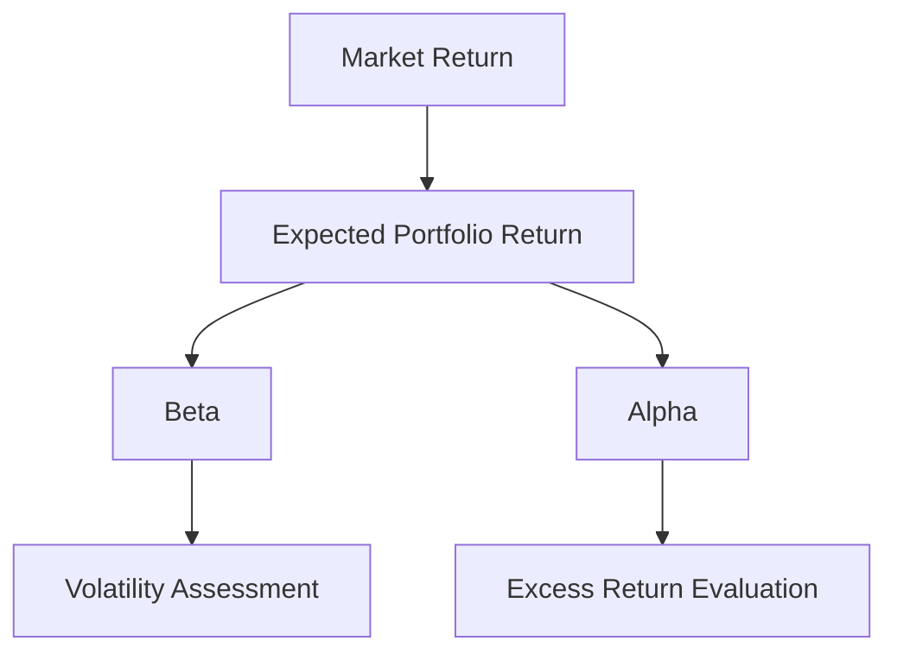

## 15.19 Portfolio Beta and Alpha

In the realm of portfolio management, understanding the concepts of beta and alpha is crucial for evaluating investment performance and making informed decisions. These metrics provide insights into a portfolio's volatility relative to the market and its ability to generate returns beyond market expectations. This section delves into the definitions, calculations, and interpretations of portfolio beta and alpha, emphasizing their significance in the Canadian financial context.

### Understanding Portfolio Beta

**Beta** is a measure of a portfolio's volatility in comparison to the overall market. It indicates how much a portfolio's returns are expected to move in relation to market movements. A beta of 1 implies that the portfolio's price will move with the market. A beta greater than 1 indicates higher volatility than the market, while a beta less than 1 suggests lower volatility.

#### Role of Beta in Portfolio Management

Beta is instrumental in assessing the risk associated with a portfolio. Investors use beta to understand how sensitive a portfolio is to market movements, which is essential for risk management and strategic asset allocation. For instance, a Canadian pension fund might prefer a portfolio with a beta less than 1 to minimize exposure to market fluctuations.

#### Calculating Portfolio Beta

The formula for calculating beta is:


\beta = \frac{\text{Covariance}(\text{Portfolio Returns}, \text{Market Returns})}{\text{Variance}(\text{Market Returns})}


This formula requires historical return data for both the portfolio and the market index, such as the S&P/TSX Composite Index in Canada.

#### Example: Calculating Beta

Consider a portfolio with the following historical returns compared to the S&P/TSX Composite Index:

- Portfolio Returns: 8%, 10%, 12%, 9%, 11%
- Market Returns: 7%, 9%, 11%, 8%, 10%

Using statistical software or a financial calculator, you can compute the covariance between the portfolio and market returns and divide it by the variance of the market returns to find the beta.

### Introducing Portfolio Alpha

**Alpha** represents the excess return of a portfolio relative to the return predicted by its beta. It is a measure of a portfolio manager's ability to generate returns above the expected market return, adjusted for risk.

#### Role of Alpha in Portfolio Management

Alpha is a critical metric for evaluating the performance of active portfolio managers. A positive alpha indicates that the portfolio has outperformed the market after adjusting for risk, while a negative alpha suggests underperformance.

#### Calculating Portfolio Alpha

The formula for calculating alpha is:


\alpha = \text{Portfolio Return} - [\text{Risk-Free Rate} + \beta \times (\text{Market Return} - \text{Risk-Free Rate})]


This formula incorporates the risk-free rate, typically represented by the yield on Canadian government bonds, to adjust for the time value of money.

#### Example: Calculating Alpha

Assume a portfolio has a return of 12%, a beta of 1.2, a market return of 10%, and a risk-free rate of 2%. The alpha is calculated as follows:


\alpha = 12\% - [2\% + 1.2 \times (10\% - 2\%)] = 12\% - 11.6\% = 0.4\%


This positive alpha of 0.4% indicates that the portfolio has outperformed the market after adjusting for risk.

### Evaluating Portfolio Performance with Beta and Alpha

Beta and alpha are complementary metrics used to evaluate portfolio performance. While beta assesses the risk level, alpha measures the manager's skill in generating excess returns. Together, they provide a comprehensive view of a portfolio's performance.

#### Practical Application: Canadian Financial Institutions

Consider a scenario where a Canadian mutual fund manager is evaluating the performance of their fund. By analyzing the fund's beta, the manager can assess its sensitivity to market movements. Simultaneously, calculating the fund's alpha allows the manager to determine whether the fund has delivered returns above market expectations, adjusted for risk.

### Visualizing Beta and Alpha

Below is a diagram illustrating the relationship between beta, alpha, and market returns:

### Best Practices and Common Pitfalls

- **Best Practices:**
  - Regularly assess portfolio beta and alpha to ensure alignment with investment objectives.
  - Use beta to manage portfolio risk and adjust asset allocation accordingly.
  - Evaluate alpha to gauge the effectiveness of active management strategies.

- **Common Pitfalls:**
  - Relying solely on beta or alpha without considering other performance metrics.
  - Ignoring changes in market conditions that may affect beta and alpha calculations.
  - Overlooking the impact of transaction costs and fees on alpha.

### References and Further Exploration

To deepen your understanding of portfolio beta and alpha, consider exploring the following resources:

- **Books:**
  - *"Active Portfolio Management: A Quantitative Approach for Producing Superior Returns and Controlling Risk"* by Richard C. Grinold and Ronald N. Kahn

- **Online Courses:**
  - **edX:** [Advanced Portfolio Management](https://www.edx.org/course/advanced-portfolio-management)

- **Canadian Financial Regulations:**
  - Review guidelines from the Canadian Investment Regulatory Organization (CIRO) for compliance and best practices in portfolio management.

### Conclusion

Understanding portfolio beta and alpha is essential for evaluating investment performance and making informed decisions. By mastering these concepts, investors and portfolio managers can better assess risk, measure excess returns, and optimize their investment strategies within the Canadian financial landscape.

### **Ready to Test Your Knowledge?**

**Practice 10 Essential CSC Exam Questions to Master Your Certification**



### What does a beta of 1 indicate about a portfolio's volatility?

- [x] The portfolio's volatility is equal to the market's volatility.
- [ ] The portfolio is more volatile than the market.
- [ ] The portfolio is less volatile than the market.
- [ ] The portfolio has no volatility.

> **Explanation:** A beta of 1 means the portfolio's returns move in line with the market's returns, indicating equal volatility.

### What does a positive alpha signify?

- [x] The portfolio has outperformed the market after adjusting for risk.
- [ ] The portfolio has underperformed the market.
- [ ] The portfolio's returns are equal to the market's returns.
- [ ] The portfolio has no excess return.

> **Explanation:** A positive alpha indicates that the portfolio has generated returns above the expected market return, adjusted for risk.

### Which formula is used to calculate beta?

- [x] Beta = Covariance(Portfolio Returns, Market Returns) / Variance(Market Returns)
- [ ] Alpha = Portfolio Return - Expected Market Return
- [ ] Beta = Portfolio Return / Market Return
- [ ] Alpha = Market Return - Portfolio Return

> **Explanation:** Beta is calculated using the covariance of portfolio returns and market returns divided by the variance of market returns.

### What is the role of beta in portfolio management?

- [x] To assess the risk associated with a portfolio relative to the market.
- [ ] To measure the portfolio's total return.
- [ ] To calculate the portfolio's transaction costs.
- [ ] To determine the portfolio's liquidity.

> **Explanation:** Beta is used to understand how sensitive a portfolio is to market movements, which is crucial for risk management.

### How is alpha calculated?

- [x] Alpha = Portfolio Return - [Risk-Free Rate + Beta × (Market Return - Risk-Free Rate)]
- [ ] Alpha = Portfolio Return / Market Return
- [x] Alpha = Portfolio Return - Expected Market Return
- [ ] Alpha = Market Return - Portfolio Return

> **Explanation:** Alpha is calculated by subtracting the expected return (based on beta) from the actual portfolio return.

### What does a beta greater than 1 indicate?

- [x] The portfolio is more volatile than the market.
- [ ] The portfolio is less volatile than the market.
- [ ] The portfolio's volatility is equal to the market's volatility.
- [ ] The portfolio has no volatility.

> **Explanation:** A beta greater than 1 indicates that the portfolio's returns are more volatile than the market's returns.

### What is the significance of a negative alpha?

- [x] The portfolio has underperformed the market after adjusting for risk.
- [ ] The portfolio has outperformed the market.
- [x] The portfolio's returns are equal to the market's returns.
- [ ] The portfolio has no excess return.

> **Explanation:** A negative alpha suggests that the portfolio has not met the expected market return, adjusted for risk.

### Why is it important to consider both beta and alpha?

- [x] To gain a comprehensive view of a portfolio's performance.
- [ ] To calculate transaction costs.
- [ ] To determine the portfolio's liquidity.
- [ ] To assess the portfolio's tax implications.

> **Explanation:** Beta and alpha together provide insights into risk and excess returns, offering a complete picture of performance.

### What is the risk-free rate typically represented by in Canada?

- [x] The yield on Canadian government bonds.
- [ ] The average return of the S&P/TSX Composite Index.
- [ ] The return on Canadian corporate bonds.
- [ ] The return on Canadian real estate investments.

> **Explanation:** The risk-free rate is usually represented by the yield on Canadian government bonds, reflecting the time value of money.

### True or False: A portfolio with a beta of 0.5 is more volatile than the market.

- [ ] True
- [x] False

> **Explanation:** A beta of 0.5 indicates that the portfolio is less volatile than the market, as it moves only half as much as the market.


