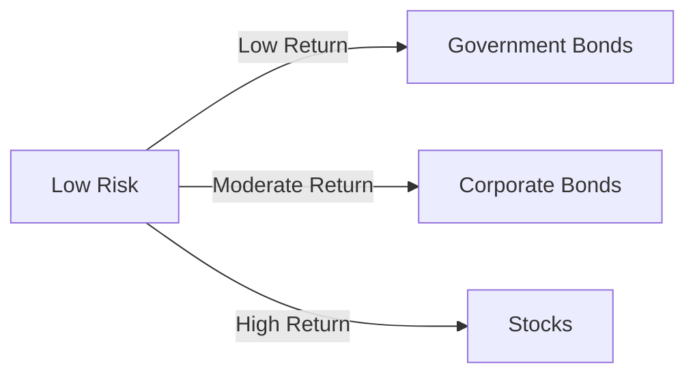

## 15.2 Risk and Return

In the world of finance, the relationship between risk and return is fundamental. Understanding this relationship is crucial for anyone involved in investing, as it forms the basis of making informed decisions that align with one's financial goals and risk tolerance. This section delves into the dynamics of risk and return, how investors balance these elements, and the implications for investment choices, particularly within the Canadian context.

### The Fundamental Relationship Between Risk and Return

At its core, the concept of risk and return is straightforward: the potential return on an investment is typically proportional to the level of risk involved. Higher risk investments generally offer the possibility of higher returns, while lower risk investments tend to provide more modest returns. This relationship is often depicted in the risk-return tradeoff, a fundamental principle in finance.

#### Visualizing the Risk-Return Tradeoff

Consider the following diagram illustrating the risk-return tradeoff:

In this diagram, government bonds represent low-risk, low-return investments, while stocks are positioned at the high-risk, high-return end of the spectrum. Corporate bonds fall somewhere in between, offering moderate risk and return.

### Balancing Risk Tolerance with Expected Returns

Investors must carefully balance their risk tolerance with their expected returns. Risk tolerance is defined as an investor's ability and willingness to lose some or all of their original investment in exchange for greater potential returns. It is influenced by factors such as age, income, financial goals, and investment experience.

#### Determining Risk Tolerance

Investors can determine their risk tolerance through self-assessment or by consulting with financial advisors. This involves evaluating their financial situation, investment goals, and emotional capacity to handle market fluctuations. Tools such as risk tolerance questionnaires are commonly used to assist in this process.

### Impact of Investment Choices on Risk and Return

Different investment choices can significantly impact the risk and return profile of a portfolio. Let's explore some examples:

#### Example 1: Conservative Portfolio

A conservative portfolio might consist primarily of government bonds and high-grade corporate bonds. This type of portfolio is designed to minimize risk and provide steady, albeit modest, returns. It is suitable for investors with low risk tolerance or those nearing retirement.

#### Example 2: Aggressive Portfolio

An aggressive portfolio, on the other hand, might be heavily weighted towards stocks, including small-cap and international equities. This portfolio aims for higher returns but comes with increased volatility and risk. It is more appropriate for younger investors with a higher risk tolerance and a longer investment horizon.

### Introducing Risk Profiles

A risk profile is a combination of an investor's risk tolerance and investment objectives. It serves as a guide for making investment decisions that align with one's financial goals and comfort with risk. Understanding one's risk profile is essential for constructing a portfolio that balances risk and return effectively.

#### Creating a Risk Profile

To create a risk profile, investors should consider:

1. **Investment Objectives:** What are the primary goals? (e.g., retirement, education, wealth accumulation)
2. **Time Horizon:** How long can the investment be held before needing access to the funds?
3. **Risk Tolerance:** How much risk is the investor willing to take on?
4. **Financial Situation:** What is the investor's current financial status, including income, expenses, and liabilities?

### Practical Examples and Case Studies

#### Case Study: Canadian Pension Funds

Canadian pension funds, such as the Canada Pension Plan Investment Board (CPPIB), offer insights into balancing risk and return. These funds manage large pools of capital with the goal of providing stable returns to beneficiaries. They achieve this by diversifying across asset classes, including equities, fixed income, and alternative investments, to optimize the risk-return profile.

#### Example: Major Canadian Banks

Major Canadian banks like RBC and TD employ sophisticated risk management strategies to balance risk and return in their investment portfolios. By diversifying their holdings and employing hedging techniques, these institutions aim to maximize returns while mitigating potential losses.

### Best Practices and Common Pitfalls

#### Best Practices

- **Diversification:** Spread investments across various asset classes to reduce risk.
- **Regular Review:** Periodically review and adjust the portfolio to ensure alignment with risk tolerance and financial goals.
- **Education:** Continuously educate oneself about market trends and investment strategies.

#### Common Pitfalls

- **Overconfidence:** Avoid making investment decisions based on emotions or overconfidence in one's ability to predict market movements.
- **Neglecting Risk Assessment:** Failing to assess risk tolerance can lead to inappropriate investment choices.

### References and Further Exploration

For those interested in deepening their understanding of risk and return, consider the following resources:

- **Books:**
  - *"Principles of Corporate Finance"* by Richard A. Brealey, Stewart C. Myers, and Franklin Allen

- **Online Courses:**
  - **Khan Academy:** [Introduction to Risk and Return](https://www.khanacademy.org/economics-finance-domain/core-finance/investment-vehicles-tutorial)

- **Canadian Financial Institutions:**
  - Canada Pension Plan Investment Board (CPPIB)
  - Royal Bank of Canada (RBC)
  - Toronto-Dominion Bank (TD)

### Summary

Understanding the relationship between risk and return is essential for making informed investment decisions. By balancing risk tolerance with expected returns and considering one's risk profile, investors can construct portfolios that align with their financial goals. Through diversification and regular portfolio reviews, investors can navigate the complexities of the financial markets and optimize their investment outcomes.

### **Ready to Test Your Knowledge?**

**Practice 10 Essential CSC Exam Questions to Master Your Certification**



### What is the fundamental relationship between risk and return?

- [x] Higher risk is associated with the potential for higher returns.
- [ ] Lower risk always guarantees higher returns.
- [ ] Risk and return are unrelated.
- [ ] Higher risk guarantees higher returns.

> **Explanation:** The fundamental relationship between risk and return is that higher risk is associated with the potential for higher returns, but it does not guarantee them.

### What is risk tolerance?

- [x] An investor's ability and willingness to lose some or all of their original investment in exchange for greater potential returns.
- [ ] The guaranteed return on an investment.
- [ ] The amount of money an investor is willing to invest.
- [ ] The time horizon for an investment.

> **Explanation:** Risk tolerance refers to an investor's ability and willingness to lose some or all of their original investment in exchange for greater potential returns.

### Which of the following is a characteristic of a conservative portfolio?

- [x] Primarily consists of government bonds and high-grade corporate bonds.
- [ ] Heavily weighted towards stocks.
- [ ] Focuses on small-cap and international equities.
- [ ] Includes high-risk derivatives.

> **Explanation:** A conservative portfolio primarily consists of government bonds and high-grade corporate bonds, aiming to minimize risk and provide steady returns.

### What is a risk profile?

- [x] A combination of an investor's risk tolerance and investment objectives.
- [ ] A list of all investments in a portfolio.
- [ ] A measure of the historical performance of a stock.
- [ ] A financial statement summary.

> **Explanation:** A risk profile is a combination of an investor's risk tolerance and investment objectives, guiding investment decisions.

### Which of the following is a best practice for managing risk and return?

- [x] Diversification
- [ ] Overconfidence
- [ ] Ignoring market trends
- [ ] Investing in a single asset class

> **Explanation:** Diversification is a best practice for managing risk and return by spreading investments across various asset classes.

### What is the risk-return tradeoff?

- [x] The principle that potential return rises with an increase in risk.
- [ ] The guarantee of high returns with low risk.
- [ ] The relationship between investment fees and returns.
- [ ] The correlation between market volatility and investment duration.

> **Explanation:** The risk-return tradeoff is the principle that potential return rises with an increase in risk.

### How can investors determine their risk tolerance?

- [x] Through self-assessment or consulting with financial advisors.
- [ ] By only looking at past investment performance.
- [ ] By investing in high-risk assets.
- [ ] By avoiding all forms of investment.

> **Explanation:** Investors can determine their risk tolerance through self-assessment or by consulting with financial advisors, considering their financial situation and goals.

### What is a common pitfall in investment decision-making?

- [x] Overconfidence
- [ ] Diversification
- [ ] Regular portfolio review
- [ ] Education

> **Explanation:** Overconfidence is a common pitfall in investment decision-making, leading to emotional or uninformed choices.

### Which Canadian institution is known for managing large pools of capital with a focus on risk and return?

- [x] Canada Pension Plan Investment Board (CPPIB)
- [ ] Bank of Canada
- [ ] Canadian Imperial Bank of Commerce (CIBC)
- [ ] Toronto Stock Exchange (TSX)

> **Explanation:** The Canada Pension Plan Investment Board (CPPIB) is known for managing large pools of capital with a focus on balancing risk and return.

### True or False: A higher risk investment always guarantees higher returns.

- [ ] True
- [x] False

> **Explanation:** False. While higher risk investments have the potential for higher returns, they do not guarantee them.


