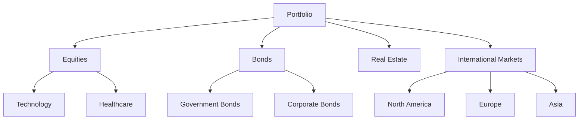

## 15.3 Benefits and Challenges of Combining Securities

In the realm of investment, the adage "don't put all your eggs in one basket" encapsulates the essence of diversification. Combining various securities within a portfolio is a strategic approach to managing risk and optimizing returns. This section delves into the benefits and challenges of diversification, offering insights into effective strategies for portfolio management.

### Benefits of Diversification in a Portfolio

#### Risk Reduction

Diversification is a cornerstone of risk management. By spreading investments across a range of securities, investors can mitigate the impact of any single security's poor performance. For instance, if an investor holds stocks in both the technology and healthcare sectors, a downturn in technology may be offset by gains in healthcare, thereby reducing overall portfolio risk.

#### Enhanced Returns

A well-diversified portfolio can capitalize on multiple investment opportunities, potentially leading to more stable and higher returns. By investing in a mix of asset classes, such as equities, bonds, and real estate, investors can benefit from the unique growth potential of each class. For example, during periods of economic expansion, equities may outperform, while bonds provide stability during downturns.

#### Volatility Management

Combining securities with varying levels of volatility can smooth out portfolio fluctuations. By including both high-risk, high-reward assets and more stable investments, investors can achieve a balance that aligns with their risk tolerance. This approach helps in maintaining a steady growth trajectory, even in volatile market conditions.

### Challenges Associated with Diversification

#### Over-Diversification

While diversification is beneficial, over-diversification can dilute returns and offer negligible risk reduction. Holding an excessive number of securities may lead to a portfolio that mimics the market index, thus limiting the potential for outperforming it. Investors must strike a balance between diversification and concentration to optimize returns.

#### Increased Complexity

Managing a diversified portfolio requires sophisticated investment strategies and continuous monitoring. Investors need to stay informed about market trends, economic indicators, and individual security performance. This complexity can be daunting, especially for those without a strong financial background or access to professional advice.

#### Higher Costs

Greater diversification often results in increased transaction costs and management fees. Each trade incurs costs, and actively managing a diverse portfolio can lead to higher expenses. These costs can erode overall profitability, particularly if the portfolio's returns do not sufficiently exceed the associated fees.

### Strategies to Optimize Portfolio Diversification

#### Asset Allocation

Asset allocation involves assigning appropriate weights to different asset classes based on investment goals and risk tolerance. A balanced mix of stocks, bonds, and alternative investments can enhance portfolio performance. For example, a young investor with a high risk tolerance might allocate more to equities, while a retiree might prefer a higher bond allocation for income stability.

#### Sector Diversification

Investing across various industry sectors helps avoid concentration risk. By spreading investments among sectors such as technology, healthcare, finance, and consumer goods, investors can protect their portfolios from sector-specific downturns. For instance, if the energy sector faces challenges due to fluctuating oil prices, gains in the technology sector can offset potential losses.

#### Geographical Diversification

Investing in international markets allows investors to capitalize on global growth opportunities and reduce regional exposure. By holding securities from different countries, investors can benefit from economic cycles that may differ from their home market. For example, Canadian investors might include U.S. or emerging market equities to diversify beyond domestic opportunities.

### Glossary

- **Asset Allocation:** The process of deciding how to distribute an investment portfolio among different asset categories, such as stocks, bonds, and cash.
- **Sector Diversification:** Investing in multiple industry sectors to minimize the impact of sector-specific risks.
- **Geographical Diversification:** Spreading investments across different regions or countries to enhance portfolio resilience against localized economic downturns.

### Practical Example: Canadian Pension Funds

Canadian pension funds, such as the Canada Pension Plan Investment Board (CPPIB), exemplify effective diversification strategies. These funds allocate assets across a broad spectrum, including domestic and international equities, fixed income, real estate, and infrastructure. By doing so, they manage risk while pursuing stable, long-term returns for beneficiaries.

### Diagram: Diversification Strategy

Below is a diagram illustrating a diversified portfolio strategy:

```mermaid
graph TD;
    A[Portfolio] --> B[Equities]
    A --> C[Bonds]
    A --> D[Real Estate]
    A --> E[International Markets]
    B --> F[Technology]
    B --> G[Healthcare]
    C --> H[Government Bonds]
    C --> I[Corporate Bonds]
    E --> J[North America]
    E --> K[Europe]
    E --> L[Asia]
```

### Conclusion

Diversification is a powerful tool in portfolio management, offering significant benefits in terms of risk reduction, enhanced returns, and volatility management. However, it also presents challenges such as over-diversification, complexity, and higher costs. By employing strategic asset allocation, sector diversification, and geographical diversification, investors can optimize their portfolios to achieve their financial goals.

Investors are encouraged to apply these principles in their own portfolios, considering their unique risk tolerance and investment objectives. Continuous learning and adaptation to market changes are essential for successful portfolio management.

## Quiz Time!



### Which of the following is a primary benefit of diversification in a portfolio?

- [x] Risk Reduction
- [ ] Increased Complexity
- [ ] Higher Costs
- [ ] Over-Diversification

> **Explanation:** Diversification reduces exposure to any single security's performance, thereby mitigating potential losses.

### What is a potential challenge of over-diversification?

- [x] Diluted Returns
- [ ] Enhanced Returns
- [ ] Risk Reduction
- [ ] Volatility Management

> **Explanation:** Over-diversification can lead to negligible risk reduction and diluted returns.

### How can geographical diversification benefit a portfolio?

- [x] By reducing regional exposure
- [ ] By increasing transaction costs
- [ ] By concentrating risk
- [ ] By simplifying management

> **Explanation:** Geographical diversification spreads investments across different regions, reducing regional exposure and enhancing resilience.

### What is asset allocation?

- [x] The process of distributing an investment portfolio among different asset categories
- [ ] Investing in multiple industry sectors
- [ ] Spreading investments across different regions
- [ ] Holding an excessive number of securities

> **Explanation:** Asset allocation involves deciding how to distribute an investment portfolio among different asset categories, such as stocks, bonds, and cash.

### Which strategy helps avoid concentration risk?

- [x] Sector Diversification
- [ ] Over-Diversification
- [ ] Increased Complexity
- [ ] Higher Costs

> **Explanation:** Sector diversification spreads investments across various industry sectors, helping to avoid concentration risk.

### What is a common pitfall of managing a diversified portfolio?

- [x] Increased Complexity
- [ ] Risk Reduction
- [ ] Enhanced Returns
- [ ] Volatility Management

> **Explanation:** Managing a diversified portfolio requires sophisticated strategies and continuous monitoring, leading to increased complexity.

### Which of the following is NOT a benefit of diversification?

- [ ] Risk Reduction
- [ ] Enhanced Returns
- [x] Higher Costs
- [ ] Volatility Management

> **Explanation:** Higher costs are a challenge, not a benefit, of diversification.

### What is the role of asset allocation in portfolio management?

- [x] To assign appropriate weights to different asset classes based on goals and risk tolerance
- [ ] To increase transaction costs
- [ ] To concentrate investments in one sector
- [ ] To simplify portfolio management

> **Explanation:** Asset allocation involves assigning appropriate weights to different asset classes based on investment goals and risk tolerance.

### Which type of diversification involves investing in international markets?

- [x] Geographical Diversification
- [ ] Sector Diversification
- [ ] Asset Allocation
- [ ] Over-Diversification

> **Explanation:** Geographical diversification involves investing in international markets to capitalize on global growth opportunities.

### True or False: Diversification always guarantees higher returns.

- [ ] True
- [x] False

> **Explanation:** While diversification can enhance returns by capitalizing on multiple opportunities, it does not guarantee higher returns as it also involves managing risks and costs.


