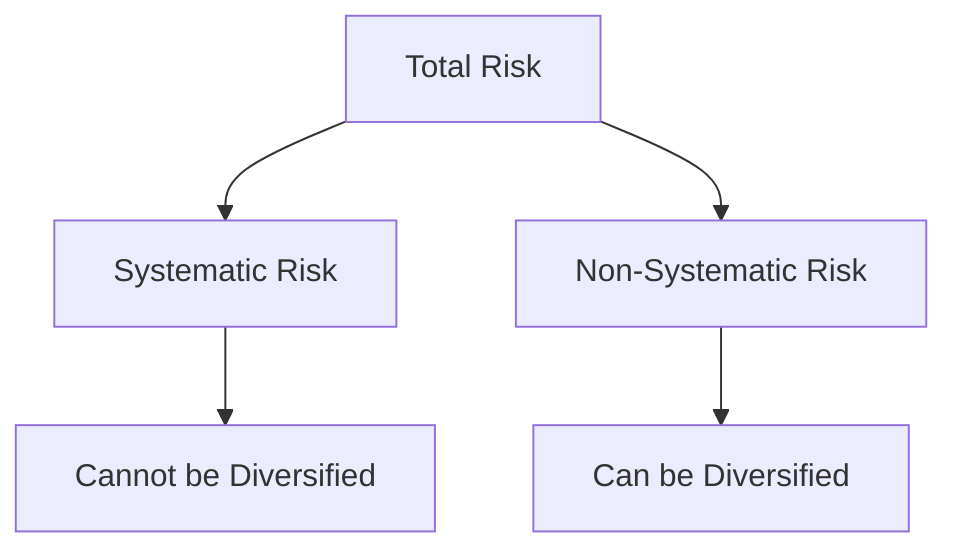

## 15.3 Systematic and Non-Systematic Risk

In the realm of investment, understanding the types of risks that can affect a portfolio is crucial for effective portfolio management. This section delves into the concepts of systematic and non-systematic risk, providing insights into their characteristics, impacts, and strategies for mitigation.

### Understanding Systematic Risk

**Systematic Risk**, also known as market risk, refers to the inherent risk that affects the entire market or a specific market segment. This type of risk is unavoidable and is influenced by factors such as economic changes, political events, or natural disasters. Since systematic risk impacts all securities in the market, it cannot be eliminated through diversification.

#### Characteristics of Systematic Risk

- **Market-Wide Impact:** Systematic risk affects all companies and industries, making it a pervasive risk factor.
- **Non-Diversifiable:** Since it is linked to macroeconomic factors, diversification cannot mitigate systematic risk.
- **Examples:** Economic recessions, changes in interest rates, inflation, and geopolitical events.

#### Impact on Portfolios

Systematic risk can lead to significant fluctuations in portfolio value. For instance, during the 2008 financial crisis, the global market experienced a downturn, affecting virtually all asset classes. Canadian investors saw declines in their portfolios regardless of the specific securities they held.

### Exploring Non-Systematic Risk

**Non-Systematic Risk**, also known as specific or idiosyncratic risk, is the risk associated with a particular company or industry. Unlike systematic risk, non-systematic risk can be mitigated through diversification.

#### Characteristics of Non-Systematic Risk

- **Asset-Specific:** Non-systematic risk is unique to a particular company or industry.
- **Diversifiable:** By holding a diversified portfolio, investors can reduce exposure to non-systematic risk.
- **Examples:** Company management decisions, product recalls, regulatory changes affecting a specific industry.

#### Impact on Portfolios

Non-systematic risk can lead to volatility in the value of individual securities. For example, if a major Canadian bank like RBC faces a scandal, its stock price might drop significantly, impacting investors who hold a concentrated position in RBC shares.

### Mitigating Non-Systematic Risk Through Diversification

Diversification is a key strategy for managing non-systematic risk. By spreading investments across various asset classes, sectors, and geographic regions, investors can reduce the impact of any single asset's poor performance on the overall portfolio.

#### Strategies for Diversification

1. **Asset Allocation:** Distribute investments across different asset classes such as equities, bonds, and real estate to balance risk and return.
2. **Sector Diversification:** Invest in a variety of sectors (e.g., technology, healthcare, finance) to avoid overexposure to any one industry.
3. **Geographic Diversification:** Include international investments to mitigate risks associated with the Canadian market alone.
4. **Use of Mutual Funds and ETFs:** These instruments inherently provide diversification by pooling funds to invest in a broad range of securities.

### Practical Examples and Case Studies

#### Example 1: The Impact of Systematic Risk

Consider a Canadian investor with a portfolio heavily weighted in equities during the COVID-19 pandemic. The global market downturn led to a significant decline in stock prices, illustrating the impact of systematic risk that could not be avoided through diversification.

#### Example 2: Mitigating Non-Systematic Risk

A Canadian pension fund diversifies its investments across various sectors and countries. When a major Canadian telecommunications company faces a regulatory issue, the fund's exposure to this specific risk is minimized due to its diversified holdings.

### Visualizing Risk with Diagrams

To better understand the relationship between systematic and non-systematic risk, consider the following diagram:

### Best Practices and Common Pitfalls

- **Best Practice:** Regularly review and rebalance your portfolio to maintain desired diversification levels.
- **Common Pitfall:** Overconcentration in a single asset or sector can expose investors to higher non-systematic risk.

### References and Further Reading

For those interested in exploring these concepts further, consider the following resources:

- **Articles:**
  - *"Understanding Systematic and Unsystematic Risk"* – [Investopedia](https://www.investopedia.com/articles/investing/082614/systematic-unsystematic-risk.asp)

- **Books:**
  - *"Risk Management and Financial Institutions"* by John C. Hull

- **Online Courses:**
  - Coursera offers courses on risk management and portfolio diversification that can provide deeper insights into these topics.

### Conclusion

Understanding the distinction between systematic and non-systematic risk is essential for effective portfolio management. By recognizing the nature of these risks and employing strategies like diversification, investors can better manage their portfolios and enhance their potential for long-term success.

### **Ready to Test Your Knowledge?**

**Practice 10 Essential CSC Exam Questions to Master Your Certification**



### What is systematic risk?

- [x] The risk inherent to the entire market or market segment
- [ ] The risk specific to a single asset or a small group of assets
- [ ] The risk that can be eliminated through diversification
- [ ] The risk associated with currency fluctuations

> **Explanation:** Systematic risk affects the entire market and cannot be diversified away.

### Which of the following is an example of non-systematic risk?

- [ ] Economic recession
- [x] A product recall by a specific company
- [ ] Changes in interest rates
- [ ] Inflation

> **Explanation:** Non-systematic risk is specific to a particular company or industry, such as a product recall.

### How can non-systematic risk be mitigated?

- [x] Through diversification
- [ ] By investing only in government bonds
- [ ] By focusing on a single industry
- [ ] By avoiding international investments

> **Explanation:** Diversification helps reduce exposure to non-systematic risk by spreading investments across various assets.

### Why can't systematic risk be diversified away?

- [x] It affects the entire market
- [ ] It is specific to a single asset
- [ ] It is related to company management
- [ ] It is a short-term risk

> **Explanation:** Systematic risk impacts all securities in the market, making it non-diversifiable.

### What is a common strategy to manage non-systematic risk?

- [x] Asset allocation
- [ ] Investing in a single stock
- [ ] Timing the market
- [ ] Avoiding bonds

> **Explanation:** Asset allocation involves spreading investments across different asset classes to manage non-systematic risk.

### Which of the following is a characteristic of systematic risk?

- [x] It is influenced by macroeconomic factors
- [ ] It is unique to a particular company
- [ ] It can be eliminated through diversification
- [ ] It is related to company-specific events

> **Explanation:** Systematic risk is influenced by factors like economic changes and affects the entire market.

### What type of risk is associated with geopolitical events?

- [x] Systematic risk
- [ ] Non-systematic risk
- [ ] Credit risk
- [ ] Liquidity risk

> **Explanation:** Geopolitical events impact the entire market, making them a source of systematic risk.

### Which investment strategy inherently provides diversification?

- [x] Investing in mutual funds
- [ ] Concentrating on a single stock
- [ ] Timing the market
- [ ] Avoiding international markets

> **Explanation:** Mutual funds pool funds to invest in a broad range of securities, providing diversification.

### What is the primary benefit of geographic diversification?

- [x] It reduces exposure to risks associated with a single market
- [ ] It increases exposure to currency risk
- [ ] It focuses investments on a single region
- [ ] It eliminates systematic risk

> **Explanation:** Geographic diversification spreads investments across different regions, reducing exposure to risks in a single market.

### True or False: Non-systematic risk can be completely eliminated through diversification.

- [x] True
- [ ] False

> **Explanation:** Diversification can effectively eliminate non-systematic risk by spreading investments across various assets.


