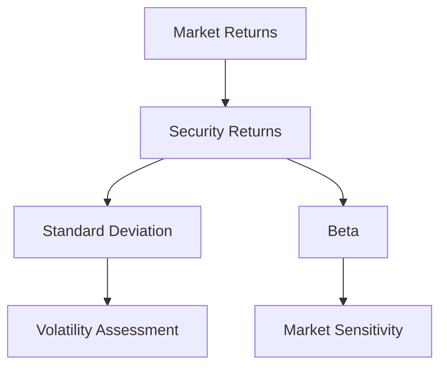

## 15.4 Measuring Risk

In the realm of portfolio management, understanding and measuring risk is crucial for making informed investment decisions. Risk measurement allows investors to assess the potential variability in returns and the likelihood of achieving their financial goals. Two fundamental metrics used to quantify risk are **standard deviation** and **beta**. These metrics provide insights into the volatility of individual securities and portfolios, helping investors to make strategic decisions aligned with their risk tolerance and investment objectives.

### Understanding Standard Deviation

**Standard Deviation** is a statistical measure that quantifies the amount of variation or dispersion in a set of values. In finance, it is used to measure the volatility of an asset's returns. A higher standard deviation indicates greater volatility, meaning the asset's returns can vary widely from the average return. Conversely, a lower standard deviation suggests that the returns are more stable and closer to the average.

#### Formula for Standard Deviation

The standard deviation (\\(\sigma\\)) of a set of returns is calculated using the following formula:


\sigma = \sqrt{\frac{\sum (R_i - \bar{R})^2}{N}}


Where:
- \\(R_i\\) = Each individual return
- \\(\bar{R}\\) = Average return of the asset
- \\(N\\) = Number of returns

#### Example Calculation

Consider a Canadian mutual fund with the following annual returns over five years: 5%, 7%, 3%, 9%, and 6%. To calculate the standard deviation:

1. Calculate the average return: \\(\bar{R} = \frac{5 + 7 + 3 + 9 + 6}{5} = 6\%\\)
2. Compute the squared deviations from the average:
   - \\((5 - 6)^2 = 1\\)
   - \\((7 - 6)^2 = 1\\)
   - \\((3 - 6)^2 = 9\\)
   - \\((9 - 6)^2 = 9\\)
   - \\((6 - 6)^2 = 0\\)
3. Sum the squared deviations: \\(1 + 1 + 9 + 9 + 0 = 20\\)
4. Divide by the number of returns: \\(\frac{20}{5} = 4\\)
5. Take the square root: \\(\sqrt{4} = 2\%\\)

Thus, the standard deviation of the mutual fund's returns is 2%, indicating moderate volatility.

### Understanding Beta

**Beta** is a measure of a security's volatility relative to the overall market. It indicates how much the security's returns move in relation to market returns. A beta of 1 means the security's price moves with the market. A beta greater than 1 indicates higher volatility than the market, while a beta less than 1 suggests lower volatility.

#### Formula for Beta

Beta (\\(\beta\\)) is calculated using the following formula:


\beta = \frac{\text{Cov}(R_i, R_m)}{\text{Var}(R_m)}


Where:
- \\(\text{Cov}(R_i, R_m)\\) = Covariance between the security's returns and the market returns
- \\(\text{Var}(R_m)\\) = Variance of the market returns

#### Example Calculation

Consider a Canadian stock with the following returns compared to the market index:

- Stock returns: 8%, 10%, 6%, 12%, 9%
- Market returns: 7%, 9%, 5%, 11%, 8%

1. Calculate the average returns for both the stock and the market.
2. Compute the covariance and variance.
3. Use the formula to find beta.

For simplicity, let's assume the covariance is 0.0025 and the variance of the market is 0.002. Then:


\beta = \frac{0.0025}{0.002} = 1.25


This beta of 1.25 indicates that the stock is 25% more volatile than the market.

### Limitations of Standard Deviation and Beta

While standard deviation and beta are valuable tools for measuring risk, they have limitations:

- **Standard Deviation** assumes that returns are normally distributed, which may not always be the case. It also does not differentiate between upside and downside volatility, treating all deviations from the mean equally.
  
- **Beta** relies on historical data and assumes that past market behavior will predict future movements. It also does not account for unsystematic risk, which can be diversified away.

### Practical Applications and Case Studies

Consider a Canadian pension fund evaluating its portfolio's risk. By calculating the standard deviation of its asset classes, the fund can identify which investments contribute most to portfolio volatility. Similarly, by analyzing beta, the fund can assess how sensitive its portfolio is to market movements, aiding in strategic asset allocation.

### Visualizing Risk Metrics

Below is a diagram illustrating the relationship between standard deviation, beta, and market returns:

### Best Practices and Common Pitfalls

- **Best Practices:** Regularly update risk metrics to reflect current market conditions. Use a combination of standard deviation and beta to gain a comprehensive view of risk.
  
- **Common Pitfalls:** Relying solely on historical data can be misleading. Consider qualitative factors and market trends that may impact future performance.

### Further Exploration

For those interested in deepening their understanding of risk measurement, consider the following resources:

- **Books:**
  - *"The Black Swan"* by Nassim Nicholas Taleb explores the impact of rare and unpredictable events on markets.

- **Online Courses:**
  - **Coursera:** [Financial Engineering and Risk Management](https://www.coursera.org/learn/financial-engineering-risk-management) offers insights into advanced risk management techniques.

- **Canadian Financial Institutions:** Explore resources from the Canadian Investment Regulatory Organization (CIRO) and the Investment Industry Regulatory Organization of Canada (IIROC) for regulatory guidance.

### Conclusion

Measuring risk is a fundamental aspect of portfolio management. By understanding and applying metrics like standard deviation and beta, investors can better navigate the complexities of the financial markets. These tools, when used alongside qualitative analysis and market insights, empower investors to make informed decisions that align with their risk tolerance and investment goals.

### **Ready to Test Your Knowledge?**

**Practice 10 Essential CSC Exam Questions to Master Your Certification**



### What does standard deviation measure in finance?

- [x] The volatility of an asset's returns
- [ ] The average return of an asset
- [ ] The correlation between two assets
- [ ] The risk-free rate of return

> **Explanation:** Standard deviation measures the amount of variation or dispersion in a set of values, indicating the volatility of an asset's returns.

### What does a beta greater than 1 indicate?

- [x] The security is more volatile than the market
- [ ] The security is less volatile than the market
- [ ] The security moves inversely to the market
- [ ] The security has no correlation with the market

> **Explanation:** A beta greater than 1 indicates that the security's returns are more volatile than the market's returns.

### Which of the following is a limitation of using standard deviation to measure risk?

- [x] It assumes returns are normally distributed
- [ ] It accounts for unsystematic risk
- [ ] It measures only downside volatility
- [ ] It predicts future returns accurately

> **Explanation:** Standard deviation assumes that returns are normally distributed, which may not always be the case, and does not differentiate between upside and downside volatility.

### How is beta calculated?

- [x] By dividing the covariance of the security's returns and market returns by the variance of the market returns
- [ ] By dividing the variance of the security's returns by the covariance of the market returns
- [ ] By multiplying the standard deviation of the security's returns by the market returns
- [ ] By subtracting the risk-free rate from the security's returns

> **Explanation:** Beta is calculated by dividing the covariance of the security's returns and market returns by the variance of the market returns.

### What does a standard deviation of 0% indicate?

- [x] The asset's returns are stable and do not vary
- [ ] The asset's returns are highly volatile
- [ ] The asset's returns are negative
- [ ] The asset's returns are unpredictable

> **Explanation:** A standard deviation of 0% indicates that the asset's returns are stable and do not vary from the average return.

### Which metric measures a security's sensitivity to market movements?

- [x] Beta
- [ ] Standard Deviation
- [ ] Alpha
- [ ] Sharpe Ratio

> **Explanation:** Beta measures a security's sensitivity to market movements, indicating its volatility relative to the market.

### What is the primary use of standard deviation in finance?

- [x] To assess the volatility of an asset's returns
- [ ] To calculate the average return of a portfolio
- [ ] To determine the risk-free rate
- [ ] To measure the correlation between two assets

> **Explanation:** The primary use of standard deviation in finance is to assess the volatility of an asset's returns.

### Which of the following is true about beta?

- [x] It does not account for unsystematic risk
- [ ] It measures the total risk of a security
- [ ] It predicts the future returns of a security
- [ ] It is always greater than 1

> **Explanation:** Beta does not account for unsystematic risk, which can be diversified away, and only measures systematic risk relative to the market.

### What does a beta of 0.5 indicate?

- [x] The security is less volatile than the market
- [ ] The security is more volatile than the market
- [ ] The security moves inversely to the market
- [ ] The security has no correlation with the market

> **Explanation:** A beta of 0.5 indicates that the security is less volatile than the market, moving only half as much as the market.

### True or False: Standard deviation treats all deviations from the mean equally.

- [x] True
- [ ] False

> **Explanation:** True. Standard deviation treats all deviations from the mean equally, regardless of whether they are positive or negative.


