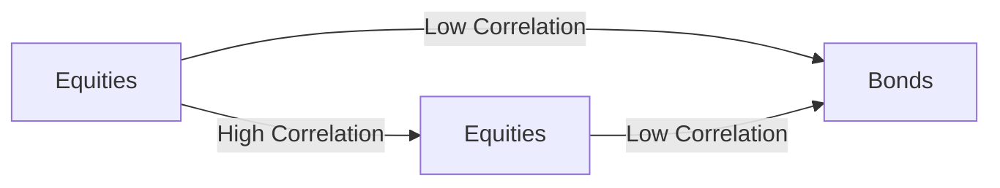

---

linkTitle: "15.5 Relationship Between Risk and Return in a Portfolio"
title: "Understanding the Relationship Between Risk and Return in a Portfolio"
description: "Explore how combining different securities affects portfolio risk and return, the concept of weighted average return, and the role of diversification in optimizing a portfolio's risk-return profile."
categories:
- Finance
- Investment
- Portfolio Management
tags:
- Risk and Return
- Diversification
- Portfolio Theory
- Canadian Securities
- Investment Strategies
date: 2024-10-25
type: docs
nav_weight: 360000
canonical: "https://securitiesexamsmastery.ca/14/3/6"
license: "© 2023 Tokenizer Inc. CC BY-NC-SA 4.0"
---

## 15.5 Relationship Between Risk and Return in a Portfolio

In the world of finance, understanding the relationship between risk and return is crucial for effective portfolio management. This section delves into how the combination of different securities impacts the overall risk and return of a portfolio, the concept of weighted average return, and how diversification can optimize a portfolio's risk-return profile. We will also explore practical examples and case studies, particularly within the Canadian financial context, to illustrate these concepts.

### The Impact of Combining Securities on Portfolio Risk and Return

When constructing a portfolio, the primary goal is to achieve an optimal balance between risk and return. The risk-return trade-off is a fundamental principle in finance, where higher potential returns are typically associated with higher risk. However, by combining different securities, investors can influence this balance.

#### Weighted Average Return

The weighted average return of a portfolio is a key concept in understanding how individual asset returns contribute to the overall portfolio performance. It is calculated by multiplying the return of each asset by its weight in the portfolio and summing the results. Mathematically, it can be expressed as:

 \text{Weighted Average Return} = \sum (w_i \times r_i) 

Where:
- \\( w_i \\) is the weight of asset \\( i \\) in the portfolio.
- \\( r_i \\) is the return of asset \\( i \\).

This calculation helps investors understand the expected return of their portfolio based on the composition of assets.

#### Example: Calculating Weighted Average Return

Consider a simple portfolio consisting of two assets: Asset A with a return of 8% and Asset B with a return of 12%. If Asset A constitutes 60% of the portfolio and Asset B 40%, the weighted average return is:

 \text{Weighted Average Return} = (0.6 \times 8\%) + (0.4 \times 12\%) = 4.8\% + 4.8\% = 9.6\% 

This example demonstrates how the weighted average return provides a clear picture of the portfolio's expected performance.

### Diversification: Optimizing the Risk-Return Profile

Diversification is a powerful strategy to optimize the risk-return profile of a portfolio. By investing in a variety of assets, investors can reduce unsystematic risk, which is the risk specific to individual securities.

#### The Role of Correlation

Correlation measures how two securities move in relation to each other. It ranges from -1 to +1, where -1 indicates perfect negative correlation, 0 indicates no correlation, and +1 indicates perfect positive correlation. Diversification benefits are maximized when assets have low or negative correlations.

#### Example: Impact of Adding Securities with Varying Correlations

Consider a portfolio initially composed of Canadian equities with a high correlation. By adding government bonds, which typically have a low or negative correlation with equities, the overall portfolio risk can be reduced without significantly sacrificing returns.

In this diagram, the addition of bonds (C) to a portfolio of equities (A and B) demonstrates the diversification effect, reducing overall portfolio risk.

### Practical Applications and Case Studies

#### Canadian Pension Funds

Canadian pension funds, such as the Canada Pension Plan Investment Board (CPPIB), employ diversification strategies to manage risk while aiming for stable returns. By investing across various asset classes, including equities, fixed income, and alternative investments, these funds achieve a balanced risk-return profile.

#### Major Canadian Banks

Major Canadian banks like RBC and TD also utilize diversification in their investment strategies. By offering a range of mutual funds and investment products, they help clients achieve diversified portfolios tailored to their risk tolerance and financial goals.

### Best Practices and Common Pitfalls

- **Best Practices:**
  - Regularly review and rebalance your portfolio to maintain the desired asset allocation.
  - Consider the impact of Canadian tax laws on investment returns, such as capital gains tax and dividend tax credits.

- **Common Pitfalls:**
  - Over-diversification can lead to diminished returns and increased complexity.
  - Ignoring correlation can result in a portfolio that appears diversified but is still exposed to significant risk.

### References and Additional Resources

- **Books:**
  - *"Modern Portfolio Theory and Investment Analysis"* by Edwin J. Elton, Martin J. Gruber, Stephen J. Brown, and William N. Goetzmann

- **Online Resources:**
  - **Portfolio Visualizer:** [Portfolio Expected Return](https://www.portfoliovisualizer.com/expected-return)

- **Canadian Financial Regulations:**
  - Familiarize yourself with CIRO guidelines and provincial regulations to ensure compliance in portfolio management.

### Conclusion

Understanding the relationship between risk and return in a portfolio is essential for effective investment management. By leveraging concepts such as weighted average return and diversification, investors can optimize their portfolios to achieve their financial objectives. As you continue to explore these principles, consider applying them to your own investment strategies, keeping in mind the unique aspects of the Canadian financial landscape.

### **Ready to Test Your Knowledge?**

**Practice 10 Essential CSC Exam Questions to Master Your Certification**



### What is the primary goal of combining different securities in a portfolio?

- [x] To achieve an optimal balance between risk and return
- [ ] To maximize the number of securities in the portfolio
- [ ] To ensure all securities have the same return
- [ ] To minimize the number of transactions

> **Explanation:** Combining different securities aims to balance risk and return, optimizing the portfolio's performance.

### How is the weighted average return of a portfolio calculated?

- [x] By multiplying the return of each asset by its weight in the portfolio and summing the results
- [ ] By averaging the returns of all assets in the portfolio
- [ ] By multiplying the returns of all assets together
- [ ] By dividing the total return by the number of assets

> **Explanation:** The weighted average return considers both the return and the proportion of each asset in the portfolio.

### What is the range of correlation values?

- [x] -1 to +1
- [ ] 0 to 1
- [ ] -2 to +2
- [ ] -0.5 to +0.5

> **Explanation:** Correlation values range from -1 (perfect negative correlation) to +1 (perfect positive correlation).

### What is the benefit of adding securities with low or negative correlations to a portfolio?

- [x] It reduces overall portfolio risk
- [ ] It increases the number of transactions
- [ ] It guarantees higher returns
- [ ] It simplifies portfolio management

> **Explanation:** Low or negative correlations help reduce risk through diversification.

### Which Canadian institution is known for employing diversification strategies in its portfolio management?

- [x] Canada Pension Plan Investment Board (CPPIB)
- [ ] Canadian Imperial Bank of Commerce (CIBC)
- [ ] Bank of Canada
- [ ] Toronto Stock Exchange (TSX)

> **Explanation:** CPPIB uses diversification to manage risk and achieve stable returns.

### What is a common pitfall in portfolio diversification?

- [x] Over-diversification leading to diminished returns
- [ ] Under-diversification leading to increased returns
- [ ] Focusing solely on high-risk assets
- [ ] Ignoring tax implications

> **Explanation:** Over-diversification can dilute returns and complicate management.

### What should investors regularly do to maintain their desired asset allocation?

- [x] Review and rebalance their portfolio
- [ ] Add more securities
- [ ] Sell all underperforming assets
- [ ] Ignore market trends

> **Explanation:** Regular review and rebalancing help maintain the intended asset allocation.

### What is the effect of ignoring correlation in a portfolio?

- [x] It can result in a portfolio exposed to significant risk
- [ ] It guarantees higher returns
- [ ] It simplifies portfolio management
- [ ] It reduces the number of transactions

> **Explanation:** Ignoring correlation can lead to unexpected risk exposure.

### Which of the following is a key concept in understanding portfolio performance?

- [x] Weighted Average Return
- [ ] Total Asset Count
- [ ] Transaction Volume
- [ ] Market Capitalization

> **Explanation:** Weighted average return provides insight into expected portfolio performance.

### True or False: Diversification can completely eliminate all types of risk in a portfolio.

- [ ] True
- [x] False

> **Explanation:** Diversification reduces unsystematic risk but cannot eliminate systematic risk.


