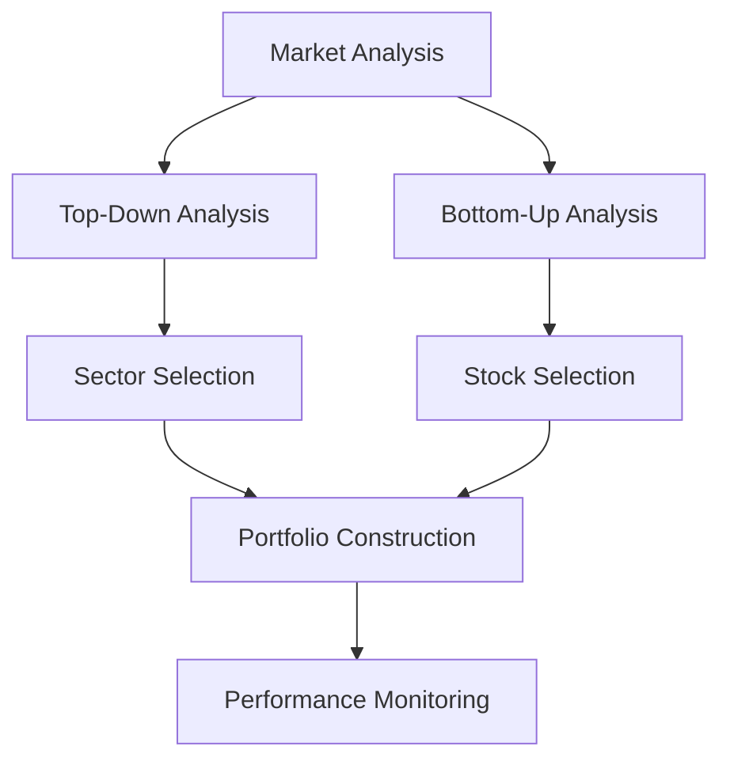

## 15.7 Active Investment Management

Active investment management is a dynamic approach to portfolio management where fund managers make specific investments with the goal of outperforming a benchmark index. Unlike passive management, which aims to replicate the performance of a market index, active management involves strategic decisions based on research, analysis, and forecasts. This section delves into the objectives, strategies, and methodologies employed by active managers, particularly within the Canadian financial context.

### Objectives of Active Investment Management

The primary objective of active investment management is to achieve returns that exceed those of a benchmark index, such as the S&P/TSX Composite Index in Canada. Active managers aim to capitalize on market inefficiencies through:

- **Stock Selection:** Identifying undervalued or overvalued securities to buy or sell.
- **Market Timing:** Making strategic decisions about when to enter or exit the market based on economic forecasts and market trends.

### Strategies for Outperforming Benchmark Indices

Active managers employ various strategies to achieve their objectives, including:

1. **Bottom-Up Analysis:** This approach focuses on analyzing individual securities based on their fundamentals, such as financial statements, management quality, and competitive position. The goal is to identify stocks that are undervalued relative to their intrinsic value.

2. **Top-Down Analysis:** This method begins with macroeconomic factors, such as interest rates, inflation, and economic growth, and narrows down to specific sectors or securities. It helps managers identify broader economic trends that could impact investment performance.

3. **Sector Rotation:** Involves shifting investments between sectors based on economic cycles. For example, during an economic expansion, managers might favor cyclical sectors like consumer discretionary, while in a downturn, they might shift to defensive sectors like utilities.

4. **Contrarian Investing:** This strategy involves going against prevailing market trends by buying assets that are currently out of favor and selling those that are popular, based on the belief that the market will eventually correct itself.

5. **Event-Driven Strategies:** Focus on exploiting opportunities arising from corporate events such as mergers, acquisitions, or restructurings.

### Practical Examples and Applications

#### Example 1: Canadian Pension Funds

Canadian pension funds, such as the Canada Pension Plan Investment Board (CPPIB), often employ active management strategies to enhance returns. By leveraging both bottom-up and top-down analyses, they can make informed decisions that align with their long-term investment goals.

#### Example 2: Major Canadian Banks

Banks like RBC and TD utilize active management within their wealth management divisions. For instance, RBC Global Asset Management employs a team of analysts to conduct in-depth research and identify investment opportunities that can outperform the market.

### Diagram: Active Management Process

Below is a simplified diagram illustrating the active management process:

### Challenges and Best Practices

#### Common Challenges

- **Market Volatility:** Active managers must navigate market fluctuations, which can impact short-term performance.
- **High Costs:** Active management often involves higher fees due to research and trading activities.
- **Behavioral Biases:** Managers must avoid biases that can lead to suboptimal decision-making.

#### Best Practices

- **Rigorous Research:** Employ comprehensive research methodologies to support investment decisions.
- **Risk Management:** Implement robust risk management frameworks to mitigate potential losses.
- **Continuous Learning:** Stay informed about market developments and emerging trends.

### Canadian Financial Regulations and Resources

Active managers in Canada must adhere to regulations set by the Canadian Investment Regulatory Organization (CIRO) and provincial securities commissions. These regulations ensure transparency, accountability, and investor protection.

#### Recommended Resources

- **Books:**
  - *"One Up On Wall Street"* by Peter Lynch: A classic guide to stock picking and investment strategies.
  
- **Online Resources:**
  - **Morningstar:** [Active Management](https://www.morningstar.com/articles/active-management): An insightful resource for understanding active management principles.

### Encouragement for Application

Active investment management requires a deep understanding of financial markets, analytical skills, and strategic foresight. By applying the principles and strategies discussed, readers can enhance their investment portfolios and achieve superior returns. Consider analyzing your current portfolio's asset allocation and explore how active management strategies could improve performance.

### **Ready to Test Your Knowledge?**

**Practice 10 Essential CSC Exam Questions to Master Your Certification**



### What is the primary objective of active investment management?

- [x] To outperform a benchmark index
- [ ] To replicate a benchmark index
- [ ] To minimize investment costs
- [ ] To avoid market volatility

> **Explanation:** Active investment management aims to achieve returns that exceed those of a benchmark index.

### Which analysis approach focuses on individual securities based on their fundamentals?

- [x] Bottom-Up Analysis
- [ ] Top-Down Analysis
- [ ] Sector Rotation
- [ ] Event-Driven Strategies

> **Explanation:** Bottom-Up Analysis involves analyzing individual securities based on their fundamentals.

### What does top-down analysis begin with?

- [x] Macroeconomic factors
- [ ] Individual securities
- [ ] Sector performance
- [ ] Corporate events

> **Explanation:** Top-Down Analysis starts with macroeconomic factors and narrows down to specific sectors or securities.

### Which strategy involves shifting investments between sectors based on economic cycles?

- [x] Sector Rotation
- [ ] Contrarian Investing
- [ ] Event-Driven Strategies
- [ ] Bottom-Up Analysis

> **Explanation:** Sector Rotation involves shifting investments between sectors based on economic cycles.

### What is a common challenge faced by active managers?

- [x] Market Volatility
- [ ] Low fees
- [ ] Lack of research
- [ ] Limited investment options

> **Explanation:** Active managers must navigate market volatility, which can impact short-term performance.

### Which Canadian institution often employs active management strategies?

- [x] Canada Pension Plan Investment Board (CPPIB)
- [ ] Canadian Securities Administrators (CSA)
- [ ] Bank of Canada
- [ ] Statistics Canada

> **Explanation:** CPPIB employs active management strategies to enhance returns.

### What is a best practice for active managers?

- [x] Rigorous Research
- [ ] Avoiding market analysis
- [ ] Ignoring risk management
- [ ] Following market trends without analysis

> **Explanation:** Rigorous research supports informed investment decisions.

### Which book is recommended for understanding stock picking and investment strategies?

- [x] "One Up On Wall Street" by Peter Lynch
- [ ] "The Intelligent Investor" by Benjamin Graham
- [ ] "A Random Walk Down Wall Street" by Burton Malkiel
- [ ] "The Little Book of Common Sense Investing" by John C. Bogle

> **Explanation:** "One Up On Wall Street" by Peter Lynch is a classic guide to stock picking and investment strategies.

### What is the role of CIRO in active management?

- [x] Ensuring transparency and investor protection
- [ ] Setting interest rates
- [ ] Providing investment advice
- [ ] Managing pension funds

> **Explanation:** CIRO ensures transparency, accountability, and investor protection in active management.

### True or False: Active management involves higher fees due to research and trading activities.

- [x] True
- [ ] False

> **Explanation:** Active management often involves higher fees due to the costs associated with research and trading activities.


