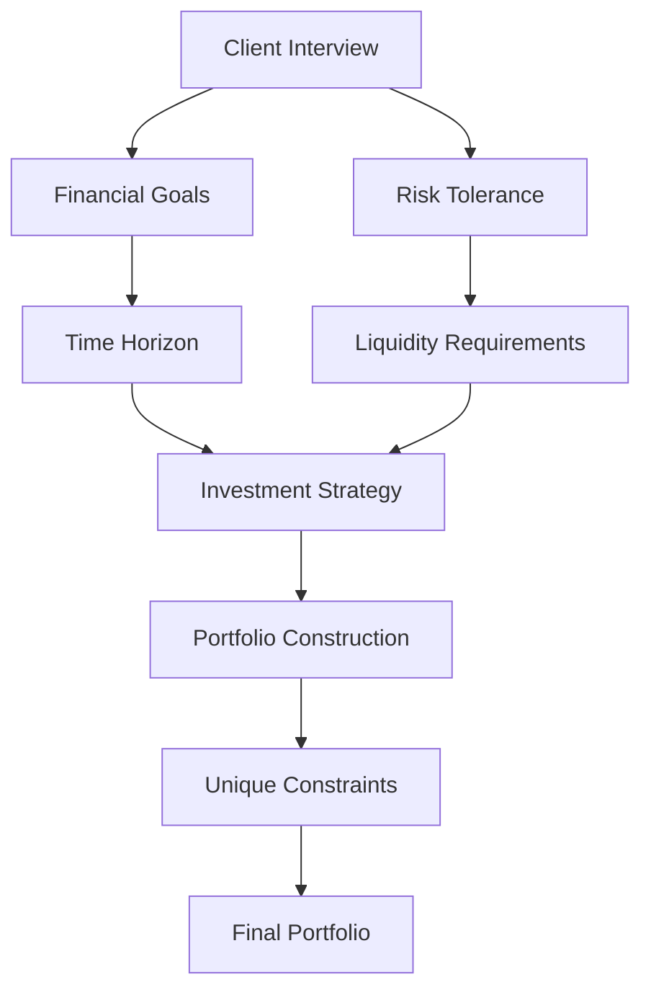

---

linkTitle: "16.1.1 Step 1: Determine Investment Objectives and Constraints"
title: "Investment Objectives and Constraints: Step 1 in Portfolio Management"
description: "Explore the first step in the portfolio management process by determining investment objectives and constraints, including financial goals, risk tolerance, time horizon, and liquidity requirements."
categories:
- Finance
- Investment
- Portfolio Management
tags:
- Investment Objectives
- Risk Tolerance
- Time Horizon
- Liquidity
- Portfolio Management
date: 2024-10-25
type: docs
nav_weight: 4110

---

## 16.1.1 Step 1: Determine Investment Objectives and Constraints

In the realm of portfolio management, the initial and arguably most critical step is determining the investment objectives and constraints. This foundational phase sets the stage for all subsequent investment decisions and strategies. By thoroughly understanding a client's financial goals, risk tolerance, time horizon, and liquidity needs, financial advisors can tailor investment portfolios that align with the client's unique circumstances and aspirations.

### Understanding Client Financial Goals and Risk Tolerance

The first step in determining investment objectives involves conducting comprehensive interviews and questionnaires to gain a deep understanding of the client's financial goals and risk tolerance. This process is crucial as it helps translate abstract financial aspirations into concrete objectives.

#### Conducting Interviews and Questionnaires

Engaging clients in detailed discussions about their financial goals is essential. These conversations should cover a wide range of topics, including:

- **Short-term and Long-term Goals:** Understanding whether the client is saving for a specific short-term goal, such as a home purchase, or a long-term goal, like retirement, is crucial.
- **Risk Tolerance Assessment:** Evaluating how much risk the client is comfortable taking is vital. This involves understanding their past investment experiences, reactions to market volatility, and overall financial stability.

#### Translating Goals into Financial Objectives

Once the client's goals are clear, the next step is to translate these into specific financial objectives. This involves setting:

- **Desired Rate of Return:** Establishing a target return that aligns with the client's goals and risk tolerance.
- **Acceptable Risk Levels:** Defining the level of risk the client is willing to accept to achieve their desired returns.

### Evaluating Time Horizon and Liquidity Requirements

Two critical factors that influence investment decisions are the time horizon and liquidity requirements. These elements help shape the investment strategy and asset allocation.

#### Time Horizon

The time horizon refers to the length of time an investor expects to hold an investment before needing the funds. It plays a significant role in determining the appropriate investment strategy. For example:

- **Short-term Horizon:** Investors with a short-term horizon may prioritize capital preservation and liquidity, opting for low-risk, easily accessible investments.
- **Long-term Horizon:** Those with a long-term horizon can afford to take on more risk, potentially investing in equities or other growth-oriented assets.

#### Liquidity Requirements

Liquidity requirements pertain to the need for access to cash or liquid assets to meet short-term financial obligations. Understanding these needs ensures that the portfolio can accommodate unexpected expenses or planned withdrawals without incurring significant losses.

### Considering Unique Circumstances and Constraints

Every client has unique circumstances that may impose additional constraints on their investment strategy. These can include:

- **Legal Restrictions:** Certain clients may face legal constraints, such as trust fund stipulations or regulatory requirements, that limit investment options.
- **Ethical Preferences:** Some investors may have ethical or social preferences that guide their investment choices, such as avoiding certain industries or supporting sustainable initiatives.

### Practical Example: Crafting a Portfolio for a Canadian Client

Consider a Canadian client, Jane, who is 45 years old and planning for retirement in 20 years. She has a moderate risk tolerance and desires a balanced portfolio that provides growth while preserving capital. Jane's liquidity requirement is minimal, as she has a stable income and no immediate need for large cash withdrawals.

#### Step-by-Step Portfolio Construction

1. **Assess Financial Goals:** Through interviews, Jane expresses her goal of retiring comfortably with a steady income stream.
2. **Determine Risk Tolerance:** Jane's moderate risk tolerance suggests a balanced approach, combining equities and fixed-income securities.
3. **Evaluate Time Horizon:** With a 20-year horizon, Jane can afford to invest in growth-oriented assets, such as Canadian equities and international funds.
4. **Consider Liquidity Needs:** Given her stable income, Jane's portfolio can include less liquid assets, such as real estate investment trusts (REITs), to enhance returns.
5. **Address Unique Constraints:** Jane prefers socially responsible investments, so her portfolio includes ESG (Environmental, Social, and Governance) funds.

### Diagram: Investment Objectives and Constraints Framework

Below is a visual representation of the investment objectives and constraints framework:

### Best Practices and Common Pitfalls

#### Best Practices

- **Regularly Review Objectives:** Financial goals and circumstances can change over time. Regular reviews ensure the portfolio remains aligned with the client's needs.
- **Diversify Investments:** Diversification helps manage risk and improve potential returns, especially in volatile markets.

#### Common Pitfalls

- **Ignoring Risk Tolerance:** Failing to accurately assess risk tolerance can lead to portfolios that are either too aggressive or too conservative.
- **Overlooking Liquidity Needs:** Not accounting for liquidity requirements can result in forced asset sales at inopportune times.

### Conclusion

Determining investment objectives and constraints is a critical step in the portfolio management process. By understanding a client's financial goals, risk tolerance, time horizon, and liquidity needs, financial advisors can craft tailored investment strategies that align with the client's unique circumstances. This foundational step ensures that the portfolio is well-positioned to achieve the client's financial aspirations while managing risk effectively.

## Quiz Time!



### What is the first step in the portfolio management process?

- [x] Determine investment objectives and constraints
- [ ] Select investment securities
- [ ] Monitor portfolio performance
- [ ] Rebalance the portfolio

> **Explanation:** The first step in the portfolio management process is determining investment objectives and constraints, which sets the foundation for all subsequent investment decisions.

### Which of the following is NOT a factor in determining investment objectives?

- [ ] Financial goals
- [ ] Risk tolerance
- [ ] Time horizon
- [x] Investment performance

> **Explanation:** Investment performance is an outcome, not a factor in determining investment objectives. Financial goals, risk tolerance, and time horizon are key factors.

### What does the term "time horizon" refer to?

- [x] The length of time an investor expects to hold an investment before needing the funds
- [ ] The expected rate of return on an investment
- [ ] The amount of risk an investor is willing to take
- [ ] The liquidity of an investment

> **Explanation:** Time horizon refers to the length of time an investor expects to hold an investment before needing the funds, influencing investment strategy.

### Why is it important to assess a client's risk tolerance?

- [x] To ensure the investment strategy aligns with the client's comfort with risk
- [ ] To determine the client's net worth
- [ ] To calculate the client's tax obligations
- [ ] To predict future market trends

> **Explanation:** Assessing risk tolerance is crucial to ensure the investment strategy aligns with the client's comfort with risk and financial stability.

### Which of the following best describes liquidity requirements?

- [x] The need for access to cash or liquid assets to meet short-term financial obligations
- [ ] The potential for high returns on investment
- [ ] The ability to invest in international markets
- [ ] The desire for ethical investments

> **Explanation:** Liquidity requirements refer to the need for access to cash or liquid assets to meet short-term financial obligations.

### What might be considered a unique constraint in investment planning?

- [x] Ethical preferences
- [ ] Desired rate of return
- [ ] Risk tolerance
- [ ] Time horizon

> **Explanation:** Ethical preferences are a unique constraint that can influence investment choices, alongside legal restrictions or other personal considerations.

### How can a long-term time horizon affect investment strategy?

- [x] It allows for more risk-taking and growth-oriented investments
- [ ] It requires a focus on liquidity and capital preservation
- [ ] It limits investment options to fixed-income securities
- [ ] It necessitates frequent portfolio rebalancing

> **Explanation:** A long-term time horizon allows for more risk-taking and growth-oriented investments, as there is more time to recover from market fluctuations.

### What is a common pitfall in determining investment objectives?

- [x] Ignoring risk tolerance
- [ ] Overemphasizing diversification
- [ ] Focusing solely on short-term goals
- [ ] Avoiding international investments

> **Explanation:** Ignoring risk tolerance is a common pitfall that can lead to portfolios that are either too aggressive or too conservative for the client.

### Why is it important to regularly review investment objectives?

- [x] Financial goals and circumstances can change over time
- [ ] To ensure the portfolio is outperforming the market
- [ ] To minimize tax liabilities
- [ ] To increase portfolio liquidity

> **Explanation:** Regularly reviewing investment objectives is important because financial goals and circumstances can change over time, requiring adjustments to the investment strategy.

### True or False: Liquidity requirements are irrelevant for long-term investors.

- [ ] True
- [x] False

> **Explanation:** False. Even long-term investors may have liquidity requirements for unexpected expenses or planned withdrawals, making it an important consideration.


