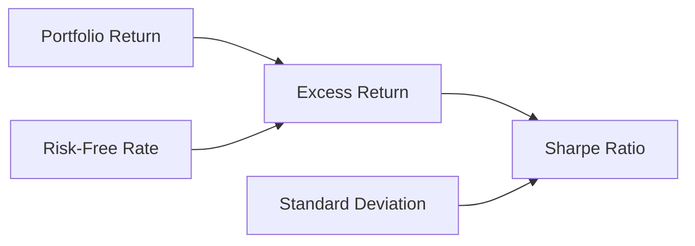

## 16.10 Evaluate Portfolio Performance

Evaluating portfolio performance is a critical aspect of the portfolio management process. It involves assessing how well a portfolio meets its investment objectives and how it compares to relevant benchmarks. This section will guide you through the methods for calculating total return and risk-adjusted return, comparing portfolio performance against benchmarks, and using the Sharpe ratio to assess risk-adjusted performance. We will also discuss the importance of long-term performance evaluation and consistency.

### Methods for Calculating Total Return

Total return is a comprehensive measure of a portfolio's performance, encompassing both income (such as dividends and interest) and capital gains (or losses). It is expressed as a percentage of the initial investment.

**Formula for Total Return:**


\text{Total Return} = \left( \frac{\text{Ending Value} - \text{Beginning Value} + \text{Income}}{\text{Beginning Value}} \right) \times 100


**Example:**

Consider a Canadian investor who starts with a portfolio valued at CAD 100,000. Over the year, the portfolio generates CAD 5,000 in dividends and appreciates to CAD 110,000. The total return would be:


\text{Total Return} = \left( \frac{110,000 - 100,000 + 5,000}{100,000} \right) \times 100 = 15\%


### Risk-Adjusted Return

Risk-adjusted return measures how much return an investment generates relative to the risk taken. It is crucial for comparing investments with different risk profiles.

**Standard Deviation:**

Standard deviation is a statistical measure that quantifies the dispersion of returns around the mean. A higher standard deviation indicates greater volatility and risk.

**Sharpe Ratio:**

The Sharpe ratio is a popular metric for assessing risk-adjusted performance. It calculates the excess return per unit of risk.

**Formula for Sharpe Ratio:**


\text{Sharpe Ratio} = \frac{\text{Portfolio Return} - \text{Risk-Free Rate}}{\text{Standard Deviation of Portfolio Returns}}


**Example:**

Assume a portfolio has an annual return of 8%, a risk-free rate of 2%, and a standard deviation of 10%. The Sharpe ratio would be:


\text{Sharpe Ratio} = \frac{8\% - 2\%}{10\%} = 0.6


A higher Sharpe ratio indicates better risk-adjusted performance.

### Comparison Against Benchmarks

Comparing a portfolio's performance against benchmarks is essential to determine its relative success. Benchmarks are typically market indices that represent a specific segment of the market, such as the S&P/TSX Composite Index for Canadian equities.

**Steps for Benchmark Comparison:**

1. **Select an Appropriate Benchmark:** Choose a benchmark that closely aligns with the portfolio's asset allocation and investment strategy.
2. **Calculate Benchmark Return:** Determine the benchmark's return over the same period as the portfolio.
3. **Compare Returns:** Analyze the portfolio's return relative to the benchmark. A portfolio outperforming its benchmark is generally considered successful.

**Example:**

If a Canadian equity portfolio returns 12% while the S&P/TSX Composite Index returns 10%, the portfolio has outperformed its benchmark by 2%.

### Importance of Long-Term Performance Evaluation

Evaluating portfolio performance over the long term is crucial for several reasons:

- **Consistency:** Long-term evaluation helps identify consistent performance patterns, distinguishing between temporary fluctuations and sustained success.
- **Strategic Adjustments:** It provides insights into the effectiveness of investment strategies, guiding necessary adjustments.
- **Risk Management:** Long-term analysis aids in understanding risk exposure and aligning it with investment goals.

### Practical Example: Canadian Pension Fund

Consider a Canadian pension fund with a diversified portfolio including equities, fixed income, and alternative investments. The fund's performance is evaluated annually against a composite benchmark reflecting its asset allocation. Over a decade, the fund consistently outperforms the benchmark, demonstrating effective risk management and strategic asset allocation.

### Diagrams and Visual Aids

Below is a diagram illustrating the relationship between portfolio return, risk-free rate, and standard deviation in the context of the Sharpe ratio:

### Best Practices and Common Pitfalls

**Best Practices:**

- Regularly review and adjust benchmarks to ensure they remain relevant.
- Use multiple metrics (e.g., total return, Sharpe ratio) for a comprehensive evaluation.
- Focus on long-term performance to avoid overreacting to short-term volatility.

**Common Pitfalls:**

- Comparing portfolios to inappropriate benchmarks can lead to misleading conclusions.
- Ignoring risk-adjusted metrics may result in underestimating the risk taken to achieve returns.
- Overemphasizing short-term performance can lead to poor investment decisions.

### Conclusion

Evaluating portfolio performance is a multifaceted process that requires a thorough understanding of both returns and risks. By employing methods such as total return calculation, risk-adjusted metrics like the Sharpe ratio, and benchmark comparisons, investors can gain valuable insights into their portfolio's effectiveness. Emphasizing long-term performance evaluation ensures that investment strategies remain aligned with financial goals, fostering sustainable success.

### **Ready to Test Your Knowledge?**

**Practice 10 Essential CSC Exam Questions to Master Your Certification**



### What is the formula for calculating total return?

- [x] \\(\left( \frac{\text{Ending Value} - \text{Beginning Value} + \text{Income}}{\text{Beginning Value}} \right) \times 100\\)
- [ ] \\(\left( \frac{\text{Ending Value} - \text{Beginning Value}}{\text{Beginning Value}} \right) \times 100\\)
- [ ] \\(\left( \frac{\text{Ending Value} + \text{Income}}{\text{Beginning Value}} \right) \times 100\\)
- [ ] \\(\left( \frac{\text{Ending Value} - \text{Income}}{\text{Beginning Value}} \right) \times 100\\)

> **Explanation:** Total return includes both income and capital gains, calculated as \\(\left( \frac{\text{Ending Value} - \text{Beginning Value} + \text{Income}}{\text{Beginning Value}} \right) \times 100\\).

### What does the Sharpe ratio measure?

- [x] Risk-adjusted return
- [ ] Total return
- [ ] Benchmark performance
- [ ] Portfolio diversification

> **Explanation:** The Sharpe ratio measures the risk-adjusted return by calculating the excess return per unit of risk.

### Why is long-term performance evaluation important?

- [x] It helps identify consistent performance patterns.
- [ ] It focuses solely on short-term gains.
- [ ] It ignores risk management.
- [ ] It is only relevant for equity portfolios.

> **Explanation:** Long-term evaluation helps identify consistent performance patterns and provides insights into risk management and strategic adjustments.

### What is a common pitfall in portfolio evaluation?

- [x] Comparing portfolios to inappropriate benchmarks
- [ ] Using multiple metrics for evaluation
- [ ] Focusing on long-term performance
- [ ] Regularly reviewing benchmarks

> **Explanation:** Comparing portfolios to inappropriate benchmarks can lead to misleading conclusions about performance.

### Which of the following is a risk-adjusted metric?

- [x] Sharpe ratio
- [ ] Total return
- [x] Standard deviation
- [ ] Benchmark return

> **Explanation:** The Sharpe ratio and standard deviation are risk-adjusted metrics, while total return and benchmark return are not.

### What does standard deviation measure in a portfolio?

- [x] The dispersion of returns
- [ ] The average return
- [ ] The risk-free rate
- [ ] The benchmark performance

> **Explanation:** Standard deviation measures the dispersion of returns, indicating the portfolio's volatility and risk.

### How can a portfolio outperform its benchmark?

- [x] By achieving a higher return than the benchmark
- [ ] By having a lower standard deviation
- [x] By maintaining a consistent risk-adjusted return
- [ ] By focusing on short-term gains

> **Explanation:** A portfolio outperforms its benchmark by achieving a higher return and maintaining a consistent risk-adjusted return.

### What is included in the total return of a portfolio?

- [x] Income and capital gains
- [ ] Only capital gains
- [ ] Only income
- [ ] Risk-free rate

> **Explanation:** Total return includes both income (such as dividends) and capital gains (or losses).

### What is a key benefit of using the Sharpe ratio?

- [x] It provides a measure of return per unit of risk.
- [ ] It calculates total return.
- [ ] It compares portfolios to benchmarks.
- [ ] It measures only short-term performance.

> **Explanation:** The Sharpe ratio provides a measure of return per unit of risk, helping assess risk-adjusted performance.

### True or False: Long-term performance evaluation is only important for equity portfolios.

- [ ] True
- [x] False

> **Explanation:** Long-term performance evaluation is important for all types of portfolios, not just equity portfolios, as it helps assess consistency and strategic alignment with investment goals.


