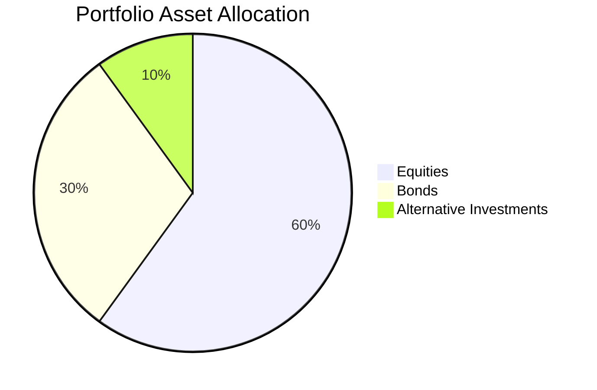

## 16.13 Monitor Portfolio Changes and Adjustments

In the dynamic world of finance, monitoring portfolio changes and adjustments is crucial for maintaining a well-balanced investment strategy. This section delves into the intricacies of tracking changes in asset values, identifying deviations from strategic asset allocation, and employing strategies to address portfolio drift. We will explore tools and techniques for effective portfolio monitoring, all within the context of Canadian financial regulations and instruments.

### Tracking Changes in Asset Values and Their Impact on the Portfolio’s Asset Mix

The value of assets within a portfolio can fluctuate due to market conditions, economic changes, and company-specific events. These fluctuations can significantly impact the portfolio's asset mix, which is the distribution of assets across various categories such as equities, fixed income, and alternative investments.

#### Understanding Asset Value Changes

Asset values change due to several factors, including:

- **Market Volatility:** Economic indicators, geopolitical events, and investor sentiment can cause market fluctuations.
- **Company Performance:** Earnings reports, management changes, and strategic decisions affect stock prices.
- **Interest Rates:** Changes in interest rates impact bond prices and yields.
- **Currency Fluctuations:** For portfolios with international exposure, currency exchange rates can influence asset values.

#### Impact on Asset Mix

As asset values change, the portfolio's asset mix may drift from its intended allocation. For example, if equities outperform bonds, the equity portion of the portfolio may increase, leading to a higher risk profile than initially intended.

### Identifying Deviations from the Strategic Asset Allocation

Strategic asset allocation is the long-term plan for distributing assets in a portfolio to achieve specific investment goals. Deviations from this allocation, known as portfolio drift, can occur when asset values change.

#### Recognizing Portfolio Drift

Portfolio drift occurs when the actual asset allocation deviates from the strategic allocation due to differential asset performance. This drift can lead to unintended risk exposure and may require rebalancing.

**Example:** Consider a portfolio with a strategic allocation of 60% equities and 40% bonds. If equities perform well and increase to 70% of the portfolio, the risk level may exceed the investor's tolerance.

### Strategies for Addressing Portfolio Drift Without Incurring Excessive Transaction Costs

Rebalancing is the process of realigning the portfolio to its strategic asset allocation. However, frequent rebalancing can incur transaction costs and tax implications. Here are strategies to address portfolio drift efficiently:

#### Threshold-Based Rebalancing

Set tolerance bands around the strategic allocation. Rebalance only when the allocation exceeds these bands, minimizing transaction costs.

#### Time-Based Rebalancing

Rebalance at regular intervals, such as quarterly or annually, regardless of drift. This approach simplifies the process and reduces the need for constant monitoring.

#### Cash Flow Rebalancing

Use new contributions or withdrawals to adjust the portfolio towards the strategic allocation, reducing the need for selling assets.

### Tools and Techniques for Effective Portfolio Monitoring

Effective portfolio monitoring involves using tools and techniques to track asset values and identify deviations from the strategic allocation.

#### Portfolio Management Software

Utilize software solutions that provide real-time data on asset values, performance metrics, and allocation analysis. Examples include Morningstar Direct and Bloomberg Terminal.

#### Performance Reports

Regularly review performance reports that detail asset returns, risk metrics, and allocation changes. These reports help identify trends and potential drift.

#### Visual Tools

Use charts and graphs to visualize asset allocation and performance. Visual tools can quickly highlight deviations and facilitate decision-making.

### Best Practices and Common Pitfalls

#### Best Practices

- **Regular Monitoring:** Establish a routine for reviewing portfolio performance and asset allocation.
- **Diversification:** Maintain a diversified portfolio to mitigate risk and reduce the impact of individual asset fluctuations.
- **Documentation:** Keep detailed records of rebalancing decisions and rationale for future reference.

#### Common Pitfalls

- **Overreacting to Market Movements:** Avoid frequent rebalancing based on short-term market changes.
- **Ignoring Tax Implications:** Consider the tax impact of selling assets, especially in non-registered accounts.
- **Neglecting Fees:** Be mindful of transaction fees and management costs when making adjustments.

### Conclusion

Monitoring portfolio changes and adjustments is a critical component of effective portfolio management. By understanding asset value changes, identifying portfolio drift, and employing strategic rebalancing techniques, investors can maintain their desired asset allocation and risk profile. Utilizing tools and adhering to best practices ensures that portfolios remain aligned with investment goals, even in the face of market volatility.

### Additional Resources

- **Canadian Securities Administrators (CSA):** [CSA Website](https://www.securities-administrators.ca/)
- **Investment Industry Regulatory Organization of Canada (IIROC):** [IIROC Website](https://www.iiroc.ca/)
- **Books:** "The Intelligent Investor" by Benjamin Graham, "A Random Walk Down Wall Street" by Burton Malkiel
- **Online Courses:** Coursera's "Investment Management" Specialization, edX's "Introduction to Investments"

### **Ready to Test Your Knowledge?**

**Practice 10 Essential CSC Exam Questions to Master Your Certification**



### What is portfolio drift?

- [x] The change in the portfolio’s asset allocation due to differential asset performance.
- [ ] The intentional adjustment of asset allocation to increase returns.
- [ ] The process of adding new assets to a portfolio.
- [ ] The reduction of risk by diversifying investments.

> **Explanation:** Portfolio drift occurs when the actual asset allocation deviates from the strategic allocation due to changes in asset values.

### Which factor can cause changes in asset values?

- [x] Market volatility
- [x] Company performance
- [x] Interest rates
- [ ] Asset maturity

> **Explanation:** Market volatility, company performance, and interest rates can all impact asset values, while asset maturity is more relevant to fixed income securities.

### What is a common strategy to address portfolio drift?

- [x] Threshold-based rebalancing
- [ ] Ignoring the drift
- [ ] Selling all assets
- [ ] Investing in new markets

> **Explanation:** Threshold-based rebalancing involves setting tolerance bands around the strategic allocation and rebalancing only when these bands are exceeded.

### What is the impact of ignoring portfolio drift?

- [x] Unintended risk exposure
- [ ] Increased diversification
- [ ] Guaranteed returns
- [ ] Reduced transaction costs

> **Explanation:** Ignoring portfolio drift can lead to unintended risk exposure as the asset allocation may no longer align with the investor's risk tolerance.

### Which tool can be used for effective portfolio monitoring?

- [x] Portfolio management software
- [ ] Social media platforms
- [ ] Personal blogs
- [ ] Online shopping websites

> **Explanation:** Portfolio management software provides real-time data on asset values and allocation analysis, aiding in effective monitoring.

### What is a benefit of time-based rebalancing?

- [x] Simplifies the process
- [ ] Eliminates all transaction costs
- [ ] Guarantees higher returns
- [ ] Increases market exposure

> **Explanation:** Time-based rebalancing simplifies the process by setting regular intervals for rebalancing, reducing the need for constant monitoring.

### What should be considered when rebalancing a portfolio?

- [x] Tax implications
- [x] Transaction fees
- [ ] Social media trends
- [ ] Personal preferences

> **Explanation:** Tax implications and transaction fees should be considered to minimize costs and maximize after-tax returns.

### What is a common pitfall in portfolio management?

- [x] Overreacting to market movements
- [ ] Regular monitoring
- [ ] Diversification
- [ ] Documentation

> **Explanation:** Overreacting to market movements can lead to frequent and unnecessary rebalancing, increasing costs and potential tax liabilities.

### What is the role of diversification in portfolio management?

- [x] Mitigate risk
- [ ] Increase transaction costs
- [ ] Guarantee returns
- [ ] Simplify monitoring

> **Explanation:** Diversification helps mitigate risk by spreading investments across different asset classes and sectors.

### True or False: Ignoring tax implications is a best practice in portfolio management.

- [ ] True
- [x] False

> **Explanation:** Ignoring tax implications is not a best practice; it can lead to higher costs and reduced after-tax returns.


