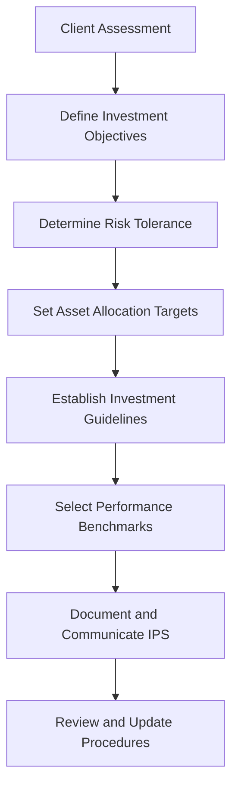

---

linkTitle: "16.2 Step 2: Design an Investment Policy Statement"
title: "Investment Policy Statement Design: A Comprehensive Guide for Canadian Investors"
description: "Learn how to design an effective Investment Policy Statement (IPS) to guide investment decisions, manage risk, and achieve financial goals in the Canadian market."
categories:
- Investment Strategy
- Portfolio Management
- Financial Planning
tags:
- Investment Policy Statement
- Asset Allocation
- Risk Management
- Canadian Finance
- Portfolio Strategy
date: 2024-10-25
type: docs
nav_weight: 420000
---

## 16.2 Step 2: Design an Investment Policy Statement

An Investment Policy Statement (IPS) is a critical tool in the portfolio management process, serving as a formal document that outlines the investment guidelines, objectives, and strategies agreed upon by the portfolio manager and the client. This section will explore the purpose and use of an IPS, its essential components, and how to effectively design one to meet the unique needs of Canadian investors.

### Purpose and Use of an Investment Policy Statement

The primary purpose of an IPS is to provide a clear and structured framework for making informed investment decisions. It acts as a roadmap for both the portfolio manager and the client, ensuring that investment strategies align with the client's financial goals, risk tolerance, and time horizon. By establishing clear guidelines, the IPS helps maintain consistency in portfolio management and facilitates regular reviews and updates.

#### Key Components of an IPS

1. **Investment Objectives:**
   - Define the client's financial goals, such as capital preservation, income generation, or growth.
   - Specify the time horizon for achieving these goals, considering factors like retirement planning or funding a child's education.

2. **Risk Tolerance:**
   - Assess the client's willingness and ability to take on risk, considering their financial situation, investment experience, and psychological comfort with market fluctuations.
   - Use risk tolerance questionnaires or interviews to gauge the client's risk profile.

3. **Asset Allocation Targets:**
   - Determine the optimal distribution of investments across various asset classes, such as equities, fixed income, and alternative investments.
   - Consider the client's risk tolerance, investment objectives, and market conditions when setting asset allocation targets.

4. **Acceptable and Prohibited Investments:**
   - Identify specific investment vehicles or strategies that are acceptable or prohibited based on the client's preferences or ethical considerations.
   - Include guidelines on the use of derivatives, leverage, or short-selling, if applicable.

5. **Performance Benchmarks:**
   - Establish appropriate benchmarks for evaluating the portfolio's performance, such as stock indices or bond indices.
   - Ensure benchmarks align with the portfolio's asset allocation and risk profile.

6. **Review and Update Procedures:**
   - Outline procedures for regular portfolio reviews, including the frequency and scope of these reviews.
   - Specify conditions that may trigger updates to the IPS, such as changes in the client's financial situation, market conditions, or investment objectives.

### Designing an Effective IPS

Creating an effective IPS involves collaboration between the portfolio manager and the client, ensuring that the document reflects the client's unique circumstances and preferences. Here are some best practices for designing an IPS:

#### Step-by-Step Guidance

1. **Conduct a Comprehensive Client Assessment:**
   - Gather detailed information about the client's financial situation, investment goals, risk tolerance, and time horizon.
   - Use tools like financial planning software or risk assessment questionnaires to facilitate this process.

2. **Define Clear Investment Objectives:**
   - Work with the client to articulate specific, measurable, achievable, relevant, and time-bound (SMART) investment objectives.
   - Prioritize objectives based on the client's needs and preferences.

3. **Determine Risk Tolerance and Asset Allocation:**
   - Use the client's risk tolerance assessment to guide asset allocation decisions.
   - Consider using a strategic asset allocation model that aligns with the client's risk profile and investment objectives.

4. **Establish Guidelines for Investment Selection:**
   - Develop criteria for selecting investments, considering factors like liquidity, diversification, and cost.
   - Include guidelines for rebalancing the portfolio to maintain target asset allocation.

5. **Set Performance Benchmarks and Review Procedures:**
   - Choose appropriate benchmarks that reflect the portfolio's asset allocation and risk profile.
   - Schedule regular portfolio reviews to assess performance and make necessary adjustments.

6. **Document and Communicate the IPS:**
   - Prepare a written IPS that clearly outlines all agreed-upon guidelines, objectives, and strategies.
   - Review the IPS with the client to ensure understanding and agreement.

### Practical Examples and Case Studies

To illustrate the application of an IPS, consider the following case study involving a Canadian investor:

#### Case Study: Designing an IPS for a Canadian Retiree

**Client Profile:**
- Age: 65
- Financial Goals: Generate steady income during retirement, preserve capital
- Risk Tolerance: Moderate
- Time Horizon: 20 years

**Investment Objectives:**
- Achieve an annual income of $40,000 from the investment portfolio.
- Maintain the portfolio's real value after inflation.

**Asset Allocation Targets:**
- Equities: 40%
- Fixed Income: 50%
- Alternative Investments: 10%

**Performance Benchmarks:**
- S&P/TSX Composite Index for equities
- FTSE Canada Universe Bond Index for fixed income

**Review and Update Procedures:**
- Conduct portfolio reviews semi-annually.
- Update the IPS if there are significant changes in the client's financial situation or market conditions.

### Visualizing the IPS Process

Below is a diagram illustrating the key components and process of designing an IPS:

### Best Practices and Common Pitfalls

**Best Practices:**
- Engage in open and ongoing communication with the client to ensure the IPS remains relevant.
- Regularly review and update the IPS to reflect changes in the client's circumstances or market conditions.
- Use a diversified approach to asset allocation to manage risk effectively.

**Common Pitfalls:**
- Failing to align the IPS with the client's true risk tolerance and investment objectives.
- Neglecting to update the IPS in response to significant changes in the client's life or market environment.
- Overlooking the importance of clear and measurable performance benchmarks.

### Conclusion

An Investment Policy Statement is a vital tool for guiding investment decisions and ensuring consistency in portfolio management. By carefully designing an IPS that reflects the client's unique needs and preferences, portfolio managers can help clients achieve their financial goals while managing risk effectively. As you continue to develop your skills in portfolio management, remember to apply the principles outlined in this chapter to create robust and effective IPS documents for your clients.

## Quiz Time!



### What is the primary purpose of an Investment Policy Statement (IPS)?

- [x] To provide a structured framework for making informed investment decisions
- [ ] To serve as a legal contract between the client and portfolio manager
- [ ] To outline tax strategies for the client's portfolio
- [ ] To determine the client's net worth

> **Explanation:** The primary purpose of an IPS is to provide a clear and structured framework for making informed investment decisions, ensuring alignment with the client's financial goals and risk tolerance.

### Which of the following is NOT a key component of an IPS?

- [ ] Investment Objectives
- [ ] Risk Tolerance
- [ ] Asset Allocation Targets
- [x] Tax Filing Status

> **Explanation:** Tax filing status is not a key component of an IPS. The IPS focuses on investment objectives, risk tolerance, asset allocation targets, and other investment-related guidelines.

### How often should a portfolio review be conducted according to best practices?

- [ ] Annually
- [x] Semi-annually
- [ ] Quarterly
- [ ] Monthly

> **Explanation:** Best practices suggest conducting portfolio reviews semi-annually to assess performance and make necessary adjustments.

### What is the role of performance benchmarks in an IPS?

- [x] To evaluate the portfolio's performance against relevant indices
- [ ] To determine the client's risk tolerance
- [ ] To outline acceptable investment vehicles
- [ ] To establish tax strategies

> **Explanation:** Performance benchmarks are used to evaluate the portfolio's performance against relevant indices, ensuring alignment with the client's investment objectives and risk profile.

### Which of the following is a common pitfall when designing an IPS?

- [x] Failing to align the IPS with the client's true risk tolerance
- [ ] Conducting regular portfolio reviews
- [ ] Establishing clear performance benchmarks
- [ ] Documenting the IPS in writing

> **Explanation:** A common pitfall is failing to align the IPS with the client's true risk tolerance, which can lead to inappropriate investment strategies and outcomes.

### What should trigger an update to the IPS?

- [x] Significant changes in the client's financial situation
- [ ] Minor fluctuations in the stock market
- [ ] Changes in the client's tax filing status
- [ ] The client's birthday

> **Explanation:** Significant changes in the client's financial situation or market conditions should trigger an update to the IPS to ensure it remains relevant and effective.

### In the context of an IPS, what does asset allocation refer to?

- [x] The distribution of investments across various asset classes
- [ ] The selection of individual stocks and bonds
- [ ] The determination of tax strategies
- [ ] The calculation of the client's net worth

> **Explanation:** Asset allocation refers to the distribution of investments across various asset classes to achieve desired risk and return profiles.

### What is the first step in designing an IPS?

- [x] Conduct a comprehensive client assessment
- [ ] Define performance benchmarks
- [ ] Establish investment guidelines
- [ ] Set asset allocation targets

> **Explanation:** The first step in designing an IPS is to conduct a comprehensive client assessment to gather detailed information about the client's financial situation, goals, and risk tolerance.

### Why is it important to document and communicate the IPS?

- [x] To ensure understanding and agreement between the client and portfolio manager
- [ ] To comply with tax regulations
- [ ] To establish legal ownership of the portfolio
- [ ] To calculate the client's net worth

> **Explanation:** Documenting and communicating the IPS ensures understanding and agreement between the client and portfolio manager, providing a clear framework for investment decisions.

### True or False: An IPS should remain unchanged once it is established.

- [ ] True
- [x] False

> **Explanation:** False. An IPS should be regularly reviewed and updated to reflect changes in the client's circumstances or market conditions, ensuring it remains relevant and effective.


