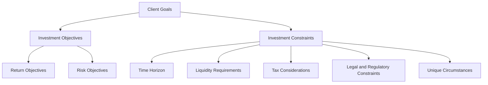

## 16.1 Determine Investment Objectives and Constraints

In the realm of portfolio management, understanding and defining investment objectives and constraints is a foundational step. This process is crucial for tailoring investment strategies that align with a client's financial goals and personal circumstances. In this section, we delve into the importance of this process, differentiate between objectives and constraints, and explore techniques for effectively eliciting and translating client goals into actionable investment strategies.

### Understanding Client Financial Goals and Personal Circumstances

The cornerstone of successful investment management lies in a deep understanding of the client's financial goals and personal circumstances. This understanding allows financial advisors to craft investment strategies that not only aim to achieve desired returns but also respect the client's risk tolerance and life situation.

#### Importance of Client Understanding

1. **Alignment with Goals:** Investment strategies must align with the client's long-term and short-term financial goals, whether they are saving for retirement, purchasing a home, or funding education.
2. **Risk Management:** Understanding a client's risk tolerance helps in constructing a portfolio that balances potential returns with acceptable levels of risk.
3. **Personalization:** Each client has unique circumstances that require personalized investment solutions, taking into account factors like age, income, family obligations, and lifestyle preferences.

### Differentiating Investment Objectives and Constraints

Investment objectives and constraints form the framework within which investment decisions are made. They guide the selection of assets and the overall strategy of the portfolio.

#### Investment Objectives

Investment objectives primarily focus on two key aspects: return and risk.

- **Return Objectives:** These are the desired financial gains from the investment, expressed as a percentage of the initial investment. They can be absolute (e.g., a 5% annual return) or relative (e.g., outperforming a benchmark index).
- **Risk Objectives:** These define the acceptable level of risk the client is willing to take to achieve their return objectives. Risk tolerance varies widely among investors and can be influenced by factors such as age, financial situation, and investment experience.

#### Investment Constraints

Constraints are the limitations or restrictions that affect investment decisions. They include:

- **Time Horizon:** The period over which the investment is expected to be held. A longer time horizon typically allows for more aggressive investment strategies, while a shorter horizon may necessitate more conservative approaches.
- **Liquidity Requirements:** The need for cash or easily convertible assets to meet unexpected expenses. High liquidity needs may limit the ability to invest in less liquid assets like real estate or private equity.
- **Tax Considerations:** Strategies to minimize the tax impact on investment returns, such as utilizing tax-advantaged accounts like RRSPs or TFSAs in Canada.
- **Legal and Regulatory Constraints:** Restrictions imposed by laws and regulations that affect investment choices, such as fiduciary responsibilities or investment limits in certain accounts.
- **Unique Circumstances:** Specific client preferences or situations, such as ethical investing, religious beliefs, or family considerations.

### Techniques for Eliciting Client Objectives

Effectively eliciting client objectives requires a combination of interviews, questionnaires, and open-ended questions. These techniques help uncover the client's true financial goals and constraints.

#### Interviews

Conducting thorough interviews allows advisors to gather detailed information about the client's financial situation, goals, and preferences. Key topics to cover include:

- Current financial status and future income expectations
- Short-term and long-term financial goals
- Risk tolerance and investment experience
- Personal values and ethical considerations

#### Questionnaires

Structured questionnaires can provide a systematic approach to understanding client objectives. They often include questions about:

- Desired investment returns and acceptable risk levels
- Time horizon for different financial goals
- Liquidity needs and emergency fund requirements
- Tax considerations and strategies

#### Open-Ended Questions

Open-ended questions encourage clients to express their thoughts and feelings about money and investing, providing deeper insights into their motivations and concerns. Examples include:

- "What are your most important financial goals?"
- "How do you feel about the possibility of losing money on your investments?"
- "Are there any specific investments or industries you wish to avoid?"

### Translating Client Goals into Measurable Investment Objectives

Once client goals are clearly understood, the next step is to translate these goals into measurable investment objectives. This involves setting specific, quantifiable targets that guide the investment strategy.

#### Setting Measurable Objectives

1. **Define Clear Targets:** Establish specific return and risk targets based on the client's goals and risk tolerance. For example, "Achieve a 6% annual return with a maximum drawdown of 10%."
2. **Align with Time Horizon:** Ensure that the investment strategy aligns with the client's time horizon, balancing growth and income needs over different periods.
3. **Incorporate Constraints:** Factor in liquidity needs, tax considerations, and any unique circumstances that may affect investment decisions.

#### Example: Canadian Pension Fund Strategy

Consider a Canadian pension fund with a long-term time horizon and moderate risk tolerance. The fund's objectives might include achieving a 7% annual return while maintaining a diversified portfolio to manage risk. Constraints such as regulatory requirements and the need for periodic liquidity to meet pension payouts would also be considered.

### Visualizing the Process

To better understand the relationship between investment objectives and constraints, consider the following diagram:

### Best Practices and Common Pitfalls

#### Best Practices

- **Comprehensive Client Profiling:** Gather detailed information about the client's financial situation, goals, and preferences.
- **Regular Reviews:** Periodically review and update investment objectives and constraints to reflect changes in the client's life or market conditions.
- **Clear Communication:** Maintain open and transparent communication with clients to ensure their understanding and agreement with the investment strategy.

#### Common Pitfalls

- **Overlooking Constraints:** Failing to consider all relevant constraints can lead to inappropriate investment decisions.
- **Inadequate Risk Assessment:** Misjudging a client's risk tolerance can result in portfolios that are either too aggressive or too conservative.
- **Neglecting Tax Implications:** Ignoring tax considerations can significantly impact investment returns.

### Conclusion

Determining investment objectives and constraints is a critical step in the portfolio management process. By thoroughly understanding client goals and personal circumstances, financial advisors can craft investment strategies that align with client needs while managing risk and adhering to constraints. This process not only enhances the likelihood of achieving financial goals but also builds trust and confidence between clients and advisors.

### Glossary

- **Time Horizon:** The expected period over which an investment is to be held before cash is needed.
- **Liquidity Requirements:** The need for cash or easily convertible to cash assets to meet unexpected expenses.
- **Tax Minimization:** Strategies to reduce the tax impact on investment returns.
- **Legal and Regulatory Constraints:** Restrictions imposed by laws and regulations that affect investment choices.
- **Unique Circumstances:** Specific client preferences or situations, such as ethical investing or family considerations.

### **Ready to Test Your Knowledge?**

**Practice 10 Essential CSC Exam Questions to Master Your Certification**



### What is the primary purpose of understanding a client's financial goals and personal circumstances?

- [x] To align investment strategies with the client's needs
- [ ] To maximize the advisor's commission
- [ ] To ensure compliance with regulatory requirements
- [ ] To minimize the client's tax liability

> **Explanation:** Understanding a client's financial goals and personal circumstances is essential for aligning investment strategies with their specific needs and preferences.

### Which of the following is NOT an investment objective?

- [ ] Return
- [ ] Risk
- [x] Time Horizon
- [ ] Liquidity

> **Explanation:** Time horizon is an investment constraint, not an objective. Investment objectives focus on return and risk.

### What technique involves asking clients about their most important financial goals?

- [ ] Structured questionnaires
- [x] Open-ended questions
- [ ] Financial modeling
- [ ] Risk assessment

> **Explanation:** Open-ended questions encourage clients to express their thoughts and feelings about their financial goals.

### Which of the following is a common pitfall in determining investment objectives?

- [ ] Comprehensive client profiling
- [ ] Regular reviews
- [x] Overlooking constraints
- [ ] Clear communication

> **Explanation:** Overlooking constraints can lead to inappropriate investment decisions and is a common pitfall.

### What is the role of liquidity requirements in investment constraints?

- [x] To ensure cash availability for unexpected expenses
- [ ] To maximize investment returns
- [ ] To minimize tax liabilities
- [ ] To comply with legal requirements

> **Explanation:** Liquidity requirements ensure that there is sufficient cash or easily convertible assets available to meet unexpected expenses.

### How can tax considerations impact investment decisions?

- [x] By affecting the net returns on investments
- [ ] By determining the client's risk tolerance
- [ ] By influencing the time horizon
- [ ] By setting legal constraints

> **Explanation:** Tax considerations can impact the net returns on investments, making tax minimization strategies important.

### What is a key benefit of regular reviews of investment objectives and constraints?

- [x] To reflect changes in the client's life or market conditions
- [ ] To increase the advisor's fees
- [ ] To reduce the client's risk tolerance
- [ ] To eliminate legal constraints

> **Explanation:** Regular reviews help ensure that investment objectives and constraints remain aligned with the client's current situation and market conditions.

### Which of the following is an example of a unique circumstance that might affect investment decisions?

- [ ] Time horizon
- [ ] Risk tolerance
- [ ] Tax considerations
- [x] Ethical investing preferences

> **Explanation:** Ethical investing preferences are a unique circumstance that can influence investment decisions.

### What is the significance of aligning investment strategies with a client's time horizon?

- [x] It balances growth and income needs over different periods
- [ ] It maximizes short-term returns
- [ ] It reduces the need for liquidity
- [ ] It eliminates tax liabilities

> **Explanation:** Aligning investment strategies with a client's time horizon helps balance growth and income needs over different periods.

### True or False: Legal and regulatory constraints are optional considerations in investment planning.

- [ ] True
- [x] False

> **Explanation:** Legal and regulatory constraints are mandatory considerations that must be adhered to in investment planning.


