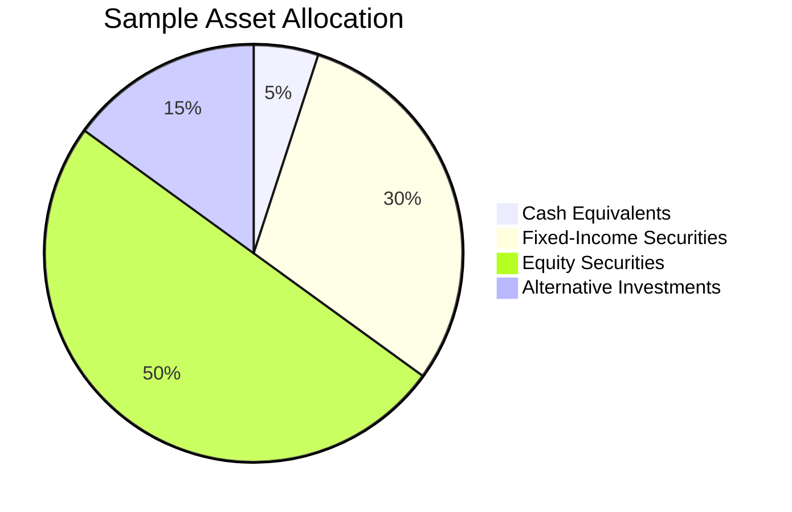

---

linkTitle: "16.3.1 Step 3: Develop the Asset Mix"
title: "Develop the Asset Mix: Balancing Asset Classes for Optimal Portfolio Management"
description: "Explore the strategic development of an asset mix by balancing cash, fixed-income, equity, and alternative investments to optimize portfolio performance."
categories:
- Portfolio Management
- Investment Strategies
- Financial Planning
tags:
- Asset Allocation
- Investment Portfolio
- Canadian Securities
- Financial Strategy
- Diversification
date: 2024-10-25
type: docs
nav_weight: 431000
---

## 16.3.1 Step 3: Develop the Asset Mix

In the realm of portfolio management, developing the asset mix is a critical step that involves strategically balancing various asset classes to meet the client's financial goals, risk tolerance, and investment horizon. This section delves into the intricacies of constructing an asset mix, focusing on cash and cash equivalents, fixed-income securities, equity securities, and other asset classes. By understanding these components, investors can create a diversified portfolio that aligns with their objectives and adapts to changing market conditions.

### Constructing the Asset Mix by Balancing Different Asset Classes

#### Cash and Cash Equivalents

Cash and cash equivalents form the foundation of any well-rounded portfolio. These assets provide liquidity and serve as a buffer for emergency needs. In the Canadian context, cash equivalents might include Treasury bills, money market funds, and short-term government bonds.

- **Allocation Strategy:** Typically, a conservative allocation of 5-10% is recommended, depending on the client's liquidity requirements and risk tolerance. For instance, a retiree might prefer a higher allocation to cash equivalents to ensure easy access to funds for unexpected expenses.

- **Example:** Consider a Canadian investor with a $500,000 portfolio. Allocating 5% to cash equivalents would mean investing $25,000 in a high-interest savings account or a short-term GIC (Guaranteed Investment Certificate), providing both liquidity and a modest return.

#### Fixed-Income Securities

Fixed-income securities are essential for generating steady income and preserving capital. They include government bonds, corporate bonds, and other debt instruments. These investments are particularly appealing in a low-interest-rate environment, where they can offer predictable returns.

- **Diversification:** Diversifying across different types of bonds (e.g., federal, provincial, and corporate) can mitigate risk. For example, Canadian government bonds are considered low-risk, while corporate bonds might offer higher yields but come with increased risk.

- **Interest Rate Considerations:** The allocation should be adjusted based on interest rate outlooks. In a rising interest rate environment, shorter-duration bonds may be preferred to reduce interest rate risk.

- **Example:** A Canadian investor might allocate 30% of their portfolio to fixed-income securities, with a mix of 15% in federal bonds and 15% in high-quality corporate bonds, balancing safety and yield.

#### Equity Securities

Equity securities offer the potential for capital appreciation and dividend income. Investing in a mix of growth and value stocks across various sectors and geographies can enhance returns and reduce risk through diversification.

- **Growth vs. Value:** Growth stocks are expected to grow at an above-average rate compared to the market, while value stocks are considered undervalued. A balanced approach might involve a 50/50 split between growth and value stocks.

- **Sector and Geographic Diversification:** Investing across different sectors (e.g., technology, healthcare, financials) and geographies (e.g., Canadian, U.S., international markets) can further diversify the portfolio.

- **Example:** A Canadian investor might allocate 50% of their portfolio to equities, with 25% in Canadian stocks, 15% in U.S. stocks, and 10% in international stocks, ensuring exposure to various markets.

#### Other Asset Classes

Incorporating alternative investments such as real estate, hedge funds, and commodities can enhance portfolio returns and provide additional diversification benefits. These assets often have low correlation with traditional asset classes, helping to reduce overall portfolio volatility.

- **Suitability Assessment:** The suitability of each alternative investment should be assessed based on the client's objectives and constraints. For instance, real estate might be suitable for investors seeking income and capital appreciation, while commodities could be appealing for those looking to hedge against inflation.

- **Example:** A Canadian investor might allocate 10% of their portfolio to alternative investments, with 5% in a real estate investment trust (REIT) and 5% in a commodity-focused mutual fund.

### Visualizing the Asset Mix

To better understand the composition of a diversified portfolio, consider the following diagram illustrating a sample asset allocation:

### Best Practices and Common Pitfalls

- **Best Practices:**
  - Regularly review and rebalance the portfolio to maintain the desired asset mix.
  - Consider tax implications, such as capital gains taxes, when adjusting the asset allocation.
  - Stay informed about market trends and economic indicators that may impact asset classes differently.

- **Common Pitfalls:**
  - Over-concentration in a single asset class or sector, increasing risk.
  - Neglecting to adjust the asset mix in response to changes in the client's financial situation or market conditions.
  - Failing to consider the impact of inflation on fixed-income investments.

### Conclusion

Developing the asset mix is a dynamic process that requires careful consideration of various asset classes and their roles within a portfolio. By balancing cash and cash equivalents, fixed-income securities, equity securities, and alternative investments, investors can create a diversified portfolio tailored to their unique financial goals and risk tolerance. As market conditions and personal circumstances evolve, so too should the asset mix, ensuring it remains aligned with the investor's objectives.

## Quiz Time!



### Which asset class provides liquidity and serves as a buffer for emergency needs?

- [x] Cash and Cash Equivalents
- [ ] Fixed-Income Securities
- [ ] Equity Securities
- [ ] Alternative Investments

> **Explanation:** Cash and cash equivalents are highly liquid and can be easily accessed for emergency needs.

### What is a typical conservative allocation percentage for cash and cash equivalents in a portfolio?

- [x] 5-10%
- [ ] 15-20%
- [ ] 25-30%
- [ ] 35-40%

> **Explanation:** A conservative allocation for cash and cash equivalents is generally 5-10%, depending on liquidity needs and risk tolerance.

### Which type of bonds are considered low-risk in Canada?

- [x] Government Bonds
- [ ] Corporate Bonds
- [ ] Junk Bonds
- [ ] Convertible Bonds

> **Explanation:** Canadian government bonds are considered low-risk due to the backing of the government.

### What is a key benefit of diversifying across different types of bonds?

- [x] Mitigating risk
- [ ] Increasing volatility
- [ ] Reducing liquidity
- [ ] Maximizing tax liability

> **Explanation:** Diversifying across different types of bonds helps mitigate risk by spreading exposure.

### Which of the following is a characteristic of growth stocks?

- [x] Expected to grow at an above-average rate
- [ ] Considered undervalued
- [x] High potential for capital appreciation
- [ ] Low dividend yield

> **Explanation:** Growth stocks are expected to grow at an above-average rate and have high potential for capital appreciation.

### What is a common pitfall when developing an asset mix?

- [x] Over-concentration in a single asset class
- [ ] Regularly rebalancing the portfolio
- [ ] Considering tax implications
- [ ] Staying informed about market trends

> **Explanation:** Over-concentration in a single asset class increases risk and is a common pitfall.

### Which asset class is often used to hedge against inflation?

- [x] Commodities
- [ ] Cash Equivalents
- [x] Real Estate
- [ ] Fixed-Income Securities

> **Explanation:** Commodities and real estate are often used to hedge against inflation due to their tangible nature.

### What is the primary goal of incorporating alternative investments into a portfolio?

- [x] Enhance returns and provide diversification
- [ ] Increase portfolio volatility
- [ ] Concentrate risk
- [ ] Simplify asset allocation

> **Explanation:** Alternative investments enhance returns and provide diversification benefits.

### What should be regularly done to maintain the desired asset mix?

- [x] Review and rebalance the portfolio
- [ ] Ignore market trends
- [ ] Concentrate on a single asset class
- [ ] Avoid tax considerations

> **Explanation:** Regularly reviewing and rebalancing the portfolio helps maintain the desired asset mix.

### True or False: Equity securities are primarily used for capital preservation.

- [ ] True
- [x] False

> **Explanation:** Equity securities are primarily used for capital appreciation and dividend income, not capital preservation.


