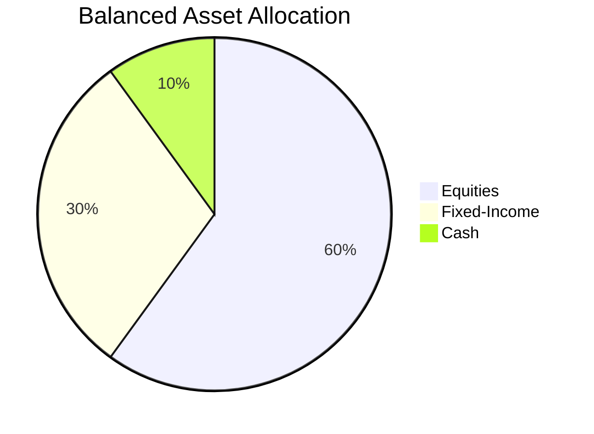

## 16.3 Step 3: Develop the Asset Mix

In the realm of portfolio management, developing an optimal asset mix is a crucial step that aligns investment strategies with the client's financial goals and risk tolerance. This process involves a careful selection of asset classes and strategic allocation to achieve a balanced portfolio that can withstand market fluctuations while maximizing returns. In this section, we will delve into the intricacies of asset mix development, focusing on the main asset classes, strategic and tactical asset allocation, and the importance of diversification.

### Understanding Asset Classes

Asset classes are the building blocks of any investment portfolio. They are categories of investments that exhibit similar characteristics and behave similarly in the marketplace. The three primary asset classes are:

1. **Cash and Cash Equivalents**: This includes savings accounts, money market funds, and short-term government bonds. Cash provides liquidity and stability but typically offers lower returns compared to other asset classes.

2. **Fixed-Income Securities**: These are investments that provide regular income, such as bonds and debentures. They are generally considered less risky than equities and can offer a steady income stream, making them suitable for risk-averse investors.

3. **Equities**: Stocks represent ownership in a company and offer the potential for capital appreciation. They are typically more volatile than fixed-income securities but can provide higher long-term returns.

### Assessing Risk Tolerance and Investment Objectives

Before constructing an asset mix, it is essential to assess the client's risk tolerance and investment objectives. Risk tolerance refers to the level of risk an investor is willing to accept in pursuit of their financial goals. Investment objectives can range from capital preservation and income generation to growth and speculation.

- **Risk Tolerance Assessment**: This involves understanding the client's financial situation, investment experience, and emotional capacity to handle market volatility. Tools such as risk questionnaires and profiling can aid in this assessment.

- **Investment Objectives**: Clearly defined objectives help in determining the appropriate asset allocation. For instance, a young investor with a long investment horizon and a high-risk tolerance may favor equities, while a retiree seeking income and capital preservation may prefer fixed-income securities.

### Strategic Asset Allocation

Strategic asset allocation is a long-term approach that sets target allocations for various asset classes based on the client's objectives and risk tolerance. This strategy involves:

- **Setting Long-Term Targets**: Establishing a baseline allocation for each asset class that aligns with the client's goals. For example, a balanced portfolio might consist of 60% equities, 30% fixed-income securities, and 10% cash.

- **Considering Market Conditions and Economic Cycles**: While strategic allocation is long-term, it should consider prevailing market conditions and economic forecasts to ensure the portfolio remains relevant.

- **Periodic Rebalancing**: To maintain the desired asset mix, portfolios should be rebalanced periodically. This involves adjusting the allocations back to their target weights, which can help in managing risk and capitalizing on market opportunities.

### Dynamic and Tactical Asset Allocation

While strategic asset allocation provides a long-term framework, dynamic and tactical asset allocation strategies allow for flexibility in response to short-term market movements and economic changes.

- **Dynamic Asset Allocation**: This involves actively adjusting the portfolio’s asset mix based on changing market conditions or economic factors. It requires continuous monitoring and analysis to make informed decisions.

- **Tactical Asset Allocation**: A short-term strategy that involves temporarily deviating from the strategic asset mix to capitalize on specific market opportunities. For instance, if equities are expected to outperform, a portfolio manager might increase the equity allocation temporarily.

### Diversification: Enhancing Risk-Adjusted Returns

Diversification is a fundamental principle in portfolio management that involves spreading investments across various asset classes and within each asset class to reduce risk and enhance returns. Key considerations include:

- **Diversification Across Asset Classes**: By investing in a mix of cash, fixed-income securities, and equities, investors can mitigate the impact of poor performance in any single asset class.

- **Diversification Within Asset Classes**: Within equities, for example, diversification can be achieved by investing in different sectors, industries, and geographic regions. This reduces the risk associated with specific market segments.

- **Risk-Adjusted Returns**: Diversification aims to optimize the portfolio's risk-adjusted returns, ensuring that the level of risk taken is commensurate with the expected returns.

### Practical Example: Canadian Pension Fund Strategy

Consider a Canadian pension fund that employs a strategic asset allocation strategy. The fund's long-term target allocation might be 50% equities, 40% fixed-income securities, and 10% alternative investments. However, during periods of economic uncertainty, the fund may adopt a tactical asset allocation approach, temporarily increasing its fixed-income allocation to reduce risk.

### Visualizing Asset Allocation

Below is a simple diagram illustrating a balanced asset allocation strategy:

### Best Practices and Common Pitfalls

- **Best Practices**: Regularly review and adjust the asset mix to align with changing financial goals and market conditions. Utilize both strategic and tactical approaches to optimize the portfolio.

- **Common Pitfalls**: Avoid overreacting to short-term market fluctuations, which can lead to unnecessary portfolio churn and increased transaction costs. Ensure diversification to prevent overexposure to any single asset class or investment.

### Conclusion

Developing an optimal asset mix is a dynamic process that requires a deep understanding of asset classes, risk tolerance, and investment objectives. By employing strategic and tactical asset allocation strategies and emphasizing diversification, investors can construct portfolios that are resilient to market volatility and aligned with their financial goals.

For further exploration, consider resources such as the Canadian Securities Institute's courses on portfolio management and investment strategies, as well as books like "The Intelligent Investor" by Benjamin Graham for foundational investment principles.

## Quiz Time!



### What are the three main asset classes used in constructing an asset mix?

- [x] Cash, Fixed-Income Securities, Equities
- [ ] Real Estate, Commodities, Derivatives
- [ ] Mutual Funds, ETFs, Bonds
- [ ] Options, Futures, Stocks

> **Explanation:** The three main asset classes are cash, fixed-income securities, and equities, which are fundamental in constructing an asset mix.

### What is strategic asset allocation?

- [x] A long-term approach to setting target allocations for various asset classes
- [ ] A short-term strategy to capitalize on market opportunities
- [ ] The practice of investing solely in equities
- [ ] A method of avoiding all market risks

> **Explanation:** Strategic asset allocation is a long-term approach that sets target allocations for asset classes based on objectives and risk tolerance.

### How does dynamic asset allocation differ from tactical asset allocation?

- [x] Dynamic involves ongoing adjustments; tactical is short-term deviations
- [ ] Dynamic is short-term; tactical is long-term
- [ ] Dynamic focuses on equities; tactical focuses on bonds
- [ ] Dynamic is passive; tactical is active

> **Explanation:** Dynamic asset allocation involves ongoing adjustments, while tactical asset allocation involves short-term deviations from the strategic mix.

### Why is diversification important in portfolio management?

- [x] It reduces risk and enhances risk-adjusted returns
- [ ] It guarantees high returns
- [ ] It eliminates all investment risks
- [ ] It focuses only on equities

> **Explanation:** Diversification reduces risk by spreading investments across various asset classes, enhancing risk-adjusted returns.

### What is the primary goal of tactical asset allocation?

- [x] To capitalize on specific market opportunities
- [ ] To maintain a fixed asset mix
- [ ] To invest only in fixed-income securities
- [ ] To avoid all market fluctuations

> **Explanation:** Tactical asset allocation aims to capitalize on specific market opportunities by temporarily deviating from the strategic asset mix.

### Which asset class is typically considered the most volatile?

- [x] Equities
- [ ] Cash
- [ ] Fixed-Income Securities
- [ ] Real Estate

> **Explanation:** Equities are generally more volatile than other asset classes but offer higher potential long-term returns.

### What should be considered when setting long-term target allocations?

- [x] Client's objectives and risk tolerance
- [ ] Only the current market trends
- [ ] The performance of a single asset class
- [ ] The client's favorite stocks

> **Explanation:** Long-term target allocations should consider the client's objectives and risk tolerance to ensure alignment with financial goals.

### What is the purpose of periodic rebalancing in a portfolio?

- [x] To maintain the desired asset mix
- [ ] To increase transaction costs
- [ ] To focus solely on equities
- [ ] To eliminate all risks

> **Explanation:** Periodic rebalancing helps maintain the desired asset mix, managing risk and capitalizing on market opportunities.

### How can diversification be achieved within the equities asset class?

- [x] By investing in different sectors and regions
- [ ] By investing only in technology stocks
- [ ] By focusing solely on Canadian stocks
- [ ] By avoiding all international investments

> **Explanation:** Diversification within equities can be achieved by investing in various sectors, industries, and geographic regions.

### True or False: Tactical asset allocation is a long-term strategy.

- [ ] True
- [x] False

> **Explanation:** Tactical asset allocation is a short-term strategy designed to capitalize on specific market opportunities.


