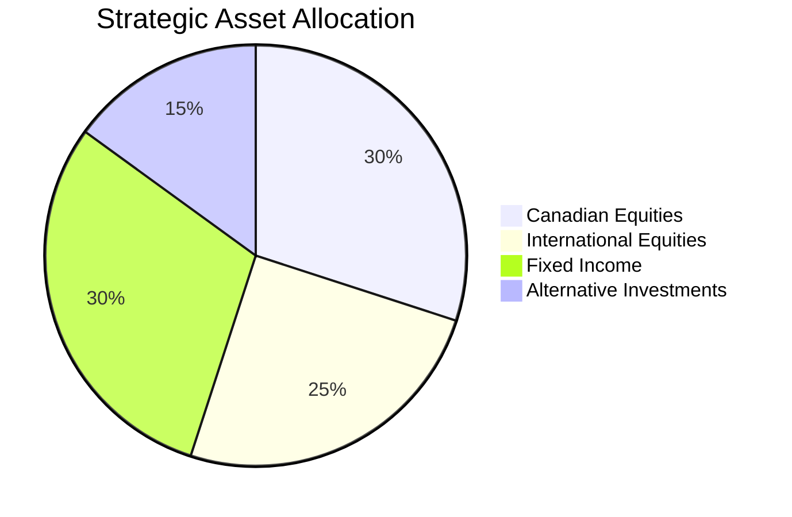

## 16.4 Develop the Strategic Asset Allocation

Strategic asset allocation is a cornerstone of the portfolio management process, providing a long-term framework for dividing a portfolio among various asset classes. This approach is essential for aligning investment strategies with an investor's financial goals, risk tolerance, and time horizon. In this section, we will delve into the intricacies of strategic asset allocation, examining the factors that influence these decisions and the methods used to establish a robust allocation strategy.

### Understanding Strategic Asset Allocation

**Strategic Asset Allocation** is the process of determining the optimal distribution of assets in a portfolio to achieve long-term investment objectives. It involves setting target allocations for different asset classes, such as equities, fixed income, and alternative investments, based on an investor's risk tolerance, investment horizon, and expected returns. This allocation is periodically reviewed and adjusted to maintain alignment with the investor's goals and market conditions.

### Factors Influencing Strategic Asset Allocation Decisions

Several key factors influence strategic asset allocation decisions:

#### 1. Risk Tolerance

Risk tolerance is the degree of variability in investment returns that an investor is willing to withstand. It is influenced by factors such as financial situation, investment experience, and psychological comfort with risk. Investors with a high risk tolerance may allocate more to equities, while those with a lower risk tolerance might prefer a greater allocation to fixed income.

#### 2. Investment Horizon

The investment horizon is the length of time an investor expects to hold a portfolio before needing to access the funds. A longer investment horizon allows for a higher allocation to riskier assets, as there is more time to recover from market downturns. Conversely, a shorter horizon may necessitate a more conservative allocation.

#### 3. Expected Returns from Different Asset Classes

Expected returns are the anticipated gains from various asset classes based on historical performance and future projections. Understanding the potential returns and risks associated with each asset class helps investors make informed allocation decisions. For example, equities typically offer higher returns but with greater volatility compared to fixed income.

#### 4. Economic and Equity Cycles

Economic and equity cycles play a crucial role in strategic asset allocation. During periods of economic expansion, equities may perform well, while fixed income may be more favorable during downturns. Understanding these cycles helps investors adjust their allocations to capitalize on market conditions.

### Methods for Setting Strategic Asset Allocation

Setting a strategic asset allocation involves analyzing historical data and expected returns to determine the optimal mix of assets. Here are some common methods used:

#### Historical Data Analysis

Analyzing historical performance data of asset classes provides insights into their risk-return profiles. This analysis helps investors understand how different assets have behaved in various market conditions, aiding in the selection of an appropriate allocation.

#### Expected Returns and Risk Assessment

Investors use expected returns and risk assessments to forecast future performance. This involves evaluating economic indicators, market trends, and financial models to estimate potential returns and risks for each asset class.

#### Optimization Models

Optimization models, such as the mean-variance optimization, are used to identify the asset allocation that maximizes expected returns for a given level of risk. These models consider the correlation between asset classes to achieve diversification benefits.

#### Scenario Analysis

Scenario analysis involves testing different asset allocation strategies under various hypothetical market conditions. This approach helps investors understand the potential impact of economic changes on their portfolios and adjust allocations accordingly.

### Practical Example: Canadian Pension Fund

Consider a Canadian pension fund with a long-term investment horizon and moderate risk tolerance. The fund's strategic asset allocation might include a mix of Canadian equities, international equities, fixed income, and alternative investments. By analyzing historical data and expected returns, the fund managers can determine the optimal allocation to achieve their objectives while managing risk.

### Visualizing Strategic Asset Allocation

Below is a simple diagram illustrating a hypothetical strategic asset allocation for a balanced portfolio:

### Best Practices and Common Pitfalls

**Best Practices:**
- Regularly review and adjust the strategic asset allocation to reflect changes in financial goals and market conditions.
- Diversify across asset classes to reduce risk and enhance returns.
- Consider tax implications and regulatory requirements when setting allocations.

**Common Pitfalls:**
- Overreacting to short-term market fluctuations and deviating from the strategic allocation.
- Failing to consider the impact of inflation on long-term investment returns.
- Neglecting to rebalance the portfolio periodically to maintain the desired allocation.

### Conclusion

Developing a strategic asset allocation is a critical step in the portfolio management process. By considering factors such as risk tolerance, investment horizon, and economic cycles, investors can create a robust framework that aligns with their long-term financial goals. Utilizing historical data, expected returns, and optimization models, investors can make informed decisions to optimize their portfolios for success.

### **Ready to Test Your Knowledge?**

**Practice 10 Essential CSC Exam Questions to Master Your Certification**



### What is strategic asset allocation?

- [x] The predefined distribution of assets based on long-term investment goals and risk tolerance.
- [ ] The short-term adjustment of asset classes in response to market changes.
- [ ] The process of selecting individual securities within an asset class.
- [ ] The allocation of assets based on current market trends.

> **Explanation:** Strategic asset allocation involves setting a long-term framework for dividing a portfolio among asset classes based on investment goals and risk tolerance.

### Which factor is NOT typically considered in strategic asset allocation?

- [ ] Risk tolerance
- [ ] Investment horizon
- [ ] Expected returns
- [x] Daily market fluctuations

> **Explanation:** Strategic asset allocation focuses on long-term factors like risk tolerance, investment horizon, and expected returns, rather than daily market fluctuations.

### How does a longer investment horizon affect asset allocation?

- [x] It allows for a higher allocation to riskier assets.
- [ ] It requires a more conservative allocation.
- [ ] It eliminates the need for diversification.
- [ ] It focuses solely on fixed income investments.

> **Explanation:** A longer investment horizon provides more time to recover from market downturns, allowing for a higher allocation to riskier assets like equities.

### What is the role of economic cycles in strategic asset allocation?

- [x] They help investors adjust allocations to capitalize on market conditions.
- [ ] They determine the exact timing of asset purchases.
- [ ] They eliminate the need for risk assessment.
- [ ] They focus only on short-term market trends.

> **Explanation:** Understanding economic cycles helps investors adjust their allocations to take advantage of favorable market conditions.

### Which method is commonly used to set strategic asset allocation?

- [x] Historical data analysis
- [ ] Daily market monitoring
- [ ] Random selection of assets
- [ ] Ignoring economic indicators

> **Explanation:** Historical data analysis provides insights into the risk-return profiles of asset classes, aiding in strategic asset allocation decisions.

### What is a common pitfall in strategic asset allocation?

- [x] Overreacting to short-term market fluctuations
- [ ] Regularly reviewing and adjusting allocations
- [ ] Diversifying across asset classes
- [ ] Considering tax implications

> **Explanation:** Overreacting to short-term market fluctuations can lead to deviations from the strategic allocation, undermining long-term goals.

### What is the benefit of diversification in strategic asset allocation?

- [x] It reduces risk and enhances returns.
- [ ] It focuses solely on high-risk assets.
- [ ] It eliminates the need for rebalancing.
- [ ] It concentrates investments in a single asset class.

> **Explanation:** Diversification across asset classes helps reduce risk and enhance returns by spreading investments.

### Why is it important to periodically rebalance a portfolio?

- [x] To maintain the desired asset allocation
- [ ] To increase exposure to a single asset class
- [ ] To eliminate low-risk investments
- [ ] To focus only on short-term gains

> **Explanation:** Periodic rebalancing ensures that the portfolio maintains the desired asset allocation, aligning with long-term goals.

### What is the impact of inflation on long-term investment returns?

- [x] It can erode purchasing power and affect returns.
- [ ] It has no impact on investment returns.
- [ ] It only affects short-term investments.
- [ ] It enhances the value of fixed income investments.

> **Explanation:** Inflation can erode purchasing power over time, impacting the real returns of long-term investments.

### True or False: Strategic asset allocation should be adjusted frequently based on daily market changes.

- [ ] True
- [x] False

> **Explanation:** Strategic asset allocation is a long-term framework and should not be frequently adjusted based on daily market changes.


