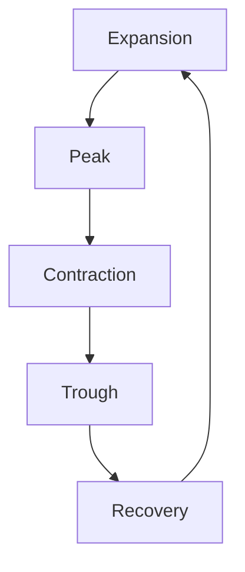

## 16.5 Asset Class Timing and Cycle Management

In the realm of portfolio management, understanding the intricate dance between equity cycles and economic cycles is crucial for optimizing investment returns and managing risks. This section delves into the phases of the equity cycle, the impact of economic indicators on asset classes, and strategies for asset class timing. By mastering these concepts, investors can make informed decisions that align with both market conditions and their financial goals.

### Understanding the Relationship Between Equity Cycles and Economic Cycles

The equity cycle and the economic cycle are closely intertwined, each influencing the other in a dynamic interplay. The **equity cycle** refers to the pattern of stock market movements that align with the phases of the economic cycle. These cycles are characterized by periods of expansion, peak, contraction, trough, and recovery. Understanding these phases is essential for investors aiming to time their asset allocations effectively.

#### Phases of the Equity Cycle

1. **Expansion**: During this phase, economic activity is on the rise, characterized by increasing GDP, employment, and consumer spending. Equity markets typically perform well as corporate earnings grow and investor confidence strengthens.

2. **Peak**: The peak marks the zenith of economic growth. While the economy is still strong, growth rates begin to slow. Equity markets may experience volatility as investors anticipate a potential downturn.

3. **Contraction**: Also known as a recession, this phase is marked by declining economic activity, reduced consumer spending, and rising unemployment. Equity markets often decline as corporate earnings fall and investor sentiment turns negative.

4. **Trough**: The trough represents the lowest point of the economic cycle. Economic indicators begin to stabilize, setting the stage for recovery. Equity markets may start to rebound as investors anticipate future growth.

5. **Recovery**: In this phase, economic activity begins to pick up again, leading to increased consumer spending and investment. Equity markets typically recover as corporate earnings improve and investor confidence returns.

### Impact of Economic Indicators on Asset Classes

Economic indicators such as GDP growth, interest rates, and inflation play a significant role in influencing asset class performance. Understanding these indicators can help investors make informed decisions about asset allocation.

- **GDP Growth**: A strong GDP growth rate often signals a healthy economy, leading to positive performance in equity markets. Conversely, slow or negative GDP growth can indicate economic weakness, impacting equities negatively.

- **Interest Rates**: Central banks, such as the Bank of Canada, adjust interest rates to manage economic growth and inflation. Lower interest rates tend to boost equity markets by reducing borrowing costs and encouraging investment. Higher rates can have the opposite effect, dampening economic activity and equity performance.

- **Inflation**: Moderate inflation is generally positive for equities, as it reflects a growing economy. However, high inflation can erode purchasing power and lead to increased costs for companies, negatively impacting equity markets.

### Asset Class Timing Strategies

Asset class timing involves adjusting the allocation of different asset classes in a portfolio based on anticipated market conditions. Effective timing strategies can enhance returns and manage risks.

#### Strategies for Asset Class Timing

1. **Sector Rotation**: This strategy involves shifting investments between sectors based on their expected performance in different phases of the economic cycle. For example, during an expansion phase, investors might favor growth-oriented sectors like technology, while in a contraction phase, defensive sectors like utilities may be preferred.

2. **Tactical Asset Allocation**: This approach involves making short-term adjustments to asset allocations based on market conditions and economic forecasts. Tactical asset allocation allows investors to capitalize on market opportunities and mitigate risks.

3. **Contrarian Investing**: Contrarian investors seek to go against prevailing market trends, buying undervalued assets during downturns and selling overvalued assets during upswings. This strategy requires a deep understanding of market cycles and investor psychology.

4. **Momentum Investing**: This strategy involves investing in assets that have shown strong recent performance, with the expectation that they will continue to perform well. Momentum investing relies on identifying trends and capitalizing on them before they reverse.

### Practical Examples and Case Studies

To illustrate these concepts, consider the investment strategies employed by Canadian pension funds. These funds often use tactical asset allocation to adjust their portfolios in response to changing economic conditions. For instance, during periods of low interest rates, they may increase their allocation to equities to seek higher returns.

Another example is the approach taken by major Canadian banks like RBC and TD. These institutions often engage in sector rotation, adjusting their investment portfolios to align with anticipated economic trends. By doing so, they aim to optimize returns while managing risks.

### Diagrams and Visual Aids

To further enhance understanding, let's visualize the relationship between economic cycles and equity cycles using a diagram:

This diagram illustrates the cyclical nature of economic and equity cycles, highlighting the interconnectedness of these phases.

### Best Practices and Common Pitfalls

**Best Practices:**

- Stay informed about economic indicators and market trends.
- Diversify your portfolio to manage risks effectively.
- Regularly review and adjust your asset allocation based on changing market conditions.

**Common Pitfalls:**

- Overreacting to short-term market fluctuations.
- Failing to diversify, leading to increased risk exposure.
- Ignoring economic indicators and relying solely on historical performance.

### Conclusion

Mastering asset class timing and cycle management is a valuable skill for investors seeking to optimize their portfolios. By understanding the relationship between equity cycles and economic cycles, and employing effective timing strategies, investors can enhance returns and manage risks in the Canadian financial landscape.

### Glossary

- **Equity Cycle**: The pattern of stock market movements aligned with economic phases.
- **Economic Cycle**: The fluctuating levels of economic activity, including periods of expansion and contraction.

### **Ready to Test Your Knowledge?**

**Practice 10 Essential CSC Exam Questions to Master Your Certification**



### What is the equity cycle?

- [x] The pattern of stock market movements aligned with economic phases.
- [ ] The pattern of bond market movements aligned with economic phases.
- [ ] The pattern of real estate market movements aligned with economic phases.
- [ ] The pattern of commodity market movements aligned with economic phases.

> **Explanation:** The equity cycle refers to the pattern of stock market movements that align with the phases of the economic cycle.

### Which phase of the equity cycle is characterized by declining economic activity?

- [ ] Expansion
- [ ] Peak
- [x] Contraction
- [ ] Recovery

> **Explanation:** The contraction phase, also known as a recession, is marked by declining economic activity.

### What impact do lower interest rates typically have on equity markets?

- [x] Boost equity markets by reducing borrowing costs.
- [ ] Depress equity markets by increasing borrowing costs.
- [ ] Have no impact on equity markets.
- [ ] Cause equity markets to crash.

> **Explanation:** Lower interest rates tend to boost equity markets by reducing borrowing costs and encouraging investment.

### Which strategy involves shifting investments between sectors based on expected performance?

- [x] Sector Rotation
- [ ] Tactical Asset Allocation
- [ ] Contrarian Investing
- [ ] Momentum Investing

> **Explanation:** Sector rotation involves shifting investments between sectors based on their expected performance in different phases of the economic cycle.

### What is a common pitfall in asset class timing?

- [x] Overreacting to short-term market fluctuations.
- [ ] Staying informed about economic indicators.
- [ ] Diversifying the portfolio.
- [ ] Regularly reviewing asset allocation.

> **Explanation:** Overreacting to short-term market fluctuations is a common pitfall in asset class timing.

### Which phase of the equity cycle follows the trough?

- [ ] Contraction
- [ ] Peak
- [x] Recovery
- [ ] Expansion

> **Explanation:** The recovery phase follows the trough, where economic activity begins to pick up again.

### What is the primary goal of tactical asset allocation?

- [x] To make short-term adjustments to asset allocations based on market conditions.
- [ ] To invest in undervalued assets during downturns.
- [ ] To invest in assets with strong recent performance.
- [ ] To shift investments between sectors.

> **Explanation:** Tactical asset allocation involves making short-term adjustments to asset allocations based on market conditions and economic forecasts.

### Which economic indicator is often used to signal a healthy economy?

- [x] GDP Growth
- [ ] High Inflation
- [ ] Rising Unemployment
- [ ] Decreasing Consumer Spending

> **Explanation:** A strong GDP growth rate often signals a healthy economy, leading to positive performance in equity markets.

### What is the impact of high inflation on equity markets?

- [ ] Positive impact as it reflects a growing economy.
- [x] Negative impact as it erodes purchasing power and increases costs.
- [ ] No impact on equity markets.
- [ ] Causes equity markets to boom.

> **Explanation:** High inflation can erode purchasing power and lead to increased costs for companies, negatively impacting equity markets.

### True or False: Contrarian investing involves going against prevailing market trends.

- [x] True
- [ ] False

> **Explanation:** Contrarian investing involves going against prevailing market trends, buying undervalued assets during downturns and selling overvalued assets during upswings.


