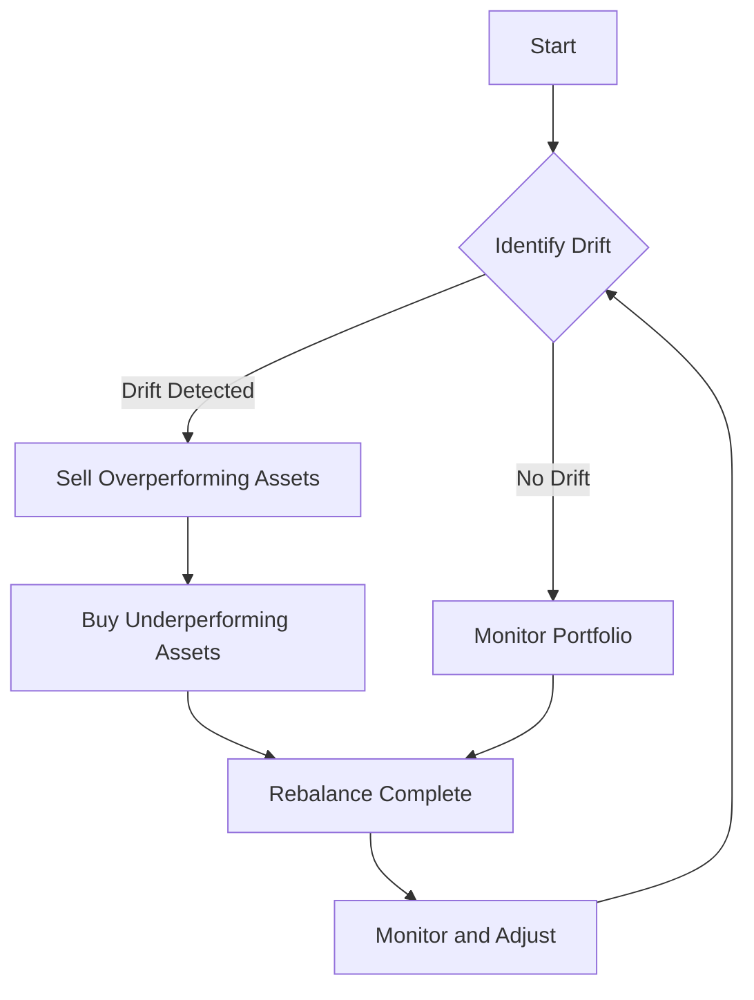

## 16.7.1 Step 7: Rebalance the Portfolio

Rebalancing a portfolio is a critical step in the portfolio management process, ensuring that the investment strategy remains aligned with the investor's goals and risk tolerance. This section will guide you through the essential strategies for effective portfolio rebalancing, focusing on the Canadian financial landscape.

### Implement Rebalancing Strategies Effectively

Rebalancing involves adjusting the weights of assets in a portfolio to maintain the desired asset allocation. This process helps manage risk and optimize returns over time. Let's explore the key components of effective rebalancing.

#### Identify Drift from Target Allocation

The first step in rebalancing is to identify any drift from the target allocation. This involves regularly comparing the current portfolio asset weights with the strategic asset mix outlined in the Investment Policy Statement (IPS).

- **Regular Comparison:** Establish a routine to compare the actual asset allocation with the target allocation. This can be done using portfolio management software or manually through spreadsheets.
  
- **Deviation Thresholds:** Determine which asset classes have deviated beyond predefined thresholds. For example, if an asset class is more than 5% above or below its target, it may trigger a rebalancing action.

**Example:** Consider a Canadian investor with a target allocation of 60% equities and 40% fixed income. If the equity portion grows to 70% due to market performance, it exceeds the threshold and requires rebalancing.

#### Execute Rebalancing

Once drift is identified, the next step is to execute the rebalancing process.

- **Sell Overperforming Assets:** Liquidate portions of asset classes that have exceeded their target allocation. This locks in gains and reduces exposure to potentially overvalued assets.

- **Buy Underperforming Assets:** Invest in asset classes that are below their target allocation. This strategy allows investors to buy low and potentially benefit from future growth.

**Practical Example:** A Canadian pension fund may sell a portion of its Canadian equities that have outperformed and use the proceeds to purchase underperforming international bonds, aligning with its strategic asset mix.

#### Timing and Frequency

Deciding when and how often to rebalance is crucial to minimizing costs and maximizing efficiency.

- **Rebalancing Schedule:** Choose a schedule, such as quarterly or annually, or rebalance based on asset weight thresholds. A time-based approach provides consistency, while a threshold-based approach is more responsive to market changes.

- **Minimize Costs:** Avoid excessive trading to reduce transaction costs and tax liabilities. Consider using tax-advantaged accounts like RRSPs or TFSAs to mitigate tax impacts.

**Case Study:** A Canadian investor rebalances annually to minimize transaction costs, using a threshold of 5% deviation to trigger additional rebalancing if necessary.

#### Monitor and Adjust

Continuous monitoring and adjustment are essential to ensure the portfolio remains aligned with the investor's objectives.

- **Performance Monitoring:** Regularly review portfolio performance and market conditions. This helps identify when rebalancing is necessary and ensures the strategy remains effective.

- **Adjust Strategies:** Be prepared to adjust rebalancing strategies in response to significant changes in client circumstances or economic factors, such as interest rate changes or shifts in market volatility.

**Example:** A financial advisor in Canada might adjust a client's portfolio strategy if the client experiences a major life event, such as retirement, requiring a more conservative asset allocation.

### Glossary

- **Threshold:** A predefined limit that triggers rebalancing when an asset class deviates beyond this range from its target allocation.
  
- **Transaction Costs:** Expenses incurred from buying and selling securities, including broker fees and commissions.

### Visualizing Rebalancing

Below is a diagram illustrating the rebalancing process:

### Best Practices and Challenges

- **Best Practices:**
  - Use a disciplined approach to rebalancing, adhering to the IPS.
  - Consider tax implications and use tax-efficient strategies.
  - Communicate with clients to ensure their goals and risk tolerance are accurately reflected.

- **Common Challenges:**
  - Balancing transaction costs with the benefits of rebalancing.
  - Managing emotional biases that may affect decision-making.
  - Adapting to changing market conditions and client needs.

### Conclusion

Rebalancing is a vital component of portfolio management, helping to maintain the desired risk-return profile. By implementing effective rebalancing strategies, investors can optimize their portfolios and achieve their financial goals. Remember to regularly review and adjust your approach to stay aligned with market conditions and client objectives.

## Quiz Time!



### What is the primary purpose of rebalancing a portfolio?

- [x] To maintain the desired asset allocation and risk profile
- [ ] To maximize short-term gains
- [ ] To minimize transaction costs
- [ ] To increase exposure to high-risk assets

> **Explanation:** Rebalancing ensures that the portfolio remains aligned with the investor's strategic asset allocation and risk tolerance.

### Which of the following triggers a rebalancing action?

- [x] Asset class deviation beyond a predefined threshold
- [ ] A decrease in market volatility
- [ ] An increase in interest rates
- [ ] A change in the investor's age

> **Explanation:** Rebalancing is typically triggered when an asset class deviates beyond a set threshold from its target allocation.

### What is a common rebalancing schedule?

- [x] Quarterly or annually
- [ ] Daily
- [ ] Every five years
- [ ] Monthly

> **Explanation:** Many investors choose to rebalance quarterly or annually to maintain consistency and manage costs.

### What is a potential benefit of buying underperforming assets during rebalancing?

- [x] Taking advantage of potential growth opportunities
- [ ] Locking in losses
- [ ] Increasing portfolio risk
- [ ] Reducing portfolio diversification

> **Explanation:** Buying underperforming assets can allow investors to capitalize on potential growth opportunities as market conditions change.

### What should be considered to minimize the impact of rebalancing on taxes?

- [x] Use tax-advantaged accounts like RRSPs or TFSAs
- [ ] Increase trading frequency
- [ ] Only rebalance in taxable accounts
- [ ] Ignore tax implications

> **Explanation:** Using tax-advantaged accounts can help mitigate the tax impact of rebalancing activities.

### What is a key challenge in the rebalancing process?

- [x] Balancing transaction costs with rebalancing benefits
- [ ] Increasing portfolio risk
- [ ] Ignoring market conditions
- [ ] Maximizing short-term gains

> **Explanation:** A key challenge is managing transaction costs while ensuring the benefits of rebalancing are realized.

### How can emotional biases affect rebalancing decisions?

- [x] They can lead to irrational decision-making
- [ ] They always improve investment outcomes
- [ ] They have no impact on rebalancing
- [ ] They simplify the decision-making process

> **Explanation:** Emotional biases can lead to irrational decisions, affecting the effectiveness of rebalancing strategies.

### What is the role of the Investment Policy Statement (IPS) in rebalancing?

- [x] It outlines the strategic asset mix and rebalancing guidelines
- [ ] It dictates daily trading activities
- [ ] It eliminates the need for rebalancing
- [ ] It focuses solely on tax strategies

> **Explanation:** The IPS provides the framework for the strategic asset mix and rebalancing guidelines.

### Why is continuous monitoring important in the rebalancing process?

- [x] To ensure the portfolio remains aligned with objectives
- [ ] To increase transaction costs
- [ ] To avoid any changes in the portfolio
- [ ] To maximize short-term gains

> **Explanation:** Continuous monitoring ensures that the portfolio stays aligned with the investor's goals and market conditions.

### True or False: Rebalancing should always be done monthly to ensure optimal performance.

- [ ] True
- [x] False

> **Explanation:** Rebalancing monthly may lead to excessive transaction costs and is not always necessary for optimal performance.


