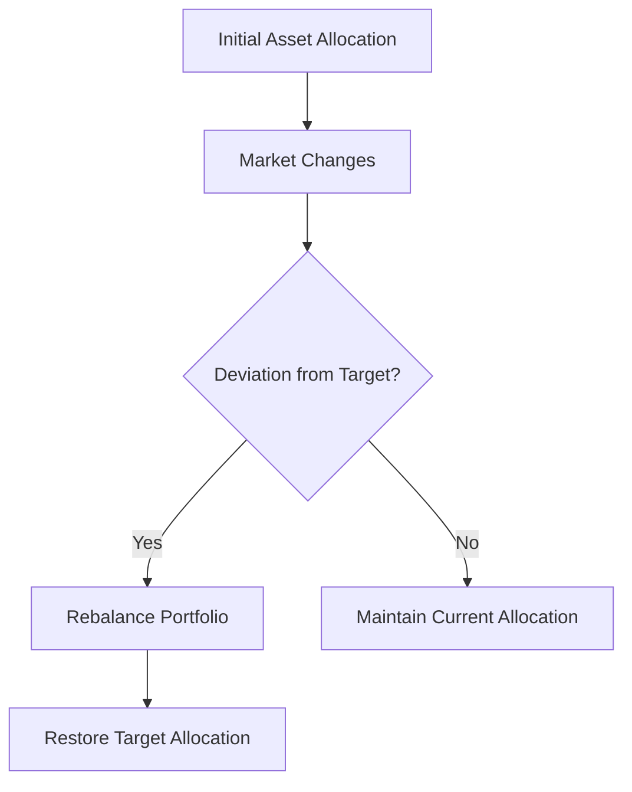

## 16.6 Dynamic Asset Allocation and Rebalancing

In the ever-evolving landscape of financial markets, maintaining an optimal asset allocation is crucial for achieving investment goals while managing risk. This section delves into the concepts of dynamic asset allocation and rebalancing, essential strategies for effective portfolio management. We will explore their definitions, purposes, techniques, and impacts on portfolio performance, with a focus on the Canadian financial context.

### Understanding Dynamic Asset Allocation

**Dynamic Asset Allocation** is a strategy that involves continuously adjusting the asset mix of a portfolio in response to changing market conditions. Unlike static asset allocation, which maintains a fixed asset mix, dynamic allocation is flexible and responsive, allowing investors to capitalize on market opportunities and mitigate risks.

#### Purpose of Dynamic Asset Allocation

The primary purpose of dynamic asset allocation is to enhance portfolio performance by adapting to market trends and economic shifts. This approach aims to:

- **Maximize Returns:** By reallocating assets based on market forecasts, investors can potentially increase returns.
- **Manage Risk:** Dynamic allocation helps in managing risk by adjusting exposure to volatile asset classes during uncertain times.
- **Align with Investment Goals:** It ensures that the portfolio remains aligned with the investor's risk tolerance and financial objectives.

### Rebalancing: Maintaining Strategic Asset Mix

**Rebalancing** is the process of realigning the proportions of assets in a portfolio to maintain the desired asset allocation. Over time, market fluctuations can cause the actual asset mix to deviate from the target allocation, necessitating rebalancing.

#### Rebalancing Techniques

Several techniques can be employed to rebalance a portfolio:

1. **Calendar Rebalancing:** This involves adjusting the portfolio at regular intervals, such as quarterly or annually, regardless of market conditions.

2. **Threshold Rebalancing:** Rebalancing is triggered when the asset allocation deviates from the target by a predetermined percentage, such as 5% or 10%.

3. **Hybrid Approach:** Combines calendar and threshold methods, rebalancing at regular intervals and when deviations exceed specific thresholds.

#### Conditions Necessitating Rebalancing

Rebalancing is crucial under certain conditions:

- **Significant Market Movements:** Sharp market fluctuations can alter the asset mix, requiring adjustments to restore balance.
- **Changes in Client Circumstances:** Life events such as retirement, inheritance, or changes in financial goals may necessitate a reassessment of the asset allocation.
- **Economic Shifts:** Changes in economic indicators, interest rates, or inflation can impact asset performance, prompting rebalancing.

### Impact of Rebalancing on Portfolio Performance and Risk

Rebalancing plays a vital role in maintaining portfolio performance and managing risk. Here’s how:

- **Performance Optimization:** By selling overperforming assets and buying underperforming ones, rebalancing can enhance long-term returns through a disciplined buy-low, sell-high approach.
- **Risk Management:** Rebalancing ensures that the portfolio's risk profile remains consistent with the investor's risk tolerance, preventing excessive exposure to volatile assets.
- **Cost Considerations:** While rebalancing can incur transaction costs and tax implications, these can be minimized through strategic planning and the use of tax-advantaged accounts like RRSPs and TFSAs in Canada.

### Practical Examples and Case Studies

#### Example 1: Canadian Pension Fund

Consider a Canadian pension fund with a target allocation of 60% equities and 40% fixed income. During a bull market, equities outperform, increasing their share to 70%. To rebalance, the fund sells equities and buys fixed income to restore the 60/40 mix, maintaining its risk profile and aligning with long-term objectives.

#### Example 2: Individual Investor with RRSP

An individual investor holds a portfolio within an RRSP, initially allocated 50% to Canadian equities and 50% to bonds. A market downturn reduces the equity portion to 40%. The investor rebalances by purchasing equities, taking advantage of lower prices and maintaining the desired allocation.

### Visualizing Asset Allocation and Rebalancing

Below is a diagram illustrating the process of dynamic asset allocation and rebalancing:

### Best Practices and Common Pitfalls

#### Best Practices

- **Regular Monitoring:** Continuously monitor market conditions and portfolio performance to identify rebalancing opportunities.
- **Strategic Planning:** Use a combination of calendar and threshold rebalancing to optimize timing and minimize costs.
- **Tax Efficiency:** Utilize tax-advantaged accounts and consider tax implications when rebalancing.

#### Common Pitfalls

- **Overtrading:** Frequent rebalancing can lead to excessive transaction costs and tax liabilities.
- **Ignoring Market Trends:** Failing to adjust the asset mix in response to significant market changes can result in missed opportunities and increased risk.

### Conclusion

Dynamic asset allocation and rebalancing are integral components of effective portfolio management. By understanding and implementing these strategies, investors can optimize performance, manage risk, and achieve their financial goals within the Canadian financial landscape. Continuous learning and adaptation to market conditions are essential for success.

### **Ready to Test Your Knowledge?**

**Practice 10 Essential CSC Exam Questions to Master Your Certification**



### What is the primary purpose of dynamic asset allocation?

- [x] To enhance portfolio performance by adapting to market trends
- [ ] To maintain a fixed asset mix regardless of market conditions
- [ ] To increase transaction costs
- [ ] To ignore economic shifts

> **Explanation:** Dynamic asset allocation aims to enhance portfolio performance by adapting to market trends and economic shifts.

### Which of the following is a technique used for rebalancing a portfolio?

- [x] Calendar Rebalancing
- [ ] Market Timing
- [ ] Buy and Hold
- [ ] Short Selling

> **Explanation:** Calendar rebalancing involves adjusting the portfolio at regular intervals, such as quarterly or annually.

### What condition might necessitate rebalancing a portfolio?

- [x] Significant market movements
- [ ] Stable market conditions
- [ ] Consistent asset performance
- [ ] Lack of economic shifts

> **Explanation:** Significant market movements can alter the asset mix, requiring rebalancing to restore balance.

### How does rebalancing impact portfolio performance?

- [x] It enhances long-term returns through a disciplined buy-low, sell-high approach
- [ ] It decreases long-term returns
- [ ] It increases exposure to volatile assets
- [ ] It ignores market trends

> **Explanation:** Rebalancing enhances long-term returns by selling overperforming assets and buying underperforming ones.

### What is a common pitfall of rebalancing?

- [x] Overtrading
- [ ] Ignoring tax implications
- [ ] Maintaining a consistent risk profile
- [ ] Enhancing portfolio performance

> **Explanation:** Overtrading due to frequent rebalancing can lead to excessive transaction costs and tax liabilities.

### Which account type can help minimize tax implications when rebalancing in Canada?

- [x] RRSP
- [ ] Savings Account
- [ ] Chequing Account
- [ ] Credit Card Account

> **Explanation:** RRSPs are tax-advantaged accounts that can help minimize tax implications when rebalancing.

### What is the impact of rebalancing on risk management?

- [x] It ensures the portfolio's risk profile remains consistent with the investor's risk tolerance
- [ ] It increases exposure to high-risk assets
- [ ] It ignores the investor's risk tolerance
- [ ] It decreases portfolio diversification

> **Explanation:** Rebalancing ensures that the portfolio's risk profile remains consistent with the investor's risk tolerance.

### What is a hybrid approach to rebalancing?

- [x] Combining calendar and threshold methods
- [ ] Using only calendar rebalancing
- [ ] Using only threshold rebalancing
- [ ] Ignoring rebalancing altogether

> **Explanation:** A hybrid approach combines calendar and threshold methods for optimal rebalancing.

### What is a benefit of dynamic asset allocation?

- [x] It allows investors to capitalize on market opportunities
- [ ] It maintains a fixed asset mix
- [ ] It increases transaction costs
- [ ] It ignores economic shifts

> **Explanation:** Dynamic asset allocation allows investors to capitalize on market opportunities and mitigate risks.

### True or False: Rebalancing can incur transaction costs and tax implications.

- [x] True
- [ ] False

> **Explanation:** Rebalancing can incur transaction costs and tax implications, which should be considered in strategic planning.


