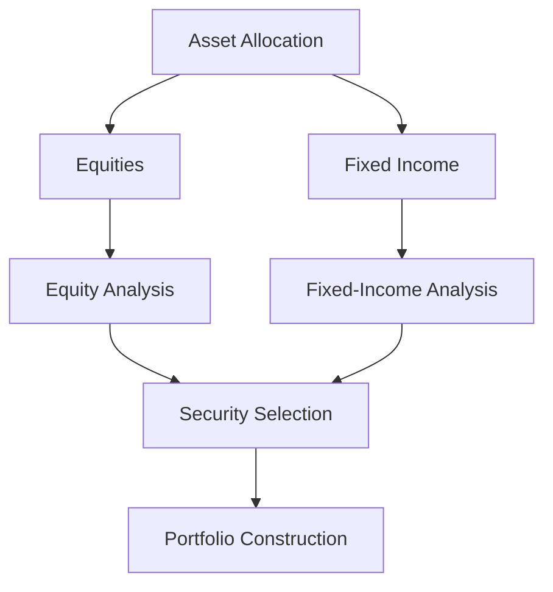

## 16.8 Select the Securities

In the realm of portfolio management, selecting the right securities is a critical step that can significantly influence the performance of an investment portfolio. This section delves into the nuances of security selection, differentiating it from asset allocation, and explores the processes and analyses involved in choosing specific securities within each asset class. We will also discuss the importance of aligning these choices with the overall investment strategy.

### Differentiating Between Asset Allocation and Security Selection

Before diving into security selection, it's essential to understand its distinction from asset allocation. Asset allocation refers to the strategic distribution of investments across various asset classes, such as equities, fixed income, and cash equivalents. This process is primarily driven by the investor's risk tolerance, investment goals, and time horizon.

On the other hand, security selection is the process of choosing individual securities within each asset class. While asset allocation sets the framework for a portfolio, security selection involves the tactical decisions that aim to optimize returns within that framework.

### The Process of Selecting Specific Securities

Security selection is a meticulous process that requires a deep understanding of the market, the specific asset class, and the individual securities. Here’s a step-by-step guide to selecting securities:

1. **Define Investment Objectives and Constraints**: Clearly outline the investment goals, risk tolerance, and any constraints such as liquidity needs or ethical considerations.

2. **Conduct Market Research**: Gather data on market trends, economic indicators, and sector performance to identify potential opportunities.

3. **Perform Security Analysis**: This involves both equity and fixed-income analysis, which we will explore in detail below.

4. **Evaluate Risk and Return**: Assess the potential risk and return of each security, considering factors such as volatility, credit risk, and interest rate sensitivity.

5. **Align with Investment Strategy**: Ensure that the selected securities align with the overall investment strategy and asset allocation plan.

6. **Monitor and Adjust**: Continuously monitor the performance of the selected securities and make adjustments as necessary to stay aligned with investment objectives.

### Role of Equity and Fixed-Income Analysis in Security Selection

#### Equity Analysis

Equity analysis involves evaluating stocks to determine their potential for growth and profitability. This analysis can be broken down into several key components:

- **Fundamental Analysis**: This involves examining a company's financial statements, management team, competitive position, and industry trends. Key metrics include earnings per share (EPS), price-to-earnings (P/E) ratio, and return on equity (ROE).

- **Technical Analysis**: This approach focuses on historical price patterns and trading volumes to forecast future price movements. Tools such as moving averages and relative strength index (RSI) are commonly used.

- **Qualitative Analysis**: Assessing non-quantifiable factors such as brand strength, customer loyalty, and management quality.

#### Fixed-Income Analysis

Fixed-income analysis focuses on evaluating bonds and other debt instruments. Key aspects include:

- **Credit Quality**: Assessing the issuer's ability to meet its debt obligations. Credit ratings from agencies like Moody's or S&P provide insights into the creditworthiness of a bond.

- **Interest Rate Risk**: Understanding how changes in interest rates affect bond prices. Duration and convexity are key metrics used to measure this risk.

- **Yield Analysis**: Evaluating the income generated by a bond relative to its price. Yield to maturity (YTM) and current yield are important considerations.

### Importance of Aligning Security Choices with the Overall Investment Strategy

Aligning security choices with the overall investment strategy is crucial for achieving desired outcomes. Each security should contribute to the portfolio's risk-return profile and help meet the investor's objectives. For instance, if the strategy emphasizes growth, selecting high-growth equities may be appropriate. Conversely, if income generation is the goal, focusing on dividend-paying stocks or high-yield bonds might be more suitable.

### Practical Example: Canadian Pension Fund Strategy

Consider a Canadian pension fund with a mandate to achieve steady growth while preserving capital. The fund's asset allocation might include 60% equities and 40% fixed income. Within equities, the fund may select a mix of Canadian blue-chip stocks and international growth stocks. For fixed income, it might choose a combination of government bonds and high-quality corporate bonds.

By aligning security selection with its strategic objectives, the pension fund can effectively manage risk and pursue its long-term goals.

### Diagrams and Visual Aids

To better understand the process of security selection, consider the following diagram illustrating the flow from asset allocation to security selection:

### Best Practices and Common Pitfalls

**Best Practices:**
- Conduct thorough research and analysis before selecting securities.
- Diversify within asset classes to mitigate risk.
- Regularly review and adjust the portfolio to reflect changing market conditions and investment goals.

**Common Pitfalls:**
- Over-concentration in a single security or sector.
- Ignoring macroeconomic trends that could impact security performance.
- Failing to align security choices with the overall investment strategy.

### Conclusion

Security selection is a critical component of the portfolio management process, requiring a blend of analytical skills and strategic thinking. By understanding the nuances of equity and fixed-income analysis and aligning security choices with investment objectives, investors can enhance their portfolio's performance and achieve their financial goals.

### Glossary

- **Security Selection**: The process of choosing individual securities to include in a portfolio.
- **Equity Analysis**: Evaluating stocks based on financial performance, growth potential, and market conditions.
- **Fixed-Income Analysis**: Assessing bonds and other debt instruments based on credit quality, interest rates, and duration.

### **Ready to Test Your Knowledge?**

**Practice 10 Essential CSC Exam Questions to Master Your Certification**



### What is the primary difference between asset allocation and security selection?

- [x] Asset allocation involves distributing investments across asset classes, while security selection involves choosing individual securities within those classes.
- [ ] Asset allocation is about selecting individual securities, while security selection is about distributing investments across asset classes.
- [ ] Asset allocation and security selection are the same processes.
- [ ] Security selection is only relevant for fixed-income investments.

> **Explanation:** Asset allocation sets the framework by distributing investments across asset classes, whereas security selection involves choosing specific securities within those classes.

### Which of the following is NOT a component of equity analysis?

- [ ] Fundamental Analysis
- [ ] Technical Analysis
- [ ] Qualitative Analysis
- [x] Credit Quality Analysis

> **Explanation:** Credit quality analysis is part of fixed-income analysis, not equity analysis.

### What is the role of credit ratings in fixed-income analysis?

- [x] To assess the issuer's ability to meet its debt obligations.
- [ ] To predict future stock price movements.
- [ ] To evaluate the management quality of a company.
- [ ] To determine the dividend yield of a stock.

> **Explanation:** Credit ratings provide insights into the creditworthiness of a bond issuer, which is crucial for fixed-income analysis.

### Why is it important to align security choices with the overall investment strategy?

- [x] To ensure each security contributes to the portfolio's risk-return profile and helps meet investment objectives.
- [ ] To maximize short-term profits regardless of risk.
- [ ] To focus solely on high-growth equities.
- [ ] To ignore macroeconomic trends.

> **Explanation:** Aligning security choices with the investment strategy ensures that the portfolio meets the investor's risk-return profile and objectives.

### Which metric is commonly used to measure interest rate risk in bonds?

- [x] Duration
- [ ] Price-to-Earnings Ratio
- [ ] Earnings Per Share
- [ ] Return on Equity

> **Explanation:** Duration is a key metric used to measure a bond's sensitivity to changes in interest rates.

### What is a common pitfall in security selection?

- [x] Over-concentration in a single security or sector.
- [ ] Diversifying within asset classes.
- [ ] Conducting thorough research and analysis.
- [ ] Regularly reviewing and adjusting the portfolio.

> **Explanation:** Over-concentration in a single security or sector can increase risk and is a common pitfall in security selection.

### Which of the following is a best practice in security selection?

- [x] Diversifying within asset classes to mitigate risk.
- [ ] Ignoring macroeconomic trends.
- [ ] Focusing only on high-yield bonds.
- [ ] Over-concentrating in one sector.

> **Explanation:** Diversifying within asset classes helps mitigate risk and is considered a best practice in security selection.

### What does yield to maturity (YTM) evaluate in bonds?

- [x] The income generated by a bond relative to its price.
- [ ] The stock price volatility.
- [ ] The company's management quality.
- [ ] The bond's credit rating.

> **Explanation:** Yield to maturity (YTM) evaluates the income generated by a bond relative to its price, considering all future coupon payments and the bond's maturity value.

### What is the first step in the security selection process?

- [x] Define investment objectives and constraints.
- [ ] Conduct market research.
- [ ] Perform security analysis.
- [ ] Evaluate risk and return.

> **Explanation:** Defining investment objectives and constraints is the first step in the security selection process, providing a foundation for subsequent steps.

### True or False: Security selection is only relevant for equity investments.

- [ ] True
- [x] False

> **Explanation:** Security selection is relevant for both equity and fixed-income investments, as it involves choosing specific securities within each asset class.


