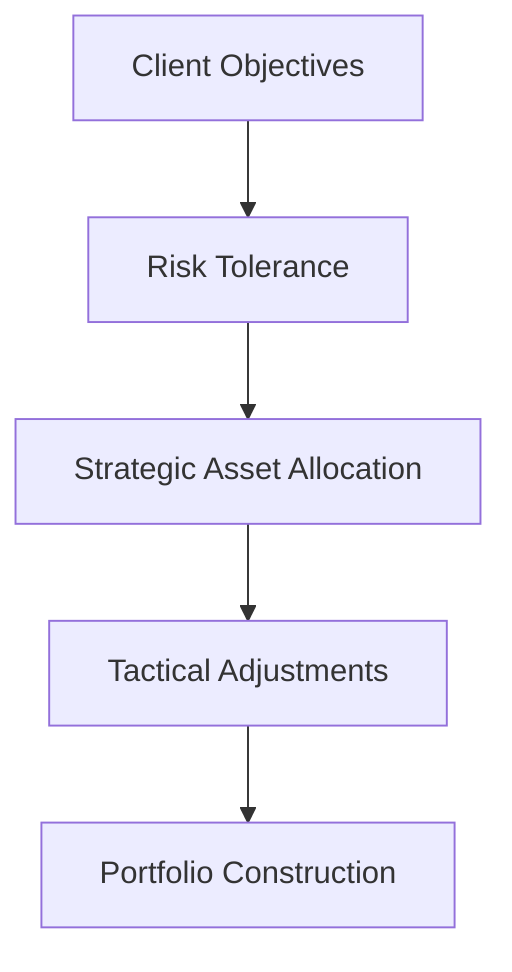

## Chapter 16: The Portfolio Management Process

In the realm of investment management, the portfolio management process is a structured approach that guides investors and financial professionals in creating and maintaining investment portfolios. This chapter delves into the seven-step portfolio management process, emphasizing its significance in achieving investment goals, particularly within the Canadian financial landscape.

### The Seven-Step Portfolio Management Process

The portfolio management process is a comprehensive framework that ensures investments are aligned with client objectives and market conditions. Here are the seven essential steps:

1. **Setting Investment Objectives and Constraints**
2. **Designing an Investment Policy Statement (IPS)**
3. **Developing an Asset Mix**
4. **Security Selection and Asset Allocation**
5. **Continuous Monitoring**
6. **Performance Evaluation**
7. **Rebalancing Strategies**

Each step is crucial in crafting a portfolio that meets the unique needs of clients while adapting to market dynamics.

### Step 1: Setting Investment Objectives and Constraints

Investment objectives are the foundation of any portfolio. They define what the investor aims to achieve, such as capital appreciation, income generation, or capital preservation. Constraints, on the other hand, are the limitations or restrictions that must be considered, including:

- **Time Horizon**: The duration over which the investment goals are to be achieved.
- **Risk Tolerance**: The investor's ability and willingness to endure market volatility.
- **Liquidity Needs**: The requirement for cash or easily convertible assets.
- **Tax Considerations**: The impact of taxes on investment returns, particularly relevant in the Canadian context with RRSPs and TFSAs.

**Example:** A young professional in Canada might prioritize growth and have a high-risk tolerance, while a retiree might focus on income and capital preservation with a low-risk tolerance.

### Step 2: Designing an Investment Policy Statement (IPS)

An Investment Policy Statement (IPS) is a formal document that outlines the investment guidelines and strategies. It serves as a roadmap for managing the portfolio and includes:

- **Investment Goals**: Clearly defined objectives.
- **Risk Tolerance and Constraints**: Detailed constraints and risk parameters.
- **Asset Allocation Strategy**: The strategic mix of asset classes.
- **Performance Benchmarks**: Standards for evaluating success.

**Case Study:** Consider a Canadian pension fund that uses an IPS to balance long-term growth with the need to meet future liabilities. The IPS would specify the fund's target asset allocation and acceptable risk levels.

### Step 3: Developing an Asset Mix

The asset mix is the combination of different asset classes, such as equities, fixed income, and alternative investments, tailored to the client's objectives and risk tolerance. This step involves:

- **Strategic Asset Allocation**: Establishing a long-term asset mix.
- **Tactical Asset Allocation**: Short-term adjustments based on market conditions.

**Diagram: Asset Allocation Strategy**

### Step 4: Security Selection and Asset Allocation

Security selection involves choosing specific investments within each asset class, while asset allocation determines the proportion of each asset class in the portfolio. Optimizing these elements can enhance portfolio performance.

**Example:** A Canadian investor might allocate 60% to equities, 30% to fixed income, and 10% to alternative investments, selecting individual stocks like RBC or TD and bonds based on their risk-return profile.

### Step 5: Continuous Monitoring

Monitoring the portfolio is essential to ensure it remains aligned with the client's objectives and market conditions. This involves:

- **Tracking Performance**: Regularly reviewing returns and risk metrics.
- **Assessing Market Conditions**: Evaluating economic indicators and market trends.
- **Adjusting for Client Changes**: Adapting to changes in the client's financial situation or goals.

### Step 6: Performance Evaluation

Evaluating portfolio performance involves measuring returns and assessing risk-adjusted performance. Key metrics include:

- **Total Return**: The overall gain or loss on the portfolio.
- **Risk-Adjusted Measures**: Metrics like the Sharpe Ratio, which considers both return and risk.

**Example:** A Canadian mutual fund might use the S&P/TSX Composite Index as a benchmark to evaluate its performance.

### Step 7: Rebalancing Strategies

Rebalancing involves adjusting the portfolio to maintain the desired asset mix. This can be triggered by:

- **Market Movements**: Significant changes in asset values.
- **Periodic Reviews**: Scheduled assessments, such as quarterly or annually.

**Best Practice:** Implementing a disciplined rebalancing strategy can help manage risk and capitalize on market opportunities.

### Common Challenges and Best Practices

**Challenges:**

- **Market Volatility**: Navigating unpredictable market conditions.
- **Behavioral Biases**: Overcoming emotional decision-making.
- **Regulatory Changes**: Adapting to evolving financial regulations.

**Best Practices:**

- **Diversification**: Spreading investments across asset classes to reduce risk.
- **Regular Reviews**: Consistently monitoring and adjusting the portfolio.
- **Education and Communication**: Keeping clients informed and engaged.

### Conclusion

The portfolio management process is a dynamic and iterative approach that requires careful planning, execution, and monitoring. By understanding and applying these seven steps, financial professionals can craft portfolios that align with client objectives and adapt to changing market conditions.

For further exploration, consider resources such as the Canadian Securities Administrators (CSA) guidelines, investment courses from the Canadian Securities Institute (CSI), and financial planning tools available through major Canadian banks.

## Quiz Time!



### What is the first step in the portfolio management process?

- [x] Setting investment objectives and constraints
- [ ] Designing an Investment Policy Statement (IPS)
- [ ] Developing an asset mix
- [ ] Security selection

> **Explanation:** Setting investment objectives and constraints is the foundational step that guides the entire portfolio management process.

### Which document serves as a roadmap for managing a portfolio?

- [ ] Asset Allocation Strategy
- [x] Investment Policy Statement (IPS)
- [ ] Performance Benchmark
- [ ] Rebalancing Plan

> **Explanation:** The Investment Policy Statement (IPS) outlines the investment guidelines and strategies, serving as a roadmap for managing the portfolio.

### What is the purpose of strategic asset allocation?

- [x] Establishing a long-term asset mix
- [ ] Making short-term adjustments
- [ ] Selecting individual securities
- [ ] Evaluating portfolio performance

> **Explanation:** Strategic asset allocation involves establishing a long-term asset mix based on client objectives and risk tolerance.

### What is a key metric for evaluating risk-adjusted performance?

- [ ] Total Return
- [x] Sharpe Ratio
- [ ] Liquidity Ratio
- [ ] Tax Efficiency

> **Explanation:** The Sharpe Ratio is a key metric for evaluating risk-adjusted performance, considering both return and risk.

### What triggers portfolio rebalancing?

- [x] Market Movements
- [ ] Security Selection
- [x] Periodic Reviews
- [ ] Tax Considerations

> **Explanation:** Rebalancing can be triggered by significant market movements or scheduled periodic reviews to maintain the desired asset mix.

### What is a common challenge in portfolio management?

- [x] Market Volatility
- [ ] Diversification
- [ ] Regular Reviews
- [ ] Education and Communication

> **Explanation:** Market volatility is a common challenge that can impact portfolio performance and requires careful management.

### What is a best practice for managing risk in a portfolio?

- [x] Diversification
- [ ] Concentration
- [x] Regular Reviews
- [ ] Emotional Decision-Making

> **Explanation:** Diversification and regular reviews are best practices for managing risk and ensuring the portfolio remains aligned with objectives.

### What should be considered when setting investment objectives?

- [x] Time Horizon
- [ ] Security Selection
- [ ] Tactical Adjustments
- [ ] Performance Benchmarks

> **Explanation:** The time horizon is a critical factor when setting investment objectives, as it influences risk tolerance and asset allocation.

### What is the role of tactical asset allocation?

- [x] Making short-term adjustments
- [ ] Establishing a long-term asset mix
- [ ] Selecting individual securities
- [ ] Designing an IPS

> **Explanation:** Tactical asset allocation involves making short-term adjustments to the asset mix based on market conditions.

### True or False: An IPS should include performance benchmarks.

- [x] True
- [ ] False

> **Explanation:** An IPS should include performance benchmarks to provide standards for evaluating the portfolio's success.


