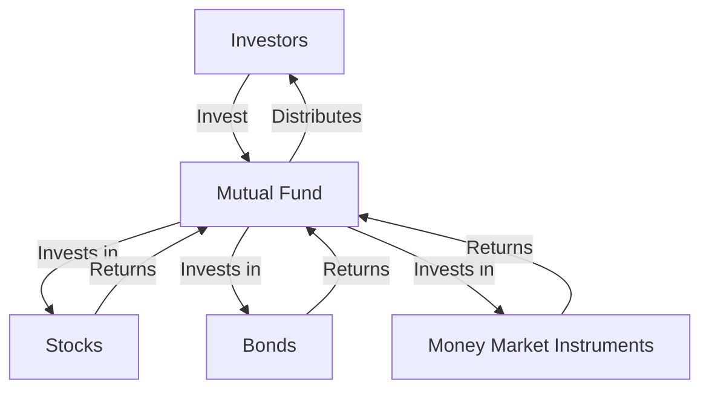

## Overview of Chapter 17

### Introduction to Mutual Funds

Mutual funds have become a cornerstone of modern investment portfolios, offering both retail and institutional investors a versatile and accessible means to diversify their holdings. This chapter delves into the intricate structure and regulatory framework governing mutual funds, highlighting their significance in the financial landscape. Understanding mutual funds is crucial for anyone involved in financial planning or investment management, as they provide a vehicle for pooling resources to invest in a diversified portfolio of assets.

### The Role of Mutual Funds in Investment Portfolios

Mutual funds play a pivotal role in investment portfolios by offering diversification, professional management, and liquidity. For retail investors, mutual funds provide an opportunity to invest in a broad range of securities with relatively low initial capital. Institutional investors, such as pension funds and insurance companies, also utilize mutual funds to achieve specific investment objectives and manage risk.

The primary advantage of mutual funds is their ability to offer diversification, which helps mitigate risk by spreading investments across various asset classes and sectors. This diversification is managed by professional fund managers who have the expertise and resources to make informed investment decisions on behalf of the fund's investors.

### Types of Managed Products

Managed products encompass a variety of investment vehicles, including mutual funds, exchange-traded funds (ETFs), and hedge funds. Among these, mutual funds are the most widely recognized and utilized by investors. They are structured as open-ended funds, meaning they can issue and redeem shares at any time, based on the fund's net asset value per share (NAVPS).

#### Key Terms

- **Mutual Fund:** An investment vehicle made up of a pool of funds collected from many investors for the purpose of investing in securities such as stocks, bonds, money market instruments, and other assets.
- **Managed Product:** A pool of capital gathered to buy securities according to a specific investment mandate, managed by an investment professional.
- **Net Asset Value per Share (NAVPS):** The value per share of a mutual fund, calculated by dividing the total net assets by the number of shares outstanding.
- **Fund Facts:** A document that provides key information about a mutual fund in plain language, helping investors make informed decisions.

### The Evolution of Mutual Funds

Mutual funds have undergone significant growth and evolution since their inception in the 1920s. Initially, they were created to provide small investors with access to professionally managed, diversified portfolios. Over the decades, mutual funds have expanded in scope and complexity, adapting to changing market conditions and investor needs.

In Canada, mutual funds have become a dominant force in the investment industry, with a wide array of funds available to meet diverse investment objectives. The regulatory framework governing mutual funds has also evolved to enhance transparency and protect investors, with institutions like the Canadian Securities Administrators (CSA) playing a crucial role.

### Regulatory Framework and Compliance

The regulatory environment for mutual funds in Canada is designed to ensure investor protection and market integrity. Key regulatory bodies, such as the CSA and the Investment Funds Institute of Canada (IFIC), establish guidelines and standards for mutual fund operations.

#### Canadian Regulatory Bodies

- **Canadian Securities Administrators (CSA):** A national organization that coordinates and harmonizes securities regulation across Canada. The CSA provides oversight and ensures compliance with securities laws.
- **Investment Funds Institute of Canada (IFIC):** Represents the investment funds industry in Canada, advocating for policies that benefit investors and the industry.

### Practical Examples and Case Studies

To illustrate the practical application of mutual funds, consider the investment strategies employed by major Canadian banks such as RBC and TD. These institutions offer a range of mutual funds tailored to different risk profiles and investment goals. For instance, a conservative investor might choose a bond fund managed by RBC, while a growth-oriented investor might opt for an equity fund offered by TD.

### Step-by-Step Guidance

When evaluating mutual funds, investors should consider several factors, including the fund's investment objective, historical performance, fees, and the expertise of the fund manager. A practical approach involves:

1. **Reviewing Fund Facts:** Analyze the Fund Facts document to understand the fund's objectives, risks, and costs.
2. **Assessing Performance:** Examine the fund's historical performance relative to its benchmark and peers.
3. **Evaluating Fees:** Consider the management expense ratio (MER) and other fees associated with the fund.
4. **Understanding the Manager's Strategy:** Research the fund manager's investment philosophy and track record.

### Diagrams and Visual Aids

To enhance understanding, consider the following diagram illustrating the flow of funds in a mutual fund structure:

### Best Practices and Common Pitfalls

Investors should adhere to best practices, such as conducting thorough due diligence and maintaining a diversified portfolio. Common pitfalls include chasing past performance and neglecting to consider fees, which can erode returns over time.

### Additional Resources

For further exploration of mutual funds and their regulation, consider the following resources:

- **Canadian Securities Administrators (CSA):** [www.securities-administrators.ca](https://www.securities-administrators.ca)
- **Investment Funds Institute of Canada (IFIC):** [www.ific.ca](https://www.ific.ca)
- **Books:**
  - "Mutual Funds for Dummies" by Eric Tyson
  - "The Bogleheads' Guide to Investing" by Taylor Larimore, Mel Lindauer, and Michael LeBoeuf
- **Online Courses:**
  - Canadian Securities Institute’s Mutual Funds Courses
  - Coursera’s "Investment Management" by University of Geneva

### Conclusion

Understanding the structure and regulation of mutual funds is essential for making informed investment decisions. By leveraging the resources and strategies outlined in this chapter, investors can effectively incorporate mutual funds into their portfolios, aligning with their financial goals and risk tolerance.

### **Ready to Test Your Knowledge?**

**Practice 10 Essential CSC Exam Questions to Master Your Certification**



### What is a mutual fund?

- [x] An investment vehicle made up of a pool of funds collected from many investors for the purpose of investing in securities.
- [ ] A type of savings account with a fixed interest rate.
- [ ] A government bond issued to finance public projects.
- [ ] A derivative used for hedging currency risk.

> **Explanation:** A mutual fund is an investment vehicle that pools funds from many investors to invest in a diversified portfolio of securities.

### What does NAVPS stand for?

- [x] Net Asset Value per Share
- [ ] National Asset Value per Share
- [ ] Net Annual Value per Share
- [ ] Nominal Asset Value per Share

> **Explanation:** NAVPS stands for Net Asset Value per Share, which is the value per share of a mutual fund.

### Which organization coordinates securities regulation across Canada?

- [x] Canadian Securities Administrators (CSA)
- [ ] Investment Funds Institute of Canada (IFIC)
- [ ] Financial Services Regulatory Authority (FSRA)
- [ ] Bank of Canada

> **Explanation:** The Canadian Securities Administrators (CSA) is responsible for coordinating securities regulation across Canada.

### What is the primary advantage of mutual funds?

- [x] Diversification
- [ ] Guaranteed returns
- [ ] Tax-free income
- [ ] High liquidity

> **Explanation:** The primary advantage of mutual funds is diversification, which helps mitigate risk by spreading investments across various asset classes.

### Which document provides key information about a mutual fund?

- [x] Fund Facts
- [ ] Prospectus
- [ ] Annual Report
- [ ] Financial Statement

> **Explanation:** Fund Facts is a document that provides key information about a mutual fund in plain language.

### What is a common pitfall when investing in mutual funds?

- [x] Chasing past performance
- [ ] Diversifying investments
- [ ] Understanding fees
- [ ] Reviewing Fund Facts

> **Explanation:** A common pitfall is chasing past performance, which may not be indicative of future results.

### Which of the following is a type of managed product?

- [x] Mutual Fund
- [ ] Savings Account
- [x] Exchange-Traded Fund (ETF)
- [ ] Corporate Bond

> **Explanation:** Both mutual funds and ETFs are types of managed products, which are professionally managed investment vehicles.

### What should investors consider when evaluating mutual funds?

- [x] Investment objective
- [ ] Past year's performance only
- [ ] Manager's age
- [ ] Fund's office location

> **Explanation:** Investors should consider the investment objective, historical performance, fees, and the expertise of the fund manager.

### What is the role of the Investment Funds Institute of Canada (IFIC)?

- [x] Represents the investment funds industry in Canada
- [ ] Regulates the banking sector
- [ ] Issues government bonds
- [ ] Manages pension funds

> **Explanation:** The IFIC represents the investment funds industry in Canada and advocates for policies that benefit investors and the industry.

### True or False: Mutual funds can only invest in stocks.

- [ ] True
- [x] False

> **Explanation:** False. Mutual funds can invest in a variety of securities, including stocks, bonds, and money market instruments.


