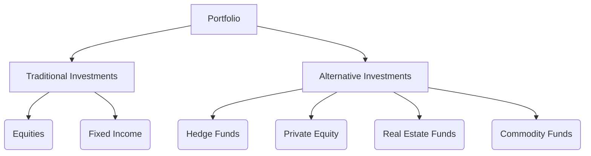

## 17.10 Alternative Investments: Benefits, Risks, and Structure

Alternative investments have become an increasingly popular component of diversified portfolios, offering unique benefits and distinct risks compared to traditional mutual funds. This section delves into the structure, benefits, and risks of alternative investments, providing a comprehensive understanding for financial professionals and investors alike.

### Understanding Alternative Investments

Alternative investments encompass a broad range of asset classes and strategies that differ from traditional equity and fixed-income investments. Key types of alternative investments include:

- **Hedge Funds:** Pooled investment funds that employ a variety of strategies to achieve active returns for investors. These strategies may include leveraging, short selling, and derivatives.
- **Private Equity:** Investments in private companies or buyouts of public companies, with the aim of improving operations and selling for a profit.
- **Real Estate Funds:** Mutual funds or ETFs that invest in real property or real estate-related securities, offering exposure to the real estate market.
- **Commodity Funds:** Funds that invest in physical commodities such as gold, oil, or agricultural products, providing a hedge against inflation and currency fluctuations.

### Benefits of Alternative Investments

Alternative investments offer several benefits that can enhance a portfolio's performance and diversification:

1. **Enhanced Diversification:** By including asset classes that are not correlated with traditional stocks and bonds, alternative investments can reduce overall portfolio volatility.

2. **Potential for Higher Returns:** Many alternative investments, such as private equity and hedge funds, have the potential to deliver higher returns due to their ability to employ sophisticated strategies and access niche markets.

3. **Access to Specialized Strategies:** Alternative investments often employ unique strategies that are not available in traditional mutual funds, such as arbitrage, distressed securities, and global macro strategies.

4. **Inflation Hedge:** Investments in commodities and real estate can provide a hedge against inflation, as their value often rises with increasing prices.

### Risks of Alternative Investments

While alternative investments offer attractive benefits, they also come with specific risks that must be carefully considered:

1. **Higher Volatility:** Many alternative investments, particularly hedge funds and commodities, can experience significant price swings, leading to higher volatility.

2. **Liquidity Constraints:** Alternative investments often have longer lock-up periods and less liquidity than traditional mutual funds, making it difficult to quickly access invested capital.

3. **Complexity:** The strategies employed by alternative investments can be complex and difficult to understand, requiring a higher level of expertise and due diligence.

4. **Regulatory Differences:** Alternative investment funds are subject to different regulatory standards than traditional mutual funds, which can affect transparency and investor protection.

### Regulatory Framework

In Canada, alternative investments are regulated differently from traditional mutual funds. The Canadian Securities Administrators (CSA) oversee the regulation of these investments, ensuring that they adhere to specific disclosure and operational standards. However, the regulatory environment for alternative investments is generally less stringent, allowing for greater flexibility in investment strategies but also requiring investors to perform thorough due diligence.

### Suitability for Different Investor Profiles

Alternative investments are not suitable for all investors. They are typically more appropriate for high-net-worth individuals and institutional investors who can tolerate higher risk and have a longer investment horizon. When advising clients, it is crucial to assess their risk tolerance, investment objectives, and overall portfolio strategy before recommending alternative investments.

### Advising Clients on Alternative Investments

When advising clients on the inclusion of alternative investments in their portfolios, consider the following guidelines:

- **Assess Risk-Return Profile:** Ensure that clients understand the risk-return profile of alternative investments and how they fit within their overall portfolio strategy.
- **Diversification Role:** Highlight the role of alternative investments in enhancing diversification and reducing portfolio volatility.
- **Complex Strategies:** Provide clear explanations of complex investment strategies used by alternative funds to ensure client comprehension and suitability.
- **Regulatory Considerations:** Discuss the regulatory environment and any implications for transparency and investor protection.

### Practical Examples and Case Studies

To illustrate the practical application of alternative investments, consider the following examples:

- **Canadian Pension Funds:** Many Canadian pension funds, such as the Canada Pension Plan Investment Board (CPPIB), allocate a portion of their portfolios to alternative investments to enhance returns and diversify risk.
- **Major Canadian Banks:** Institutions like RBC and TD offer alternative investment products, including hedge funds and real estate funds, to their high-net-worth clients, providing access to specialized strategies and markets.

### Diagrams and Visual Aids

To enhance understanding, consider the following diagram illustrating the relationship between traditional and alternative investments within a diversified portfolio:

### Conclusion

Alternative investments can play a valuable role in a diversified portfolio, offering unique benefits and distinct risks. By understanding the structure, benefits, and risks of these investments, financial professionals can better advise clients and enhance portfolio performance. As the regulatory environment continues to evolve, staying informed and performing thorough due diligence will be essential for successful investment in alternative assets.

## Quiz Time!



### Which of the following is NOT considered an alternative investment?

- [ ] Hedge Fund
- [ ] Private Equity
- [ ] Real Estate Fund
- [x] Government Bonds

> **Explanation:** Government bonds are traditional fixed-income investments, not alternative investments.

### What is a key benefit of including alternative investments in a portfolio?

- [x] Enhanced Diversification
- [ ] Guaranteed Returns
- [ ] Lower Volatility
- [ ] Immediate Liquidity

> **Explanation:** Alternative investments can enhance diversification by including asset classes that are not correlated with traditional stocks and bonds.

### Which of the following is a risk associated with alternative investments?

- [ ] High Liquidity
- [x] Higher Volatility
- [ ] Simplicity
- [ ] Guaranteed Returns

> **Explanation:** Alternative investments often experience higher volatility, which is a key risk factor.

### What regulatory body oversees alternative investments in Canada?

- [x] Canadian Securities Administrators (CSA)
- [ ] Financial Industry Regulatory Authority (FINRA)
- [ ] Securities and Exchange Commission (SEC)
- [ ] Office of the Superintendent of Financial Institutions (OSFI)

> **Explanation:** The Canadian Securities Administrators (CSA) oversee the regulation of alternative investments in Canada.

### Which investor profile is most suitable for alternative investments?

- [ ] Risk-Averse Individuals
- [x] High-Net-Worth Individuals
- [ ] Short-Term Investors
- [ ] Low-Income Individuals

> **Explanation:** High-net-worth individuals are typically more suitable for alternative investments due to their higher risk tolerance and longer investment horizon.

### What is a common strategy used by hedge funds?

- [x] Short Selling
- [ ] Buy and Hold
- [ ] Dollar-Cost Averaging
- [ ] Index Tracking

> **Explanation:** Hedge funds often use short selling as part of their diverse strategies to achieve active returns.

### How do real estate funds provide a hedge against inflation?

- [x] Real estate values often rise with increasing prices
- [ ] They have fixed returns
- [ ] They are not affected by market conditions
- [ ] They are government-backed

> **Explanation:** Real estate values often rise with increasing prices, providing a hedge against inflation.

### What is a key consideration when advising clients on alternative investments?

- [x] Risk-Return Profile
- [ ] Immediate Liquidity
- [ ] Guaranteed Returns
- [ ] Low Complexity

> **Explanation:** Understanding the risk-return profile is crucial when advising clients on alternative investments.

### Which of the following is a benefit of commodity funds?

- [x] Inflation Hedge
- [ ] Guaranteed Returns
- [ ] Low Volatility
- [ ] High Liquidity

> **Explanation:** Commodity funds can provide a hedge against inflation, as their value often rises with increasing prices.

### True or False: Alternative investments are subject to the same regulatory standards as traditional mutual funds.

- [ ] True
- [x] False

> **Explanation:** Alternative investments are subject to different regulatory standards, which can affect transparency and investor protection.


