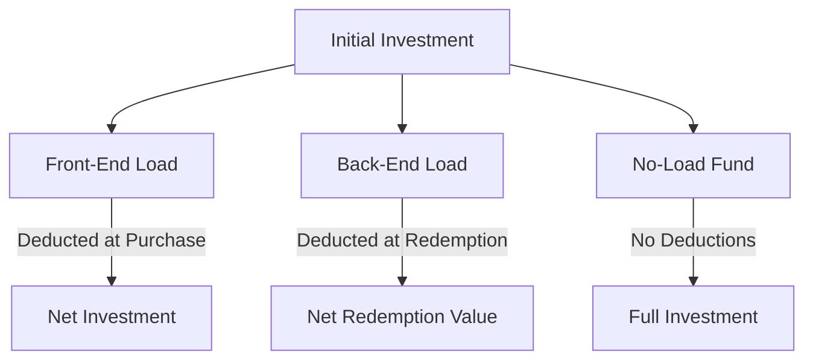

## 17.10 Load Types: Front-End, Back-End, and No-Load

In the realm of mutual funds, understanding the different types of loads is crucial for making informed investment decisions. Loads are essentially sales charges or commissions that investors pay when buying or selling mutual fund shares. These charges can significantly impact the net investment and redemption value, influencing the overall return on investment. In this section, we will delve into the three primary load types: front-end load, back-end load, and no-load, and explore their implications within the Canadian financial context.

### Front-End Load

**Definition:** A front-end load is a sales charge paid by the investor at the time of purchasing mutual fund shares. This fee is deducted from the initial investment amount, thereby reducing the total amount that is actually invested in the fund.

**Example:** Suppose an investor decides to invest CAD 10,000 in a mutual fund with a front-end load of 5%. The sales charge would be CAD 500 (5% of CAD 10,000), leaving CAD 9,500 to be invested in the fund.

**Impact on Investment:** The immediate deduction of the front-end load means that less money is working for the investor from the outset. This can affect the compounding potential of the investment over time, especially if the investor plans to hold the fund for a long period.

**Glossary:**  
- **Front-End Load:** A percentage fee applied when purchasing mutual fund shares.

### Back-End Load

**Definition:** A back-end load, also known as a deferred sales charge, is a fee paid by the investor at the time of redeeming mutual fund shares. This charge typically decreases the longer the investor holds the fund, often disappearing entirely after a certain period.

**Example:** Consider an investor who invests CAD 10,000 in a mutual fund with a back-end load that starts at 5% and decreases by 1% each year. If the investor redeems the shares after three years, the back-end load would be 2%, resulting in a CAD 200 charge on the redemption value.

**Impact on Investment:** Back-end loads encourage investors to hold their investments for longer periods, aligning with long-term investment strategies. However, they can deter investors who may need liquidity or wish to reallocate their portfolio sooner.

**Glossary:**  
- **Back-End Load:** A percentage fee applied when redeeming mutual fund shares.

### No-Load Fund

**Definition:** A no-load fund is a mutual fund that does not charge any sales loads on purchases or redemptions. This means investors can buy and sell shares without incurring any additional fees, allowing the entire investment amount to work for them.

**Example:** An investor who invests CAD 10,000 in a no-load fund will have the full amount invested without any deductions for sales charges, maximizing the potential for growth from the outset.

**Impact on Investment:** No-load funds are attractive to investors seeking to minimize costs and maximize their investment's growth potential. They are particularly beneficial for investors who frequently buy and sell mutual fund shares.

### Practical Examples and Case Studies

To illustrate the impact of these load types, let's consider a hypothetical scenario involving a Canadian investor, Sarah, who is evaluating her mutual fund options:

- **Front-End Load Scenario:** Sarah invests CAD 20,000 in a mutual fund with a 4% front-end load. The sales charge is CAD 800, leaving CAD 19,200 to be invested. Over five years, assuming an average annual return of 6%, her investment grows to approximately CAD 25,700.

- **Back-End Load Scenario:** Sarah invests the same amount in a fund with a 5% back-end load, decreasing by 1% annually. If she redeems after four years, the load is 1%, resulting in a CAD 200 charge. Assuming the same 6% annual return, her investment grows to approximately CAD 25,300 before the load is applied.

- **No-Load Fund Scenario:** Sarah invests in a no-load fund, allowing the full CAD 20,000 to be invested. With a 6% annual return, her investment grows to approximately CAD 26,750 over five years.

### Diagrams and Visuals

To better understand the impact of these load types, consider the following diagram illustrating the flow of investment and charges for each load type:

### Best Practices and Considerations

- **Evaluate Long-Term Goals:** Consider your investment horizon and liquidity needs when choosing between load types. Front-end loads may be less impactful for long-term investments, while back-end loads can be advantageous if you plan to hold the fund for several years.

- **Understand Fee Structures:** Always review the fund's prospectus to understand the fee structure and how it aligns with your investment strategy.

- **Consider Total Costs:** While no-load funds eliminate sales charges, they may have higher management fees. Evaluate the total cost of ownership, including management expense ratios (MERs).

### References and Further Reading

- **Books:**
  - "Mutual Funds For Dummies" by Eric Tyson

- **Online Articles:**
  - [Investopedia on Load Funds](https://www.investopedia.com/terms/l/loadfund.asp)

- **Canadian Financial Regulations:**
  - Review the Canadian Securities Administrators (CSA) guidelines on mutual fund fees and disclosures.

### Conclusion

Understanding the different load types is essential for making informed investment decisions in mutual funds. By considering the implications of front-end, back-end, and no-load funds, investors can align their choices with their financial goals and strategies. As you explore mutual fund options, keep in mind the importance of evaluating total costs and aligning your investments with your long-term objectives.

### **Ready to Test Your Knowledge?**

**Practice 10 Essential CSC Exam Questions to Master Your Certification**



### What is a front-end load?

- [x] A sales charge paid at the time of purchase
- [ ] A fee paid at the time of redemption
- [ ] A charge that decreases over time
- [ ] A fee that applies only to no-load funds

> **Explanation:** A front-end load is a sales charge paid when purchasing mutual fund shares, reducing the initial investment amount.

### How does a back-end load typically change over time?

- [x] It decreases the longer the investor holds the fund
- [ ] It increases the longer the investor holds the fund
- [ ] It remains constant regardless of holding period
- [ ] It applies only to no-load funds

> **Explanation:** A back-end load often decreases over time, encouraging investors to hold the fund longer.

### What is the primary advantage of a no-load fund?

- [x] No sales charges on purchases or redemptions
- [ ] Higher management fees
- [ ] Guaranteed returns
- [ ] Lower risk

> **Explanation:** No-load funds do not charge sales loads, allowing the full investment amount to work for the investor.

### Which load type is deducted at the time of purchase?

- [x] Front-End Load
- [ ] Back-End Load
- [ ] No-Load
- [ ] Deferred Load

> **Explanation:** A front-end load is deducted at the time of purchase, reducing the amount invested.

### What should investors consider when choosing between load types?

- [x] Investment horizon and liquidity needs
- [ ] Only the fund's past performance
- [x] Total cost of ownership
- [ ] The fund's name

> **Explanation:** Investors should consider their investment horizon, liquidity needs, and total costs when choosing load types.

### Which load type encourages long-term holding?

- [x] Back-End Load
- [ ] Front-End Load
- [ ] No-Load
- [ ] All of the above

> **Explanation:** Back-end loads decrease over time, encouraging investors to hold the fund longer.

### What is deducted from the initial investment in a front-end load fund?

- [x] The sales charge
- [ ] The management fee
- [x] The load percentage
- [ ] The redemption fee

> **Explanation:** The sales charge, or load percentage, is deducted from the initial investment in a front-end load fund.

### How does a no-load fund affect the initial investment?

- [x] The full amount is invested
- [ ] A portion is deducted as a fee
- [ ] It incurs a back-end load
- [ ] It requires a minimum holding period

> **Explanation:** In a no-load fund, the full investment amount is invested without deductions for sales charges.

### What is the effect of a back-end load on redemption value?

- [x] It reduces the redemption value
- [ ] It increases the redemption value
- [ ] It has no effect
- [ ] It applies only to no-load funds

> **Explanation:** A back-end load reduces the redemption value by applying a fee at the time of redemption.

### True or False: No-load funds always have lower management fees than load funds.

- [ ] True
- [x] False

> **Explanation:** No-load funds may have higher management fees, so it's important to evaluate the total cost of ownership.


