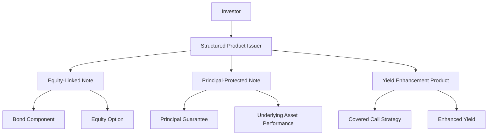

## 17.12.1 Structure and Regulation of Structured Products

Structured products are innovative financial instruments that combine traditional securities like bonds with derivatives to create customized investment solutions. They are designed to meet specific investor needs by offering tailored risk-return profiles, enhanced yield opportunities, and downside protection. In this section, we will delve into the components, regulatory framework, benefits, risks, and guidelines associated with structured products, with a focus on the Canadian financial landscape.

### Understanding the Components of Structured Products

Structured products can be complex, but understanding their components is crucial for both investors and financial professionals. Here, we explore three primary types of structured products:

#### Equity-Linked Notes (ELNs)

Equity-Linked Notes are hybrid securities that combine a bond with an equity option. They offer investors the potential for income through bond-like features and capital gains linked to the performance of a specific equity or equity index. ELNs are attractive to investors seeking exposure to equity markets with a degree of principal protection.

**Example:** Consider an ELN issued by a major Canadian bank like RBC. This note might offer a fixed coupon payment with an additional return based on the performance of the S&P/TSX Composite Index. If the index performs well, investors benefit from capital gains, while the bond component provides a steady income stream.

#### Principal-Protected Notes (PPNs)

Principal-Protected Notes guarantee the return of the initial principal amount at maturity, regardless of market conditions. They offer the opportunity for additional returns linked to the performance of an underlying asset, such as a stock index or commodity.

**Example:** A PPN issued by TD Bank might be linked to the performance of gold prices. Investors are assured of receiving their initial investment back at maturity, with the potential for additional returns if gold prices rise during the investment period.

#### Yield Enhancement Products

Yield Enhancement Products aim to provide higher income through strategies such as covered calls. These products may cap the upside potential but offer attractive yields compared to traditional fixed-income securities.

**Example:** A yield enhancement product might involve writing covered call options on a portfolio of Canadian dividend-paying stocks. This strategy generates additional income from option premiums, enhancing the overall yield of the investment.

### Regulatory Framework

Structured products in Canada are subject to a robust regulatory framework to ensure investor protection and market integrity. Key aspects of this framework include:

#### Compliance with Sector-Specific Regulations

Structured products must comply with regulations specific to the financial sector in which they operate. This includes adhering to mutual fund standards and ensuring that the products are suitable for retail investors.

#### Disclosure Requirements

Issuers of structured products are required to provide comprehensive disclosure documents that inform investors about the product's structure, risks, and fees. This transparency helps investors make informed decisions.

#### Derivatives Regulations

The use of derivatives within structured products is governed by strict regulations. These rules ensure that derivatives are used appropriately and that the associated risks are clearly communicated to investors.

### Benefits of Structured Products

Structured products offer several benefits that make them appealing to a wide range of investors:

#### Tailored Risk-Return Profiles

Structured products can be customized to match specific investor needs, offering a balance between risk and return that aligns with individual investment goals.

#### Enhanced Yield Opportunities

By incorporating derivatives and innovative strategies, structured products can provide higher income compared to traditional fixed-income securities.

#### Downside Protection

Many structured products include features that limit potential losses, making them attractive to risk-averse investors seeking capital preservation.

### Risks of Structured Products

Despite their benefits, structured products also come with inherent risks:

#### Complexity

The complex nature of structured products can make it difficult for investors to fully understand the underlying strategies and risks involved.

#### Limited Liquidity

Structured products often have limited liquidity, meaning investors may face challenges in selling them before maturity without incurring significant costs.

#### Higher Fees

The inclusion of derivative components and complex structures can result in higher fees compared to traditional investment products.

### Guidelines for Structured Products

To effectively utilize structured products, financial professionals should adhere to the following guidelines:

#### Clear Explanations

Provide clear and comprehensive explanations of how structured products work and their associated risks. This helps investors make informed decisions.

#### Suitability Assessments

Conduct thorough suitability assessments to ensure structured products align with client objectives and risk tolerance. This is crucial for maintaining investor trust and satisfaction.

#### Real-World Examples

Use real-world examples to demonstrate the performance and risk characteristics of different structured products. This practical approach enhances understanding and confidence.

### Glossary

- **Equity-Linked Note (ELN):** A debt instrument linked to the performance of a specific equity or equity index.
- **Principal-Protected Note (PPN):** An investment that guarantees the return of the initial principal amount at maturity.
- **Yield Enhancement:** Financial strategies aimed at increasing the income generated from an investment portfolio.

### Visualizing Structured Products

To better understand the structure and flow of structured products, consider the following diagram:

### Best Practices and Common Pitfalls

- **Best Practices:** Ensure transparency and clarity in communication with clients. Regularly review and update suitability assessments to reflect changing market conditions and client needs.
- **Common Pitfalls:** Avoid over-reliance on structured products without fully understanding their complexity and potential risks. Be cautious of products with limited liquidity and high fees.

### Conclusion

Structured products offer a versatile and innovative approach to investing, providing tailored solutions for diverse investor needs. By understanding their structure, regulatory framework, benefits, and risks, financial professionals can effectively incorporate these products into investment strategies. As with any financial instrument, due diligence, transparency, and client-centric practices are essential for success.

## Quiz Time!



### What is an Equity-Linked Note (ELN)?

- [x] A debt instrument linked to the performance of a specific equity or equity index.
- [ ] A bond that provides a fixed interest rate.
- [ ] A mutual fund that invests in equities.
- [ ] A derivative contract based on equity performance.

> **Explanation:** An Equity-Linked Note (ELN) is a debt instrument that combines a bond with an equity option, offering returns linked to the performance of a specific equity or equity index.

### What is the primary benefit of Principal-Protected Notes (PPNs)?

- [x] Guarantee of the return of the initial principal amount at maturity.
- [ ] Higher interest rates compared to traditional bonds.
- [ ] Unlimited upside potential.
- [ ] Immediate liquidity.

> **Explanation:** Principal-Protected Notes (PPNs) guarantee the return of the initial principal amount at maturity, providing a level of security for investors.

### Which strategy is commonly used in Yield Enhancement Products?

- [x] Covered call strategy.
- [ ] Short selling.
- [ ] Leveraged buyouts.
- [ ] Currency hedging.

> **Explanation:** Yield Enhancement Products often use a covered call strategy to generate additional income from option premiums, enhancing the overall yield.

### What is a key regulatory requirement for structured products in Canada?

- [x] Comprehensive disclosure of the product's structure, risks, and fees.
- [ ] Guaranteed returns for investors.
- [ ] No fees for investors.
- [ ] Unlimited liquidity.

> **Explanation:** Structured products in Canada must provide comprehensive disclosure documents to inform investors about the product's structure, risks, and fees.

### What is a common risk associated with structured products?

- [x] Complexity and difficulty in understanding.
- [ ] Guaranteed loss of principal.
- [ ] No potential for capital gains.
- [ ] Unlimited liquidity.

> **Explanation:** Structured products can be complex, making it difficult for investors to fully understand the underlying strategies and risks.

### How can structured products be tailored to investor needs?

- [x] By customizing risk-return profiles.
- [ ] By offering fixed interest rates.
- [ ] By eliminating all risks.
- [ ] By providing immediate liquidity.

> **Explanation:** Structured products can be customized to match specific investor needs, offering tailored risk-return profiles.

### What is a potential downside of limited liquidity in structured products?

- [x] Difficulty in selling before maturity without significant costs.
- [ ] Guaranteed loss of principal.
- [ ] No potential for capital gains.
- [ ] Unlimited upside potential.

> **Explanation:** Limited liquidity can make it difficult for investors to sell structured products before maturity without incurring significant costs.

### What should financial professionals conduct to ensure structured products align with client objectives?

- [x] Thorough suitability assessments.
- [ ] Immediate liquidity assessments.
- [ ] Guaranteed return evaluations.
- [ ] Unlimited risk analyses.

> **Explanation:** Financial professionals should conduct thorough suitability assessments to ensure structured products align with client objectives and risk tolerance.

### What is a common feature of structured products that makes them attractive to risk-averse investors?

- [x] Downside protection.
- [ ] Unlimited upside potential.
- [ ] Immediate liquidity.
- [ ] Guaranteed high returns.

> **Explanation:** Many structured products include features that limit potential losses, providing downside protection that is attractive to risk-averse investors.

### True or False: Structured products always guarantee high returns.

- [ ] True
- [x] False

> **Explanation:** Structured products do not always guarantee high returns. They offer tailored risk-return profiles and may include downside protection, but returns depend on the performance of the underlying assets and strategies used.


