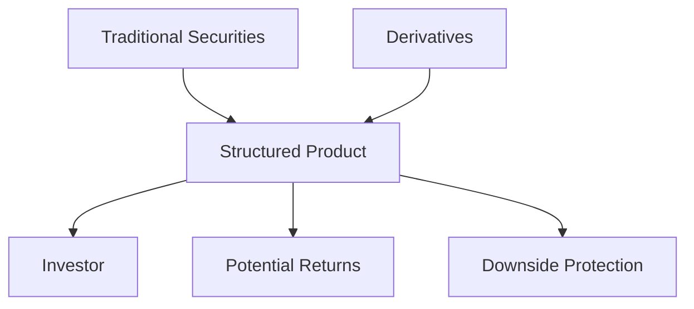

## 17.12 Structured Products

Structured products are innovative financial instruments that blend traditional securities with derivatives to meet specific investment objectives. These products are designed to offer tailored risk-return profiles, providing investors with unique opportunities to enhance yield, manage risk, and achieve specific financial goals. In this section, we will delve into the structure, benefits, risks, and regulatory environment of structured products, particularly within the Canadian mutual fund framework.

### Understanding Structured Products

Structured products are essentially pre-packaged investment strategies that combine a variety of financial instruments, including bonds, equities, and derivatives. The primary goal of these products is to offer investors a customized investment solution that aligns with their risk tolerance and return expectations.

#### Components of Structured Products

1. **Traditional Securities:** These include stocks, bonds, or other conventional financial instruments that form the base of the structured product.
2. **Derivatives:** Financial contracts such as options, futures, and swaps that derive their value from underlying assets. Derivatives are used to enhance returns, provide downside protection, or achieve other specific investment outcomes.

### Benefits of Structured Products

Structured products offer several advantages that make them attractive to certain investors:

1. **Tailored Risk-Return Profiles:** Investors can select structured products that match their specific risk tolerance and return objectives, allowing for a more personalized investment strategy.
2. **Downside Protection:** Many structured products include features that limit potential losses, providing a safety net in volatile markets.
3. **Enhanced Yield Opportunities:** By incorporating derivatives, structured products can offer higher potential returns compared to traditional investments.

### Risks Associated with Structured Products

Despite their benefits, structured products come with inherent risks that investors must consider:

1. **Complexity:** The combination of traditional securities and derivatives can make structured products difficult to understand, requiring a higher level of financial literacy.
2. **Limited Liquidity:** Structured products often have limited secondary markets, making it challenging to sell or exit the investment before maturity.
3. **Higher Fees:** The complexity and customization of structured products typically result in higher fees compared to standard investment options.

### Regulatory Environment for Structured Products

In Canada, structured products are subject to rigorous regulatory oversight to ensure investor protection and market integrity. The Canadian Securities Administrators (CSA) and the Canadian Investment Regulatory Organization (CIRO) play crucial roles in regulating these products.

#### Key Regulatory Considerations

1. **Disclosure Requirements:** Issuers of structured products must provide comprehensive information about the product's structure, risks, and costs to ensure transparency.
2. **Suitability Assessments:** Financial advisors must assess the suitability of structured products for their clients, considering the client's investment objectives, risk tolerance, and financial situation.
3. **Compliance with Securities Laws:** Structured products must adhere to Canadian securities laws and regulations, ensuring they are marketed and sold appropriately.

### Suitability and Appropriate Use of Structured Products

Structured products are not suitable for all investors. They are best suited for those with a clear understanding of the product's structure and risks, as well as a specific investment goal that aligns with the product's features.

#### Investor Profiles

1. **Risk-Averse Investors:** Those seeking downside protection may benefit from structured products with capital protection features.
2. **Yield-Seeking Investors:** Investors looking for enhanced returns may consider structured products that leverage derivatives for higher yield potential.
3. **Sophisticated Investors:** Individuals with a strong understanding of financial markets and derivatives may find structured products an effective tool for achieving complex investment strategies.

### Educating Clients on Structured Products

Financial advisors play a critical role in educating clients about the unique characteristics and potential benefits of structured products. It is essential to:

- Clearly explain the underlying components and strategies used in structured products.
- Highlight the importance of understanding the product's structure and associated risks.
- Assess the appropriateness of structured products based on the client's investment objectives and risk tolerance.

### Practical Example: Canadian Pension Funds

Consider a Canadian pension fund seeking to enhance its yield while maintaining a conservative risk profile. The fund might invest in a structured product that combines a bond with an equity option, providing a fixed income stream with the potential for additional returns if the equity market performs well. This strategy aligns with the fund's goal of achieving stable returns with limited downside risk.

### Diagram: Structure of a Typical Structured Product

Below is a simplified diagram illustrating the structure of a typical structured product:

### Conclusion

Structured products offer a unique blend of traditional and derivative instruments, providing investors with tailored investment solutions. While they offer significant benefits, including tailored risk-return profiles and enhanced yield opportunities, they also come with complexities and risks that require careful consideration. Understanding the regulatory environment and assessing the suitability of structured products for different investor profiles are crucial steps in leveraging these instruments effectively.

## Quiz Time!



### What are structured products primarily composed of?

- [x] Traditional securities and derivatives
- [ ] Only traditional securities
- [ ] Only derivatives
- [ ] Commodities and currencies

> **Explanation:** Structured products combine traditional securities with derivatives to achieve specific investment objectives.

### Which of the following is a benefit of structured products?

- [x] Tailored risk-return profiles
- [ ] Guaranteed returns
- [ ] No fees
- [ ] Unlimited liquidity

> **Explanation:** Structured products offer tailored risk-return profiles, allowing investors to align their investments with their specific risk tolerance and return expectations.

### What is a key risk associated with structured products?

- [x] Complexity
- [ ] Guaranteed losses
- [ ] No regulatory oversight
- [ ] High liquidity

> **Explanation:** The complexity of structured products can make them difficult to understand, requiring a higher level of financial literacy.

### Who regulates structured products in Canada?

- [x] Canadian Securities Administrators (CSA) and Canadian Investment Regulatory Organization (CIRO)
- [ ] Federal Reserve
- [ ] European Central Bank
- [ ] International Monetary Fund

> **Explanation:** The CSA and CIRO are responsible for regulating structured products in Canada to ensure investor protection and market integrity.

### What should financial advisors assess before recommending structured products?

- [x] Client's investment objectives and risk tolerance
- [ ] Client's favorite color
- [ ] Client's dietary preferences
- [ ] Client's travel history

> **Explanation:** Financial advisors must assess the client's investment objectives and risk tolerance to determine the suitability of structured products.

### Which investor profile might benefit from structured products with capital protection features?

- [x] Risk-averse investors
- [ ] Aggressive investors
- [ ] Speculative traders
- [ ] Day traders

> **Explanation:** Risk-averse investors may benefit from structured products with capital protection features to limit potential losses.

### What is a common feature of structured products that enhances yield opportunities?

- [x] Use of derivatives
- [ ] Fixed interest rates
- [ ] Government guarantees
- [ ] Unlimited liquidity

> **Explanation:** Structured products often use derivatives to enhance yield opportunities, offering higher potential returns.

### Why might structured products have limited liquidity?

- [x] Limited secondary markets
- [ ] High demand
- [ ] Government restrictions
- [ ] Unlimited supply

> **Explanation:** Structured products often have limited secondary markets, making it challenging to sell or exit the investment before maturity.

### What is a critical role of financial advisors regarding structured products?

- [x] Educating clients about the product's structure and risks
- [ ] Guaranteeing returns
- [ ] Eliminating all risks
- [ ] Providing free products

> **Explanation:** Financial advisors must educate clients about the structure and risks of structured products to ensure informed investment decisions.

### Structured products are suitable for all investors. True or False?

- [ ] True
- [x] False

> **Explanation:** Structured products are not suitable for all investors. They are best suited for those with a clear understanding of the product's structure and risks, as well as specific investment goals.


