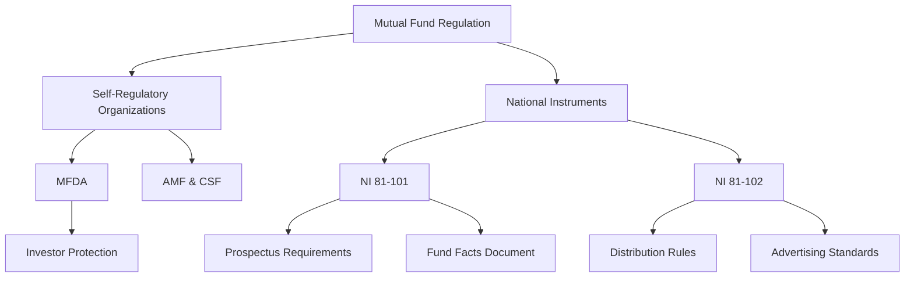

## 17.12 Mutual Fund Regulation: SROs and National Instruments

The regulation of mutual funds in Canada is a critical aspect of ensuring the integrity, transparency, and fairness of the financial markets. This section delves into the regulatory framework that governs mutual funds, focusing on the roles of Self-Regulatory Organizations (SROs) and National Instruments. Understanding these regulations is essential for financial professionals and investors alike, as they provide the foundation for investor protection and fair market practices.

### Self-Regulatory Organizations (SROs)

#### Mutual Fund Dealers Association (MFDA)

The Mutual Fund Dealers Association (MFDA) is the primary SRO responsible for overseeing the distribution side of the mutual fund industry in Canada. The MFDA's mandate includes regulating the operations, standards of practice, and business conduct of its members to ensure investor protection and market integrity.

**Key Functions of the MFDA:**

- **Regulatory Oversight:** The MFDA establishes rules and standards that its members must adhere to, covering areas such as sales practices, internal controls, and financial compliance.
- **Investor Protection:** By enforcing compliance with its rules, the MFDA helps protect investors from unethical practices and financial misconduct.
- **Dispute Resolution:** The MFDA provides mechanisms for resolving disputes between investors and mutual fund dealers, ensuring fair and efficient outcomes.

#### Quebec's Regulatory Bodies: AMF and CSF

In Quebec, the regulatory landscape includes the Autorité des marchés financiers (AMF) and the Chambre de la sécurité financière (CSF). These organizations work in tandem to regulate the financial markets and ensure the protection of investors.

- **AMF:** The AMF is the regulatory body responsible for overseeing Quebec's financial markets, including securities, insurance, and mutual funds. It ensures that financial institutions comply with regulations and maintain high standards of conduct.
- **CSF:** The CSF focuses on the professional development and ethical conduct of financial advisors in Quebec, providing oversight and guidance to ensure that advisors act in the best interests of their clients.

### National Instruments

National Instruments are regulatory frameworks established by the Canadian Securities Administrators (CSA) to govern various aspects of the securities industry, including mutual funds. Two key National Instruments relevant to mutual funds are National Instrument 81-101 and National Instrument 81-102.

#### National Instrument 81-101: Prospectus and Fund Facts

National Instrument 81-101 sets out the requirements for the disclosure of information in mutual fund prospectuses and Fund Facts documents. These documents are crucial for providing investors with clear, concise, and relevant information about mutual funds, enabling them to make informed investment decisions.

**Key Components of National Instrument 81-101:**

- **Prospectus Requirements:** Mutual funds must provide a detailed prospectus that includes information about the fund's investment objectives, strategies, risks, and fees.
- **Fund Facts Document:** This document offers a simplified overview of the mutual fund, highlighting key information such as performance, costs, and investment suitability.

#### National Instrument 81-102: Distribution and Advertising

National Instrument 81-102 governs the distribution and advertising practices of mutual funds, ensuring that these activities are conducted in a fair and transparent manner.

**Key Components of National Instrument 81-102:**

- **Distribution Rules:** The instrument sets out rules for the sale and distribution of mutual funds, including requirements for sales practices, disclosure, and investor suitability assessments.
- **Advertising Standards:** Mutual fund advertisements must be clear, accurate, and not misleading, providing investors with truthful information about the fund's performance and characteristics.

### Investor Protection and Fair Practices

The regulatory framework established by SROs and National Instruments plays a vital role in protecting investors and ensuring fair practices within the mutual fund industry. By enforcing compliance with these regulations, the Canadian financial markets maintain a high level of integrity and transparency, fostering investor confidence and market stability.

**Investor Protection Mechanisms:**

- **Disclosure Requirements:** By mandating comprehensive disclosure of information, investors are equipped with the knowledge needed to make informed decisions.
- **Compliance and Enforcement:** Regulatory bodies actively monitor and enforce compliance with regulations, deterring misconduct and ensuring accountability.

### Practical Examples and Case Studies

To illustrate the application of these regulations, consider the following examples:

- **Case Study: RBC Mutual Funds:** RBC, one of Canada's largest banks, adheres to National Instrument 81-101 by providing detailed prospectuses and Fund Facts documents for its mutual funds. This transparency helps investors understand the risks and benefits associated with their investments.
- **Example: TD Asset Management:** TD Asset Management ensures compliance with National Instrument 81-102 by conducting thorough suitability assessments for its clients, ensuring that mutual funds are appropriate for their investment goals and risk tolerance.

### Diagrams and Visual Aids

To enhance understanding, consider the following diagram illustrating the regulatory framework for mutual funds in Canada:

### Best Practices and Common Pitfalls

**Best Practices:**

- **Stay Informed:** Regularly review updates to National Instruments and SRO guidelines to ensure compliance and best practices.
- **Enhance Transparency:** Provide clear and comprehensive information to investors, fostering trust and informed decision-making.

**Common Pitfalls:**

- **Inadequate Disclosure:** Failing to provide sufficient information in prospectuses and Fund Facts documents can lead to regulatory penalties and loss of investor confidence.
- **Non-Compliance with Advertising Standards:** Misleading advertisements can result in reputational damage and regulatory action.

### Additional Resources

For further exploration of mutual fund regulations in Canada, consider the following resources:

- **National Instruments Documentation:** [National Instruments Documentation](https://www.osc.ca/laws-rules/regulations/national-instruments)
- **MFDA Resources:** [MFDA Website](https://www.mfda.ca)

### Glossary

- **Mutual Fund Dealers Association (MFDA):** The SRO responsible for the distribution side of the mutual fund industry in Canada.
- **National Instrument 81-101:** Regulations governing mutual fund prospectus and Fund Facts disclosure.

### Conclusion

Understanding the regulatory framework governing mutual funds in Canada is essential for financial professionals and investors. By adhering to the guidelines set forth by SROs and National Instruments, the mutual fund industry can maintain high standards of integrity, transparency, and investor protection. As you continue to explore the world of mutual funds, consider how these regulations impact your investment strategies and decision-making processes.

### **Ready to Test Your Knowledge?**

**Practice 10 Essential CSC Exam Questions to Master Your Certification**



### What is the primary role of the Mutual Fund Dealers Association (MFDA)?

- [x] To regulate the distribution side of the mutual fund industry in Canada
- [ ] To manage mutual fund investments directly
- [ ] To set interest rates for mutual funds
- [ ] To provide insurance for mutual fund investments

> **Explanation:** The MFDA is responsible for regulating the operations, standards of practice, and business conduct of mutual fund dealers in Canada.

### Which regulatory body oversees Quebec's financial markets?

- [ ] MFDA
- [x] AMF
- [ ] CSF
- [ ] OSC

> **Explanation:** The Autorité des marchés financiers (AMF) is the regulatory body responsible for overseeing Quebec's financial markets.

### What is the purpose of National Instrument 81-101?

- [x] To govern mutual fund prospectus and Fund Facts disclosure
- [ ] To regulate the advertising of mutual funds
- [ ] To set interest rates for mutual funds
- [ ] To manage mutual fund investments directly

> **Explanation:** National Instrument 81-101 sets out the requirements for the disclosure of information in mutual fund prospectuses and Fund Facts documents.

### What is a key component of National Instrument 81-102?

- [ ] Prospectus Requirements
- [ ] Fund Facts Document
- [x] Distribution Rules
- [ ] Interest Rate Setting

> **Explanation:** National Instrument 81-102 governs the distribution and advertising practices of mutual funds, including distribution rules.

### Which document provides a simplified overview of a mutual fund?

- [ ] Prospectus
- [x] Fund Facts Document
- [ ] Annual Report
- [ ] Financial Statement

> **Explanation:** The Fund Facts Document offers a simplified overview of the mutual fund, highlighting key information such as performance, costs, and investment suitability.

### What is the role of the Chambre de la sécurité financière (CSF) in Quebec?

- [x] To focus on the professional development and ethical conduct of financial advisors
- [ ] To regulate the distribution of mutual funds
- [ ] To manage mutual fund investments directly
- [ ] To set interest rates for mutual funds

> **Explanation:** The CSF provides oversight and guidance to ensure that financial advisors in Quebec act in the best interests of their clients.

### What is a common pitfall in mutual fund advertising?

- [x] Misleading advertisements
- [ ] Over-disclosure of information
- [ ] Underestimating fund performance
- [ ] Providing too much transparency

> **Explanation:** Misleading advertisements can result in reputational damage and regulatory action, making it a common pitfall in mutual fund advertising.

### How do National Instruments protect investors?

- [x] By enforcing comprehensive disclosure of information
- [ ] By setting interest rates for mutual funds
- [ ] By managing mutual fund investments directly
- [ ] By providing insurance for mutual fund investments

> **Explanation:** National Instruments mandate comprehensive disclosure of information, equipping investors with the knowledge needed to make informed decisions.

### What is a best practice for mutual fund dealers?

- [x] Providing clear and comprehensive information to investors
- [ ] Minimizing disclosure to protect proprietary information
- [ ] Focusing solely on fund performance
- [ ] Avoiding compliance with advertising standards

> **Explanation:** Providing clear and comprehensive information to investors fosters trust and informed decision-making, making it a best practice for mutual fund dealers.

### True or False: The MFDA is responsible for managing mutual fund investments directly.

- [ ] True
- [x] False

> **Explanation:** The MFDA is responsible for regulating the distribution side of the mutual fund industry, not for managing mutual fund investments directly.


