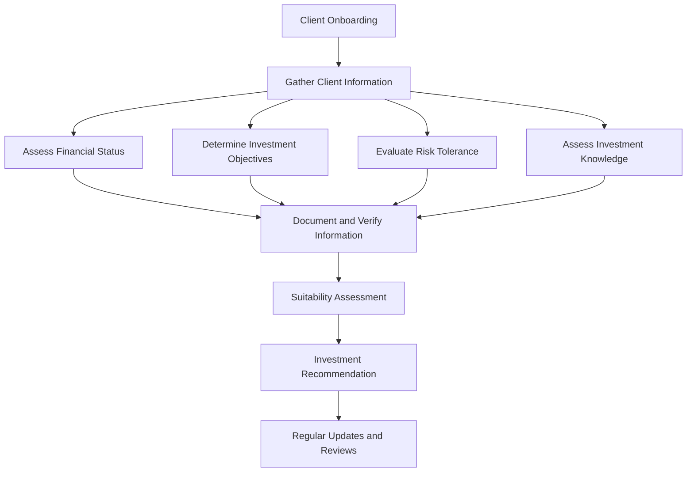

## 17.13 Know Your Client (KYC) Rule and Suitability

In the realm of Canadian mutual fund sales, the Know Your Client (KYC) rule is a cornerstone of ethical and regulatory compliance. This rule is not merely a procedural formality but a critical component in ensuring that investment recommendations are tailored to the unique financial circumstances and objectives of each client. This section delves into the intricacies of the KYC rule, the steps required for compliance, and the importance of assessing suitability in mutual fund recommendations.

### Understanding the Know Your Client (KYC) Rule

The Know Your Client (KYC) rule is a regulatory process mandated by Canadian financial authorities to verify the identity and suitability of clients engaging in investment activities. It serves as a safeguard, ensuring that financial advisors and mutual fund sales representatives have a comprehensive understanding of their clients' financial situations before making investment recommendations.

#### Significance of KYC in Mutual Fund Sales

The KYC rule is significant for several reasons:

1. **Investor Protection:** By understanding a client's financial status, investment goals, and risk tolerance, advisors can recommend suitable investment products, thereby protecting clients from unsuitable investments.
   
2. **Regulatory Compliance:** Adhering to KYC requirements is essential for compliance with Canadian financial regulations, such as those set by the Mutual Fund Dealers Association of Canada (MFDA) and the Canadian Investment Regulatory Organization (CIRO).

3. **Building Trust:** A thorough KYC process helps build trust between clients and advisors, fostering long-term relationships based on transparency and mutual understanding.

### Steps to Comply with KYC Requirements

Compliance with the KYC rule involves several key steps, each designed to gather critical information about the client:

1. **Gathering Client Information:**
   - **Financial Status:** Collect detailed information about the client's income, assets, liabilities, and overall financial health.
   - **Investment Objectives:** Understand the client's short-term and long-term investment goals, such as retirement planning, wealth accumulation, or income generation.
   - **Risk Tolerance:** Assess the client's willingness and ability to take on investment risk, which can vary widely among individuals.
   - **Investment Knowledge:** Evaluate the client's understanding of financial markets and investment products to tailor recommendations appropriately.

2. **Documentation and Verification:**
   - Ensure that all client information is accurately documented and verified through reliable sources. This includes identity verification through government-issued identification and financial documentation.

3. **Regular Updates:**
   - Client information should be regularly reviewed and updated to reflect any changes in financial circumstances or investment objectives.

### Assessing Suitability in Mutual Fund Recommendations

Suitability is a fundamental principle that ensures investment recommendations align with the client's profile. It involves a careful analysis of the client's KYC information to determine the appropriateness of specific mutual fund products.

#### Importance of Suitability Assessment

1. **Customized Investment Strategies:** Suitability assessments allow advisors to tailor investment strategies that align with the client's risk tolerance and financial goals.

2. **Risk Mitigation:** By ensuring that investments are suitable, advisors can help mitigate potential financial losses and enhance the client's investment experience.

3. **Regulatory Adherence:** Suitability assessments are a regulatory requirement, ensuring that advisors act in the best interest of their clients.

### Responsibilities of Mutual Fund Sales Representatives

Mutual fund sales representatives play a crucial role in the KYC process and in assessing suitability. Their responsibilities include:

1. **Conducting Thorough KYC Assessments:** Representatives must diligently gather and verify client information, ensuring that all aspects of the client's financial profile are understood.

2. **Maintaining and Updating Client Information:** It is essential for representatives to keep client information current, reflecting any changes in financial status or investment objectives.

3. **Providing Transparent Recommendations:** Advisors must clearly communicate the rationale behind investment recommendations, ensuring clients understand how these align with their financial goals.

### Practical Example: Applying KYC and Suitability in a Canadian Context

Consider a scenario involving a Canadian investor, Jane, who approaches a financial advisor at a major bank like RBC. Jane is 45 years old, with a stable income and moderate risk tolerance. Her primary investment objective is to save for retirement in 20 years.

1. **KYC Process:**
   - The advisor gathers detailed information about Jane's income, assets, and liabilities. They also discuss her investment knowledge and risk tolerance.
   - Jane's financial profile indicates a preference for balanced mutual funds that offer growth potential with moderate risk.

2. **Suitability Assessment:**
   - Based on Jane's KYC information, the advisor recommends a diversified portfolio of balanced mutual funds, aligning with her risk tolerance and retirement goals.
   - The advisor explains the potential risks and returns of the recommended funds, ensuring Jane understands the investment strategy.

3. **Ongoing Review:**
   - The advisor schedules regular reviews with Jane to update her financial information and adjust the investment strategy as needed.

### Visualizing the KYC Process

Below is a diagram illustrating the KYC process and its integration with suitability assessments:

### References and Additional Resources

- **MFDA’s KYC Guidelines:** For detailed guidelines on KYC compliance, visit the [MFDA KYC Resources](https://www.mfda.ca).
- **Online Courses:** Enhance your understanding of KYC with the Canadian Securities Institute’s KYC Training Modules.

### Conclusion

The Know Your Client (KYC) rule and suitability assessments are integral to the ethical and regulatory framework of mutual fund sales in Canada. By diligently applying these principles, financial advisors can ensure that investment recommendations are tailored to the unique needs and objectives of each client, fostering trust and compliance in the financial industry.

### **Ready to Test Your Knowledge?**

**Practice 10 Essential CSC Exam Questions to Master Your Certification**



### What is the primary purpose of the Know Your Client (KYC) rule?

- [x] To verify the identity and suitability of clients
- [ ] To maximize investment returns
- [ ] To reduce paperwork for advisors
- [ ] To promote specific mutual funds

> **Explanation:** The KYC rule is designed to verify the identity and suitability of clients, ensuring that investment recommendations are appropriate for their financial situation.

### Which of the following is NOT a component of the KYC process?

- [ ] Gathering client financial status
- [ ] Assessing investment objectives
- [ ] Evaluating risk tolerance
- [x] Maximizing sales commissions

> **Explanation:** The KYC process focuses on understanding the client's financial profile, not on maximizing sales commissions.

### Why is suitability assessment important in mutual fund recommendations?

- [x] It ensures recommendations align with the client's profile
- [ ] It guarantees high returns
- [ ] It simplifies the investment process
- [ ] It reduces the need for documentation

> **Explanation:** Suitability assessments ensure that investment recommendations are aligned with the client's financial situation and objectives.

### What is a key responsibility of mutual fund sales representatives regarding KYC?

- [x] Maintaining and updating client information
- [ ] Guaranteeing investment returns
- [ ] Offering only high-risk investments
- [ ] Avoiding client communication

> **Explanation:** Sales representatives must maintain and update client information to ensure ongoing suitability of investment recommendations.

### Which Canadian regulatory body provides guidelines for KYC compliance?

- [x] MFDA
- [ ] SEC
- [ ] FINRA
- [ ] ASIC

> **Explanation:** The Mutual Fund Dealers Association of Canada (MFDA) provides guidelines for KYC compliance.

### What should an advisor do if a client's financial situation changes significantly?

- [x] Update the client's KYC information and reassess suitability
- [ ] Ignore the changes
- [ ] Recommend riskier investments
- [ ] Focus on short-term gains

> **Explanation:** Advisors should update the client's KYC information and reassess the suitability of their investment strategy.

### How often should client information be reviewed and updated?

- [x] Regularly, as needed
- [ ] Once a year
- [ ] Every five years
- [ ] Only at the initial meeting

> **Explanation:** Client information should be reviewed and updated regularly to reflect any changes in their financial situation or objectives.

### What is the outcome of a successful KYC process?

- [x] Tailored investment recommendations
- [ ] Guaranteed profits
- [ ] Reduced regulatory oversight
- [ ] Increased sales targets

> **Explanation:** A successful KYC process results in tailored investment recommendations that align with the client's financial profile.

### True or False: Suitability assessments are optional for mutual fund sales representatives.

- [ ] True
- [x] False

> **Explanation:** Suitability assessments are a mandatory part of the investment recommendation process to ensure compliance and client protection.

### What is the role of risk tolerance in the KYC process?

- [x] To determine the client's ability to handle investment risk
- [ ] To predict market trends
- [ ] To increase sales commissions
- [ ] To simplify documentation

> **Explanation:** Risk tolerance is assessed to determine the client's ability and willingness to handle investment risk, guiding suitable investment recommendations.


