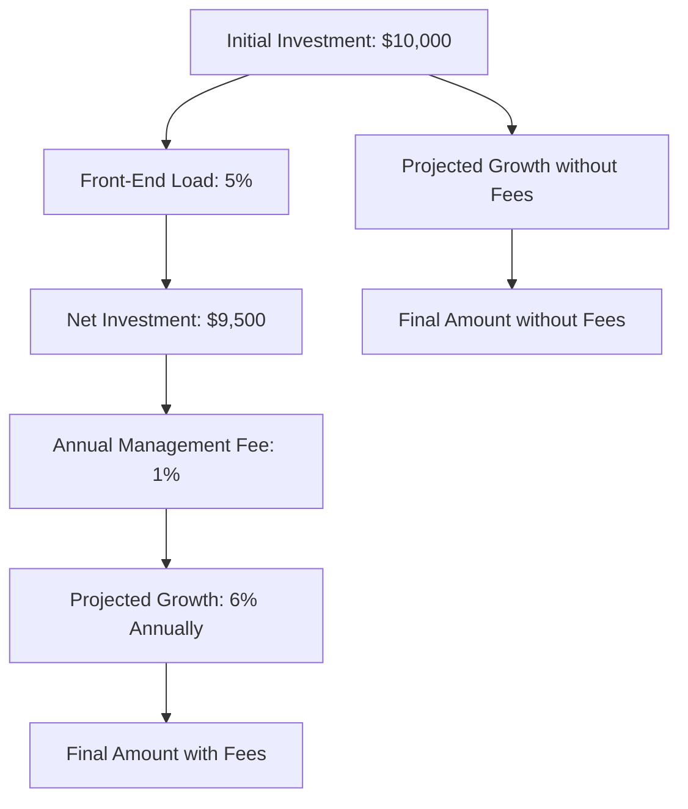

## 17.17 Mutual Fund Fee Impact Calculator

In the world of investing, mutual funds are a popular choice for many Canadians due to their diversification and professional management. However, one critical aspect that can significantly impact the returns from mutual funds is the fees associated with them. Understanding these fees and their long-term impact on your investment is crucial for making informed financial decisions. This is where the Mutual Fund Fee Impact Calculator becomes an invaluable tool.

### Introduction to the Mutual Fund Fee Impact Calculator

The Mutual Fund Fee Impact Calculator is designed to help investors visualize how different types of fees can affect their investment returns over time. By inputting various parameters, investors can see a clear picture of how fees such as front-end loads, back-end loads, and management fees can erode their potential gains. This tool is essential for anyone looking to compare mutual funds and make cost-effective investment choices.

### How to Use the Mutual Fund Fee Impact Calculator

Using the Mutual Fund Fee Impact Calculator involves a few straightforward steps. Here’s a guide to help you navigate this tool effectively:

#### Step 1: Input Initial Investment Amount

Begin by entering the initial amount you plan to invest. This is the starting point for your investment journey and will serve as the base for calculating potential returns.

#### Step 2: Select Fee Types

Mutual funds come with various fee structures, and it’s important to understand each type:

- **Front-End Load:** A fee paid upfront when purchasing shares of a mutual fund. This fee is deducted from your initial investment.
- **Back-End Load:** Also known as a deferred sales charge, this fee is paid when you sell your mutual fund shares. It typically decreases over time.
- **Management Fees:** These are ongoing fees paid to the fund manager for managing the fund. They are usually expressed as a percentage of the fund’s assets.

Select the applicable fees for your mutual fund to see how they impact your investment.

#### Step 3: Project Investment Growth Over Time

With the initial investment and fees set, the calculator will project the growth of your investment over a specified period. You can compare scenarios with and without fees to understand their impact on your returns.

### Importance of Considering Fees

Fees can significantly erode your investment gains over time. Even small percentage differences in fees can lead to substantial differences in returns, especially over long investment horizons. Therefore, when comparing mutual funds, it’s crucial to consider the total cost of ownership, including all associated fees.

### Practical Example

Consider an investor who plans to invest $10,000 in a mutual fund with a 5% front-end load, a 1% annual management fee, and an expected annual return of 6%. Without fees, the investment would grow to approximately $17,908 over 10 years. However, after accounting for the front-end load and management fees, the final amount would be significantly lower. This example illustrates the importance of understanding and minimizing fees to maximize returns.

### Visualizing the Impact of Fees

To better understand the impact of fees, let’s use a diagram to illustrate the flow of investment with and without fees:

### References and Resources

For further exploration and to use a practical tool, consider the following resources:

- [GetSmarterAboutMoney.ca Fee Impact Calculator](https://www.getsmarteraboutmoney.ca/tools/mutual-fund-fee-impact-calculator/): An excellent resource for Canadian investors to calculate the impact of mutual fund fees.
- [Canada.ca Investment Calculators](https://www.canada.ca/en/services/business/money.html): Offers a variety of calculators to help with financial planning and investment decisions.

### Glossary

- **Fee Impact Calculator:** A tool that calculates the effect of various mutual fund fees on investment returns over time.

### Conclusion

Understanding the impact of fees on mutual fund investments is crucial for maximizing returns. By using tools like the Mutual Fund Fee Impact Calculator, investors can make more informed decisions and choose funds that align with their financial goals while minimizing unnecessary costs. Always consider the total cost of ownership when evaluating mutual funds to ensure that fees do not erode your investment gains.

### **Ready to Test Your Knowledge?**

**Practice 10 Essential CSC Exam Questions to Master Your Certification**



### What is the primary purpose of the Mutual Fund Fee Impact Calculator?

- [x] To help investors understand how different fees affect their returns
- [ ] To predict stock market trends
- [ ] To calculate taxes on investments
- [ ] To determine the best time to buy mutual funds

> **Explanation:** The Mutual Fund Fee Impact Calculator is designed to show how various fees impact investment returns over time.

### Which of the following is a type of fee that can be selected in the Mutual Fund Fee Impact Calculator?

- [x] Front-End Load
- [ ] Dividend Fee
- [x] Management Fee
- [ ] Currency Exchange Fee

> **Explanation:** The calculator includes options for front-end loads and management fees, among others.

### How does a front-end load fee affect your initial investment?

- [x] It reduces the initial investment amount
- [ ] It increases the initial investment amount
- [ ] It has no effect on the initial investment amount
- [ ] It is applied only at the end of the investment period

> **Explanation:** A front-end load is deducted from the initial investment, reducing the amount that is actually invested.

### Why is it important to consider fees when comparing mutual funds?

- [x] Fees can significantly erode investment gains over time
- [ ] Fees determine the risk level of the fund
- [ ] Fees are the only factor in choosing a mutual fund
- [ ] Fees guarantee higher returns

> **Explanation:** Fees can have a substantial impact on long-term returns, making it important to consider them when comparing funds.

### What is the effect of a 1% annual management fee on an investment?

- [x] It reduces the investment's annual return
- [ ] It increases the investment's annual return
- [ ] It has no effect on the investment's annual return
- [ ] It only affects the investment if sold within a year

> **Explanation:** An annual management fee reduces the net return of the investment each year.

### Which online resource provides a tool specifically for calculating the impact of mutual fund fees?

- [x] GetSmarterAboutMoney.ca
- [ ] Canada Revenue Agency
- [ ] Statistics Canada
- [ ] Bank of Canada

> **Explanation:** GetSmarterAboutMoney.ca offers a specific tool for calculating mutual fund fee impacts.

### What is a back-end load fee?

- [x] A fee paid when selling mutual fund shares
- [ ] A fee paid when buying mutual fund shares
- [ ] A fee paid annually
- [ ] A fee paid only if the fund performs well

> **Explanation:** A back-end load is a fee charged when shares are sold, often decreasing over time.

### How can investors minimize the impact of fees on their mutual fund investments?

- [x] By choosing funds with lower fees
- [ ] By investing in more funds
- [ ] By only investing in high-risk funds
- [ ] By avoiding all mutual funds

> **Explanation:** Selecting funds with lower fees can help minimize their impact on returns.

### True or False: The Mutual Fund Fee Impact Calculator can project investment growth both with and without fees.

- [x] True
- [ ] False

> **Explanation:** The calculator allows users to see projections with and without fees to understand their impact.

### What is the main benefit of using the Mutual Fund Fee Impact Calculator?

- [x] It helps investors make informed decisions by visualizing fee impacts
- [ ] It guarantees higher returns
- [ ] It eliminates all investment risks
- [ ] It predicts future market conditions

> **Explanation:** The calculator aids in understanding how fees affect returns, helping investors make informed choices.


