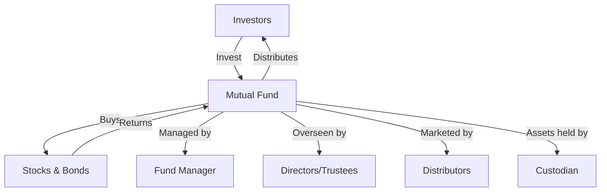

## 17.2 Overview of Mutual Funds

Mutual funds are a cornerstone of modern investment strategies, offering investors a diversified portfolio managed by professional fund managers. This section delves into the advantages and disadvantages of mutual funds, the different types of fund structures, and their suitability for various investment goals and risk tolerances.

### Advantages and Disadvantages of Mutual Funds

#### Advantages

1. **Diversification**: Mutual funds pool money from many investors to purchase a wide array of securities, reducing the risk associated with investing in individual stocks or bonds. This diversification helps mitigate the impact of poor performance by a single security.

2. **Professional Management**: Investors benefit from the expertise of professional fund managers who make informed decisions based on extensive research and market analysis.

3. **Liquidity**: Mutual funds are generally liquid, allowing investors to buy or sell shares at the net asset value per share (NAVPS) at the end of each trading day.

4. **Accessibility**: With relatively low minimum investment requirements, mutual funds are accessible to a broad range of investors.

5. **Variety**: There are numerous types of mutual funds, including equity, bond, balanced, and index funds, catering to different investment objectives and risk profiles.

#### Disadvantages

1. **Fees and Expenses**: Mutual funds charge management fees and other expenses, which can erode returns over time. It's crucial for investors to understand the fee structure before investing.

2. **Lack of Control**: Investors relinquish control over individual investment decisions to the fund manager, which may not align with their personal investment philosophy.

3. **Tax Implications**: Mutual funds may distribute taxable capital gains and dividends to investors, impacting after-tax returns.

4. **Performance Variability**: Not all mutual funds outperform the market, and past performance is not indicative of future results.

### Types of Mutual Fund Structures

Mutual funds can be structured as open-end trusts or corporations, each with distinct characteristics affecting taxation, distribution, and investor rights.

#### Open-End Trusts

Open-end trusts are the most common mutual fund structure in Canada. They allow investors to buy and sell shares directly from the fund at the NAVPS. This structure offers several benefits:

- **Tax Efficiency**: Open-end trusts can pass income directly to investors, potentially offering tax advantages.
- **Flexibility**: Investors can enter or exit the fund at any time, providing liquidity.
- **Investor Rights**: Shareholders have voting rights on significant fund decisions, such as changes in investment objectives.

#### Corporations

Mutual funds structured as corporations may offer different tax treatments and shareholder rights compared to trusts. Key features include:

- **Tax Treatment**: Corporations may retain earnings and reinvest them, potentially deferring taxes for investors.
- **Shareholder Rights**: Investors in corporate mutual funds are shareholders with rights similar to those in a traditional corporation, including voting on corporate matters.
- **Distribution**: Corporations may distribute dividends to shareholders, which can be reinvested or taken as income.

### Impact of Structure on Taxation, Distribution, and Investor Rights

The choice between an open-end trust and a corporation affects various aspects of mutual fund operations:

- **Taxation**: Open-end trusts generally pass income directly to investors, who are then taxed on their share of the income. Corporations may offer deferred taxation, as they can retain and reinvest earnings.
- **Distribution**: Trusts typically distribute income regularly, while corporations may reinvest earnings, affecting the timing and nature of distributions.
- **Investor Rights**: Trusts often provide more direct voting rights on fund matters, whereas corporate structures may limit shareholder influence.

### Suitability of Different Mutual Fund Types

When selecting a mutual fund, investors should consider their investment goals, risk tolerance, and time horizon. Here are some common types of mutual funds and their suitability:

- **Equity Funds**: Suitable for investors seeking long-term growth and willing to accept higher volatility.
- **Bond Funds**: Ideal for those seeking income and lower risk, though they may be sensitive to interest rate changes.
- **Balanced Funds**: Offer a mix of stocks and bonds, providing growth potential with reduced volatility.
- **Index Funds**: Track a specific market index, offering broad market exposure with lower fees.

### Roles in Mutual Fund Operations

Understanding the roles of various entities involved in mutual fund operations is crucial for investors:

- **Directors and Trustees**: Oversee the fund's operations and ensure compliance with regulations.
- **Fund Managers**: Make investment decisions and manage the fund's portfolio.
- **Distributors**: Market and sell the fund to investors.
- **Custodians**: Safeguard the fund's assets, ensuring they are held securely and accurately accounted for.

### Practical Example: Canadian Pension Funds

Consider a Canadian pension fund investing in mutual funds to achieve a diversified portfolio. By selecting a mix of equity and bond funds, the pension fund can balance growth and income objectives while managing risk. The choice between open-end trusts and corporate structures will depend on the fund's tax strategy and distribution preferences.

### Diagram: Mutual Fund Structure and Flow

Below is a diagram illustrating the flow of funds and roles within a mutual fund structure:

### Best Practices and Common Pitfalls

- **Best Practices**: Regularly review mutual fund performance, fees, and alignment with investment goals. Consider tax implications and the impact of distributions on overall returns.
- **Common Pitfalls**: Failing to understand the fee structure, overlooking tax consequences, and not aligning fund selection with investment objectives.

### Conclusion

Mutual funds offer a versatile investment vehicle for achieving a wide range of financial goals. By understanding the advantages, disadvantages, and structural differences, investors can make informed decisions that align with their objectives and risk tolerance. As the Canadian financial landscape evolves, staying informed about regulatory changes and market trends is essential for successful mutual fund investing.

## Quiz Time!



### What is one advantage of investing in mutual funds?

- [x] Diversification
- [ ] High fees
- [ ] Lack of control
- [ ] Tax inefficiency

> **Explanation:** Diversification is a key advantage of mutual funds, as they allow investors to spread risk across a wide array of securities.

### Which mutual fund structure allows investors to buy and sell shares at the NAVPS?

- [x] Open-End Trust
- [ ] Corporation
- [ ] Closed-End Fund
- [ ] Exchange-Traded Fund

> **Explanation:** Open-end trusts allow investors to buy and sell shares directly from the fund at the net asset value per share (NAVPS).

### What role does a custodian play in mutual fund operations?

- [x] Safeguards the fund's assets
- [ ] Manages the fund's portfolio
- [ ] Markets the fund to investors
- [ ] Oversees the fund's operations

> **Explanation:** A custodian is responsible for holding and safeguarding the mutual fund’s assets.

### What is a disadvantage of mutual funds?

- [x] Fees and Expenses
- [ ] Professional Management
- [ ] Liquidity
- [ ] Accessibility

> **Explanation:** Fees and expenses can erode returns over time, making them a disadvantage of mutual funds.

### Which type of mutual fund is suitable for investors seeking long-term growth?

- [x] Equity Funds
- [ ] Bond Funds
- [x] Balanced Funds
- [ ] Money Market Funds

> **Explanation:** Equity funds and balanced funds are suitable for investors seeking long-term growth, though balanced funds offer reduced volatility.

### How does the choice of mutual fund structure affect taxation?

- [x] Open-end trusts pass income directly to investors
- [ ] Corporations always offer tax-free distributions
- [ ] Trusts defer taxes indefinitely
- [ ] Corporations distribute income regularly

> **Explanation:** Open-end trusts generally pass income directly to investors, who are then taxed on their share of the income.

### What is one role of fund managers in mutual fund operations?

- [x] Make investment decisions
- [ ] Safeguard the fund's assets
- [x] Market the fund to investors
- [ ] Oversee the fund's operations

> **Explanation:** Fund managers are responsible for making investment decisions and managing the fund's portfolio.

### Which type of mutual fund structure may offer deferred taxation?

- [x] Corporation
- [ ] Open-End Trust
- [ ] Closed-End Fund
- [ ] Exchange-Traded Fund

> **Explanation:** Corporations may offer deferred taxation, as they can retain and reinvest earnings.

### What is a common pitfall when investing in mutual funds?

- [x] Overlooking tax consequences
- [ ] Understanding the fee structure
- [ ] Aligning fund selection with investment objectives
- [ ] Regularly reviewing fund performance

> **Explanation:** Overlooking tax consequences can impact after-tax returns and is a common pitfall when investing in mutual funds.

### True or False: Mutual funds are generally illiquid.

- [ ] True
- [x] False

> **Explanation:** Mutual funds are generally liquid, allowing investors to buy or sell shares at the net asset value per share (NAVPS) at the end of each trading day.


