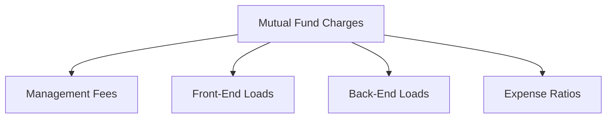

## 17.1 Learning Objectives

In Chapter 17 of the CSC® Exam Prep Guide: Volume 2, we delve into the intricate world of mutual funds, focusing on their structure and regulation within the Canadian financial landscape. This chapter aims to equip you with a comprehensive understanding of mutual funds, enabling you to make informed decisions and provide sound advice in your professional practice. Below, we outline the key learning objectives that will guide your exploration of this topic.

### 1. Identify the Advantages and Disadvantages of Managed Products

Managed products, such as mutual funds, offer investors a range of benefits, including professional management, diversification, and liquidity. However, they also come with certain drawbacks, such as management fees and potential underperformance compared to benchmarks. Understanding these pros and cons is crucial for advising clients on whether managed products align with their investment goals and risk tolerance.

#### Practical Example:
Consider a Canadian investor looking to diversify their portfolio. A mutual fund managed by a reputable firm like RBC Global Asset Management might offer the diversification and professional oversight they seek. However, the investor must weigh these benefits against the fund's management fees and historical performance.

### 2. Describe the Benefits and Drawbacks of Mutual Funds and Understand Different Fund Structures

Mutual funds are structured in various ways, including open-end and closed-end funds, each with unique characteristics. Open-end funds allow investors to buy and sell shares at the net asset value (NAV), while closed-end funds have a fixed number of shares traded on the stock exchange. Understanding these structures helps in evaluating their suitability for different investment strategies.

#### Case Study:
A Canadian pension fund might choose a closed-end fund for its potential to trade at a premium or discount to NAV, offering opportunities for strategic buying and selling. Conversely, an individual investor might prefer an open-end fund for its liquidity and ease of access.

### 3. Calculate a Mutual Fund’s Net Asset Value Per Share (NAVPS) and Comprehend Pricing Mechanisms

The NAVPS is a critical metric for mutual funds, representing the per-share value of the fund's assets minus liabilities. Calculating NAVPS involves dividing the total net assets by the number of outstanding shares. Understanding how NAVPS is determined and its role in pricing mechanisms is essential for evaluating fund performance and making informed investment decisions.

#### Step-by-Step Guidance:
1. **Determine Total Assets:** Sum the market value of all securities held by the fund.
2. **Subtract Liabilities:** Deduct any liabilities the fund owes.
3. **Divide by Outstanding Shares:** Divide the net assets by the total number of shares outstanding to get the NAVPS.

### 4. Analyze the Impacts of Various Charges Associated with Mutual Funds

Mutual funds come with various charges, including management fees, front-end loads, back-end loads, and expense ratios. These charges can significantly impact an investor's returns. Analyzing these costs helps in selecting funds that offer the best value relative to their performance.

#### Diagram:

### 5. Understand Mutual Fund Regulatory Requirements

Mutual funds in Canada are subject to stringent regulatory requirements to protect investors. These regulations cover fund registration, disclosure, and compliance with the Investment Funds Institute of Canada (IFIC) standards. Familiarity with these requirements ensures adherence to legal and ethical standards in fund management and sales.

#### Reference:
- **Investment Funds Institute of Canada (IFIC) Educational Resources:** [www.ific.ca/en/education](https://www.ific.ca/en/education)

### 6. Recognize Mutual Fund Restrictions and Prohibited Selling Practices

Certain restrictions and prohibited practices, such as churning and unsuitable recommendations, are in place to safeguard investors. Recognizing these limitations is vital for maintaining ethical standards and avoiding regulatory penalties.

### 7. Explain the Know Your Client (KYC) Rule, Product Requirements, and Suitability Standards

The KYC rule mandates that financial advisors gather detailed information about their clients' financial situations, investment objectives, and risk tolerance. This information is crucial for making suitable investment recommendations and ensuring compliance with regulatory standards.

#### Glossary:
- **Suitability:** The appropriateness of an investment recommendation based on the client’s financial situation, investment objectives, and risk tolerance.
- **Know Your Client (KYC):** A regulatory requirement to verify the identity, suitability, and assess the risks involved with maintaining a business relationship.

### 8. Discuss the Elements That Must Be Included in Client Disclosure Documents and Circumstances Requiring Updates to KYC Information

Client disclosure documents must include comprehensive information about the mutual fund, including its objectives, risks, fees, and past performance. Regular updates to KYC information are necessary to reflect changes in a client's financial situation or investment goals, ensuring ongoing suitability of investment recommendations.

#### Best Practices:
- Regularly review and update client information.
- Ensure transparency in all client communications.
- Maintain thorough records of client interactions and recommendations.

### Conclusion

Understanding these learning objectives is crucial for navigating the complex landscape of mutual funds in Canada. By mastering these concepts, you will be better equipped to advise clients, manage portfolios, and comply with regulatory requirements. As you progress through this chapter, consider how each objective applies to real-world scenarios and how you can integrate these insights into your professional practice.

For further exploration, consider visiting the Bank of Canada's website for additional resources on Canadian financial regulations: [www.bankofcanada.ca](https://www.bankofcanada.ca).

### **Ready to Test Your Knowledge?**

**Practice 10 Essential CSC Exam Questions to Master Your Certification**



### What is a key advantage of managed products like mutual funds?

- [x] Professional management
- [ ] Guaranteed returns
- [ ] No fees
- [ ] Unlimited liquidity

> **Explanation:** Managed products offer professional management, which is a key advantage for investors seeking expert oversight of their investments.

### Which type of mutual fund allows investors to buy and sell shares at the net asset value?

- [x] Open-end fund
- [ ] Closed-end fund
- [ ] Exchange-traded fund
- [ ] Hedge fund

> **Explanation:** Open-end funds allow investors to buy and sell shares at the net asset value, providing liquidity and flexibility.

### How is the Net Asset Value Per Share (NAVPS) calculated?

- [x] Total net assets divided by the number of outstanding shares
- [ ] Total liabilities divided by the number of outstanding shares
- [ ] Total assets divided by the number of outstanding shares
- [ ] Total net assets divided by total liabilities

> **Explanation:** NAVPS is calculated by dividing the total net assets by the number of outstanding shares, reflecting the per-share value of the fund.

### What is a common charge associated with mutual funds?

- [x] Management fees
- [ ] Interest payments
- [ ] Dividend fees
- [ ] Capital gains tax

> **Explanation:** Management fees are a common charge associated with mutual funds, covering the cost of professional management.

### Which organization provides educational resources on mutual fund regulations in Canada?

- [x] Investment Funds Institute of Canada (IFIC)
- [ ] Canadian Securities Administrators (CSA)
- [ ] Bank of Canada
- [ ] Toronto Stock Exchange (TSX)

> **Explanation:** The Investment Funds Institute of Canada (IFIC) provides educational resources on mutual fund regulations in Canada.

### What is the purpose of the Know Your Client (KYC) rule?

- [x] To verify client identity and assess investment suitability
- [ ] To ensure clients pay taxes
- [ ] To track client spending habits
- [ ] To monitor client credit scores

> **Explanation:** The KYC rule is designed to verify client identity and assess the suitability of investment recommendations based on their financial situation and goals.

### What must be included in client disclosure documents?

- [x] Fund objectives, risks, fees, and past performance
- [ ] Client's personal spending habits
- [ ] Detailed tax history
- [ ] Credit score

> **Explanation:** Client disclosure documents must include comprehensive information about the mutual fund, such as objectives, risks, fees, and past performance.

### What is a prohibited selling practice in mutual funds?

- [x] Churning
- [ ] Diversification
- [ ] Asset allocation
- [ ] Rebalancing

> **Explanation:** Churning, or excessive trading to generate commissions, is a prohibited selling practice in mutual funds.

### When should KYC information be updated?

- [x] When there are changes in a client's financial situation or investment goals
- [ ] Annually, regardless of changes
- [ ] Only when requested by the client
- [ ] Every five years

> **Explanation:** KYC information should be updated whenever there are changes in a client's financial situation or investment goals to ensure ongoing suitability.

### True or False: Closed-end funds have a fixed number of shares traded on the stock exchange.

- [x] True
- [ ] False

> **Explanation:** Closed-end funds have a fixed number of shares that are traded on the stock exchange, unlike open-end funds.


