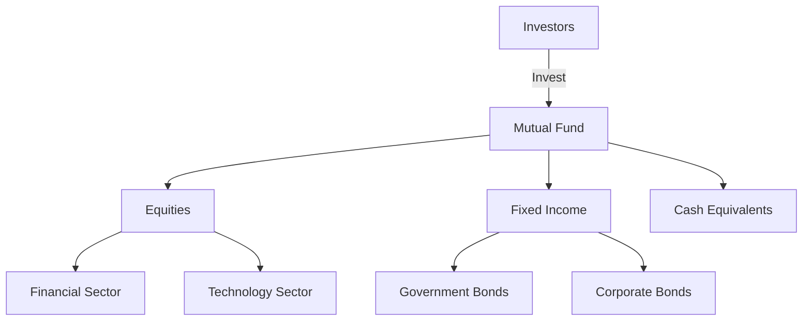

## Additional Resources for Chapter 17

Mutual funds are a cornerstone of investment portfolios for many Canadians, offering diversification, professional management, and accessibility. Understanding their structure and regulation is crucial for both investors and financial professionals. This section provides a curated list of additional resources to deepen your understanding of mutual funds, focusing on Canadian contexts and regulations.

### Books

#### "The Mutual Fund Industry: Performance, Pricing and Structure" by James M. Cliff

This book provides an in-depth analysis of the mutual fund industry, focusing on performance metrics, pricing strategies, and structural components. It offers insights into how mutual funds are managed and evaluated, making it a valuable resource for understanding the intricacies of fund management and investor expectations.

**Key Topics Covered:**
- Historical performance trends in mutual funds
- Pricing models and fee structures
- The impact of regulatory changes on fund operations

#### "Mutual Fund Investor’s Handbook" by David M. Kostek

David M. Kostek's handbook is an essential guide for both novice and experienced investors. It covers the basics of mutual fund investing, including how to select funds, understand risk, and evaluate performance. The book also delves into the regulatory environment governing mutual funds, providing a comprehensive overview of compliance and investor protection measures.

**Key Topics Covered:**
- Fundamentals of mutual fund investing
- Risk assessment and management
- Regulatory frameworks and investor rights

### Online Courses

#### Canadian Securities Institute’s Mutual Fund Structure and Regulation Courses

The Canadian Securities Institute (CSI) offers specialized courses that cover the structure and regulation of mutual funds in Canada. These courses are designed for financial professionals seeking to enhance their knowledge and skills in mutual fund management and compliance.

**Course Highlights:**
- Detailed exploration of mutual fund structures
- Regulatory requirements and compliance strategies
- Case studies on Canadian mutual fund practices

#### edX’s "Investing in Mutual Funds" by University of Illinois

This online course, available on edX, provides a global perspective on mutual fund investing, with insights applicable to the Canadian market. It covers investment strategies, fund selection, and performance evaluation, making it a valuable resource for anyone looking to expand their understanding of mutual funds.

**Course Highlights:**
- Investment strategies and portfolio management
- Fund selection criteria and performance metrics
- Comparative analysis of global mutual fund markets

### Websites

#### [Canada’s Mutual Funds Glossary](https://www.getsmarteraboutmoney.ca/resource/mutual-funds/glossary/)

This glossary is an excellent resource for understanding the terminology associated with mutual funds. It provides clear definitions and explanations of key terms, helping investors and professionals navigate the complex language of mutual fund investing.

**Features:**
- Comprehensive list of mutual fund terms
- Easy-to-understand definitions
- Regular updates to reflect industry changes

#### [Canadian Securities Administrators (CSA) on Mutual Funds](https://www.securities-administrators.ca)

The CSA website offers authoritative information on the regulation of mutual funds in Canada. It includes guidelines, policy statements, and investor alerts, making it an essential resource for staying informed about regulatory developments and compliance requirements.

**Features:**
- Access to regulatory guidelines and policies
- Investor alerts and educational resources
- Updates on regulatory changes and initiatives

### Practical Examples and Case Studies

To further illustrate the concepts covered in Chapter 17, consider the following practical examples and case studies:

#### Example: Asset Allocation in Canadian Mutual Funds

A typical Canadian mutual fund might allocate assets across various sectors such as financials, energy, and technology. For instance, a balanced fund could have 40% in equities, 40% in fixed income, and 20% in cash or cash equivalents. This allocation helps manage risk while aiming for growth.

#### Case Study: Regulatory Impact on Mutual Fund Fees

In recent years, Canadian regulators have focused on transparency in mutual fund fees. A case study of a major Canadian bank's mutual fund division revealed that increased disclosure requirements led to a shift towards lower-cost fund options, benefiting investors through reduced fees and improved net returns.

### Diagrams and Visual Aids

To enhance understanding, consider the following diagram illustrating the structure of a typical mutual fund:

**Explanation:** This diagram shows how investors pool their money into a mutual fund, which then allocates assets across different investment categories such as equities and fixed income.

### Best Practices and Common Pitfalls

**Best Practices:**
- Regularly review and adjust your mutual fund portfolio to align with your financial goals and risk tolerance.
- Stay informed about regulatory changes that may impact your investments.

**Common Pitfalls:**
- Overlooking fund fees and expenses, which can significantly impact returns over time.
- Failing to diversify within mutual fund investments, leading to increased risk exposure.

### Encouragement for Continuous Learning

Understanding mutual funds' structure and regulation is an ongoing process. By leveraging the resources outlined in this section, you can enhance your knowledge and make informed investment decisions. Stay curious, seek out new information, and apply what you learn to optimize your investment strategies.

### **Ready to Test Your Knowledge?**

**Practice 10 Essential CSC Exam Questions to Master Your Certification**



### Which book provides an in-depth analysis of mutual fund performance, pricing, and structure?

- [x] "The Mutual Fund Industry: Performance, Pricing and Structure" by James M. Cliff
- [ ] "Mutual Fund Investor’s Handbook" by David M. Kostek
- [ ] "Investing in Mutual Funds" by University of Illinois
- [ ] "Canadian Securities Institute’s Mutual Fund Structure and Regulation Courses"

> **Explanation:** James M. Cliff's book focuses on the performance, pricing, and structure of the mutual fund industry.

### What is a key feature of the Canadian Securities Institute’s courses on mutual funds?

- [x] Detailed exploration of mutual fund structures
- [ ] Focus on global mutual fund markets
- [ ] Basic introduction to mutual fund investing
- [ ] Exclusive to beginner investors

> **Explanation:** The CSI courses provide a detailed exploration of mutual fund structures, tailored for financial professionals.

### Which online course offers a global perspective on mutual fund investing?

- [ ] Canadian Securities Institute’s Mutual Fund Structure and Regulation Courses
- [x] edX’s "Investing in Mutual Funds" by University of Illinois
- [ ] "The Mutual Fund Industry: Performance, Pricing and Structure" by James M. Cliff
- [ ] "Mutual Fund Investor’s Handbook" by David M. Kostek

> **Explanation:** The edX course by the University of Illinois offers a global perspective on mutual fund investing.

### What is a common pitfall when investing in mutual funds?

- [x] Overlooking fund fees and expenses
- [ ] Regularly reviewing your portfolio
- [ ] Staying informed about regulatory changes
- [ ] Diversifying within mutual fund investments

> **Explanation:** Overlooking fund fees and expenses can significantly impact investment returns over time.

### Which website provides a glossary of mutual fund terms?

- [x] Canada’s Mutual Funds Glossary
- [ ] Canadian Securities Administrators (CSA) on Mutual Funds
- [ ] edX’s "Investing in Mutual Funds"
- [ ] Canadian Securities Institute’s courses

> **Explanation:** Canada’s Mutual Funds Glossary offers a comprehensive list of mutual fund terms and definitions.

### What is a key focus of the Canadian Securities Administrators (CSA) website?

- [x] Regulatory guidelines and policies
- [ ] Global mutual fund markets
- [ ] Basic mutual fund investing tips
- [ ] Exclusive investment strategies

> **Explanation:** The CSA website focuses on providing regulatory guidelines and policies related to mutual funds.

### What is a best practice for managing a mutual fund portfolio?

- [x] Regularly review and adjust your portfolio
- [ ] Ignore regulatory changes
- [ ] Focus solely on high-risk investments
- [ ] Avoid diversification

> **Explanation:** Regularly reviewing and adjusting your portfolio helps align it with your financial goals and risk tolerance.

### What impact did increased disclosure requirements have on mutual fund fees?

- [x] Shift towards lower-cost fund options
- [ ] Increase in fund fees
- [ ] No impact on fees
- [ ] Decrease in transparency

> **Explanation:** Increased disclosure requirements led to a shift towards lower-cost fund options, benefiting investors.

### What does the diagram illustrate about mutual funds?

- [x] Asset allocation across different investment categories
- [ ] The process of buying individual stocks
- [ ] The structure of a hedge fund
- [ ] The impact of regulatory changes

> **Explanation:** The diagram illustrates how mutual funds allocate assets across different investment categories like equities and fixed income.

### True or False: Diversification within mutual fund investments can increase risk exposure.

- [ ] True
- [x] False

> **Explanation:** Diversification within mutual fund investments helps reduce risk exposure by spreading investments across various sectors and asset classes.


