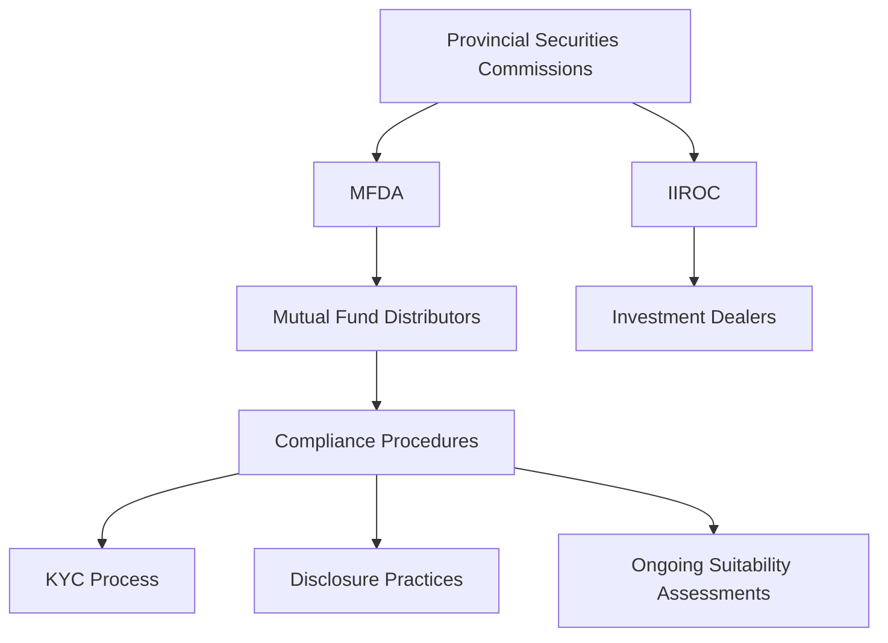

## 17.5 Mutual Fund Regulation

Mutual funds are a cornerstone of the Canadian investment landscape, offering investors a diversified portfolio managed by professionals. However, with this opportunity comes the necessity for stringent regulation to protect investors and maintain market integrity. This section delves into the regulatory framework governing mutual funds in Canada, focusing on the roles of provincial securities commissions, self-regulatory organizations (SROs), and key regulatory instruments.

### Regulatory Bodies and Framework

#### Provincial Securities Commissions

In Canada, securities regulation is primarily a provincial responsibility. Each province and territory has its own securities commission or equivalent authority, such as the Ontario Securities Commission (OSC) or the British Columbia Securities Commission (BCSC). These bodies are responsible for enforcing securities laws and protecting investors within their jurisdictions.

#### Self-Regulatory Organizations (SROs)

The Mutual Fund Dealers Association of Canada (MFDA) is the primary SRO overseeing mutual fund distributors. The MFDA establishes rules and standards for its members to ensure fair and ethical business practices. It works alongside the Investment Industry Regulatory Organization of Canada (IIROC), which regulates investment dealers and trading activity.

### Key Regulatory Instruments

#### National Instrument 81-101

National Instrument 81-101 sets the standards for mutual fund prospectuses and Fund Facts documents. These documents are crucial for providing investors with essential information about a mutual fund's objectives, strategies, risks, and costs. The prospectus must be clear, concise, and easily understandable, enabling investors to make informed decisions.

#### National Instrument 81-102

National Instrument 81-102 governs the distribution and advertising of mutual funds. It outlines the rules for sales practices, ensuring that mutual funds are marketed transparently and ethically. This instrument also covers operational aspects, such as fund valuation, redemption, and the use of derivatives.

### Registration and Compliance Requirements

#### Registration of Mutual Fund Managers and Representatives

To operate legally, mutual fund managers, distributors, and sales representatives must be registered with the appropriate provincial securities commission. This registration ensures that individuals and firms meet the necessary qualifications and adhere to regulatory standards.

#### Know Your Client (KYC) Rule

The KYC rule is a fundamental component of mutual fund regulation. It requires representatives to gather detailed information about their clients' financial situations, investment objectives, and risk tolerances. This information is critical for making suitable investment recommendations and ensuring that clients' portfolios align with their financial goals.

#### Disclosure and Ethical Selling Practices

Mutual fund representatives have a duty to disclose all relevant information to clients, including fees, risks, and potential conflicts of interest. They must avoid prohibited selling practices, such as misleading advertising or pressure tactics. Transparency and ethical behavior are paramount to maintaining trust and protecting investors.

### Best Practices for Compliance

#### Adhering to Provincial Regulations and MFDA Guidelines

Mutual fund sales practices must comply with provincial regulations and MFDA guidelines. This includes ensuring that all marketing materials and communications are accurate and not misleading. Firms should implement robust compliance procedures to monitor adherence to these standards.

#### Implementing Compliance Procedures

Effective compliance procedures are essential for account registration, KYC information gathering, and ongoing suitability assessments. Regular audits and reviews can help identify potential issues and ensure that all processes align with regulatory requirements.

#### Staying Updated on Regulatory Changes

The regulatory landscape is dynamic, with changes occurring regularly. Firms must stay informed about updates to regulations and ensure that all disclosures and documentation meet current standards. This may involve subscribing to regulatory updates or participating in industry seminars.

#### Training Staff and Representatives

Training is crucial for ensuring that staff and representatives understand mutual fund regulations, the importance of transparency, and ethical selling practices. Ongoing education can help maintain high standards of professionalism and compliance.

### Practical Examples and Case Studies

#### Case Study: Ethical Selling Practices at RBC

Consider a scenario involving RBC, one of Canada's largest banks. RBC implemented a comprehensive training program for its mutual fund representatives, focusing on ethical selling practices and KYC compliance. This program included workshops, role-playing exercises, and assessments to reinforce the importance of transparency and client-centric service.

#### Example: KYC in Action

Imagine a mutual fund representative at TD Bank working with a new client. The representative conducts a thorough KYC assessment, gathering information about the client's income, investment experience, and risk tolerance. Based on this information, the representative recommends a balanced mutual fund that aligns with the client's moderate risk appetite and long-term growth objectives.

### Diagrams and Visual Aids

To enhance understanding, let's visualize the regulatory framework and compliance process using a diagram.

### Conclusion

Understanding mutual fund regulation is crucial for anyone involved in the Canadian financial services industry. By adhering to provincial regulations, MFDA guidelines, and key National Instruments, firms can ensure compliance, protect investors, and maintain market integrity. Continuous education, robust compliance procedures, and ethical selling practices are essential components of a successful mutual fund operation.

## Quiz Time!



### Which organization is primarily responsible for regulating mutual fund distributors in Canada?

- [ ] IIROC
- [x] MFDA
- [ ] OSC
- [ ] BCSC

> **Explanation:** The Mutual Fund Dealers Association (MFDA) is the primary self-regulatory organization responsible for regulating mutual fund distributors in Canada.

### What is the purpose of National Instrument 81-101?

- [x] To set standards for mutual fund prospectuses and Fund Facts documents
- [ ] To govern the distribution and advertising of mutual funds
- [ ] To regulate investment dealers and trading activity
- [ ] To enforce securities laws at the provincial level

> **Explanation:** National Instrument 81-101 sets the standards for mutual fund prospectuses and Fund Facts documents, ensuring that investors receive essential information about mutual funds.

### What is a key component of the Know Your Client (KYC) rule?

- [x] Gathering detailed information about clients' financial situations
- [ ] Ensuring mutual fund advertisements are accurate
- [ ] Registering mutual fund managers with the MFDA
- [ ] Conducting regular audits of mutual fund operations

> **Explanation:** The KYC rule requires representatives to gather detailed information about clients' financial situations, investment objectives, and risk tolerances to make suitable investment recommendations.

### What must mutual fund representatives disclose to clients?

- [x] All relevant information, including fees and risks
- [ ] Only the potential returns of the mutual fund
- [ ] The personal investment strategies of the representative
- [ ] The historical performance of the mutual fund

> **Explanation:** Mutual fund representatives must disclose all relevant information to clients, including fees, risks, and potential conflicts of interest, to ensure transparency and protect investors.

### Which of the following is a prohibited selling practice?

- [x] Misleading advertising
- [ ] Providing clear and concise Fund Facts documents
- [ ] Conducting thorough KYC assessments
- [ ] Offering diversified mutual fund options

> **Explanation:** Misleading advertising is a prohibited selling practice. Representatives must ensure that all marketing materials and communications are accurate and not misleading.

### What is the role of provincial securities commissions in Canada?

- [x] Enforcing securities laws and protecting investors
- [ ] Regulating mutual fund distributors
- [ ] Setting standards for mutual fund prospectuses
- [ ] Conducting KYC assessments

> **Explanation:** Provincial securities commissions are responsible for enforcing securities laws and protecting investors within their jurisdictions.

### How can firms ensure compliance with mutual fund regulations?

- [x] Implementing robust compliance procedures
- [ ] Ignoring regulatory updates
- [ ] Relying solely on representatives' discretion
- [ ] Avoiding KYC assessments

> **Explanation:** Firms can ensure compliance by implementing robust compliance procedures, including account registration, KYC information gathering, and ongoing suitability assessments.

### Why is training important for mutual fund representatives?

- [x] To understand regulations, transparency, and ethical selling practices
- [ ] To increase sales at any cost
- [ ] To bypass compliance procedures
- [ ] To focus solely on short-term gains

> **Explanation:** Training is crucial for ensuring that representatives understand mutual fund regulations, the importance of transparency, and ethical selling practices, maintaining high standards of professionalism and compliance.

### What should firms do to stay updated on regulatory changes?

- [x] Subscribe to regulatory updates and participate in industry seminars
- [ ] Ignore changes until they are enforced
- [ ] Rely on outdated information
- [ ] Focus only on internal policies

> **Explanation:** Firms should stay informed about updates to regulations by subscribing to regulatory updates and participating in industry seminars to ensure all disclosures and documentation meet current standards.

### True or False: The MFDA works alongside IIROC to regulate mutual fund distributors and investment dealers.

- [x] True
- [ ] False

> **Explanation:** True. The MFDA works alongside the Investment Industry Regulatory Organization of Canada (IIROC), which regulates investment dealers and trading activity, to ensure fair and ethical business practices.


